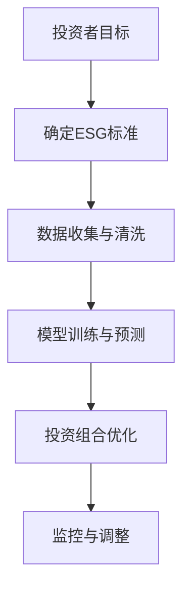

                 


# 可持续发展投资（ESG）：长期价值创造的新范式

> 关键词：可持续发展、ESG投资、长期价值、环境、社会、公司治理

> 摘要：可持续发展投资（ESG）是将环境、社会和公司治理因素纳入投资决策的过程，旨在实现长期价值创造。本文从ESG的核心概念、评估方法、技术应用、全球实践及未来趋势等方面展开，探讨ESG如何成为投资领域的新范式。通过案例分析和数据支持，本文揭示了ESG投资在风险控制、回报潜力和社会责任方面的独特优势。

---

## 第1章：ESG投资的背景与概念

### 1.1 ESG的起源与发展
- 1.1.1 可持续投资的定义与演变
  - ESG的起源：从社会投资到环境治理
  - 联合国可持续发展目标（SDGs）的推动作用
- 1.1.2 ESG的核心理念
  - 环境：减少碳足迹，保护自然资源
  - 社会：促进公平，关注人权
  - 治理：提升企业透明度，优化管理结构
- 1.1.3 ESG与长期价值创造
  - 投资者的责任：从短期收益到长期价值
  - ESG如何影响企业竞争力和投资回报

---

## 第2章：ESG的核心维度与相互关系

### 2.1 环境（Environmental）维度
- 2.1.1 环境维度的核心要素
  - 碳排放与气候变化
  - 资源消耗与可持续性
  - 环境影响评估
- 2.1.2 环境维度的挑战与机遇
  - 环境政策的不确定性
  - 绿色技术的发展
  - 环境投资的回报潜力

### 2.2 社会（Social）维度
- 2.2.1 社会维度的核心要素
  - 劳工权益
  - 社区参与
  - 健康与安全
- 2.2.2 社会维度的挑战与机遇
  - 社会不平等问题
  - 社会责任投资的兴起
  - 社会治理的创新

### 2.3 治理（Governance）维度
- 2.3.1 治理维度的核心要素
  - 股权结构
  - 董事会结构与责任
  - 反腐败与道德规范
- 2.3.2 治理维度的挑战与机遇
  - 治理结构的透明化
  - 股东权利的保护
  - 治理效率的提升

---

## 第3章：ESG投资的评估与方法

### 3.1 ESG评级与评估方法
- 3.1.1 ESG评级机构与标准
  - MSCI、S&P、晨星等评级机构的比较
  - 不同评级标准的优缺点
- 3.1.2 ESG评分的计算方法
  - 数据收集与处理流程
  - 评分模型的构建与验证

### 3.2 ESG投资策略
- 3.2.1 主动型投资策略
  - ESG主题基金的构建与管理
  - 股票筛选与组合优化
- 3.2.2 被动型投资策略
  - ESG指数基金的投资逻辑
  - 风险分散与收益平衡

### 3.3 ESG与风险管理
- 3.3.1 环境风险的评估与定价
  - 碳排放的经济影响分析
  - 气候变化对资产价格的影响
- 3.3.2 社会风险的识别与应对
  - 社会运动对企业声誉的影响
  - 企业社会责任的履行与投资回报

---

## 第4章：技术驱动的ESG投资

### 4.1 ESG数据的处理与分析
- 4.1.1 ESG数据的来源与分类
  - 公司财报、社会责任报告、第三方评级
- 4.1.2 ESG数据的清洗与预处理
  - 数据清洗方法：去除噪声与异常值
  - 数据预处理：标准化与特征选择

### 4.2 ESG投资的技术实现
- 4.2.1 基于机器学习的ESG评分预测
  - 算法选择：随机森林、支持向量机
  - 模型训练与验证
- 4.2.2 大数据分析在ESG投资中的应用
  - 数据可视化：仪表盘设计与实时监控
  - 数据挖掘：发现隐藏的ESG风险与机会

### 4.3 ESG投资的算法原理
- 4.3.1 算法流程图（使用Mermaid）
  ```mermaid
  graph TD
    A[数据来源] --> B[数据清洗]
    B --> C[特征选择]
    C --> D[模型训练]
    D --> E[预测结果]
    E --> F[投资决策]
  ```
- 4.3.2 算法数学模型
  - 线性回归模型：用于预测ESG评分
  - $$ y = \beta_0 + \beta_1x_1 + \beta_2x_2 + ... + \beta_nx_n + \epsilon $$
  - 支持向量机模型：用于分类ESG表现
  - $$ max_{\gamma, \alpha} \sum_{i=1}^n \alpha_i (y_i - \gamma - \sum_{j=1}^n \beta_j x_{ij}x_{kj}) ) $$

---

## 第5章：全球ESG投资实践

### 5.1 全球ESG投资概况
- 5.1.1 全球ESG投资规模与增长
  - 近年来ESG基金的快速发展
  - 不同地区ESG投资的差异
- 5.1.2 主要市场的ESG实践
  - 欧盟的CSRD框架
  - 美国的PRI（负责任投资原则）
  - 亚洲市场的新兴趋势

### 5.2 成功的ESG投资案例
- 5.2.1 环境领域的成功案例
  - 某清洁能源企业的投资回报分析
- 5.2.2 社会领域的成功案例
  - 某社会责任投资基金的表现
- 5.2.3 治理领域的成功案例
  - 某公司治理优化后的股价表现

---

## 第6章：ESG投资的未来趋势

### 6.1 技术进步对ESG投资的影响
- 6.1.1 人工智能在ESG数据处理中的应用
  - 自动化数据收集与分析
  - AI驱动的ESG评分预测
- 6.1.2 区块链技术在ESG治理中的应用
  - 透明化的企业治理记录
  - 可追溯的ESG数据流

### 6.2 政策环境的变化
- 6.2.1 全球ESG政策的趋严
  - 欧盟CSRD的实施细节
  - 美国SEC的新规要求
- 6.2.2 中国ESG投资的发展潜力
  - 中国市场的ESG投资现状
  - 未来可能的政策支持

### 6.3 投资者行为的变化
- 6.3.1 机构投资者的ESG意识提升
  - ESG投资在机构资产配置中的比重增加
- 6.3.2 个人投资者的参与度提升
  - ESG投资产品的普及与教育

---

## 第7章：总结与展望

### 7.1 全文总结
- ESG投资的核心理念与长期价值
- 技术驱动下的ESG投资创新

### 7.2 未来展望
- ESG投资的全球发展趋势
- 技术与政策如何共同推动ESG投资的未来

---

## 附录

### 附录A：ESG评级机构与标准对比表格
| 评级机构 | 主要标准 | 适用范围 | 优点 | 缺点 |
|----------|----------|----------|------|------|
| MSCI     | MSCI ESG评级 | 全球企业 | 数据全面 | 成本较高 |
| S&P      | S&P ESG评分 | 全球企业 | 易用性高 | 数据更新慢 |

### 附录B：ESG投资流程图（Mermaid）


---

## 作者

作者：AI天才研究院/AI Genius Institute & 禅与计算机程序设计艺术 /Zen And The Art of Computer Programming

---

通过以上目录，文章将从ESG投资的背景、核心维度、评估方法、技术应用、全球实践、未来趋势等方面进行详细阐述，结合实际案例和数据分析，为读者提供全面的ESG投资知识。

