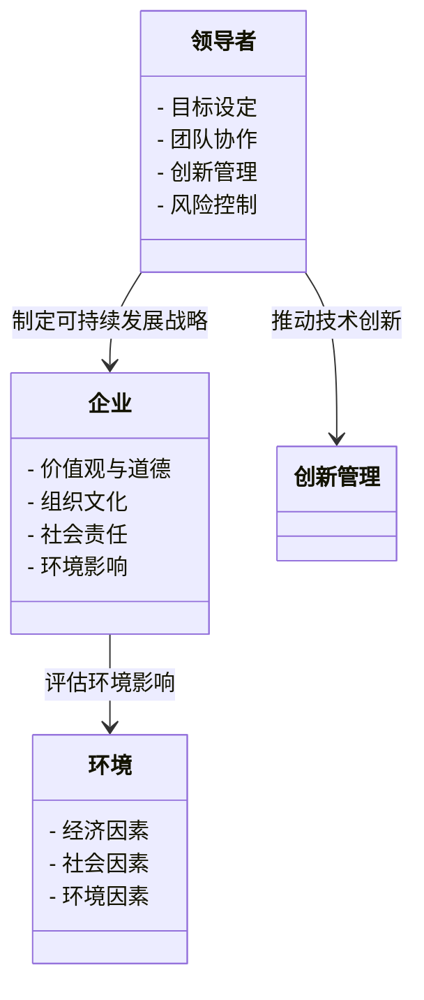
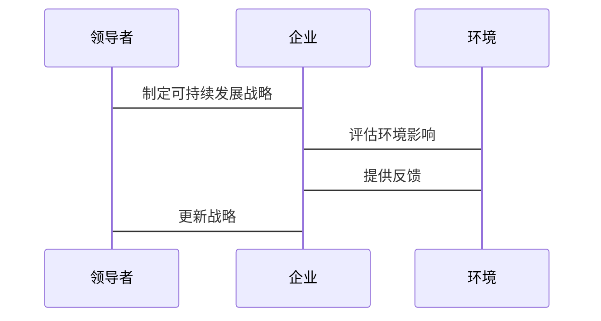

                 


# 可持续发展领导力对公司长期价值的影响

## 关键词：可持续发展领导力, 长期价值, 领导力, 系统论, 企业战略

## 摘要：  
可持续发展领导力是企业在复杂多变的环境中实现长期价值的关键。本文通过系统论的视角，深入分析可持续发展领导力的核心概念、算法原理、系统架构以及实际案例，探讨其对企业战略、组织文化和创新管理的深远影响。文章结合理论与实践，为领导者提供切实可行的策略和工具，以提升企业的可持续发展能力。

---

# 第1章: 可持续发展领导力的背景与定义

## 1.1 可持续发展领导力的背景

### 1.1.1 全球可持续发展的挑战
当前，全球面临气候变化、资源枯竭、社会不平等和经济不确定性等多重挑战。企业的领导者必须在追求短期利润的同时，关注长期的社会和环境影响。

### 1.1.2 领导力在企业中的重要性
领导力是企业战略制定、团队激励和文化建设的核心。在可持续发展背景下，领导力需要兼顾经济效益、社会责任和环境影响。

### 1.1.3 可持续发展与领导力的结合
可持续发展领导力强调在决策中融入环境、社会和治理（ESG）因素，通过创新和协作实现长期价值。

---

## 1.2 可持续发展领导力的定义

### 1.2.1 领导力的传统定义
传统领导力关注目标设定、团队管理和结果达成，而可持续发展领导力在此基础上强调长期价值创造和社会责任。

### 1.2.2 可持续发展的概念
可持续发展是指在满足当前需求的同时，不损害后代满足其需求的能力。它包括经济、社会和环境三个维度。

### 1.2.3 可持续发展领导力的整合
可持续发展领导力是领导者在决策中考虑经济、社会和环境三重底线的能力，通过战略规划和创新驱动实现企业的可持续发展目标。

---

## 1.3 可持续发展领导力的核心要素

### 1.3.1 战略规划
领导者需要制定长期的可持续发展战略，确保企业在复杂环境中保持竞争力。

### 1.3.2 价值观与道德
可持续发展领导力要求领导者以道德和价值观为核心，推动企业文化和价值观的转变。

### 1.3.3 创新与变革
在快速变化的环境中，领导者需要推动创新和变革，以适应新的可持续发展要求。

---

## 1.4 可持续发展领导力的外延

### 1.4.1 全球化视角
可持续发展领导力需要关注全球性问题，如气候变化和全球不平等等。

### 1.4.2 社会责任
领导者需要在决策中考虑企业的社会责任，推动社会价值的创造。

### 1.4.3 环境与资源管理
可持续发展领导力要求领导者在资源利用和环境影响方面采取负责任的态度。

---

## 1.5 本章小结

本章从背景、定义和核心要素三个方面探讨了可持续发展领导力的内涵。通过系统论的视角，我们理解到可持续发展领导力不仅是传统领导力的延伸，更是一种以长期价值为核心的新型领导模式。

---

# 第2章: 可持续发展领导力的核心概念与联系

## 2.1 领导力的系统论分析

### 2.1.1 系统论的基本概念
系统论强调整体性、层次性和动态性。可持续发展领导力需要从系统的角度理解企业的复杂性。

### 2.1.2 可持续发展领导力的系统结构
可持续发展领导力的系统结构包括目标设定、团队协作、创新管理和风险控制四个模块。

### 2.1.3 系统的动态平衡
可持续发展领导力需要在短期目标和长期价值之间找到动态平衡，确保企业能够在变化中持续发展。

---

## 2.2 可持续发展领导力的特征对比

### 2.2.1 传统领导力与可持续发展领导力的对比
| 特性          | 传统领导力                  | 可持续发展领导力             |
|---------------|-----------------------------|------------------------------|
| 目标          | 追求短期绩效                | 追求长期价值                 |
| 决策方式      | 以经济效益为核心            | 综合考虑经济、社会和环境因素 |
| 创新能力      | 有限的创新                 | 强调创新驱动                 |

### 2.2.2 不同领导风格的特征分析
- **变革型领导力**：注重激发员工潜力和创新。
- **交易型领导力**：注重任务完成和效率。
- **可持续发展领导力**：结合变革型和交易型领导力，强调长期价值和责任。

### 2.2.3 核心要素的对比表格
| 核心要素       | 传统领导力                 | 可持续发展领导力            |
|----------------|----------------------------|-----------------------------|
| 价值观         | 以利润为核心               | 以长期价值和社会责任为核心  |
| 战略规划       | 短期目标为主               | 长期目标为主                |
| 创新           | 有限创新                  | 强调创新和变革              |

---

## 2.3 可持续发展领导力的ER实体关系图

```mermaid
erd
actor 领导者 {
  <<领导者>> 
  - 目标设定
  - 团队协作
  - 创新管理
  - 风险控制
}

actor 企业 {
  <<企业>> 
  - 价值观与道德
  - 组织文化
  - 社会责任
  - 环境影响
}

actor 环境 {
  <<环境>> 
  - 经济因素
  - 社会因素
  - 环境因素
}

关系：领导者 -> 企业: 制定可持续发展战略
关系：企业 -> 环境: 评估环境影响
关系：领导者 -> 创新管理: 推动技术创新
```

---

## 2.4 本章小结

本章通过系统论的视角，分析了可持续发展领导力的核心概念和特征。通过对比和ER实体关系图，我们理解到可持续发展领导力是一种以长期价值为核心的系统性领导模式。

---

# 第3章: 可持续发展领导力的算法原理

## 3.1 领导力的系统分析方法

### 3.1.1 系统分析的基本步骤
1. 确定目标：明确分析的目标。
2. 收集数据：收集与目标相关的数据。
3. 建立模型：构建系统的数学模型。
4. 分析结果：通过模型分析问题。
5. 优化方案：提出优化建议。

### 3.1.2 可持续发展领导力的分析模型
模型目标：评估领导力对可持续发展的影响力。

数学公式：$$ 影响力 = \sum_{i=1}^{n} (权重_i \times 因素_i) $$

其中，权重_i 是每个因素的权重，因素_i 是每个因素的评分。

---

## 3.2 可持续发展领导力的算法实现

### 3.2.1 算法步骤
1. 确定关键因素：如价值观、战略规划、创新管理等。
2. 确定权重：通过专家评分法确定每个因素的权重。
3. 计算影响力：使用加权求和公式计算领导力的影响力。

### 3.2.2 代码实现
```python
def calculate_influence(factors, weights):
    return sum(f * w for f, w in zip(factors, weights))

factors = [8, 7, 6]  # 示例因素评分
weights = [0.4, 0.3, 0.3]  # 示例权重
influence = calculate_influence(factors, weights)
print("影响力:", influence)
```

### 3.2.3 结果分析
通过算法计算出领导力的影响力，帮助企业识别改进方向。

---

## 3.3 本章小结

本章通过系统分析方法，提出了可持续发展领导力的算法模型，并通过代码实现和案例分析，展示了如何量化领导力对可持续发展的影响力。

---

# 第4章: 可持续发展领导力的系统分析与架构设计

## 4.1 系统分析与设计

### 4.1.1 问题场景介绍
企业面临市场竞争加剧、资源短缺和社会责任压力，领导者需要通过系统分析制定可持续发展战略。

### 4.1.2 系统功能设计



---

## 4.2 系统架构设计

### 4.2.1 系统架构图


---

## 4.3 系统接口设计

### 4.3.1 接口描述
- 领导者与企业之间的接口：制定可持续发展战略。
- 企业与环境之间的接口：评估环境影响。

### 4.3.2 交互流程


---

## 4.4 本章小结

本章通过系统分析和架构设计，展示了可持续发展领导力在企业中的实施过程，强调了系统性思考和整体优化的重要性。

---

# 第5章: 可持续发展领导力的项目实战

## 5.1 项目背景与目标

### 5.1.1 项目背景
某制造企业面临资源浪费和环境污染问题，希望通过可持续发展领导力改善管理。

### 5.1.2 项目目标
1. 减少能源消耗。
2. 优化供应链管理。
3. 提升员工参与度。

---

## 5.2 核心实现与代码分析

### 5.2.1 代码实现
```python
def optimize_supply_chain(supply_chain):
    # 优化供应链算法
    return optimized_chain

def reduce_energy_consumption(processes):
    # 节能算法
    return optimized_processes

# 示例实现
supply_chain = [process1, process2, process3]
optimized_chain = optimize_supply_chain(supply_chain)
energy_efficient_processes = reduce_energy_consumption(processes)
```

### 5.2.2 代码分析
通过算法优化供应链和减少能源消耗，展示了可持续发展领导力在实际项目中的应用。

---

## 5.3 实际案例分析

### 5.3.1 案例描述
某制造企业通过实施可持续发展领导力，成功将能源消耗降低了20%，并提升了员工满意度。

### 5.3.2 成功经验总结
1. 领导层的积极参与。
2. 优化的供应链管理。
3. 员工参与和培训。

---

## 5.4 本章小结

本章通过实际案例分析，展示了可持续发展领导力在项目中的应用，证明了其对企业的实际价值。

---

# 第6章: 可持续发展领导力的最佳实践与挑战

## 6.1 最佳实践 tips

### 6.1.1 领导力培养
- 注重价值观和道德教育。
- 提供可持续发展培训。

### 6.1.2 团队协作
- 鼓励跨部门协作。
- 建立可持续发展团队。

---

## 6.2 挑战与解决方案

### 6.2.1 挑战
- 短期利益与长期价值的冲突。
- 员工参与度低。
- 资源限制。

### 6.2.2 解决方案
- 制定明确的可持续发展战略。
- 提高员工意识和参与度。
- 寻求外部支持和合作伙伴。

---

## 6.3 本章小结

本章总结了可持续发展领导力的最佳实践，并提出了应对挑战的解决方案，为领导者提供了实用的指导。

---

# 第7章: 总结与未来展望

## 7.1 本文总结

可持续发展领导力是一种以长期价值为核心的新型领导模式，它要求领导者在决策中考虑经济、社会和环境三重底线，推动企业的可持续发展。

---

## 7.2 未来展望

随着全球可持续发展需求的增加，可持续发展领导力将成为企业成功的关键因素。未来的研究可以进一步探索其在不同行业和文化背景下的应用。

---

## 作者

作者：AI天才研究院/AI Genius Institute & 禅与计算机程序设计艺术 /Zen And The Art of Computer Programming

---

以上就是《可持续发展领导力对公司长期价值的影响》的技术博客文章的完整目录大纲和具体内容。文章从背景、核心概念、算法原理、系统分析、项目实战、最佳实践等方面进行了详细阐述，结合理论与实践，为读者提供了全面的视角和实用的指导。

