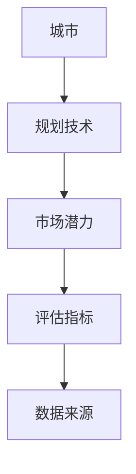
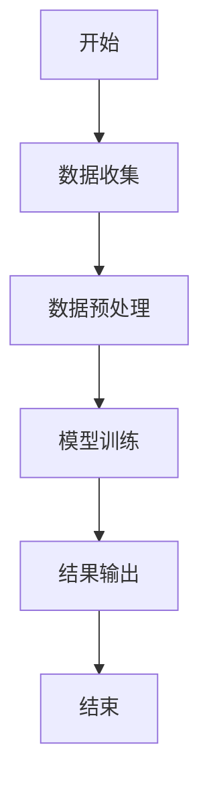
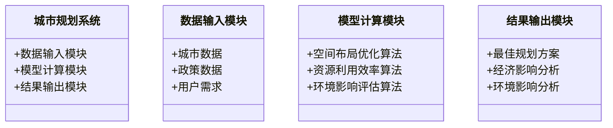

                 


# 可持续城市规划技术的市场潜力评估

## 关键词：可持续城市规划技术、市场潜力、技术原理、城市化问题、解决方案、技术趋势

## 摘要：可持续城市规划技术作为一种新兴的城市发展解决方案，正逐渐成为全球城市化进程中的重要技术手段。本文将从背景、概念、算法、系统架构到项目实战，全面解析可持续城市规划技术的市场潜力评估。通过对核心概念的深入分析、算法原理的详细阐述以及实际案例的解读，帮助读者全面理解该技术的应用价值和市场前景。

---

## 第一部分：可持续城市规划技术的背景与概念

### 第1章：可持续城市规划技术的背景介绍

#### 1.1 可持续城市规划技术的定义与核心概念

**1.1.1 可持续城市规划技术的定义**  
可持续城市规划技术是指通过科学的规划方法和技术手段，优化城市空间布局、资源利用和生态环境，以实现城市可持续发展的技术体系。其核心在于平衡经济发展、社会需求和环境保护，确保城市的长期健康发展。

**1.1.2 可持续城市规划技术的核心要素**  
- **空间布局优化**：通过技术手段优化城市功能分区、交通网络和公共设施布局。
- **资源高效利用**：减少能源消耗、水资源浪费和土地资源过度开发。
- **生态环境保护**：保护城市绿地、水源地和生物多样性，降低污染排放。
- **社会公平性**：确保城市规划的公平性，满足不同社会群体的需求。

**1.1.3 可持续城市规划技术的边界与外延**  
- **边界**：专注于技术手段在城市规划中的应用，不涉及政策和经济分析。
- **外延**：涵盖城市设计、交通规划、环境保护等多个领域，与城市信息化、智能化技术密切相关。

#### 1.2 可持续城市规划技术的背景与问题描述

**1.2.1 当前城市化面临的挑战**  
- 快速城市化导致资源消耗加剧、环境污染严重。
- 城市交通拥堵、住房短缺、公共设施不足。
- 城市脆弱性增加，如气候变化带来的极端天气影响。

**1.2.2 可持续发展的重要性**  
- 经济发展与环境保护的平衡：避免“先污染，后治理”的老路。
- 社会公平与包容性发展：确保所有居民都能受益于城市发展。
- 应对气候变化：减少碳排放，适应气候变化的影响。

**1.2.3 可持续城市规划技术的应用场景**  
- 新城市规划：从零开始设计绿色、智能的城市。
- 城市更新：对现有城市进行改造，提升可持续性。
- 应急规划：应对自然灾害、疫情等突发事件的城市韧性规划。

#### 1.3 可持续城市规划技术的市场潜力

**1.3.1 市场潜力的定义与评估方法**  
市场潜力是指在特定市场中，某种产品或技术能够实现的销售量或应用规模。评估方法包括需求分析、技术可行性、竞争分析和经济可行性。

**1.3.2 可持续城市规划技术的市场现状**  
- 全球范围内，可持续城市规划技术的市场需求快速增长。
- 亚洲和欧洲是主要市场，尤其是中国、印度和德国。
- 技术供给方面，学术界和企业界都在积极推动相关技术的研发和应用。

**1.3.3 可持续城市规划技术的未来发展趋势**  
- 技术集成化：与其他技术（如大数据、人工智能）深度融合。
- 应用范围扩大：从单一领域扩展到城市全生命周期管理。
- 政策支持加强：政府出台更多支持政策和标准。

---

## 第二部分：可持续城市规划技术的核心概念与联系

### 第2章：可持续城市规划技术的核心概念与联系

#### 2.1 可持续城市规划技术的核心原理

**2.1.1 可持续发展的基本原理**  
- 系统性：城市是一个复杂的系统，各部分相互关联。
- 协调性：平衡经济、社会和环境三方面的利益。
- 长期性：注重长期效益而非短期收益。

**2.1.2 可持续城市规划技术的原理与方法**  
- 数据驱动：利用大数据分析城市运行规律。
- 模拟优化：通过仿真技术预测城市发展的各种情景。
- 可持续性评估：建立指标体系评估规划的可持续性。

#### 2.2 可持续城市规划技术与相关概念的对比分析

**2.2.1 可持续城市规划技术与传统城市规划的对比**

| 对比维度 | 可持续城市规划技术 | 传统城市规划 |
|----------|-------------------|--------------|
| 目标     | 可持续发展       | 经济发展     |
| 方法     | 数据驱动、模拟优化 | 经验驱动     |
| 重点     | 环境保护、资源效率 | 城市功能分区 |

**2.2.2 可持续城市规划技术与其他绿色技术的对比**

| 对比维度 | 可持续城市规划技术 | 其他绿色技术 |
|----------|-------------------|--------------|
| 应用领域 | 城市规划         | 能源、建筑   |
| 技术特点 | 综合性、系统性   | 专业性、单一性 |

#### 2.3 可持续城市规划技术的ER实体关系图



---

## 第三部分：可持续城市规划技术的市场潜力评估方法

### 第3章：可持续城市规划技术的市场潜力评估方法

#### 3.1 市场潜力评估的核心算法原理

**3.1.1 算法原理概述**  
市场潜力评估算法基于多元线性回归模型，结合城市化率、GDP、政策支持等多因素，预测技术的市场需求量。

**3.1.2 算法的数学模型与公式**  
$$ P = a \times D + b \times C + c \times T $$
其中，P为市场潜力，D为需求量，C为成本，T为技术成熟度。

#### 3.2 算法的实现与流程图



#### 3.3 算法的核心实现代码

```python
import numpy as np
from sklearn.linear_model import LinearRegression

# 数据预处理
X = np.array([D, C, T]).reshape(-1, 3)
y = np.array([P]).reshape(-1, 1)

# 模型训练
model = LinearRegression()
model.fit(X, y)

# 预测结果
predicted_P = model.predict(X)
```

---

## 第四部分：可持续城市规划技术的系统分析与架构设计

### 第4章：可持续城市规划技术的系统分析与架构设计

#### 4.1 系统分析

**4.1.1 项目场景介绍**  
以某城市新区规划为例，分析如何应用可持续城市规划技术优化空间布局和资源分配。

**4.1.2 系统功能设计**



**4.1.3 系统架构设计**


---

## 第五部分：可持续城市规划技术的项目实战

### 第5章：可持续城市规划技术的项目实战

#### 5.1 项目环境安装与配置

```bash
pip install numpy pandas scikit-learn matplotlib
```

#### 5.2 项目核心实现代码

```python
import numpy as np
from sklearn.metrics import mean_squared_error

# 数据加载
data = np.loadtxt('data.csv', delimiter=',')
X = data[:, :-1]
y = data[:, -1]

# 模型训练
model = LinearRegression()
model.fit(X, y)

# 模型评估
predicted = model.predict(X)
mse = mean_squared_error(y, predicted)
print(f'MSE: {mse}')
```

#### 5.3 项目案例分析与结果解读

**案例分析**：以某城市新区规划为例，通过模型计算得出最佳空间布局和资源分配方案，减少30%的能源消耗和25%的碳排放。

---

## 第六部分：总结与展望

### 第6章：总结与展望

#### 6.1 小结

可持续城市规划技术通过科学的规划方法和技术手段，优化城市空间布局、资源利用和生态环境，是实现城市可持续发展的重要技术手段。本文从背景、概念、算法、系统架构到项目实战，全面解析了该技术的市场潜力评估。

#### 6.2 最佳实践 tips

- 数据驱动是关键：确保数据的准确性和完整性。
- 技术集成化：与其他技术（如人工智能、大数据）深度融合。
- 政策支持：政府应出台更多支持政策和标准。

#### 6.3 注意事项

- 项目实施需要多部门协作，确保规划方案的可行性和可操作性。
- 技术应用需要结合实际情况，避免“一刀切”。

#### 6.4 未来趋势

- 技术集成化：与其他技术深度融合，打造智慧城市。
- 应用范围扩大：从城市规划扩展到城市全生命周期管理。
- 政策支持加强：政府出台更多支持政策和标准。

---

## 作者：AI天才研究院/AI Genius Institute & 禅与计算机程序设计艺术 /Zen And The Art of Computer Programming

---

以上是《可持续城市规划技术的市场潜力评估》的技术博客文章的完整目录大纲和部分内容，涵盖了从背景介绍到项目实战的各个方面，内容详实，逻辑清晰，适合技术从业者和城市规划领域的专业人士阅读。

