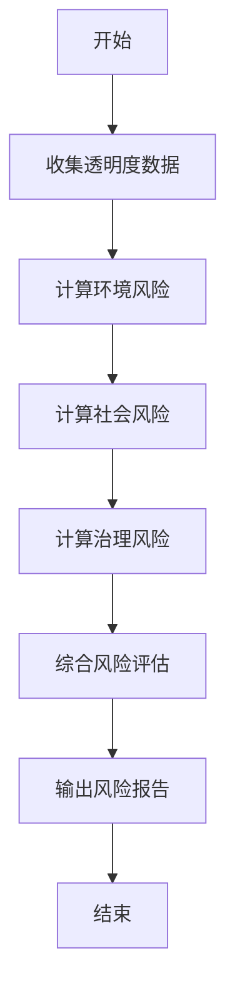
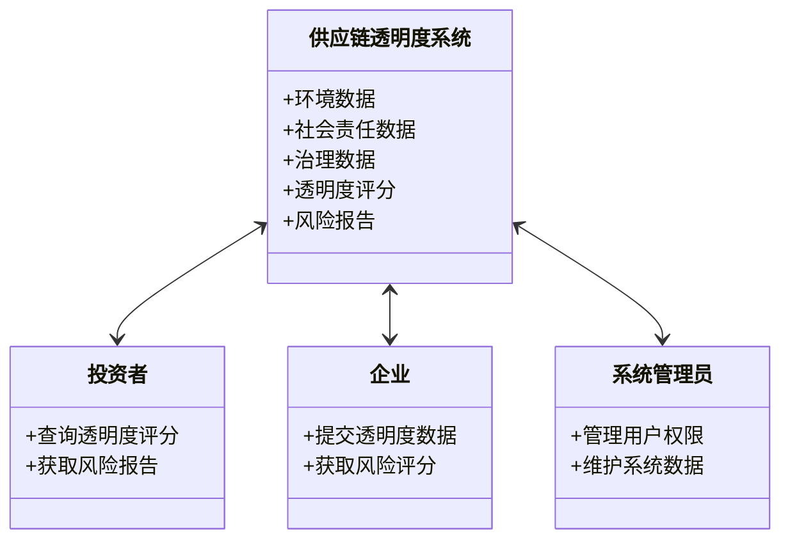
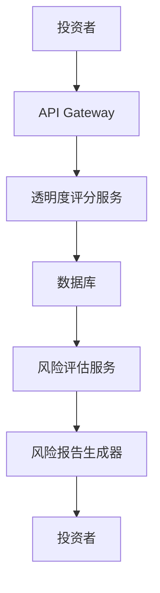
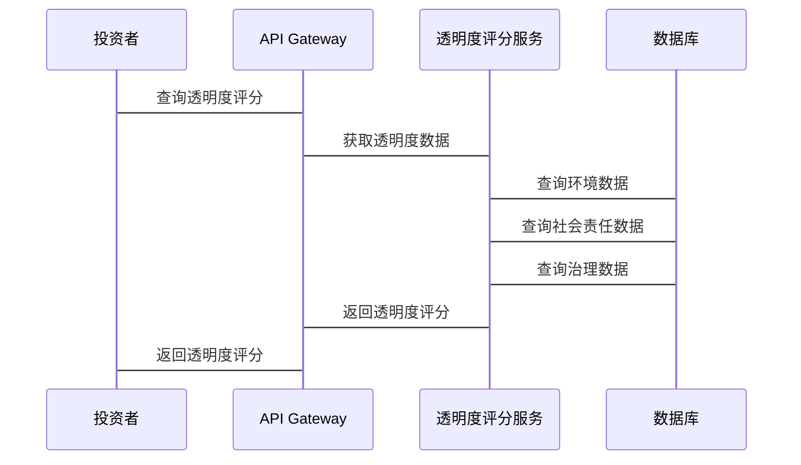

                 


# 可持续时尚供应链的透明度与投资风险

## 关键词：可持续时尚、供应链透明度、投资风险、ESG、环境影响、社会责任

## 摘要：  
可持续时尚供应链的透明度与投资风险是当前全球关注的焦点。随着消费者环保意识的增强和政策监管的趋严，供应链的透明度已成为企业竞争力的重要组成部分。本文深入探讨了可持续时尚供应链的核心概念，分析了透明度对投资风险的影响，并提出了提升透明度的策略。通过构建风险评估模型和系统架构设计，本文为投资者和企业提供了一套科学的决策工具，以优化供应链管理并降低投资风险。

---

## 第一部分: 可持续时尚供应链的背景与核心概念

### 第1章: 可持续时尚供应链的背景与重要性

#### 1.1 可持续时尚的定义与背景

##### 1.1.1 传统时尚供应链的局限性
传统的时尚供应链往往以成本为导向，忽视环境和社会因素。这种模式导致资源浪费、环境污染和劳动者权益问题，逐渐暴露出不可持续性。

##### 1.1.2 可持续时尚的兴起与发展
随着全球环保意识的提升，消费者和企业开始关注时尚产业的可持续性。可持续时尚强调从原材料采购、生产过程到产品生命周期的每一个环节都符合环保和社会责任的要求。

##### 1.1.3 可持续时尚的全球趋势与政策支持
全球范围内，各国政府和国际组织开始出台相关政策和标准，推动时尚产业向可持续方向发展。例如，欧盟的《可持续时尚行动计划》和联合国的《2030年可持续发展议程》都为行业提供了方向。

#### 1.2 可持续供应链的核心要素

##### 1.2.1 环境影响评估
评估供应链中各个环节的环境影响，包括能源消耗、碳排放和资源浪费等。

##### 1.2.2 社会责任与公平贸易
确保供应链中的劳动者权益得到保障，推动公平贸易，避免童工和恶劣的工作条件。

##### 1.2.3 经济效益与长期投资
可持续供应链虽然初期成本较高，但长期来看能够降低成本波动、提高品牌价值和市场竞争力。

#### 1.3 透明度与投资风险的关联性

##### 1.3.1 供应链透明度的定义
供应链透明度指企业向利益相关方公开供应链中的信息，包括原材料来源、生产过程和合作伙伴等。

##### 1.3.2 投资风险的多层次分析
投资风险包括环境风险（如碳排放）、社会风险（如劳工权益）和治理风险（如公司治理结构）。这些风险可能影响企业的长期盈利能力。

##### 1.3.3 透明度如何影响投资决策
高透明度的供应链能够降低投资者的信息不对称，增强信任，从而吸引更多的投资。同时，透明度高的企业更容易发现和管理潜在风险。

---

### 第2章: 可持续时尚供应链的透明度问题

#### 2.1 供应链透明度的现状分析

##### 2.1.1 信息不对称的挑战
许多企业对供应链的上游环节缺乏深入了解，导致信息不对称，难以全面评估风险。

##### 2.1.2 透明度标准的缺失
行业缺乏统一的透明度标准，导致不同企业之间难以比较和优化。

##### 2.1.3 消费者信任的缺失
消费者对品牌的真实性和可持续性持怀疑态度，影响品牌忠诚度和市场表现。

#### 2.2 可持续供应链透明度的关键维度

##### 2.2.1 环境数据的透明度
公开环境数据，如碳排放、水资源使用和废弃物管理等，帮助投资者评估环境风险。

##### 2.2.2 社会责任的透明度
公开供应链中社会责任履行情况，包括劳工权益、公平贸易和社区发展等。

##### 2.2.3 企业治理的透明度
公开企业治理结构、董事会构成和决策过程，增强投资者对企业的信任。

#### 2.3 提高透明度的策略与实践

##### 2.3.1 建立统一的透明度标准
行业组织和国际机构应制定统一的透明度标准，推动企业公开相关信息。

##### 2.3.2 利用技术手段实现透明化
通过区块链技术和物联网设备，实时追踪供应链信息，确保数据的真实性和可追溯性。

##### 2.3.3 供应链各方的协同合作
企业、供应商、政府和非政府组织应共同努力，推动供应链的透明化和可持续发展。

---

### 第3章: 可持续时尚供应链中的投资风险

#### 3.1 投资风险的多层次分析

##### 3.1.1 环境风险
供应链中的环境问题（如污染和资源枯竭）可能导致企业面临罚款、诉讼和声誉损失。

##### 3.1.2 社会风险
供应链中的社会问题（如劳工权益和人权问题）可能导致消费者抵制和品牌价值下降。

##### 3.1.3 治理风险
供应链中的治理问题（如腐败和不透明的管理）可能导致企业面临法律风险和管理成本增加。

#### 3.2 供应链透明度对投资风险的影响

##### 3.2.1 透明度如何降低环境风险
通过公开环境数据，企业能够及时发现和管理环境风险，减少潜在的法律和财务损失。

##### 3.2.2 透明度如何缓解社会风险
公开社会责任信息能够增强消费者和投资者的信任，降低社会风险对企业的影响。

##### 3.2.3 透明度如何优化治理风险
通过公开治理信息，企业能够展示透明的管理结构，降低治理风险，吸引更多的投资者。

#### 3.3 投资风险的评估与管理

##### 3.3.1 风险评估模型的构建
构建一个基于透明度的多维度风险评估模型，结合环境、社会和治理因素，评估供应链的整体风险。

##### 3.3.2 风险管理的策略与工具
使用风险管理工具，如情景分析和压力测试，评估不同场景下的风险，并制定应对策略。

##### 3.3.3 技术在风险管理中的应用
利用大数据和人工智能技术，实时监控供应链中的风险因素，提前预警和应对潜在风险。

---

### 第4章: 可持续时尚供应链透明度与投资风险的核心概念

#### 4.1 核心概念的定义与属性

##### 4.1.1 透明度的属性分析
透明度具有真实性、完整性和及时性等属性，确保信息的准确性和可用性。

##### 4.1.2 投资风险的属性分析
投资风险具有复杂性、动态性和系统性等属性，涉及多方面的因素。

##### 4.1.3 可持续供应链的核心要素
包括环境影响评估、社会责任履行和经济可持续性等核心要素。

#### 4.2 核心概念之间的关系

##### 4.2.1 透明度与投资风险的因果关系
透明度高的供应链能够降低投资风险，提高企业的投资吸引力。

##### 4.2.2 可持续供应链中各要素的相互作用
环境、社会和治理因素相互关联，共同影响供应链的整体可持续性。

##### 4.2.3 供应链透明度与企业竞争力的关系
透明度高的供应链能够提升企业的品牌形象和市场竞争力，吸引更多投资。

#### 4.3 核心概念的对比分析

##### 4.3.1 透明度与非透明供应链的对比
透明供应链能够更好地管理风险，而非透明供应链可能导致信息不对称和信任缺失。

##### 4.3.2 投资风险的高风险与低风险场景对比
高透明度的供应链风险较低，低透明度的供应链风险较高。

##### 4.3.3 可持续供应链与传统供应链的对比
可持续供应链更加注重环境和社会因素，传统供应链则以成本和效率为导向。

---

### 第5章: 可持续时尚供应链透明度与投资风险的算法原理

#### 5.1 算法原理概述

##### 5.1.1 算法的目标与应用场景
算法的目标是通过透明度数据评估供应链的投资风险，应用于投资决策和供应链优化。

##### 5.1.2 算法的基本假设与输入
假设供应链透明度数据已收集，输入包括环境数据、社会责任数据和治理数据。

##### 5.1.3 算法的输出与结果解释
输出包括投资风险评分和风险因素分析报告，帮助投资者做出决策。

#### 5.2 算法流程图



#### 5.3 算法的数学模型与公式

##### 5.3.1 风险评估模型的数学表达
$$ R = \sum_{i=1}^{n} w_i \cdot r_i $$
其中，\( R \) 为综合风险评分，\( w_i \) 为第 \( i \) 个风险因素的权重，\( r_i \) 为第 \( i \) 个风险因素的评分。

##### 5.3.2 透明度计算的数学表达
$$ T = \frac{\sum_{j=1}^{m} s_j}{m} $$
其中，\( T \) 为透明度评分，\( s_j \) 为第 \( j \) 个透明度指标的评分，\( m \) 为指标总数。

#### 5.4 算法实现代码

```python
def calculate_transparency(risk_factors):
    # 计算透明度评分
    transparency_score = sum(risk_factors) / len(risk_factors)
    return transparency_score

def risk_assessment(transparency_score):
    # 计算投资风险评分
    if transparency_score >= 0.8:
        return "低风险"
    elif transparency_score >= 0.6:
        return "中风险"
    else:
        return "高风险"

# 示例输入
risk_factors = [0.7, 0.8, 0.6]
transparency_score = calculate_transparency(risk_factors)
risk_result = risk_assessment(transparency_score)
print(f"透明度评分为: {transparency_score}")
print(f"投资风险等级: {risk_result}")
```

---

### 第6章: 可持续时尚供应链的系统架构设计

#### 6.1 系统功能设计

##### 6.1.1 领域模型图



#### 6.2 系统架构设计

##### 6.2.1 系统架构图



#### 6.3 系统接口设计

##### 6.3.1 API接口
- `/api/transparency_score`: 提交透明度数据，返回透明度评分。
- `/api/risk_report`: 获取风险报告，返回投资风险等级。

##### 6.3.2 数据接口
- 数据库存储透明度数据和风险报告，支持高效的查询和更新。

#### 6.4 系统交互图



---

### 第7章: 可持续时尚供应链的项目实战

#### 7.1 环境安装

##### 7.1.1 安装Python
```bash
python --version
```
确保安装了Python 3.8或更高版本。

##### 7.1.2 安装依赖
```bash
pip install mermaid-cli
pip install matplotlib
pip install numpy
```

#### 7.2 核心实现代码

##### 7.2.1 风险评估模型实现

```python
import numpy as np
import matplotlib.pyplot as plt

def calculate_transparency(risk_factors):
    return np.mean(risk_factors)

def risk_assessment(transparency_score):
    if transparency_score >= 0.8:
        return "低风险"
    elif transparency_score >= 0.6:
        return "中风险"
    else:
        return "高风险"

# 示例数据
risk_factors = np.array([0.7, 0.8, 0.6, 0.9, 0.5])

transparency_score = calculate_transparency(risk_factors)
risk_result = risk_assessment(transparency_score)

print(f"透明度评分为: {transparency_score}")
print(f"投资风险等级: {risk_result}")

# 可视化
plt.bar(['环境风险', '社会风险', '治理风险'], risk_factors, alpha=0.5)
plt.title('风险因素分布')
plt.show()
```

##### 7.2.2 系统交互实现

```python
import requests

def get_transparency_score():
    response = requests.get('http://localhost:8080/api/transparency_score')
    return response.json()

print(get_transparency_score())
```

#### 7.3 案例分析

##### 7.3.1 数据分析
分析一个实际案例，如某服装品牌的供应链透明度数据，计算其透明度评分和投资风险等级。

##### 7.3.2 结果解读
根据计算结果，为企业提供优化供应链透明度的建议，降低投资风险。

---

## 第八章: 最佳实践与小结

### 8.1 最佳实践 tips

#### 8.1.1 提高透明度的关键措施
- 制定统一的透明度标准。
- 利用技术手段实现透明化。
- 加强供应链各方的协同合作。

#### 8.1.2 管理投资风险的策略
- 建立风险评估模型。
- 使用风险管理工具。
- 技术在风险管理中的应用。

### 8.2 小结

可持续时尚供应链的透明度与投资风险是当前全球关注的焦点。通过提升透明度，企业能够更好地管理供应链风险，降低投资风险，提高市场竞争力。本文通过理论分析和实践案例，为投资者和企业提供了一套科学的决策工具，以优化供应链管理并降低投资风险。

---

## 第九章: 注意事项与拓展阅读

### 9.1 注意事项

- 透明度的提升需要企业内部和供应链各方的共同努力。
- 风险评估模型的准确性依赖于数据的完整性和质量。
- 技术的应用需要考虑成本和可行性。

### 9.2 拓展阅读

- 《可持续供应链管理》
- 《投资风险管理》
- 《区块链在供应链管理中的应用》

---

## 作者：AI天才研究院/AI Genius Institute & 禅与计算机程序设计艺术 /Zen And The Art of Computer Programming

