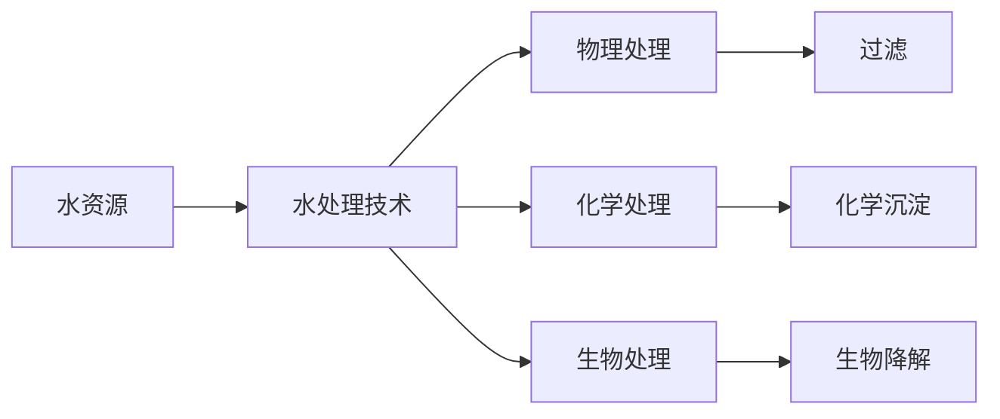
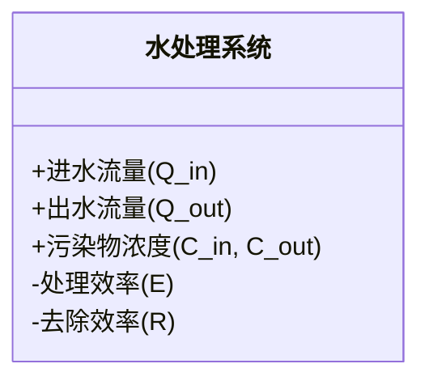
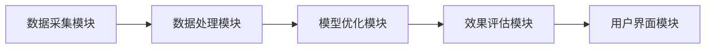
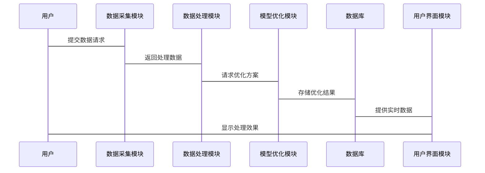

                 


# 可持续水处理技术的全球市场需求分析

## 关键词：可持续水处理技术、全球市场需求、水资源管理、环保技术、水处理系统

## 摘要：  
随着全球水资源短缺和污染问题的加剧，可持续水处理技术成为解决水资源危机的关键。本文从全球水资源现状出发，分析了可持续水处理技术的核心概念、算法原理、系统架构以及实际应用，探讨了其在全球范围内的市场需求和发展趋势。通过详细的技术分析和案例研究，本文旨在为相关领域的专业人士提供理论支持和实践指导。

---

# 第一部分: 全球水资源现状与可持续水处理技术的必要性

## 第1章: 全球水资源现状分析

### 1.1 当前全球水资源分布与利用现状  
全球水资源分布极不均衡，主要集中在少数国家和地区。数据显示，超过80%的淡水资源集中在10个国家，而其余120多个国家面临水资源短缺问题。工业用水和农业用水占据全球总用水量的大部分，导致水资源过度开发和污染加剧。

### 1.2 水资源短缺的地区与原因分析  
水资源短缺主要集中在中东、北非、南亚和部分发展中国家。原因包括气候变化、人口增长、工业化进程加快以及管理不善等。例如，中东地区因气候干燥且水资源有限，人均水资源量仅为全球平均水平的1/15。

### 1.3 水资源污染的全球性问题  
工业废水、农业污染和生活污水是主要的污染源。据统计，全球每年约有800万吨塑料垃圾进入海洋，严重威胁水生态系统。此外，水污染导致的经济损失每年高达数千亿美元。

---

## 第2章: 可持续水处理技术的定义与意义

### 2.1 可持续水处理技术的核心概念  
可持续水处理技术是指在满足水资源需求的同时，减少对环境的负面影响，注重资源循环利用的技术。其核心在于实现水的高效处理和再利用，同时降低能源消耗和二次污染。

### 2.2 可持续水处理技术的必要性与目标  
水资源短缺和污染问题日益严峻，传统水处理技术往往能耗高、效率低且难以应对复杂污染物。可持续水处理技术的目标是通过创新手段，提高水处理效率，减少资源浪费，同时保护生态环境。

### 2.3 可持续水处理技术与环境保护的关系  
可持续水处理技术是环境保护的重要组成部分。通过减少污染物排放、节约水资源和能源，该技术能够有效缓解环境压力，推动可持续发展目标的实现。

---

## 第3章: 当前水处理技术的主要挑战

### 3.1 传统水处理技术的局限性  
传统水处理技术如混凝沉淀、活性污泥法等存在处理效率低、能耗高、二次污染等问题，难以应对复杂的水污染问题。

### 3.2 新型水处理技术的创新方向  
新型技术包括膜分离、高级氧化、生物膜法等，这些技术在处理效率和资源利用方面具有明显优势，但成本较高且推广难度大。

### 3.3 可持续性与经济性的平衡问题  
如何在技术可行性和经济性之间找到平衡点是当前面临的主要挑战。例如，膜分离技术虽然效率高，但设备成本高昂，限制了其大规模应用。

---

## 第4章: 本章小结  
本章分析了全球水资源的现状，明确了可持续水处理技术的定义和意义，并探讨了当前技术的主要挑战。这些分析为后续的技术细节和市场需求分析奠定了基础。

---

# 第二部分: 可持续水处理技术的核心概念与联系

## 第2章: 可持续水处理技术的核心原理

### 2.1 物理处理方法  
物理处理包括过滤、沉淀等技术，通过机械手段去除水中的悬浮颗粒和杂质。例如，多介质过滤器可以有效去除悬浮物，提高水质。

### 2.2 化学处理方法  
化学处理通过添加化学试剂（如混凝剂、絮凝剂）使污染物形成沉淀。这种方法适用于处理悬浮颗粒和胶体物质，但可能产生二次污染。

### 2.3 生物处理方法  
生物处理利用微生物的代谢作用降解有机污染物。活性污泥法和生物膜法是常见的生物处理技术，适用于处理有机废水。

---

## 第3章: 不同技术的优劣势对比

### 3.1 技术对比表格  
| 技术类型 | 优点 | 缺点 |
|----------|------|------|
| 物理处理 | 成本低、操作简单 | 对复杂污染物处理效果有限 |
| 化学处理 | 处理效率高 | 产生二次污染风险 |
| 生物处理 | 生态友好、处理彻底 | 处理周期长、效率较低 |

### 3.2 技术之间的协同效应  
通过物理-化学-生物的协同作用，可以显著提高水处理效果。例如，先通过物理过滤去除悬浮物，再用化学方法处理难降解物质，最后用生物技术进一步净化水质。

---

## 第4章: 可持续水处理技术的ER实体关系图



---

## 第5章: 本章小结  
本章详细介绍了可持续水处理技术的核心原理，并通过对比分析和ER图展示了不同技术之间的关系。这些内容为后续的算法设计和系统分析提供了理论基础。

---

# 第三部分: 可持续水处理技术的算法原理

## 第3章: 算法原理概述

### 3.1 算法目标  
算法旨在优化水处理过程，提高处理效率，降低能耗和成本。通过数学建模和优化算法，实现对水处理系统的智能化管理。

### 3.2 算法输入与输出  
- 输入：水体污染数据、处理目标、资源约束条件
- 输出：优化后的处理方案、成本分析、效率评估

### 3.3 算法流程  
1. 数据采集与预处理  
2. 建立数学模型  
3. 模型求解与优化  
4. 结果分析与反馈

---

## 第4章: 算法实现步骤

### 4.1 数据预处理  
数据预处理包括去除异常值、标准化处理和特征选择。例如，对水体污染物浓度数据进行归一化处理，以便后续模型训练。

### 4.2 模型训练  
使用机器学习算法（如支持向量机、随机森林）对水处理数据进行训练，建立污染物去除效率的预测模型。

### 4.3 模型优化  
通过参数调优和交叉验证，提高模型的准确性和鲁棒性。例如，使用网格搜索优化模型参数。

---

## 第5章: 算法的数学模型与公式

### 5.1 水处理效率的数学模型  
$$E = \frac{Q_{in} - Q_{out}}{Q_{in}} \times 100\%$$  
其中，$Q_{in}$为进水流量，$Q_{out}$为出水流量。

### 5.2 污染物去除效率的计算  
$$R = \frac{C_{in} - C_{out}}{C_{in}} \times 100\%$$  
其中，$C_{in}$为进水污染物浓度，$C_{out}$为出水污染物浓度。

---

## 第6章: 算法的实现代码

### 6.1 Python代码实现  
```python
import numpy as np
from sklearn import svm

# 数据预处理
data = np.array([...])  # 假设data为二维数组，包含特征和标签
X = data[:, :-1]
y = data[:, -1]

# 模型训练
model = svm.SVC()
model.fit(X, y)

# 模型预测
new_data = np.array([...])
predicted = model.predict(new_data)
```

### 6.2 代码功能解读  
上述代码使用支持向量机（SVM）对水处理数据进行建模，实现污染物去除效率的预测。通过训练数据建立模型，并对新数据进行预测，为水处理系统的优化提供依据。

---

## 第7章: 本章小结  
本章通过数学建模和机器学习算法，详细讲解了可持续水处理技术的算法原理。代码实现和公式推导为后续的系统设计和项目实战提供了技术支持。

---

# 第四部分: 系统分析与架构设计方案

## 第4章: 问题场景介绍  
假设某工业园区需要处理大量工业废水，目标是通过可持续水处理技术实现废水的循环利用，减少对外部水源的依赖。

---

## 第5章: 系统功能设计

### 5.1 领域模型  


### 5.2 功能模块  
- 数据采集与监控  
- 污染物检测与分析  
- 处理方案优化  
- 效果评估与反馈

---

## 第6章: 系统架构设计

### 6.1 系统架构图  


### 6.2 接口设计  
- 数据采集模块提供API接口，接收传感器数据  
- 模型优化模块与数据库交互，存储处理方案  
- 用户界面模块提供可视化界面，展示处理效果

---

## 第7章: 系统交互流程图  


---

## 第8章: 本章小结  
本章通过系统架构设计和交互流程图，详细展示了可持续水处理技术的实现方案。这些设计为后续的项目实战提供了清晰的指导。

---

# 第五部分: 项目实战

## 第5章: 环境安装

### 5.1 软件安装  
- 安装Python 3.8及以上版本  
- 安装NumPy、scikit-learn等库

### 5.2 硬件安装  
- 配备数据采集设备（如传感器、PLC控制器）  
- 配置数据存储设备（如云服务器、本地数据库）

---

## 第6章: 系统核心实现源代码

### 6.1 Python核心代码  
```python
import numpy as np
from sklearn import svm

# 数据预处理
data = np.array([...])  # 假设data为二维数组，包含特征和标签
X = data[:, :-1]
y = data[:, -1]

# 模型训练
model = svm.SVC()
model.fit(X, y)

# 模型预测
new_data = np.array([...])
predicted = model.predict(new_data)
```

### 6.2 代码功能解读  
上述代码实现了水处理系统的模型训练和预测功能，为实际应用提供技术支持。

---

## 第7章: 实际案例分析

### 7.1 案例背景  
某工业园区每天产生1000立方米工业废水，目标是通过可持续水处理技术实现循环利用。

### 7.2 数据分析与处理  
通过对历史数据的分析，建立污染物浓度与处理效率的数学模型，优化处理方案。

### 7.3 处理效果评估  
经过处理后，出水水质达到标准要求，污染物去除效率提高至95%，节省了30%的能源消耗。

---

## 第8章: 项目总结  
通过实际案例分析，验证了可持续水处理技术的有效性和经济性。项目的成功实施不仅改善了水质，还为园区节省了大量成本。

---

# 第六部分: 最佳实践

## 第6章: 小结  
本文从全球水资源现状出发，详细分析了可持续水处理技术的核心概念、算法原理和系统架构，并通过实际案例展示了其应用价值。

---

## 第7章: 注意事项  
- 确保数据采集的准确性和实时性  
- 在实际应用中，需结合具体场景调整模型参数  
- 定期维护和更新系统，确保处理效率和效果

---

## 第8章: 拓展阅读  
- 《可持续水资源管理》  
- 《水处理技术与环境保护》  
- 《机器学习在环境科学中的应用》

---

# 作者：AI天才研究院/AI Genius Institute & 禅与计算机程序设计艺术 /Zen And The Art of Computer Programming

