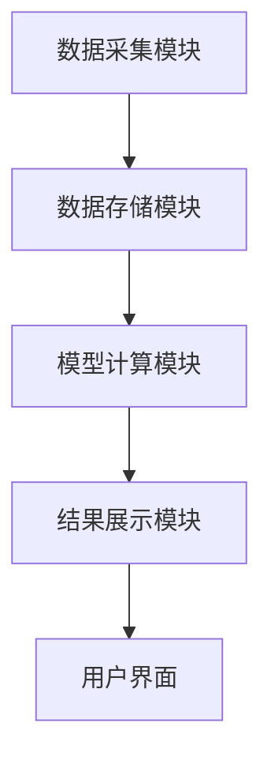

                 


# 可持续海洋资源开发的经济效益评估

## 关键词：可持续发展、海洋资源、经济效益评估、资源管理、环境影响、数学模型

## 摘要：  
可持续海洋资源开发是全球经济发展与环境保护的重要结合点。本文从经济效益评估的角度，系统分析了海洋资源开发的核心要素、评估方法与模型，并通过实际案例展示了如何实现经济效益与环境可持续性的平衡。文章结合理论与实践，为决策者和研究者提供了科学的评估框架和工具。

---

# 第一部分：可持续海洋资源开发的背景与概述

## 第1章：可持续海洋资源开发的背景与意义

### 1.1 可持续海洋资源开发的背景

随着全球人口的快速增长和资源需求的不断上升，海洋资源开发的重要性日益凸显。海洋蕴藏着丰富的能源、矿产和生物资源，但其开发必须兼顾经济效益与环境保护。以下是关键点：

- **全球资源需求的增长**：工业化和城市化加速了对资源的需求，传统陆地资源的枯竭促使人类将目光转向海洋。
- **海洋资源的潜力**：海洋覆盖了地球70%以上的面积，蕴藏着石油、天然气、可再生能源（如潮汐能、风能）以及丰富的渔业和矿产资源。
- **可持续开发的必要性**：海洋资源的开发必须避免过度捕捞、污染和生态破坏，以确保资源的长期利用。

### 1.2 经济效益评估的基本概念

经济效益评估是衡量海洋资源开发项目价值的核心工具。以下是关键概念：

- **经济效益的定义**：指资源开发带来的经济收益，包括直接收益（如产值）和间接收益（如就业机会）。
- **可持续性与经济效益的关系**：可持续开发强调长期性，而不仅仅是短期收益。例如，过度捕捞可能带来短期高收益，但会破坏生态，影响长期收益。
- **评估的目的**：通过评估，识别高收益、低环境影响的开发方式，为政策制定和投资决策提供依据。

---

## 第2章：海洋资源开发中的经济效益评估框架

### 2.1 海洋资源开发的核心要素

海洋资源开发涉及多个方面，以下是核心要素：

- **资源特征**：包括资源的分布、储量、可及性和再生能力。例如，潮汐能的分布受地理位置影响，而鱼类资源的再生能力依赖于捕捞强度。
- **开发活动类型**：包括能源开发（如风电、潮汐能）、矿产开采、渔业捕捞等。
- **经济效益影响因素**：市场 demand、技术成本、环境法规、资源可持续性等。

### 2.2 经济效益评估的基本方法

以下是常用的评估方法：

- **成本-收益分析**：比较开发项目的总成本与预期收益，判断其经济可行性。
- **净现值法（Net Present Value, NPV）**：将未来收益折现，减去初始投资，评估项目的经济价值。
- **环境影响成本法**：将环境破坏的经济成本纳入评估，确保开发活动的外部性得到内部化。

---

# 第二部分：经济效益评估的核心概念与联系

## 第3章：海洋资源开发与经济效益的核心概念

### 3.1 核心概念的定义与属性

- **资源可再生性**：海洋资源（如渔业资源）具有一定的再生能力，但过度开发会破坏其再生能力。
- **开发活动的外部性**：开发活动可能产生正外部性（如创造就业）或负外部性（如环境污染）。
- **经济效益的动态性**：资源开发的经济效益随时间变化，短期收益可能高于长期成本，但长期可持续性更重要。

### 3.2 核心概念之间的关系

通过对比分析，可以更好地理解核心概念之间的关系：

- **资源特征与经济效益**：资源的可再生性和分布特征直接影响其开发的经济效益。例如，易于开采的资源通常具有更高的经济价值。
- **开发模式与经济可持续性**：可持续开发模式（如生态友好型捕捞）通常具有更高的长期经济效益，而短期开发模式可能导致资源枯竭和环境破坏。
- **外部性与社会成本**：负外部性（如污染）会增加社会成本，降低整体经济效益。

---

## 第4章：经济效益评估的理论基础与模型

### 4.1 经济效益评估的理论基础

- **资源经济学**：研究资源分配与利用的经济规律，强调资源稀缺性与经济价值的关系。
- **可持续发展理论**：强调经济、社会和环境的协调发展，为海洋资源开发提供了理论指导。
- **外部性理论**：解释了开发活动对第三方的影响，为环境成本的内部化提供了理论依据。

### 4.2 经济效益评估的主要模型

- **资源价值评估模型**：用于估算资源的经济价值，例如：
  $$ V = P \times Q \times T $$
  其中，V为资源价值，P为价格，Q为数量，T为时间因素。
- **经济影响分析模型**：用于评估开发活动对经济的整体影响：
  $$ EI = \sum_{i=1}^{n} (C_i \times I_i) $$
  其中，EI为经济影响指数，C_i为影响系数，I_i为影响因素。
- **综合效益评估模型**：结合经济效益、环境效益和社会效益，进行全面评估。

---

# 第三部分：经济效益评估的数学模型与算法

## 第5章：经济效益评估的数学模型

### 5.1 基础模型与公式

- **资源价值计算公式**：
  $$ V = P \times Q \times T $$
  例如，若某种海洋资源的市场价格为$100/吨，年产量为1000吨，时间因素T=1，则其年价值为$100 \times 1000 \times 1 = 100,000美元。
- **经济影响分析模型**：
  $$ EI = \sum_{i=1}^{n} (C_i \times I_i) $$
  例如，假设影响系数C1=0.5，I1=2（环境污染），C2=0.3，I2=3（就业增加），则EI=0.5×2 + 0.3×3=1 + 0.9=1.9。

### 5.2 算法原理与流程

以下是经济效益评估的基本流程：

1. **数据收集**：收集资源价格、产量、环境影响等数据。
2. **模型选择**：根据具体情况选择合适的评估模型。
3. **参数设定**：确定模型中的参数，例如价格、影响系数等。
4. **计算与分析**：使用公式进行计算，并分析结果。
5. **结果验证**：通过实际案例验证模型的准确性。

---

## 第6章：经济效益评估的系统分析与架构设计

### 6.1 问题场景介绍

- **问题背景**：海洋资源开发涉及多方利益，如何在经济效益与环境可持续性之间找到平衡是关键。
- **问题描述**：开发活动可能带来短期收益，但长期可能破坏环境，影响可持续性。

### 6.2 系统功能设计

- **数据采集模块**：收集资源数据、市场数据和环境数据。
- **模型计算模块**：运行经济效益评估模型，计算净现值、内部收益率等指标。
- **结果展示模块**：以图表形式展示评估结果，帮助决策者理解。

### 6.3 系统架构设计

以下是系统架构的mermaid图：



---

# 第四部分：项目实战与总结

## 第7章：项目实战：可持续海洋资源开发的经济效益评估

### 7.1 环境安装与准备

- **工具安装**：安装Python、NumPy、Matplotlib等工具。
- **数据准备**：收集海洋资源开发的相关数据。

### 7.2 核心实现代码

以下是Python代码示例：

```python
import numpy as np
import matplotlib.pyplot as plt

# 定义资源价值计算函数
def calculate_resource_value(price, quantity, time_factor):
    return price * quantity * time_factor

# 示例数据
price = 100  # 美元/吨
quantity = 1000  # 吨
time_factor = 1

# 计算资源价值
value = calculate_resource_value(price, quantity, time_factor)
print(f"资源价值为：${value:.2f} 美元")

# 绘制环境影响分析图
x = np.arange(1, 6)
y = np.array([1.8, 2.0, 1.5, 2.2, 1.9])
plt.bar(x, y)
plt.xticks(x, ['项目1', '项目2', '项目3', '项目4', '项目5'])
plt.title('环境影响分析')
plt.show()
```

### 7.3 实际案例分析

以海洋风电项目为例：

- **项目背景**：在沿海地区建设风电场，预计年发电量为1000万千瓦时，每千瓦时电价为0.1美元，建设成本为1亿美元，运营成本为每年200万美元。
- **经济效益评估**：
  - 净现值（NPV）计算：
    $$ NPV = \sum_{t=1}^{n} \frac{CF_t}{(1+r)^t} - Initial\_Cost $$
    其中，CF_t为年现金流，r为折现率。
    假设年现金流为1000万 × 0.1 = 100万美元，折现率为8%。
    $$ NPV = \frac{100}{1.08} + \frac{100}{1.08^2} + \cdots + \frac{100}{1.08^5} - 10000 $$
    计算得NPV ≈ -1,000万美元，项目经济性较差。

---

## 第8章：总结与展望

### 8.1 总结

本文系统分析了可持续海洋资源开发的经济效益评估，从理论到实践，为决策者和研究者提供了科学的评估框架和工具。通过数学模型和实际案例，展示了如何在保证经济效益的同时，实现海洋资源的可持续开发。

### 8.2 展望

未来的研究可以进一步优化模型，考虑更多因素，如气候变化对海洋资源的影响。此外，还需要加强国际合作，推动全球范围内的可持续海洋资源开发。

---

## 作者

作者：AI天才研究院/AI Genius Institute & 禅与计算机程序设计艺术 /Zen And The Art of Computer Programming

---

通过本文的分析，读者可以全面理解可持续海洋资源开发的经济效益评估，并为实际应用提供参考。

