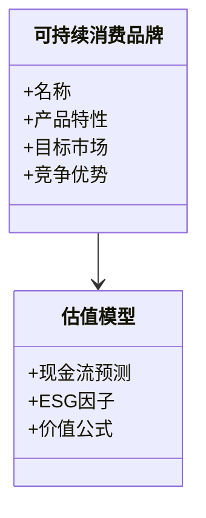
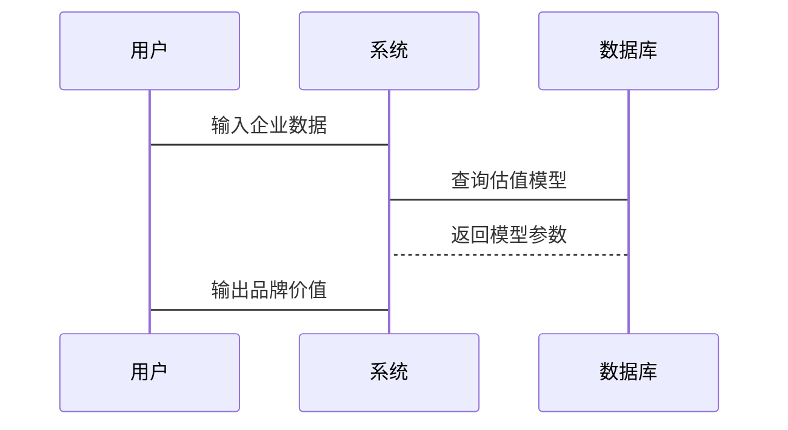

                 


# 可持续消费品牌的估值方法与投资策略

> 关键词：可持续消费品牌、估值方法、投资策略、ESG、绿色经济、循环经济

> 摘要：  
随着全球环境问题的日益严峻和消费者环保意识的增强，可持续消费品牌逐渐成为市场的重要组成部分。本文将从可持续消费品牌的定义、估值方法、投资策略等多方面展开分析，探讨如何通过技术创新和商业模式优化，实现品牌价值的最大化，同时为投资者提供科学的决策依据。

---

# 第一章：可持续消费品牌的背景与定义

## 1.1 可持续消费品牌的背景介绍

### 1.1.1 传统消费模式的局限性
- **资源浪费**：传统生产模式中，资源的过度使用导致环境压力增大。
- **环境污染**：生产过程中的污染物排放对生态系统造成破坏。
- **社会不平**：传统消费模式加剧了社会资源分配的不均衡。

### 1.1.2 可持续消费的兴起
- **环保意识的提升**：全球气候变化、资源枯竭等问题促使消费者转向可持续产品。
- **消费者行为的变化**：消费者越来越关注产品背后的社会责任和环境影响。
- **政策法规的推动**：各国政府出台相关政策，鼓励企业采用可持续发展模式。

## 1.2 可持续消费品牌的定义与特征

### 1.2.1 可持续消费品牌的定义
- **生产端**：采用绿色生产技术，减少资源消耗和污染物排放。
- **消费端**：倡导绿色消费，鼓励消费者选择环保产品。
- **废弃端**：建立循环经济模式，实现资源的循环利用。

### 1.2.2 可持续消费品牌的特征
- **环境友好性**：产品全生命周期中对环境的影响最小化。
- **社会责任性**：关注社会公平，推动社会责任的履行。
- **经济可持续性**：通过创新商业模式实现长期盈利能力。

## 1.3 可持续消费品牌的生态系统

### 1.3.1 产业链的重构
- **生产端**：绿色生产、智能制造。
- **消费端**：绿色消费、共享经济。
- **废弃端**：资源回收、循环利用。

### 1.3.2 核心利益相关者
- **企业**：生产者、品牌商。
- **消费者**：终端用户。
- **政府**：政策制定者。
- **非营利组织**：监督者。

---

# 第二章：可持续消费品牌的估值方法

## 2.1 传统估值方法的局限性

### 2.1.1 现金流折现法（DCF）
- **传统DCF模型的假设**：假设现金流可以无限期增长，忽视环境和社会成本。
- **可持续品牌DCF模型的调整**：将ESG因素纳入现金流预测。

### 2.1.2 市盈率法（P/E）
- **传统市盈率法的局限性**：忽视企业社会责任和环境影响。
- **改进方向**：引入绿色市盈率，考虑企业的可持续发展能力。

## 2.2 可持续消费品牌的专属估值模型

### 2.2.1 ESG因子的引入
- **环境（E）**：碳排放、能源消耗。
- **社会（S）**：员工福利、社区贡献。
- **治理（G）**：公司治理结构、透明度。

### 2.2.2 可持续品牌价值公式
$$ V = E \times S \times G $$
其中：
- **E**：环境影响因子。
- **S**：社会效益因子。
- **G**：治理效率因子。

---

# 第三章：可持续消费品牌的投资策略

## 3.1 可持续消费品牌的投资价值分析

### 3.1.1 市场潜力
- **绿色市场规模**：全球绿色市场规模持续增长。
- **消费者偏好**：年轻一代更倾向于选择可持续品牌。

### 3.1.2 风险分析
- **政策风险**：环保法规的变化可能影响企业运营。
- **技术风险**：绿色技术的不确定性。

## 3.2 投资策略的选择

### 3.2.1 长期投资策略
- **目标选择**：投资具有长期发展潜力的可持续品牌。
- **持股策略**：长期持有，分享企业成长收益。

### 3.2.2 短期投资策略
- **市场波动**：利用市场波动进行短期交易。
- **事件驱动**：关注重大环保事件带来的投资机会。

## 3.3 投资组合的构建

### 3.3.1 资产配置
- **资产比例**：根据市场情况调整可持续品牌资产比例。
- **分散投资**：避免过度集中于单一行业或品牌。

### 3.3.2 风险管理
- **止损机制**：设定止损点，控制投资风险。
- **动态调整**：根据市场变化及时调整投资策略。

---

# 第四章：可持续消费品牌的系统分析与架构设计

## 4.1 系统分析方法

### 4.1.1 领域模型


### 4.1.2 架构设计


## 4.2 系统架构设计

### 4.2.1 系统功能设计
- **数据输入**：收集企业的ESG数据、财务数据。
- **模型计算**：运行估值模型，得出品牌价值。
- **策略制定**：根据计算结果，制定投资策略。

### 4.2.2 系统接口设计
- **输入接口**：数据采集模块。
- **输出接口**：结果展示模块。

---

# 第五章：可持续消费品牌的项目实战

## 5.1 项目环境安装

### 5.1.1 开发工具
- **代码编辑器**：Visual Studio Code。
- **版本控制**：Git。
- **依赖管理**：pip、npm。

### 5.1.2 系统架构


## 5.2 核心代码实现

### 5.2.1 估值模型实现
```python
def calculate_sustainable_value(E, S, G):
    return E * S * G
```

### 5.2.2 投资策略实现
```python
def investment_strategy(portfolio, market_conditions):
    # 根据市场条件调整投资组合
    return optimized_portfolio
```

---

# 第六章：可持续消费品牌的总结与展望

## 6.1 总结
- **核心内容回顾**：可持续消费品牌的定义、估值方法、投资策略。
- **主要结论**：通过科学的估值方法和合理的投资策略，可以实现可持续消费品牌的长期价值。

## 6.2 未来展望
- **技术创新**：人工智能、大数据在可持续消费中的应用。
- **政策支持**：各国政府进一步加强政策支持，推动可持续消费发展。

---

# 作者

作者：AI天才研究院/AI Genius Institute & 禅与计算机程序设计艺术 /Zen And The Art of Computer Programming

