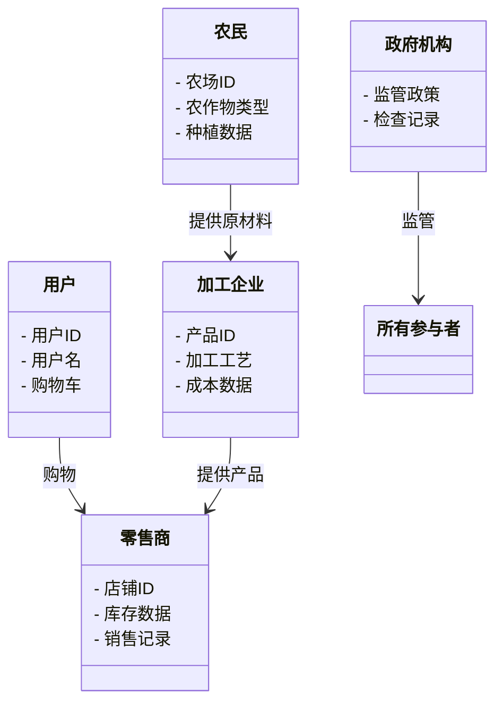
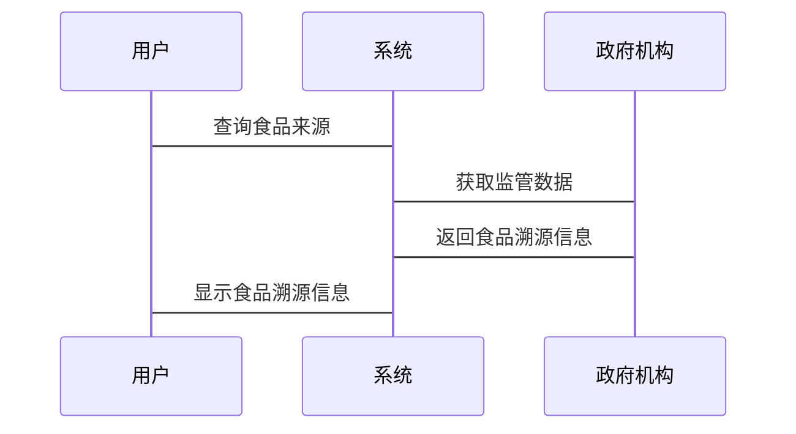

                 


# 《可持续食品系统的创新与投资机会》

---

## 关键词：
可持续食品系统、技术创新、投资机会、农业数字化、智能供应链、食品科技

---

## 摘要：
随着全球人口增长和环境问题的加剧，可持续食品系统成为保障粮食安全和减少环境影响的关键。本文系统分析了可持续食品系统的定义、核心要素、技术创新及其投资机会，探讨了农业数字化、智能供应链和食品科技领域的最新进展，并通过实际案例展示了技术如何推动食品系统的可持续发展。文章最后总结了未来的发展趋势和投资建议，为行业从业者和投资者提供了深度洞察。

---

# 第一部分：可持续食品系统的背景与挑战

## 第1章：可持续食品系统的背景与问题背景

### 1.1 可持续发展的概念与内涵
- **可持续发展的定义**：强调经济、社会和环境的平衡发展，避免过度消耗资源和破坏环境。
- **可持续食品系统的定义**：一种在生产、加工、配送和消费全过程中，减少资源消耗、降低污染、保障粮食安全并促进社会公平的食品系统。
- **可持续食品系统的特点**：
  - 环境友好：减少温室气体排放、节约水资源、减少化学肥料使用。
  - 经济高效：优化资源配置，降低生产成本，提高生产效率。
  - 社会公平：确保所有人都能获得安全、营养丰富的食物，减少浪费。

### 1.2 食品系统面临的挑战
- **全球粮食安全问题**：人口增长、气候变化导致粮食产量波动，威胁粮食安全。
- **环境资源消耗与污染**：传统农业过度依赖化肥和农药，导致土壤退化、水污染和生物多样性丧失。
- **社会与经济不平等问题**：贫困地区缺乏足够的资源和基础设施，难以获得健康食品。

### 1.3 可持续食品系统的重要性
- **对环境保护的意义**：减少碳足迹，缓解气候变化，保护生态系统。
- **对社会公平的影响**：通过优化供应链和降低食品浪费，确保弱势群体获得基本营养。
- **对经济发展的推动作用**：通过技术创新和产业升级，创造新的经济增长点。

---

## 第2章：可持续食品系统的构成与核心要素

### 2.1 可持续食品系统的构成
- **农业生产环节**：包括种植、养殖和渔业，强调生态农业和有机种植。
- **食品加工与包装**：减少资源消耗，使用可降解材料。
- **食品物流与供应链**：优化运输路径，减少能源浪费。
- **食品消费与浪费**：倡导理性消费，减少食物浪费。

### 2.2 核心概念与联系
- **可持续食品系统的属性特征对比表格**
| 属性 | 可持续性 | 效率 | 环境友好 | 社会公平 |
|------|---------|------|----------|----------|
| 定义 | 长期稳定 | 资源高效利用 | 低环境影响 | 公平分配资源 |
| 特征 | 循环利用 | 减少浪费 | 减少污染 | 保障弱势群体 |

- **可持续食品系统的ER实体关系图**
```mermaid
erd
    actor 用户
    actor 农民
    actor 加工企业
    actor 零售商
    actor 消费者
    actor 政府机构
    node 食品生产
    node 食品加工
    node 食品物流
    node 食品消费
    user -[参与]-> 食品消费
    farmer -[提供]-> 食品生产
    food production -[输入]-> food processing
    food processing -[输出]-> food logistics
    food logistics -[配送]-> 零售商
    零售商 -[销售]-> 用户
    政府机构 -[监管]-> 食品生产、食品加工、食品物流、食品消费
```

---

## 第3章：技术创新与可持续食品系统的实现

### 3.1 农业数字化与智能种植
- **农业物联网（IoT）**：通过传感器和数据采集设备，实时监测土壤湿度、温度、光照等参数，优化灌溉和施肥。
- **人工智能与机器学习**：预测天气、病虫害，优化种植计划和作物轮作。
- **案例分析**：某农业公司使用AI预测模型，减少30%的水资源消耗。

### 3.2 智能供应链与区块链技术
- **区块链技术**：用于食品溯源，确保供应链透明，减少假冒伪劣产品。
- **智能物流**：通过大数据优化配送路径，减少运输成本和碳排放。
- **案例分析**：某食品企业利用区块链技术，实现从农场到超市的全程追溯。

### 3.3 食品科技创新
- **替代蛋白**：如植物基肉类产品，减少对传统畜牧业的依赖。
- **食品加工技术**：如低温杀菌技术，减少能源消耗。
- **案例分析**：某食品科技公司开发的植物基肉类产品，减少90%的碳排放。

---

## 第4章：系统分析与架构设计

### 4.1 系统功能设计（领域模型类图）


### 4.2 系统架构设计（架构图）


### 4.3 系统交互设计（序列图）


---

## 第5章：项目实战与投资机会

### 5.1 环境安装与配置
- **工具安装**：安装Python、TensorFlow、区块链开发框架等。
- **数据准备**：收集农业数据、供应链数据、消费者行为数据。

### 5.2 核心代码实现
- **AI预测模型代码示例**
```python
import tensorflow as tf
from sklearn.model_selection import train_test_split
import numpy as np

# 数据准备
X = np.random.rand(1000, 10)  # 10个特征，1000个样本
y = np.random.randint(2, size=1000)

# 划分训练集和测试集
X_train, X_test, y_train, y_test = train_test_split(X, y, test_size=0.2)

# 构建模型
model = tf.keras.Sequential([
    tf.keras.layers.Dense(16, activation='relu'),
    tf.keras.layers.Dense(1, activation='sigmoid')
])
model.compile(optimizer='adam', loss='binary_crossentropy', metrics=['accuracy'])

# 训练模型
model.fit(X_train, y_train, epochs=10, batch_size=32)

# 预测
predictions = model.predict(X_test)
```

- **区块链溯源代码示例**
```python
from hashlib import sha256
import json

def create_block(data, previous_hash):
    block = {
        'data': data,
        'timestamp': str(time.time()),
        'previous_hash': previous_hash
    }
    return json.dumps(block)

def calculate_hash(block):
    return sha256(block.encode()).hexdigest()

# 创建区块
data = {'product_id': '001', 'origin': 'farm'}
previous_hash = '0'
new_block = create_block(data, previous_hash)
block_hash = calculate_hash(new_block)
```

### 5.3 投资机会分析
- **农业数字化**：投资AI农业、精准农业技术。
- **智能供应链**：投资区块链溯源、智能物流技术。
- **食品科技创新**：投资替代蛋白、新型食品加工技术。

---

## 第6章：总结与展望

### 6.1 总结
- 本文系统分析了可持续食品系统的构成、技术创新和投资机会。
- 通过实际案例和技术实现，展示了如何通过技术创新推动食品系统的可持续发展。

### 6.2 未来展望
- **技术进步**：AI、区块链和生物技术将进一步推动食品系统的创新。
- **政策支持**：政府和社会资本合作（PPP）模式将加速可持续食品系统的推广。
- **投资机会**：农业数字化、智能供应链和食品科技创新领域将吸引更多投资。

---

## 作者：
AI天才研究院/AI Genius Institute  
禅与计算机程序设计艺术/Zen And The Art of Computer Programming

