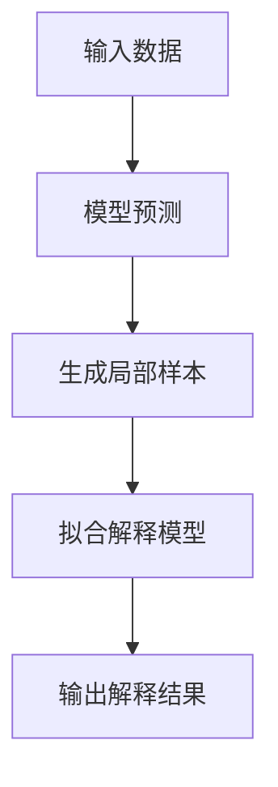
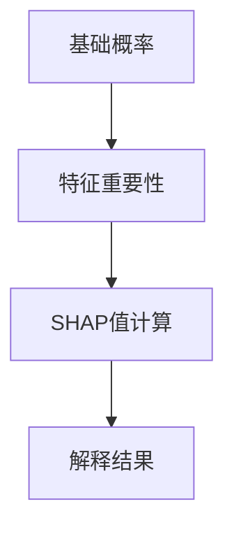
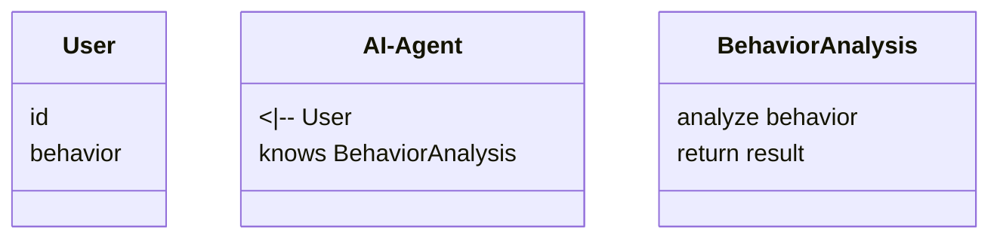
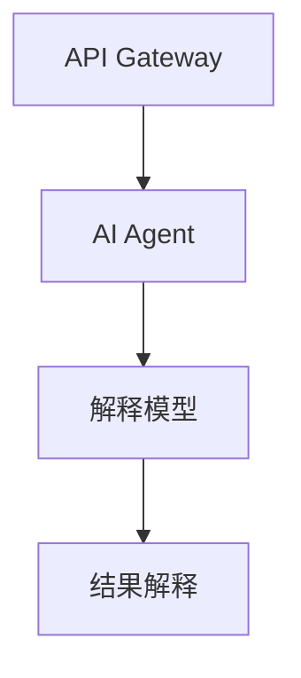

                 


# 可解释性：理解AI Agent的决策过程

> 关键词：可解释性、AI Agent、决策过程、算法原理、系统设计、项目实战

> 摘要：本文深入探讨AI Agent的可解释性，分析其在决策过程中的关键作用，介绍常见的可解释性算法，结合系统设计和项目实战，提供实用的解决方案和最佳实践。

---

## 第1章：可解释性的重要性

### 1.1 什么是可解释性

#### 1.1.1 可解释性的定义
可解释性是指AI系统的行为、决策或输出能够被人类理解和解释的程度。一个可解释的模型不仅输出结果，还能揭示其决策背后的逻辑和依据。

#### 1.1.2 可解释性在AI中的作用
1. **信任建立**：可解释性增强用户对AI系统的信任。
2. **调试与优化**：帮助开发者识别和修复模型错误。
3. **合规性**：满足法律法规对AI系统的透明性要求。
4. **用户体验**：提供有意义的反馈，提升用户体验。

#### 1.1.3 可解释性与AI决策过程的关系
可解释性贯穿AI决策过程的始终，从数据输入到最终输出，每一步都需要清晰的逻辑支持。

---

### 1.2 AI Agent的基本概念

#### 1.2.1 AI Agent的定义
AI Agent是一种智能体，能够感知环境、自主决策并执行任务。它具备自主性、反应性、目标导向和社会能力等特征。

#### 1.2.2 AI Agent的核心特征
1. **自主性**：独立决策。
2. **反应性**：实时响应环境变化。
3. **目标导向**：以目标为导向执行任务。
4. **社会能力**：与环境或其他智能体交互。

#### 1.2.3 AI Agent的决策过程
AI Agent的决策过程包括感知、推理、规划和执行四个阶段。每个阶段都需要可解释性支持，以便理解和优化决策过程。

---

### 1.3 可解释性在AI Agent中的应用

#### 1.3.1 可解释性在机器学习中的应用
1. **模型解释**：通过特征重要性分析揭示模型决策逻辑。
2. **诊断错误**：定位模型错误的原因。

#### 1.3.2 可解释性在自然语言处理中的应用
1. **文本解释**：分析AI生成文本的逻辑。
2. **情感分析**：解释情感判断的依据。

#### 1.3.3 可解释性在推荐系统中的应用
1. **推荐理由**：向用户解释推荐的原因。
2. **提升用户满意度**：通过可解释性提高推荐系统的接受度。

---

## 第2章：可解释性与AI Agent的核心概念

### 2.1 可解释性的核心原理

#### 2.1.1 解释性模型的分类
1. **模型内解释**：基于模型本身的特性进行解释，如线性回归的系数。
2. **模型外解释**：通过生成模拟数据来解释模型行为，如LIME和SHAP。

#### 2.1.2 解释性模型的特征对比

| 特征         | 模型内解释 | 模型外解释 |
|--------------|------------|------------|
| 适用性       | 高         | 低         |
| 解释能力     | 强         | 较弱       |
| 计算复杂度   | 低         | 高         |

#### 2.1.3 解释性模型的优缺点
- **优点**：增强透明度，提升用户信任。
- **缺点**：可能降低模型的准确性和复杂性。

---

### 2.2 AI Agent决策过程的可解释性

#### 2.2.1 决策过程的透明化
通过记录决策过程，确保每个决策都有迹可循。

#### 2.2.2 决策过程的可验证性
提供验证工具和方法，确保决策的正确性和合理性。

#### 2.2.3 决策过程的可追溯性
建立追溯机制，便于回溯和优化决策过程。

---

### 2.3 可解释性与AI Agent的实体关系图


---

## 第3章：可解释性算法的原理与实现

### 3.1 常见的可解释性算法

#### 3.1.1 LIME算法
LIME（Local Interpretable Model-agnostic Explanations）用于解释单个预测结果。

#### 3.1.2 SHAP值
SHAP（SHapley Additive exPlanations）基于博弈论解释模型决策。

#### 3.1.3 其他解释性方法
如特征重要性分析、决策树解释等。

---

### 3.2 LIME算法的实现流程



---

### 3.3 SHAP值的计算过程



---

### 3.4 Python实现LIME算法

```python
from lime import lime_explanations
import numpy as np

def explain_model(model, instance):
    explainer = lime_explanations.LimeExplainer()
    explanation = explainer.explain_instance(instance, model.predict)
    return explanation
```

---

### 3.5 SHAP值的数学模型

$$ \text{SHAP值} = \sum_{i=1}^{n} \phi_i $$

其中，$$ \phi_i $$ 是特征i对模型预测的贡献。

---

## 第4章：系统分析与架构设计

### 4.1 项目场景介绍

#### 4.1.1 问题场景
设计一个AI Agent用于用户行为分析，需解释其决策过程。

---

### 4.2 系统功能设计

#### 4.2.1 领域模型设计



---

#### 4.2.2 系统架构设计



---

## 第5章：项目实战

### 5.1 环境安装

```bash
pip install lime
pip install shap
```

---

### 5.2 核心代码实现

```python
import numpy as np
from lime import lime_explanations

def main():
    model = SomeModel()
    instance = np.array([[1, 2, 3]])
    explainer = lime_explanations.LimeExplainer()
    explanation = explainer.explain_instance(instance, model.predict)
    print(explanation)

if __name__ == "__main__":
    main()
```

---

### 5.3 实际应用案例分析

分析用户评论分类系统，使用LIME解释模型预测结果。

---

## 第6章：最佳实践

### 6.1 小结
可解释性是AI Agent的重要特性，需在设计和实现中重点关注。

### 6.2 注意事项
1. **模型选择**：选择适合可解释性需求的模型。
2. **数据处理**：确保数据的可解释性。
3. **解释验证**：验证解释的准确性和有效性。

### 6.3 拓展阅读
推荐阅读《可解释的人工智能：模型、方法与应用》。

---

## 作者：AI天才研究院

---

通过以上内容，您可以系统地理解AI Agent的可解释性及其在决策过程中的应用。从理论到实践，本文为您提供全面的指导和解决方案。

