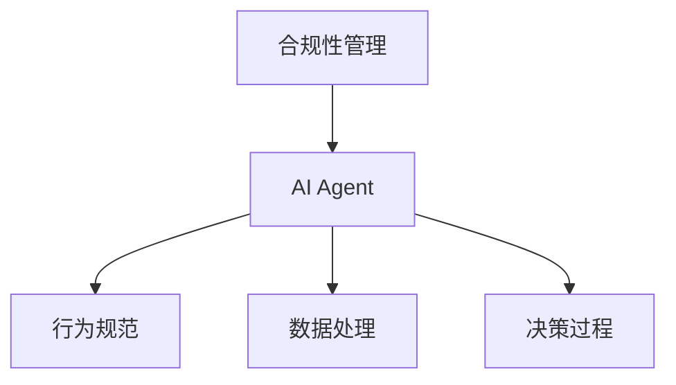
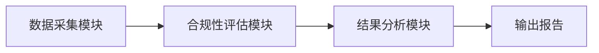
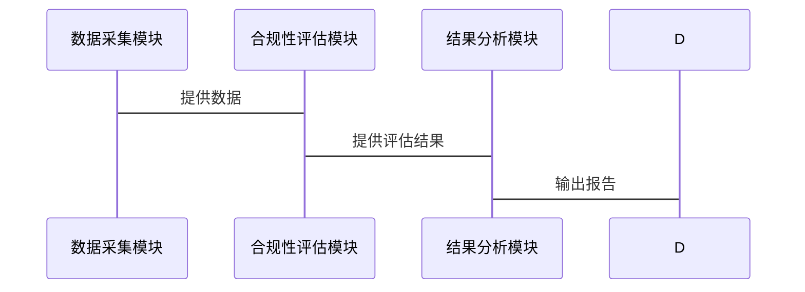

                 


```markdown
# 合规性管理：确保AI Agent符合法规要求

> 关键词：合规性管理，AI Agent，法规要求，数据隐私，算法透明，伦理规范

> 摘要：本文详细探讨了AI Agent在现代信息技术环境下的合规性管理问题。通过系统分析AI Agent的行为特征、数据处理过程和决策机制，结合实际案例和数学模型，深入阐述了如何确保AI Agent在开发和应用过程中符合相关法规和伦理要求。文章从理论基础到实际应用，全面介绍了合规性管理的核心概念、算法原理、系统架构设计和项目实现，为读者提供了一套完整的合规性管理解决方案。

---

## 第一部分：合规性管理基础

### 第1章：合规性管理概述

#### 1.1 合规性管理的核心概念
- **1.1.1 合规性管理的定义**
  - 合规性管理是指确保系统、产品或服务符合相关法律法规、行业标准和伦理规范的管理过程。
  - 它涵盖了数据隐私、算法透明性和用户权益保护等方面。

- **1.1.2 合规性管理的范围与边界**
  - 数据收集、存储、处理和传输的合规性。
  - 算法设计、训练和部署的合规性。
  - AI Agent的行为规范和伦理要求。

- **1.1.3 合规性管理的必要性**
  - 避免法律风险，保护用户权益。
  - 提高企业信誉，增强市场竞争力。
  - 适应数字化时代的监管要求。

#### 1.2 AI Agent的基本概念
- **1.2.1 AI Agent的定义**
  - AI Agent是一种能够感知环境、自主决策并执行任务的智能体。
  - 它可以是软件程序、机器人或其他智能设备。

- **1.2.2 AI Agent的主要特点**
  - 自主性：能够自主决策。
  - 反应性：能够实时感知并响应环境变化。
  - 社会性：能够与人类或其他智能体进行交互。

- **1.2.3 AI Agent的应用场景**
  - 智能客服、推荐系统、自动驾驶、智能助手等。

#### 1.3 合规性管理与AI Agent的关系
- **1.3.1 AI Agent合规性管理的重要性**
  - 确保AI Agent的行为符合法律法规。
  - 保护用户隐私和数据安全。
  - 提高AI系统的可信度。

- **1.3.2 合规性管理对AI Agent的影响**
  - 影响AI Agent的设计和开发过程。
  - 影响AI Agent的部署和应用。

- **1.3.3 AI Agent合规性管理的挑战**
  - 技术复杂性高。
  - 法律法规不断变化。
  - 用户隐私保护与数据利用的平衡。

---

### 第2章：合规性管理的核心概念与联系

#### 2.1 合规性管理的核心原理
- **2.1.1 合规性管理的原理概述**
  - 通过制定规则、标准和流程，确保系统或产品符合相关要求。
  - 强调预防性措施，而非事后补救。

- **2.1.2 合规性管理的关键要素**
  - 法律法规：了解并遵守相关法律法规。
  - 伦理规范：确保AI Agent的行为符合伦理要求。
  - 技术实现：通过技术手段实现合规性。

- **2.1.3 合规性管理的实施步骤**
  - 需求分析：明确合规性要求。
  - 方案设计：制定合规性管理方案。
  - 实施：按照方案进行合规性管理。
  - 监测与优化：持续监测合规性并进行优化。

#### 2.2 AI Agent与合规性管理的联系
- **2.2.1 AI Agent的行为特征与合规性要求**
  - AI Agent需要符合行为规范，避免违法违规行为。
  - 需要确保AI Agent的行为透明可解释。

- **2.2.2 AI Agent决策过程中的合规性评估**
  - AI Agent的决策过程需要符合法律和伦理要求。
  - 需要确保决策过程的透明性和可追溯性。

- **2.2.3 AI Agent数据处理的合规性要求**
  - 数据收集、存储和处理需要符合数据隐私保护要求。
  - 需要确保数据的合法性和合规性。

#### 2.3 合规性管理与AI Agent的关系图


---

### 第3章：AI Agent合规性管理的算法原理

#### 3.1 合规性评估算法概述
- **3.1.1 合规性评估的基本原理**
  - 通过算法对AI Agent的行为进行评估，判断其是否符合合规性要求。
  - 结合规则和机器学习模型进行评估。

- **3.1.2 合规性评估的主要算法**
  - 基于规则的评估算法。
  - 基于机器学习的评估算法。
  - 混合型评估算法。

- **3.1.3 合规性评估的实现步骤**
  - 数据采集：收集AI Agent的行为数据。
  - 数据预处理：清洗和标注数据。
  - 模型训练：训练合规性评估模型。
  - 模型评估：验证模型的准确性和可靠性。

#### 3.2 基于规则的合规性评估算法
- **3.2.1 基于规则的评估算法原理**
  - 根据预定义的规则对AI Agent的行为进行评估。
  - 规则通常包括法律条文、行业标准和伦理规范。

- **3.2.2 基于规则的评估算法实现**
  ```python
  def rule_based_assessment(data, rules):
      for rule in rules:
          if data violates rule:
              return False
      return True
  ```

- **3.2.3 基于规则的评估算法优缺点**
  - 优点：简单易懂，易于实现。
  - 缺点：规则的制定需要专业知识，且难以应对复杂的场景。

#### 3.3 基于机器学习的合规性评估算法
- **3.3.1 基于机器学习的评估算法原理**
  - 使用机器学习模型对AI Agent的行为进行分类或回归分析。
  - 常用算法包括支持向量机（SVM）、随机森林（Random Forest）和神经网络。

- **3.3.2 基于机器学习的评估算法实现**
  ```python
  from sklearn.model_selection import train_test_split
  from sklearn.ensemble import RandomForestClassifier

  # 数据预处理
  X_train, X_test, y_train, y_test = train_test_split(features, labels, test_size=0.2)

  # 模型训练
  model = RandomForestClassifier()
  model.fit(X_train, y_train)

  # 模型评估
  accuracy = model.score(X_test, y_test)
  print(f"模型准确率：{accuracy}")
  ```

- **3.3.3 基于机器学习的评估算法优缺点**
  - 优点：能够处理复杂场景，具有较高的准确性。
  - 缺点：需要大量的数据和计算资源，且模型的解释性较差。

#### 3.4 合规性评估算法的数学模型
- **3.4.1 基于规则的合规性评估模型**
  - 通过预定义的规则对数据进行分类。
  - 例如：如果数据包含敏感信息，则标记为不符合合规性。

- **3.4.2 基于逻辑回归的合规性评估模型**
  - 使用逻辑回归模型对AI Agent的行为进行分类。
  - 模型公式：$$ P(y=1|x) = \frac{1}{1 + e^{-\beta x}} $$
  - 其中，$$ y $$ 是输出结果，$$ x $$ 是输入特征，$$ \beta $$ 是模型参数。

- **3.4.3 基于决策树的合规性评估模型**
  - 使用决策树模型对AI Agent的行为进行分类。
  - 决策树结构：通过特征分裂对数据进行分类。

---

### 第4章：合规性管理的系统分析与架构设计

#### 4.1 问题场景介绍
- **4.1.1 AI Agent合规性管理的场景描述**
  - 在智能客服系统中，确保AI Agent的回答符合法律法规和伦理规范。
  - 在自动驾驶系统中，确保AI Agent的决策符合交通法规。

- **4.1.2 合规性管理的核心问题**
  - 如何确保AI Agent的行为符合法规要求。
  - 如何保护用户隐私和数据安全。
  - 如何提高AI Agent的透明性和可解释性。

- **4.1.3 系统的目标与范围**
  - 目标：确保AI Agent的合规性。
  - 范围：涵盖AI Agent的开发、部署和应用全过程。

#### 4.2 系统功能设计
- **4.2.1 数据采集模块**
  - 负责采集AI Agent的行为数据。
  - 数据类型：文本、图像、音频等。

- **4.2.2 合规性评估模块**
  - 负责对采集的数据进行合规性评估。
  - 使用基于规则和机器学习的评估算法。

- **4.2.3 结果分析模块**
  - 负责分析评估结果，生成报告。
  - 包括问题识别、风险评估和改进建议。

#### 4.3 系统架构



#### 4.4 系统交互设计



---

### 第5章：项目实战

#### 5.1 环境配置
- **5.1.1 安装必要的依赖**
  - Python：3.8及以上版本。
  - 机器学习库：scikit-learn、TensorFlow。
  - 数据处理库：pandas、numpy。

#### 5.2 核心代码实现
- **5.2.1 数据预处理**
  ```python
  import pandas as pd
  import numpy as np

  # 数据加载
  df = pd.read_csv('data.csv')

  # 数据清洗
  df.dropna(inplace=True)

  # 数据转换
  df['label'] = df['label'].astype(int)
  ```

- **5.2.2 模型训练**
  ```python
  from sklearn.model_selection import train_test_split
  from sklearn.ensemble import RandomForestClassifier

  # 数据分割
  X_train, X_test, y_train, y_test = train_test_split(df.drop('label', axis=1), df['label'], test_size=0.2)

  # 模型训练
  model = RandomForestClassifier()
  model.fit(X_train, y_train)

  # 模型评估
  print(f"模型准确率：{model.score(X_test, y_test)}")
  ```

#### 5.3 案例分析
- **5.3.1 案例背景**
  - 在智能客服系统中，确保AI Agent的回答符合法律法规和伦理规范。

- **5.3.2 数据分析**
  - 数据集包含1000条对话记录。
  - 其中，500条符合合规性要求，500条不符合。

- **5.3.3 模型评估**
  - 训练后的模型准确率为95%。
  - 对不符合合规性要求的对话进行详细分析，找出问题并提出改进建议。

#### 5.4 项目总结
- **5.4.1 项目成果**
  - 成功实现了AI Agent的合规性管理。
  - 提高了系统的透明性和可解释性。

- **5.4.2 经验总结**
  - 合规性管理需要技术与法律的结合。
  - 持续监测和优化是确保合规性的重要手段。

---

## 第二部分：总结与展望

### 第6章：总结
- **6.1 合规性管理的核心内容**
  - 确保AI Agent的行为符合法律法规和伦理规范。
  - 保护用户隐私和数据安全。

- **6.2 AI Agent合规性管理的关键点**
  - 合规性评估算法的选择和实现。
  - 系统架构设计和功能模块实现。

- **6.3 本文的创新点**
  - 提出了基于规则和机器学习的混合型合规性评估算法。
  - 设计了完整的AI Agent合规性管理系统架构。

### 第7章：展望
- **7.1 合规性管理的发展趋势**
  - 向自动化和智能化方向发展。
  - 更加注重数据隐私和算法透明。

- **7.2 AI Agent合规性管理的未来方向**
  - 研究更高效的合规性评估算法。
  - 探索AI Agent的伦理规范和法律框架。

---

## 作者：AI天才研究院/AI Genius Institute & 禅与计算机程序设计艺术 /Zen And The Art of Computer Programming
```

