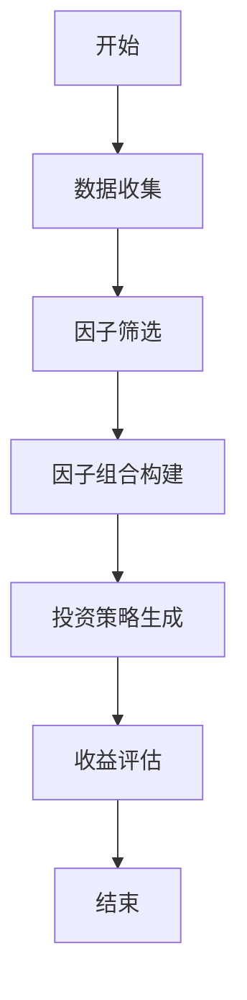
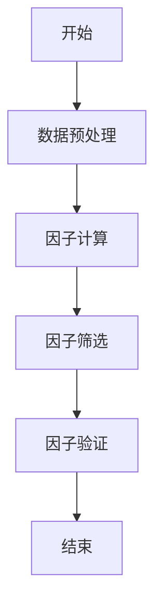
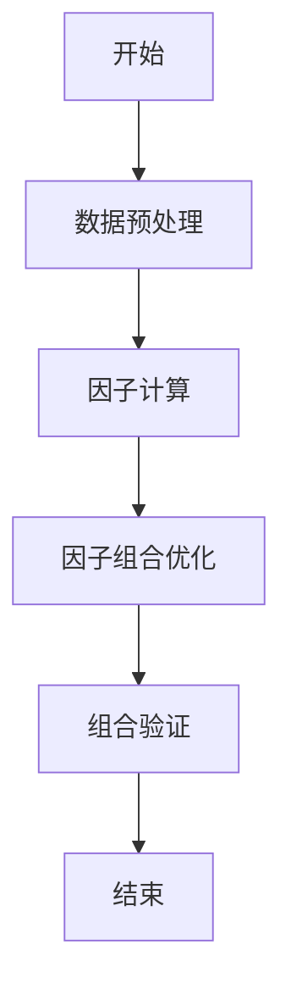

                 


# 因子投资：捕捉市场异常回报的系统方法

---

## 关键词：
因子投资，异常回报，系统方法，多因子模型，因子筛选，因子组合构建

---

## 摘要：
因子投资是一种基于统计学和金融学的系统化投资方法，旨在通过识别和利用市场中的异常回报机会，实现长期稳定的超额收益。本文从因子投资的核心概念出发，系统性地介绍了因子投资的背景、理论基础、算法原理、数学模型以及实际应用。通过详细的流程图、ER实体关系图、类图和序列图，本文深入剖析了因子投资的系统方法，包括因子筛选、因子组合构建、投资策略生成等关键环节。结合实际案例和Python代码实现，本文为读者提供了一套完整的因子投资解决方案，帮助投资者在复杂的金融市场中捕捉异常回报。

---

# 第一部分: 因子投资概述与背景

## 第1章: 因子投资的背景与概念

### 1.1 什么是因子投资
因子投资是一种基于对资产价格驱动因素的系统化分析的投资方法。通过识别和利用市场中的因子（如市值、价值、动量等），投资者可以构建出能够捕捉异常回报的投资组合。

#### 1.1.1 因子投资的定义
因子投资是通过分析资产价格的驱动因素，筛选出具有超额收益能力的因子，并利用这些因子构建投资组合的一种投资方法。其核心在于发现市场中未被充分定价的因子，并通过这些因子实现超额收益。

#### 1.1.2 因子投资的核心要素
- **因子**：能够解释资产收益的统计变量，如市值、价值、动量等。
- **投资组合**：基于筛选出的因子构建的投资组合。
- **超额收益**：通过因子投资策略获得的高于市场平均收益的部分。

#### 1.1.3 因子投资与传统投资的区别
传统的投资方法更多依赖于基本面分析或技术分析，而因子投资则是通过统计方法筛选因子并构建投资组合。因子投资更加注重系统化、量化和科学化。

### 1.2 因子投资的历史与发展
因子投资起源于20世纪60年代，随着金融学的发展，逐步从单因子模型发展到多因子模型。

#### 1.2.1 因子投资的起源
因子投资的起源可以追溯到资本资产定价模型（CAPM）。CAPM假设资产的收益可以通过市场因子解释，但实际中发现单因子模型无法完全解释资产收益的异象。

#### 1.2.2 因子投资的发展阶段
- **单因子模型**：以CAPM为代表，假设资产收益仅由市场因子驱动。
- **多因子模型**：以Fama-French三因子模型为代表，引入多个因子解释资产收益。
- **现代发展**：引入更多因子，如动量、质量、波动率等，构建复杂的多因子模型。

#### 1.2.3 当前因子投资的现状
当前，因子投资在学术界和实务界得到了广泛应用。机构投资者通过因子投资构建被动型基金和主动型投资组合。

### 1.3 因子投资的理论基础
因子投资的理论基础主要包括资本资产定价模型（CAPM）和多因子资产定价模型（APT）。

#### 1.3.1 资本资产定价模型（CAPM）
CAPM假设资产的收益由市场因子决定，公式为：
$$
E[r_i] = r_f + \beta_i (E[r_m] - r_f)
$$
其中，$r_f$ 是无风险利率，$\beta_i$ 是资产i的贝塔系数，$E[r_m]$ 是市场预期收益。

#### 1.3.2 多因子资产定价模型（APT）
APT模型认为资产收益由多个因子驱动，公式为：
$$
E[r_i] = \alpha_i + \beta_{i1}F_1 + \beta_{i2}F_2 + \dots + \beta_{ik}F_k + \epsilon_i
$$
其中，$F_j$ 是第j个因子，$\beta_{ij}$ 是资产i对因子j的敏感度。

#### 1.3.3 因子投资的经济学解释
因子投资通过识别和利用市场中的定价错误，捕捉资产的异常收益。这种定价错误通常与资产的某些特征（如市值、价值、动量等）相关。

### 1.4 因子投资的市场应用
因子投资在实际市场中得到了广泛应用，尤其是在机构投资中。

#### 1.4.1 机构投资者的因子投资实践
机构投资者通过因子投资构建被动型指数基金和主动型投资组合。

#### 1.4.2 个人投资者的因子投资策略
个人投资者可以通过因子投资策略进行定投，分散风险，捕捉市场中的超额收益。

#### 1.4.3 因子投资在不同市场环境下的表现
因子投资在不同市场环境下的表现有所不同，但长期来看，因子投资能够稳定地捕捉到超额收益。

### 1.5 本章小结
本章介绍了因子投资的核心概念、历史发展和理论基础，为后续内容奠定了基础。

---

# 第二部分: 因子投资的核心概念与联系

## 第2章: 因子投资的核心概念

### 2.1 因子投资的核心要素
因子投资的核心要素包括因子、因子筛选、因子组合构建等。

#### 2.1.1 因子的定义与分类
因子是能够解释资产收益的统计变量，常见的因子包括：
- **市值因子（Size）**：资产的市值大小。
- **价值因子（Value）**：资产的低市盈率、低市净率等。
- **动量因子（Momentum）**：资产价格的动量效应。
- **质量因子（Quality）**：资产的盈利能力、杠杆率等。

#### 2.1.2 因子的属性特征对比
下表对比了常见因子的属性特征：

| 因子类型 | 解释变量 | 数据来源 | 计算方式 |
|----------|----------|----------|----------|
| 市值因子 | 资产规模 | 市值 | 市值排序 |
| 价值因子 | 估值水平 | 市盈率、市净率 | 估值排序 |
| 动量因子 | 动量效应 | 收益率 | 收益率排序 |
| 质量因子 | 盈利能力 | 净利润、杠杆率 | 财务指标排序 |

#### 2.1.3 因子之间的关系
因子之间可能存在相关性，也可能相互独立。例如，市值因子和价值因子之间可能存在一定的相关性。

### 2.2 因子投资的实体关系图
通过ER实体关系图可以清晰地展示因子投资的核心要素及其关系。

```mermaid
erDiagram
    actor 投资者 {
        <attribute> 资金
        <attribute> 投资目标
    }
    actor 市场数据提供者 {
        <attribute> 股价数据
        <attribute> 财务数据
    }
    entity 因子 {
        <attribute> 因子类型
        <attribute> 因子值
    }
    entity 投资组合 {
        <attribute> 资产列表
        <attribute> 持股权重
    }
    entity 预测收益 {
        <attribute> 预测收益值
    }
    投资者 --> 因子: 选择因子
    因子 --> 投资组合: 构建投资组合
    投资组合 --> 预测收益: 计算预测收益
```

### 2.3 因子投资的流程图
因子投资的流程图如下：



### 2.4 本章小结
本章通过实体关系图和流程图，详细描述了因子投资的核心概念及其关系。

---

## 第3章: 因子筛选的算法原理

### 3.1 因子筛选的统计方法
因子筛选的统计方法包括回归分析、方差分析和聚类分析。

#### 3.1.1 回归分析
回归分析用于评估因子对资产收益的解释能力。例如，使用线性回归模型：

$$
r_i = \alpha + \beta F_j + \epsilon
$$

其中，$\beta$ 是因子的回归系数，表示因子对收益的贡献。

#### 3.1.2 方差分析
方差分析用于检验因子对资产收益的影响是否显著。通过F检验可以判断因子的显著性。

#### 3.1.3 聚类分析
聚类分析用于将资产按照因子值进行分组，以便筛选出具有显著差异的因子。

### 3.2 因子筛选的机器学习方法
机器学习方法可以提高因子筛选的准确性和效率。

#### 3.2.1 线性回归
线性回归是一种常用的因子筛选方法，可以用来估计因子的回归系数。

#### 3.2.2 支持向量机
支持向量机（SVM）可以用于因子筛选，尤其是在高维数据中。

#### 3.2.3 随机森林
随机森林通过集成学习可以有效筛选出重要的因子。

### 3.3 因子筛选的流程图
因子筛选的流程图如下：



### 3.4 本章小结
本章详细介绍了因子筛选的统计方法和机器学习方法，并通过流程图展示了因子筛选的流程。

---

## 第4章: 因子组合构建的算法原理

### 4.1 因子组合构建的统计方法
因子组合构建的统计方法包括均值-方差优化和最小方差组合。

#### 4.1.1 均值-方差优化
均值-方差优化是一种经典的组合优化方法，目标是最小化组合的方差，同时最大化组合的预期收益。

#### 4.1.2 最小方差组合
最小方差组合是在给定预期收益下，最小化组合方差的优化问题。

### 4.2 因子组合构建的机器学习方法
机器学习方法可以用于因子组合构建，尤其是复杂场景下的优化。

#### 4.2.1 线性回归
线性回归可以用于估计因子的权重。

#### 4.2.2 支持向量回归
支持向量回归（SVR）可以用于估计因子的权重。

#### 4.2.3 随机森林回归
随机森林回归可以通过集成学习估计因子的权重。

### 4.3 因子组合构建的流程图
因子组合构建的流程图如下：



### 4.4 本章小结
本章详细介绍了因子组合构建的统计方法和机器学习方法，并通过流程图展示了因子组合构建的流程。

---

## 第5章: 因子投资的数学模型与公式

### 5.1 单因子模型
单因子模型是因子投资的基础，主要包括CAPM和Fama-French三因子模型。

#### 5.1.1 CAPM模型
CAPM模型的公式为：
$$
E[r_i] = r_f + \beta_i (E[r_m] - r_f)
$$

#### 5.1.2 Fama-French三因子模型
Fama-French三因子模型的公式为：
$$
E[r_i] = r_f + \beta_i (E[r_m] - r_f) + \beta_{i2} SMB + \beta_{i3} HML
$$
其中，SMB是小市值因子，HML是高估低估值因子。

### 5.2 多因子模型
多因子模型通过引入多个因子解释资产收益。

#### 5.2.1 多因子回归模型
多因子回归模型的公式为：
$$
r_i = \alpha + \beta_{i1} F_1 + \beta_{i2} F_2 + \dots + \beta_{ik} F_k + \epsilon_i
$$

#### 5.2.2 因子载荷矩阵
因子载荷矩阵用于表示因子与资产收益之间的关系。

#### 5.2.3 因子方差协方差矩阵
因子方差协方差矩阵用于衡量因子之间的相关性。

### 5.3 因子投资的数学公式
因子投资的数学公式主要体现在多因子回归模型中。

#### 5.3.1 因子回归公式
因子回归公

