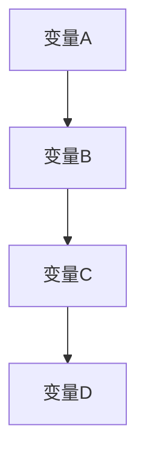
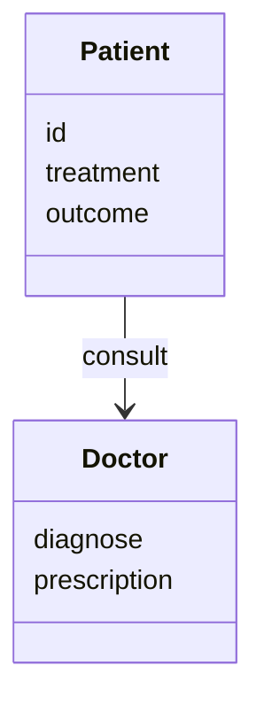
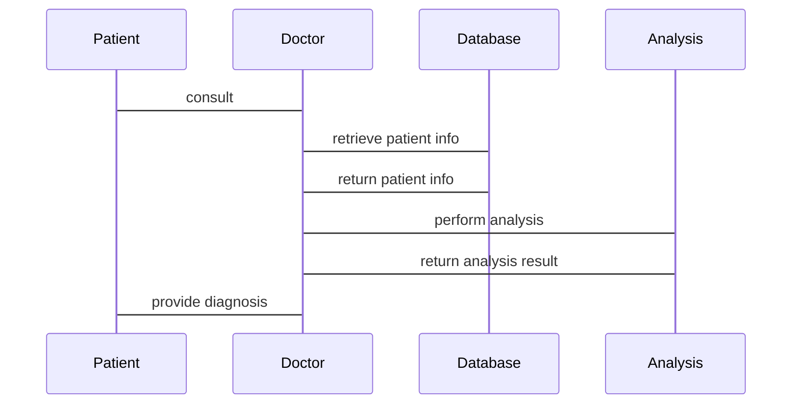

                 


# 因果推断：增强AI Agent的因果理解

---

## 关键词：因果推断，AI Agent，因果关系，结构方程模型，贝叶斯网络，潜在结果框架，因果图

---

## 摘要

本文探讨了因果推断在增强AI Agent中的应用，重点分析了因果推断的基本概念、算法原理及其在AI系统中的实际应用。通过详细解释因果推断的理论基础，结合具体的算法实现和项目案例，本文展示了如何通过因果理解提升AI Agent的决策能力和推理能力。文章还讨论了因果推断在实际应用中的挑战与解决方案，为读者提供了全面的视角。

---

# 第1章: 因果推断的基本概念

## 1.1 因果推断的定义与特点

### 1.1.1 因果关系的基本定义

因果关系是指两个变量之间存在直接的、可验证的影响关系。与相关性不同，因果关系强调“原因”与“结果”之间的确定性关系。例如，下雨是导致地面湿的原因，而两者之间的相关性可能在某些情况下被误解为因果关系。

### 1.1.2 因果关系与相关性的区别

- **相关性**：表示两个变量之间的统计关联，可能是正相关或负相关。
- **因果关系**：表示一个变量的变化直接导致另一个变量的变化。

### 1.1.3 因果推断在AI中的重要性

因果推断帮助AI Agent理解变量之间的因果关系，从而做出更准确的预测和决策。例如，在医疗领域，因果推断可以帮助AI Agent理解药物与患者康复之间的因果关系，从而优化治疗方案。

## 1.2 AI Agent的基本概念

### 1.2.1 AI Agent的定义

AI Agent是一种智能实体，能够感知环境、自主决策并执行任务。它可以是一个软件程序或物理机器人，具备一定的学习和推理能力。

### 1.2.2 AI Agent的分类与特点

AI Agent可以分为以下几类：
1. **简单反射型Agent**：基于当前输入做出简单反应。
2. **基于模型的反射型Agent**：使用内部模型进行决策。
3. **目标驱动型Agent**：根据目标选择行动。
4. **效用驱动型Agent**：通过最大化效用函数进行决策。

### 1.2.3 AI Agent在现实中的应用场景

- 医疗诊断
- 金融投资
- 自动驾驶
- 智能客服

## 1.3 问题背景与问题描述

### 1.3.1 当前AI Agent的局限性

传统AI Agent主要依赖相关性进行预测和决策，缺乏对因果关系的理解。这可能导致在因果关系复杂的情况下出现错误。

### 1.3.2 因果理解在AI Agent中的必要性

因果理解可以增强AI Agent的解释能力和鲁棒性，使其在面对干扰和不确定性时做出更合理的决策。

### 1.3.3 问题解决的思路与目标

通过引入因果推断技术，增强AI Agent的因果理解能力，使其能够更好地处理因果关系复杂的问题。

## 1.4 问题的边界与外延

### 1.4.1 因果推断的边界条件

- 数据的充分性
- 因果关系的复杂性
- 干扰因素的影响

### 1.4.2 AI Agent能力的边界

- 知识的局限性
- 计算资源的限制
- 环境的不确定性

### 1.4.3 因果推断与相关领域的关系

- **机器学习**：因果推断可以为机器学习提供更深层次的理解。
- **知识图谱**：因果推断可以帮助构建更准确的知识图谱。
- **自然语言处理**：因果推断可以增强文本理解的深度。

## 1.5 概念结构与核心要素

### 1.5.1 因果推断的核心要素

- **潜在结果**：在给定干预的情况下，变量可能的结果。
- **因果图**：表示变量之间的因果关系。
- **结构方程**：描述变量之间的因果关系。

### 1.5.2 AI Agent的核心要素

- **感知**：获取环境信息。
- **推理**：理解信息并做出决策。
- **行动**：执行决策。

### 1.5.3 两者的结合与相互作用

因果推断为AI Agent提供更深层次的理解，增强其推理和决策能力。

---

# 第2章: 因果推断的核心概念与联系

## 2.1 因果推断的原理

### 2.1.1 潜在结果框架

潜在结果框架是一种数学框架，用于分析变量之间的因果关系。在潜在结果框架中，每个变量在给定干预的情况下都有一个潜在的结果。

### 2.1.2 结构方程模型

结构方程模型是一种用于描述变量之间因果关系的模型。它通过结构方程和测量方程来表示变量之间的关系。

### 2.1.3 贝叶斯网络与因果图

贝叶斯网络是一种概率图模型，可以用来表示变量之间的因果关系。因果图通过有向边表示因果关系。

## 2.2 核心概念对比表

| 概念 | 特征 | 描述 |
|------|------|------|
| 相关性 | 单向 | 数据之间的统计关联 |
| 因果性 | 双向 | 变量之间的因果关系 |
| 随机性 | 不确定 | 数据的随机波动 |

## 2.3 ER实体关系图



---

# 第3章: 因果推断的算法原理

## 3.1 潜在结果框架

### 3.1.1 潜在结果的定义

在潜在结果框架中，每个变量在给定干预的情况下都有一个潜在的结果。例如，假设我们研究药物A对疾病B的治疗效果，潜在结果就是患者在服用药物A和未服用药物A的情况下，疾病B的状况。

### 3.1.2 潜在结果框架的实现

通过构建潜在结果框架，我们可以估计因果效应。例如，使用反事实推理来估计因果效应。

## 3.2 结构方程模型

### 3.2.1 结构方程模型的定义

结构方程模型是一种用于描述变量之间因果关系的模型。它通过结构方程和测量方程来表示变量之间的关系。

### 3.2.2 结构方程模型的实现

使用结构方程模型进行因果推断，可以通过参数估计和模型拟合来实现。

## 3.3 贝叶斯网络与因果图

### 3.3.1 贝叶斯网络的定义

贝叶斯网络是一种概率图模型，可以用来表示变量之间的因果关系。它通过有向边表示因果关系。

### 3.3.2 贝叶斯网络的实现

使用贝叶斯网络进行因果推断，可以通过概率推理和条件概率来实现。

## 3.4 算法实现

### 3.4.1 潜在结果框架的实现

```python
def potential_outcome(X, T, Y, W):
    # X: covariates
    # T: treatment
    # Y: outcome
    # W:干预变量
    # 估计潜在结果
    pass
```

### 3.4.2 结构方程模型的实现

```python
def structural_equation_model(X, Y, W):
    # X: covariates
    # Y: outcome
    # W:干预变量
    # 估计结构方程模型
    pass
```

### 3.4.3 贝叶斯网络的实现

```python
def bayesian_network(X, Y, W):
    # X: covariates
    # Y: outcome
    # W:干预变量
    # 估计贝叶斯网络
    pass
```

## 3.5 数学模型

### 3.5.1 潜在结果模型的数学表达

$$ Y = T \cdot Y_1 + (1 - T) \cdot Y_0 $$

### 3.5.2 结构方程模型的数学表达

$$ Y = \beta X + \gamma T + \epsilon $$

### 3.5.3 贝叶斯网络的数学表达

$$ P(Y|X, T) = \prod_{i=1}^n P(Y_i|X_i, T_i) $$

---

# 第4章: 系统分析与架构设计

## 4.1 问题场景介绍

假设我们有一个医疗数据分析系统，需要分析某种药物对患者康复的影响。

## 4.2 系统功能设计

### 4.2.1 领域模型



### 4.2.2 系统架构


### 4.2.3 系统接口设计

- 输入接口：患者信息、治疗方案
- 输出接口：分析结果、诊断报告

### 4.2.4 系统交互



---

# 第5章: 项目实战

## 5.1 环境安装

安装Python和相关库（如pymc、numpy、pandas、scipy）。

## 5.2 核心代码实现

### 5.2.1 数据准备

```python
import pandas as pd
import numpy as np

data = pd.DataFrame({
    'X': np.random.randn(1000),
    'T': np.random.binomial(1, 0.5, 1000),
    'Y': np.random.randn(1000)
})
```

### 5.2.2 算法实现

```python
def causal_inference(data):
    X = data['X']
    T = data['T']
    Y = data['Y']
    # 进行因果推断
    pass
```

### 5.2.3 结果分析

分析结果并解释因果效应。

## 5.3 项目总结

总结项目中的关键点和经验教训。

---

# 第6章: 最佳实践与注意事项

## 6.1 最佳实践

- 数据质量：确保数据的准确性和完整性。
- 模型选择：根据具体情况选择合适的因果推断方法。
- 可解释性：注重模型的可解释性。

## 6.2 注意事项

- 干扰因素：注意控制干扰因素的影响。
- 数据量：因果推断需要足够的数据支持。
- 模型验证：通过实验验证模型的正确性。

## 6.3 拓展阅读

推荐一些因果推断和AI Agent相关的书籍和论文。

---

# 小结

本文详细探讨了因果推断在增强AI Agent中的应用，从理论基础到实际应用，为读者提供了全面的视角。通过因果推断，AI Agent可以更好地理解因果关系，从而做出更准确的决策和推理。

---

# 作者

作者：AI天才研究院/AI Genius Institute & 禅与计算机程序设计艺术 /Zen And The Art of Computer Programming

