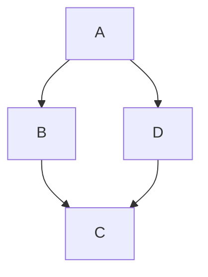
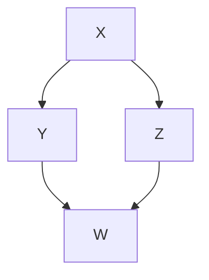
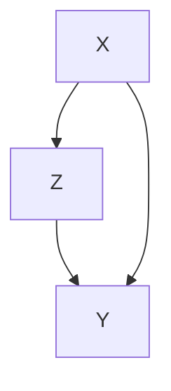
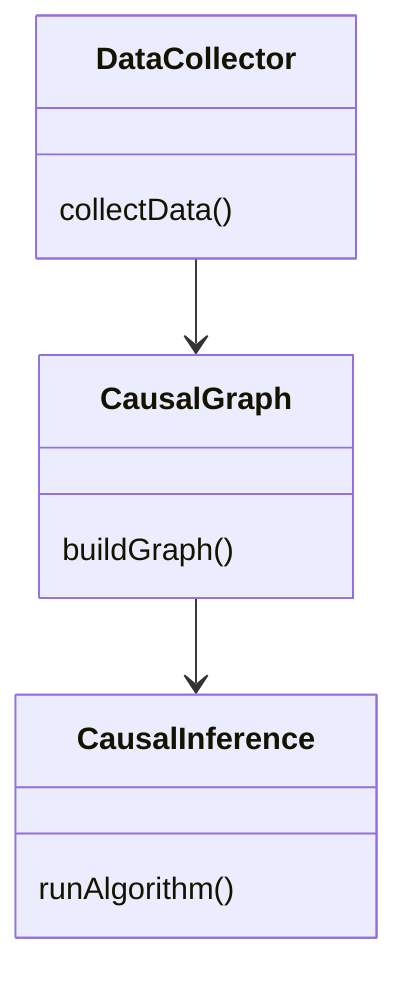
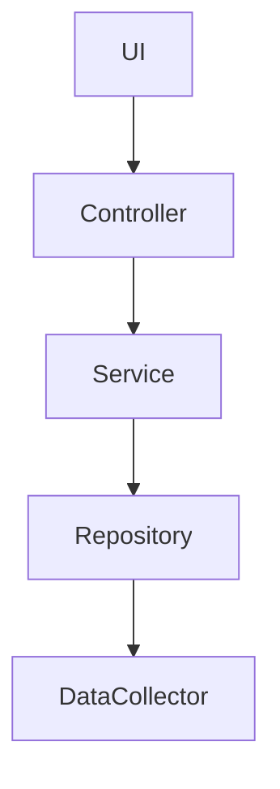
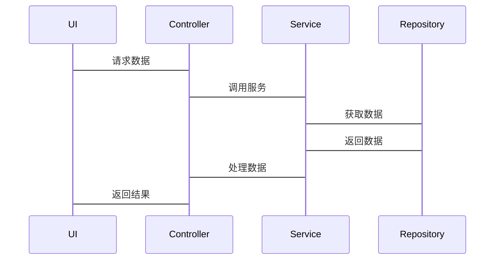

                 


# 因果推理：增强AI Agent的理解和决策能力

> **关键词**：因果推理、AI Agent、因果关系、因果图、潜在结果、处理效应  
> **摘要**：因果推理是理解因果关系的关键，对增强AI Agent的理解和决策能力至关重要。本文将详细探讨因果推理的基本概念、核心算法及其在AI Agent中的应用，通过系统设计和项目实战帮助读者掌握因果推理的核心原理和实践方法。

---

## 第1章 因果推理概述

### 1.1 因果关系的基本概念

#### 1.1.1 相关关系与因果关系的区别
相关关系描述变量之间的关联程度，而因果关系关注变量间的“原因与结果”的关系。例如，相关关系可能表明“学习时间与成绩相关”，而因果关系则表明“增加学习时间导致成绩提高”。

#### 1.1.2 因果关系的定义与特征
因果关系是指一个事件（原因）导致另一个事件（结果）发生的确定性关系。其特征包括时间顺序、可重复性、排除他因等。

#### 1.1.3 因果推理的重要性
因果推理能够帮助AI Agent理解数据背后的机制，从而做出更合理的决策，避免仅依赖相关关系可能导致的错误。

### 1.2 因果推理的背景与应用

#### 1.2.1 因果推理的背景介绍
因果推理起源于哲学和统计学，近年来随着AI的发展，其应用范围不断扩大，尤其是在推荐系统、医疗诊断等领域。

#### 1.2.2 因果推理在AI Agent中的应用
AI Agent通过因果推理可以更好地理解用户行为，优化决策过程。例如，在推荐系统中，因果推理可以帮助识别用户的真正需求，而不是表面的相关性。

#### 1.2.3 因果推理的边界与外延
因果推理的边界在于确定因果关系的条件，而外延则涉及如何将因果推理应用于复杂系统。

### 1.3 本书的核心目标

#### 1.3.1 提升AI Agent的理解能力
通过因果推理，AI Agent能够理解数据背后的因果关系，而不仅仅是表面的相关性。

#### 1.3.2 增强AI Agent的决策能力
因果推理使AI Agent能够基于因果关系做出更准确的决策，而不仅仅是基于统计相关性。

#### 1.3.3 实现AI Agent的因果智能
目标是将因果推理整合到AI Agent的决策过程中，使其具备因果智能。

### 1.4 本章小结
因果推理是理解因果关系的关键，对AI Agent的理解和决策能力至关重要。本章介绍了因果关系的基本概念、背景与应用，并明确了本书的核心目标。

---

## 第2章 因果推理的核心概念

### 2.1 因果图的基本原理

#### 2.1.1 因果图的定义
因果图（Directed Acyclic Graph, DAG）是一种有向无环图，用于表示变量之间的因果关系。

#### 2.1.2 因果图的构建方法
因果图的构建需要基于领域知识，识别变量之间的因果关系，并用有向边表示。

#### 2.1.3 因果图的属性特征对比表格
| 属性 | 特征 |
|------|------|
| 结构 | 有向无环图 |
| 边 | 表示因果关系 |
| 节点 | 表示变量 |

#### 2.1.4 因果图的Mermaid流程图


### 2.2 潜在结果与处理效应

#### 2.2.1 潜在结果的定义
潜在结果是指在某个特定干预下，变量可能的结果。

#### 2.2.2 处理效应的计算方法
处理效应是潜在结果的差异，用于衡量干预的效果。

#### 2.2.3 潜在结果与观测数据的关系
潜在结果是不可观测的，但可以通过观测数据进行推断。

### 2.3 因果关系的数学模型

#### 2.3.1 因果关系的线性模型
因果关系可以用线性回归模型表示，例如：
$$ Y = \beta X + \epsilon $$
其中，\( X \) 是原因，\( Y \) 是结果，\( \beta \) 是系数，\( \epsilon \) 是误差项。

#### 2.3.2 因果关系的非线性模型
非线性模型可以更复杂地描述因果关系，例如：
$$ Y = \beta X^2 + \epsilon $$

#### 2.3.3 因果关系的数学公式与推导
通过数学推导，可以确定因果关系的系数，并验证模型的正确性。

### 2.4 本章小结
因果推理的核心概念包括因果图、潜在结果和处理效应。这些概念帮助我们理解因果关系的结构和数学模型。

---

## 第3章 因果推理算法原理

### 3.1 潜在结果推断算法

#### 3.1.1 潜在结果推断的基本原理
潜在结果推断通过构建因果图，估计潜在结果的分布。

#### 3.1.2 潜在结果推断的数学模型
$$ Y = f(X) + \epsilon $$
其中，\( X \) 是前驱变量，\( Y \) 是结果，\( f \) 是函数，\( \epsilon \) 是误差项。

#### 3.1.3 潜在结果推断的Python实现
```python
import numpy as np

def potential_outcome(X):
    return X * 2 + np.random.normal(0, 1)
```

#### 3.1.4 潜在结果推断的Mermaid流程图


### 3.2 倾向评分匹配算法

#### 3.2.1 倾向评分的定义与计算
倾向评分是干预变量对结果变量的影响概率，可以用Logistic回归估计。

#### 3.2.2 倾向评分匹配的原理与步骤
通过匹配观测数据，使得干预组和对照组的倾向评分分布一致。

#### 3.2.3 倾向评分匹配的Python代码实现
```python
from sklearn.linear_model import LogisticRegression

lr = LogisticRegression()
lr.fit(X_train, y_train)
```

#### 3.2.4 倾向评分匹配的Mermaid流程图


### 3.3 因果森林算法

#### 3.3.1 因果森林的基本原理
因果森林是一种基于树的因果推断方法，适用于复杂的数据分布。

#### 3.3.2 因果森林的数学模型
因果森林通过构建多个树，估计因果效应的分布。

#### 3.3.3 因果森林的Python代码实现
```python
from causalforest import CausalForest

cf = CausalForest()
cf.fit(X_train, y_train)
```

### 3.4 本章小结
因果推理算法包括潜在结果推断、倾向评分匹配和因果森林。这些算法帮助我们估计因果效应，并进行因果推理。

---

## 第4章 因果推理在AI Agent中的应用

### 4.1 推荐系统中的因果推理

#### 4.1.1 推荐系统的背景介绍
推荐系统通过分析用户行为，提供个性化推荐。

#### 4.1.2 因果推理在推荐系统中的应用
通过因果推理，推荐系统可以识别用户的真正需求，而不仅仅是表面的相关性。

#### 4.1.3 实际案例分析
通过案例分析，说明因果推理如何提升推荐系统的性能。

### 4.2 对話系统中的因果推理

#### 4.2.1 对話系统的背景介绍
对話系统通过与用户交互，理解用户意图。

#### 4.2.2 因果推理在对话系统中的应用
通过因果推理，对话系统可以更准确地理解用户意图，提供更相关的回复。

#### 4.2.3 实际案例分析
通过案例分析，说明因果推理如何提升对话系统的性能。

### 4.3 强化学习中的因果推理

#### 4.3.1 强化学习的背景介绍
强化学习通过与环境交互，学习最优策略。

#### 4.3.2 因果推理在强化学习中的应用
通过因果推理，强化学习可以更好地理解环境的动态，做出更合理的决策。

#### 4.3.3 实际案例分析
通过案例分析，说明因果推理如何提升强化学习系统的性能。

### 4.4 本章小结
因果推理在AI Agent中的应用包括推荐系统、对话系统和强化学习。这些应用展示了因果推理在提升AI Agent性能中的重要性。

---

## 第5章 系统设计

### 5.1 项目介绍

#### 5.1.1 项目背景
本项目旨在通过因果推理，增强AI Agent的理解和决策能力。

#### 5.1.2 项目目标
通过因果推理算法，提升AI Agent的性能。

### 5.2 系统功能设计

#### 5.2.1 系统功能模块
系统包括数据采集、因果图构建、因果推理算法实现、结果分析等功能模块。

#### 5.2.2 领域模型Mermaid类图


### 5.3 系统架构设计

#### 5.3.1 系统架构图


#### 5.3.2 系统接口设计
系统接口包括数据输入接口、算法选择接口、结果输出接口等。

#### 5.3.3 系统交互Mermaid序列图


### 5.4 本章小结
系统设计包括项目介绍、功能设计和架构设计，为因果推理算法的实现提供了基础。

---

## 第6章 项目实战

### 6.1 环境安装

#### 6.1.1 安装Python
安装Python 3.8或更高版本。

#### 6.1.2 安装依赖库
安装必要的Python库，如`numpy`, `scikit-learn`, `causalforest`等。

### 6.2 核心代码实现

#### 6.2.1 数据预处理
对数据进行清洗和特征工程，确保数据适合因果推理算法。

#### 6.2.2 构建因果图
使用Mermaid流程图展示因果图的结构。

#### 6.2.3 实现因果推理算法
实现潜在结果推断、倾向评分匹配或因果森林算法。

### 6.3 案例分析

#### 6.3.1 数据集介绍
介绍使用的数据集，说明数据的来源和结构。

#### 6.3.2 数据分析
对数据进行初步分析，识别变量之间的关系。

#### 6.3.3 算法实现与结果解读
展示算法的实现过程，并解释结果的含义。

### 6.4 本章小结
项目实战部分通过实际操作，帮助读者理解因果推理算法的应用。

---

## 第7章 高级主题

### 7.1 时间序列因果推理

#### 7.1.1 时间序列数据的特性
时间序列数据具有时序依赖性，适合使用ARIMA、GARCH等模型。

#### 7.1.2 时间序列因果推理的应用
在金融、经济等领域，时间序列因果推理可以帮助预测未来趋势。

### 7.2 异构因果网络

#### 7.2.1 异构网络的定义
异构网络包含不同类型的节点和边，适合复杂系统的因果推理。

#### 7.2.2 异构网络的因果推理方法
通过构建异构网络，识别变量之间的因果关系。

### 7.3 因果强化学习

#### 7.3.1 强化学习的因果视角
从因果视角理解强化学习，有助于优化决策过程。

#### 7.3.2 因果强化学习的应用
在机器人控制、游戏AI等领域，因果强化学习可以提升决策的效率和准确性。

### 7.4 本章小结
高级主题包括时间序列因果推理、异构因果网络和因果强化学习，展示了因果推理的发展方向。

---

## 第8章 总结与展望

### 8.1 本书核心内容回顾

#### 8.1.1 因果推理的基本概念
回顾了因果图、潜在结果和处理效应等核心概念。

#### 8.1.2 因果推理算法的原理
介绍了潜在结果推断、倾向评分匹配和因果森林算法。

### 8.2 未来研究方向

#### 8.2.1 更复杂的因果图结构
未来研究可以探索更复杂的因果图结构，如动态因果图。

#### 8.2.2 多模态数据的因果推理
研究如何在多模态数据中进行因果推理，提升模型的泛化能力。

#### 8.2.3 因果推理的可解释性
增强因果推理的可解释性，使其更易于理解和应用。

### 8.3 最佳实践Tips

#### 8.3.1 数据质量的重要性
数据质量直接影响因果推理的效果，需确保数据的准确性和完整性。

#### 8.3.2 算法选择的策略
根据具体问题选择合适的因果推理算法，避免盲目应用。

#### 8.3.3 结果验证的方法
通过交叉验证和对比实验，验证因果推理结果的正确性。

### 8.4 本章小结
总结了本书的核心内容，并展望了因果推理的未来研究方向，同时给出了实践建议。

---

## 作者：AI天才研究院/AI Genius Institute & 禅与计算机程序设计艺术 /Zen And The Art of Computer Programming

