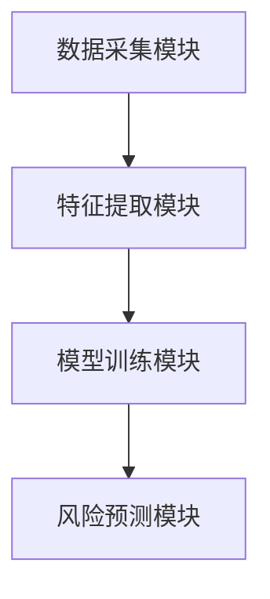

                 


# 图神经网络在金融网络风险传播中的应用

> 关键词：图神经网络，金融风险，风险传播，系统架构，项目实战

> 摘要：本文深入探讨了图神经网络在金融网络风险传播中的应用，从背景、理论到算法实现，再到系统设计与实战案例，全面解析了图神经网络在金融风险传播建模中的优势与挑战。通过详细的数学推导、系统架构设计和实际案例分析，展示了如何利用图神经网络有效捕捉和预测金融网络中的风险传播路径，为金融风险管理提供了新的思路和解决方案。

---

## 第1章: 金融网络风险传播的背景与挑战

### 1.1 金融网络的基本概念

#### 1.1.1 金融网络的定义与组成
金融网络是指由金融机构、企业、个人等主体通过金融交易（如贷款、投资、转账等）形成的复杂网络。这些主体之间通过资金流动、信息共享等方式相互连接，形成了一个动态的、非线性的网络系统。

- **节点**：金融网络中的节点可以是银行、企业、个人等。
- **边**：边表示节点之间的金融关联，如贷款关系、投资关系等。

#### 1.1.2 金融网络中的风险传播机制
金融网络中的风险传播是指一个节点的负面事件（如违约）通过网络中的关联关系影响其他节点，最终导致系统性风险的扩散。风险传播的机制包括：
- **直接传播**：直接相连的节点之间的风险传递。
- **间接传播**：通过多个中间节点的传播。
- **系统性传播**：整个金融网络的崩溃或连锁反应。

#### 1.1.3 传统风险传播模型的局限性
传统的风险传播模型（如马科维茨的资产组合理论、VaR模型等）主要基于统计方法或线性假设，难以捕捉金融网络中的非线性关系和复杂结构。具体表现在：
- 无法处理大规模、高维度的金融数据。
- 忽略了网络中的拓扑结构对风险传播的影响。
- 难以捕捉复杂的非线性关系。

---

### 1.2 图神经网络的核心概念

#### 1.2.1 图论基础
图论是研究网络结构的基础数学理论。图由节点（顶点）和边组成，描述了节点之间的关系。图的基本属性包括：
- **度数**：节点的度数表示其连接的边数，反映了节点在网络中的重要性。
- **中心性**：中心性衡量了节点在图中的影响力，如介数中心性和接近中心性。
- **社区结构**：社区是图中节点的聚类，反映了节点之间的强关联性。

#### 1.2.2 神经网络基础
神经网络是一种模拟人脑神经元结构的计算模型，通过多层非线性变换实现复杂模式的识别。深度学习（Deep Learning）是神经网络的一种，通过多层网络结构捕捉数据的高层次特征。

#### 1.2.3 图神经网络的基本概念
图神经网络（Graph Neural Networks, GNNs）是一种专门处理图结构数据的深度学习模型。它通过聚合节点及其邻居的信息，逐步传播特征，最终学习出节点的表示。

图神经网络的核心思想：
- **局部聚合**：每个节点的特征更新依赖于其邻居节点的特征。
- **全局传播**：通过多轮信息传播，捕捉图中的全局结构。

---

### 1.3 图神经网络在金融风险传播中的应用价值

#### 1.3.1 金融风险传播的复杂性
金融网络中的风险传播是一个复杂的非线性过程，具有以下几个特点：
- **复杂性**：金融网络中的节点和边数量庞大，结构复杂。
- **动态性**：金融网络的结构和关系随时间动态变化。
- **非线性**：风险传播过程中存在非线性增强效应。

#### 1.3.2 图神经网络的优势
与传统方法相比，图神经网络在处理金融风险传播问题时具有以下优势：
- **非线性建模能力**：图神经网络能够捕捉复杂的非线性关系。
- **全局视角**：通过图结构，图神经网络能够捕捉全局风险传播路径。
- **可扩展性**：图神经网络能够处理大规模金融网络数据。

#### 1.3.3 应用场景与潜在影响
图神经网络在金融风险传播中的应用场景包括：
- **风险预测**：预测某个节点的违约风险。
- **风险传播路径分析**：分析风险从一个节点向其他节点传播的路径。
- **系统性风险评估**：评估整个金融网络的系统性风险。

---

## 第2章: 图神经网络的基本原理

### 2.1 图论基础

#### 2.1.1 图的表示与属性
图可以用邻接矩阵（Adjacency Matrix）或邻接表（Adjacency List）表示。邻接矩阵是一个二维数组，其中的元素表示节点之间的连接情况。邻接表是一种链表结构，记录了每个节点的邻居节点。

图的属性包括：
- **度数序列**：每个节点的度数。
- **邻接矩阵**：节点之间的连接情况。
- **社区结构**：节点的聚类情况。

#### 2.1.2 常见的图模型
图模型是描述图结构的基础工具，常见的图模型包括：
- **随机图模型**（如Erdős–Rényi模型）：随机连接节点。
- **小世界模型**：具有小世界效应的图。
- **社区网络模型**：节点之间形成社区结构。

#### 2.1.3 图的遍历算法
图的遍历算法用于访问图中的所有节点，常见的遍历算法包括：
- **深度优先搜索（DFS）**：沿着一条路径尽可能深入地访问节点。
- **广度优先搜索（BFS）**：逐层访问节点，适用于发现最短路径。

---

### 2.2 神经网络基础

#### 2.2.1 神经网络的基本结构
神经网络的基本结构包括输入层、隐藏层和输出层。输入层接收输入数据，隐藏层通过非线性变换提取特征，输出层产生最终的预测结果。

---

#### 2.2.2 深度学习的核心原理
深度学习通过多层网络结构捕捉数据的高层次特征。其核心原理是通过反向传播算法（Backpropagation）更新网络参数，最小化预测误差。

---

#### 2.2.3 图神经网络的独特性
图神经网络的独特性在于其对图结构的处理能力：
- **局部聚合**：图神经网络通过聚合节点及其邻居的信息，逐步传播特征。
- **全局视角**：通过多轮信息传播，捕捉图中的全局结构。

---

### 2.3 图神经网络的基本模型

#### 2.3.1 图卷积网络（GCN）

图卷积网络（Graph Convolutional Network, GCN）是一种经典的图神经网络模型，其核心思想是通过聚合节点及其邻居的特征，更新节点的表示。

GCN的数学模型如下：
$$
Z = A \cdot X \cdot W_1 + B \cdot X \cdot W_2
$$
其中，$A$是邻接矩阵，$X$是输入特征矩阵，$W_1$和$W_2$是网络参数。

---

#### 2.3.2 图注意力网络（GAT）

图注意力网络（Graph Attention Network, GAT）通过注意力机制捕捉图中的重要节点，其数学模型如下：
$$
\alpha_{ij} = \text{softmax}(\frac{W \cdot X_i}{\sqrt{d}})
$$
其中，$\alpha_{ij}$是节点$i$对节点$j$的注意力权重，$W$是注意力权重矩阵，$d$是节点的度数。

---

#### 2.3.3 图嵌入与表示学习
图嵌入（Graph Embedding）是将图中的节点映射到低维空间的过程。常用的图嵌入方法包括：
- **Node2Vec**：基于随机游走的节点嵌入方法。
- **DeepWalk**：基于深度学习的节点嵌入方法。

---

## 第3章: 金融风险传播的建模与图神经网络结合

### 3.1 风险传播的数学模型

#### 3.1.1 风险传播的基本概念
风险传播是指一个节点的负面事件通过网络中的关联关系影响其他节点的过程。风险传播的数学模型可以表示为：
$$
R_i = f(R_j, W_{ij})
$$
其中，$R_i$是节点$i$的风险值，$R_j$是节点$j$的风险值，$W_{ij}$是节点$i$和$j$之间的权重。

---

#### 3.1.2 风险传播的扩散模型
扩散模型是描述风险传播过程的数学模型，常用的扩散模型包括：
- **SIR模型**：描述流行病传播的过程。
- **SEIR模型**：扩展的流行病传播模型。

---

#### 3.1.3 图结构在风险传播中的作用
图结构在风险传播中的作用：
- **节点之间的关联**：图结构反映了节点之间的关联性。
- **传播路径的捕捉**：图结构帮助捕捉风险传播的路径。

---

### 3.2 图神经网络在风险传播建模中的应用

#### 3.2.1 图结构数据的处理
图结构数据的处理包括：
- **邻接矩阵的构建**：根据金融网络的节点关系构建邻接矩阵。
- **节点特征的提取**：提取节点的特征信息，如资产规模、信用评分等。

---

#### 3.2.2 风险传播的图神经网络模型
风险传播的图神经网络模型包括：
- **GCN模型**：基于图卷积网络的风险传播模型。
- **GAT模型**：基于图注意力网络的风险传播模型。

---

#### 3.2.3 模型的优势与适用性
模型的优势：
- **非线性建模能力**：图神经网络能够捕捉复杂的非线性关系。
- **全局视角**：通过图结构，图神经网络能够捕捉全局风险传播路径。

---

### 3.3 数据预处理与特征提取

#### 3.3.1 数据清洗与标准化
数据清洗包括：
- **缺失值处理**：填充缺失值或删除缺失值较多的样本。
- **异常值处理**：识别并处理异常值。

标准化是将数据归一化的过程，常用的标准化方法包括：
- **Min-Max标准化**：将数据缩放到[0,1]区间。
- **Z-score标准化**：将数据缩放到均值为0，方差为1。

---

#### 3.3.2 图结构特征提取
图结构特征提取包括：
- **度数特征**：提取节点的度数特征。
- **社区特征**：提取节点所在的社区特征。

---

#### 3.3.3 数据增强方法
数据增强方法包括：
- **节点删除**：随机删除部分节点，增加模型的鲁棒性。
- **边扰动**：随机扰动部分边，增加模型的泛化能力。

---

### 3.4 模型训练与评估

#### 3.4.1 模型训练策略
模型训练策略包括：
- **批量训练**：将数据分成批量进行训练。
- **学习率调整**：动态调整学习率，提高训练效果。

---

#### 3.4.2 模型评估指标
模型评估指标包括：
- **准确率**：模型预测的准确率。
- **召回率**：模型预测的召回率。
- **F1分数**：准确率和召回率的调和平均数。

---

#### 3.4.3 超参数调优
超参数调优包括：
- **学习率**：调整学习率，找到最优学习率。
- **批量大小**：调整批量大小，找到最优批量大小。

---

### 3.5 本章小结

---

## 第4章: 图神经网络算法的数学模型与实现

### 4.1 图卷积网络（GCN）的数学模型

#### 4.1.1 GCN的基本公式
GCN的基本公式如下：
$$
Z = A X W_1 + B X W_2
$$
其中，$A$是邻接矩阵，$X$是输入特征矩阵，$W_1$和$W_2$是网络参数。

---

#### 4.1.2 GCN的传播机制
GCN的传播机制包括：
- **信息聚合**：聚合节点及其邻居的信息。
- **特征变换**：对特征进行非线性变换。

---

#### 4.1.3 GCN的训练过程
GCN的训练过程包括：
- **前向传播**：计算输出结果。
- **反向传播**：计算损失函数的梯度，更新网络参数。

---

### 4.2 图注意力网络（GAT）的数学模型

#### 4.2.1 GAT的基本公式
GAT的基本公式如下：
$$
\alpha_{ij} = \text{softmax}(\frac{W \cdot X_i}{\sqrt{d}})
$$
其中，$\alpha_{ij}$是节点$i$对节点$j$的注意力权重，$W$是注意力权重矩阵，$d$是节点的度数。

---

#### 4.2.2 GAT的传播机制
GAT的传播机制包括：
- **注意力计算**：计算节点之间的注意力权重。
- **特征聚合**：根据注意力权重聚合特征。

---

#### 4.2.3 GAT的训练过程
GAT的训练过程包括：
- **前向传播**：计算输出结果。
- **反向传播**：计算损失函数的梯度，更新网络参数。

---

### 4.3 图嵌入与表示学习

#### 4.3.1 图嵌入的基本原理
图嵌入的基本原理是将图中的节点映射到低维空间，常用的图嵌入方法包括：
- **Node2Vec**：基于随机游走的节点嵌入方法。
- **DeepWalk**：基于深度学习的节点嵌入方法。

---

#### 4.3.2 图嵌入的实现步骤
图嵌入的实现步骤包括：
- **随机游走**：生成节点的随机游走序列。
- **特征学习**：通过深度学习模型学习节点的嵌入表示。

---

## 第5章: 金融网络风险传播的系统架构与设计

### 5.1 问题场景介绍
金融网络风险传播的系统设计目标是通过图神经网络模型，预测金融网络中的风险传播路径和系统性风险。

---

### 5.2 项目介绍
项目名称：金融网络风险传播系统。

---

### 5.3 系统功能设计

#### 5.3.1 系统功能模块
系统功能模块包括：
- **数据采集模块**：采集金融网络数据。
- **特征提取模块**：提取节点特征和图结构特征。
- **模型训练模块**：训练图神经网络模型。
- **风险预测模块**：预测风险传播路径和系统性风险。

---

#### 5.3.2 系统功能流程
系统功能流程如下：
1. 数据采集模块采集金融网络数据。
2. 特征提取模块提取节点特征和图结构特征。
3. 模型训练模块训练图神经网络模型。
4. 风险预测模块预测风险传播路径和系统性风险。

---

### 5.4 系统架构设计

#### 5.4.1 系统架构图


---

#### 5.4.2 系统接口设计
系统接口设计包括：
- **数据接口**：提供金融网络数据的接口。
- **模型接口**：提供图神经网络模型的接口。

---

#### 5.4.3 系统交互流程
系统交互流程如下：
1. 用户输入金融网络数据。
2. 系统调用数据采集模块采集数据。
3. 系统调用特征提取模块提取特征。
4. 系统调用模型训练模块训练模型。
5. 系统调用风险预测模块预测风险。

---

## 第6章: 图神经网络在金融风险传播中的项目实战

### 6.1 环境安装

#### 6.1.1 安装Python环境
安装Python环境：
```bash
python --version
pip install --upgrade pip
```

---

#### 6.1.2 安装必要的库
安装必要的库：
```bash
pip install numpy
pip install pandas
pip install networkx
pip install tensorflow
pip install pymermaid
```

---

### 6.2 系统核心实现源代码

#### 6.2.1 数据采集模块
数据采集模块代码：
```python
import pandas as pd
import requests

def fetch_financial_data(api_key):
    url = f"https://api.example.com/financial_data?api_key={api_key}"
    response = requests.get(url)
    data = response.json()
    df = pd.DataFrame(data)
    return df
```

---

#### 6.2.2 特征提取模块
特征提取模块代码：
```python
import networkx as nx

def extract_features(graph):
    features = []
    for node in graph.nodes():
        degree = graph.degree(node)
        community = nx.community_greedy(graph)[node]
        features.append([degree, community])
    return features
```

---

#### 6.2.3 模型训练模块
模型训练模块代码：
```python
import tensorflow as tf
from tensorflow.keras import layers

def build_gcn_model(input_dim, output_dim):
    model = tf.keras.Sequential()
    model.add(layers.Dense(input_dim, activation='relu'))
    model.add(layers.Dense(output_dim, activation='sigmoid'))
    return model
```

---

#### 6.2.4 风险预测模块
风险预测模块代码：
```python
def predict_risk(model, features):
    risk_scores = model.predict(features)
    return risk_scores
```

---

### 6.3 代码应用解读与分析
代码应用解读与分析：
- 数据采集模块：从API获取金融数据。
- 特征提取模块：提取节点的度数和社区特征。
- 模型训练模块：构建图卷积网络模型。
- 风险预测模块：预测节点的风险评分。

---

### 6.4 实际案例分析

#### 6.4.1 案例背景
假设我们有一个包含100家银行的金融网络，每家银行之间通过贷款关系连接。

---

#### 6.4.2 数据准备
数据准备步骤：
1. 从API获取银行的贷款数据。
2. 构建银行之间的邻接矩阵。
3. 提取每家银行的特征。

---

#### 6.4.3 模型训练
模型训练步骤：
1. 使用图卷积网络模型训练风险预测模型。
2. 调整模型超参数，优化模型性能。

---

#### 6.4.4 模型评估
模型评估步骤：
1. 使用测试数据评估模型的准确率。
2. 计算模型的召回率和F1分数。

---

### 6.5 项目小结

---

## 第7章: 总结与展望

### 7.1 本章总结
本章总结了图神经网络在金融网络风险传播中的应用，通过详细的数学推导和系统设计，展示了图神经网络在金融风险传播建模中的优势。

---

### 7.2 未来展望
未来展望包括：
- **模型优化**：优化图神经网络模型，提高模型的预测精度。
- **算法创新**：探索新的图神经网络算法，捕捉更复杂的金融风险传播机制。
- **应用场景扩展**：将图神经网络应用于更多的金融领域，如信用评估、投资组合管理等。

---

## 作者：AI天才研究院/AI Genius Institute & 禅与计算机程序设计艺术 /Zen And The Art of Computer Programming

---

**本文总结**：本文系统地探讨了图神经网络在金融网络风险传播中的应用，通过理论分析、算法实现和系统设计，展示了图神经网络在金融风险传播建模中的优势和潜力。未来，随着图神经网络技术的不断发展，其在金融风险管理中的应用前景将更加广阔。

