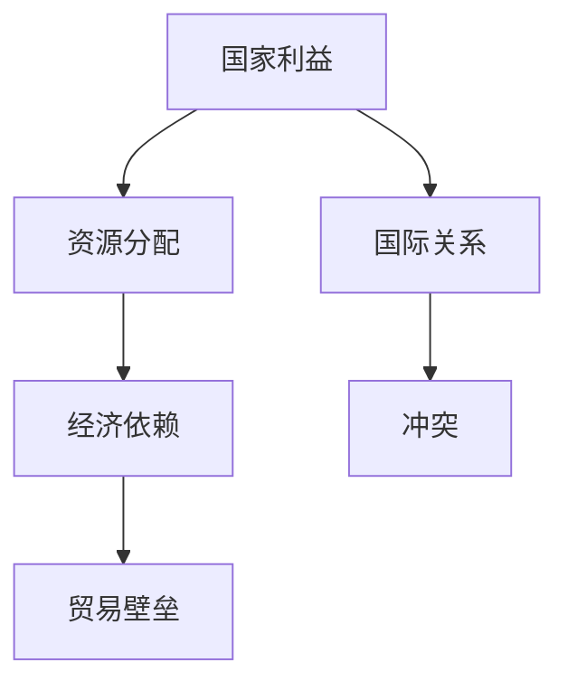
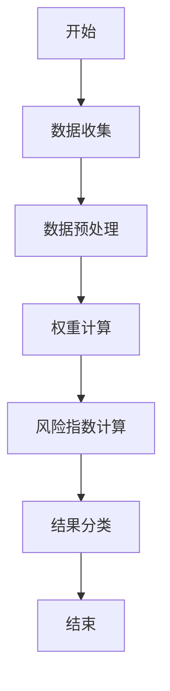
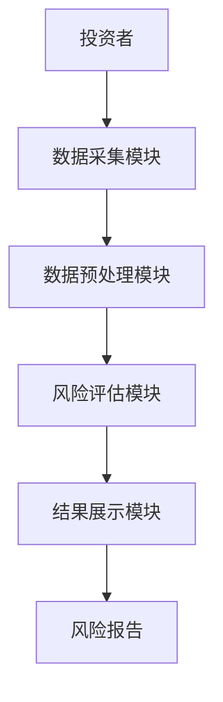

                 


# 地缘政治风险评估：全球投资的关键考量

> 关键词：地缘政治风险评估，全球投资，风险评估，地缘政治风险，投资决策，政治风险

> 摘要：地缘政治风险评估是全球投资中不可忽视的关键因素。本文系统地探讨了地缘政治风险的定义、核心要素、评估方法和系统架构设计，结合实际案例分析，展示了如何通过算法和系统设计实现有效的地缘政治风险评估。文章内容涵盖从理论到实践的全过程，旨在为投资者提供科学的决策支持。

---

# 第一部分: 地缘政治风险评估的背景与核心概念

# 第1章: 地缘政治风险评估的概述

## 1.1 地缘政治风险的定义与内涵

### 1.1.1 地缘政治的定义与核心要素

地缘政治（Geopolitical）是研究地理环境、政治活动和国际关系之间相互作用的学科。地缘政治风险则是指由于国家间的地理、政治、经济和文化等因素的相互作用而产生的潜在风险。

- **地理因素**：地理位置、资源分布、边界争议等。
- **政治因素**：政府政策、政治稳定性、领导人决策等。
- **经济因素**：经济依赖、贸易壁垒、资源争夺等。
- **文化因素**：文化冲突、民族主义情绪等。

### 1.1.2 风险的定义与分类

风险是指在特定情境下，某种事件发生的可能性及其可能带来的损失。地缘政治风险可以分为以下几类：

- **直接风险**：直接影响投资的事件，如战争、制裁。
- **间接风险**：通过影响市场、供应链等方式间接影响投资。
- **系统性风险**：影响整个区域或全球的投资环境。

### 1.1.3 地缘政治风险的特征与表现形式

- **不确定性**：风险的来源和影响难以完全预测。
- **复杂性**：涉及多方面的因素，如政治、经济、社会等。
- **动态性**：随着国际形势的变化而变化。

## 1.2 地缘政治风险评估的重要性

### 1.2.1 全球化背景下的投资风险

全球化使得跨国投资变得更加普遍，但也带来了更大的地缘政治风险。例如，贸易争端、地区冲突等都可能对投资产生重大影响。

### 1.2.2 地缘政治风险对投资决策的影响

- **投资决策的制定**：投资者需要评估地缘政治风险对投资项目的影响。
- **风险管理**：通过风险评估，投资者可以制定应对策略，如分散投资、购买保险等。

### 1.2.3 风险评估在投资中的关键作用

- **降低损失**：通过识别和评估风险，投资者可以避免或减少潜在损失。
- **提高决策效率**：风险评估为投资决策提供科学依据。
- **增强竞争力**：有效的风险评估可以帮助投资者在竞争中占据优势。

## 1.3 地缘政治风险评估的核心目标

### 1.3.1 识别潜在风险因素

通过分析地理、政治、经济等多方面的因素，识别可能影响投资的地缘政治风险。

### 1.3.2 量化风险影响

利用数学模型和算法，量化地缘政治风险对投资的影响程度。

### 1.3.3 提供风险应对策略

基于风险评估结果，为投资者提供应对策略，如调整投资组合、增加监控等。

## 1.4 本章小结

本章介绍了地缘政治风险的定义、核心要素和分类，强调了地缘政治风险评估在投资中的重要性，并提出了评估的核心目标。

---

# 第2章: 地缘政治风险评估的核心概念与联系

## 2.1 地缘政治风险的核心要素

### 2.1.1 国家利益与资源分配

国家利益是地缘政治的核心驱动力。各国通过争夺资源、领土和影响力来实现自身利益。

### 2.1.2 国际关系与冲突

国际关系的紧张或缓和直接影响地缘政治风险。冲突的爆发可能对投资产生重大影响。

### 2.1.3 经济依赖与贸易壁垒

经济依赖使得各国在贸易、投资等方面相互影响。贸易壁垒的增加可能引发经济摩擦，进而影响投资。

## 2.2 地缘政治风险评估的关键联系

### 2.2.1 经济因素与地缘政治风险的关系

经济因素是地缘政治风险的重要驱动因素。例如，资源争夺可能引发冲突，进而影响投资。

### 2.2.2 社会因素与地缘政治风险的相互作用

社会因素如民族主义、宗教冲突等可能加剧地缘政治风险。

### 2.2.3 政治因素对风险评估的影响

政治不稳定、政策变化等政治因素直接影响地缘政治风险。

## 2.3 地缘政治风险评估的实体关系图



## 2.4 本章小结

本章通过分析地缘政治风险的核心要素及其相互关系，构建了实体关系图，为后续的风险评估提供了理论基础。

---

# 第3章: 地缘政治风险评估的算法原理

## 3.1 风险评估的数学模型

### 3.1.1 层次分析法（AHP）原理

层次分析法是一种用于多因素决策的定性分析方法。通过构建层次结构，计算各因素的权重，从而确定其重要性。

### 3.1.2 聚类分析法原理

聚类分析法用于将相似的因素归为一类，便于分析和评估。

### 3.1.3 风险指数计算公式

$$ Risk\_Index = \sum_{i=1}^{n} w_i \cdot R_i $$

其中，$w_i$ 是第 $i$ 个因素的权重，$R_i$ 是第 $i$ 个因素的风险值。

## 3.2 风险评估的算法流程

### 3.2.1 数据收集与预处理

收集相关的地缘政治数据，包括经济、政治、社会等方面的数据，并进行清洗和标准化。

### 3.2.2 风险因子的权重计算

通过层次分析法计算各风险因子的权重。

### 3.2.3 风险指数的计算与分类

根据权重和风险值计算风险指数，并根据指数的大小进行分类。

## 3.3 风险评估的数学公式

### 3.3.1 层次分析法权重计算公式：

$$ AHP\_weight = \frac{\lambda_i}{\sum_{j=1}^{n}\lambda_j} $$

其中，$\lambda_i$ 是第 $i$ 个因素的特征值。

### 3.3.2 风险指数计算公式：

$$ Risk\_Index = \sum_{i=1}^{n} w_i \cdot R_i $$

## 3.4 算法流程图



## 3.5 本章小结

本章介绍了地缘政治风险评估的数学模型和算法流程，为后续的系统设计提供了理论基础。

---

# 第4章: 地缘政治风险评估的系统架构设计

## 4.1 问题场景介绍

### 4.1.1 投资者面临的挑战

投资者需要在复杂的地缘政治环境中做出决策，需要实时监控和分析相关风险。

### 4.1.2 问题描述

如何构建一个高效的地缘政治风险评估系统，为投资者提供实时、准确的风险评估结果。

## 4.2 系统功能设计

### 4.2.1 数据采集模块

- 数据来源：新闻、政府报告、经济指标等。
- 数据预处理：清洗、标准化。

### 4.2.2 风险评估模块

- 计算风险指数：基于层次分析法和聚类分析法。
- 风险分类：根据风险指数进行分类。

### 4.2.3 结果展示模块

- 可视化展示：地图、图表等。
- 报告生成：生成风险评估报告。

## 4.3 系统架构设计

### 4.3.1 系统架构图



### 4.3.2 系统接口设计

- 数据采集接口：接收外部数据。
- 风险评估接口：提供风险评估服务。
- 结果展示接口：展示风险评估结果。

## 4.4 本章小结

本章通过系统架构设计，为地缘政治风险评估提供了技术实现的框架。

---

# 第5章: 地缘政治风险评估的项目实战

## 5.1 环境安装

### 5.1.1 系统需求

- 操作系统：Windows/Mac/Linux
- 开发工具：Python、Jupyter Notebook
- 库：pandas、numpy、scipy、matplotlib

### 5.1.2 数据来源

- 数据集：国际关系数据、经济指标数据、新闻数据等。

## 5.2 核心代码实现

### 5.2.1 数据预处理代码

```python
import pandas as pd
import numpy as np

# 数据加载
data = pd.read_csv('geopolitical_data.csv')

# 数据清洗
data.dropna(inplace=True)
data = data[~data.duplicated()]
```

### 5.2.2 风险评估代码

```python
from scipy.cluster.hierarchy import linkage, fcluster
from sklearn.metrics.pairwise import cosine_similarity

# 层次分析法权重计算
def calculate_weights(matrix):
    # 计算相似性矩阵
    similarity = cosine_similarity(matrix)
    # 计算特征值
    _, _, v = np.linalg.svd(similarity)
    eigenvalues = np.diag(v)
    # 计算权重
    total = np.sum(eigenvalues)
    weights = eigenvalues / total
    return weights

# 风险指数计算
def calculate_risk_index(weights, risk_factors):
    risk_index = np.dot(weights, risk_factors)
    return risk_index
```

## 5.3 代码解读与分析

### 5.3.1 数据预处理代码解读

- 数据加载：使用pandas加载CSV格式的数据。
- 数据清洗：删除缺失值和重复值。

### 5.3.2 风险评估代码解读

- 层次分析法权重计算：计算相似性矩阵，进行SVD分解，得到特征值，计算权重。
- 风险指数计算：基于权重和风险因素，计算风险指数。

## 5.4 实际案例分析

### 5.4.1 案例选择

选择中东地区的地缘政治风险评估作为案例。

### 5.4.2 数据分析与结果展示

- 数据分析：通过层次分析法计算权重。
- 结果展示：生成风险指数图表。

## 5.5 本章小结

本章通过实际案例分析，展示了地缘政治风险评估系统的实现过程。

---

# 第6章: 最佳实践与小结

## 6.1 最佳实践

### 6.1.1 数据来源的选择

- 数据来源应多样化，包括新闻、政府报告等。
- 数据应具有实时性。

### 6.1.2 模型选择

- 根据具体情况选择合适的模型，如层次分析法、聚类分析法等。

### 6.1.3 风险监控

- 建立风险监控机制，实时更新风险评估结果。

## 6.2 小结

本章总结了地缘政治风险评估的核心概念、算法原理和系统架构设计，并通过实际案例分析展示了系统的实现过程。

---

# 第7章: 注意事项与拓展阅读

## 7.1 注意事项

### 7.1.1 数据的准确性

- 数据来源应可靠，避免错误信息。

### 7.1.2 模型的适用性

- 模型应根据具体情况调整参数。

### 7.1.3 风险的动态性

- 风险评估结果应定期更新。

## 7.2 拓展阅读

### 7.2.1 相关书籍

- 《地缘政治学导论》
- 《风险评估与管理》

### 7.2.2 相关研究论文

- "地缘政治风险评估方法研究"
- "多层次的地缘政治风险分析模型"

---

# 附录

## 附录A: 数据来源

- 国际关系数据：联合国报告、各国政府官网。
- 经济指标数据：世界银行、国际货币基金组织（IMF）。

## 附录B: 工具与库

- Python库：pandas、numpy、scipy、matplotlib。
- 开发工具：Jupyter Notebook、PyCharm。

## 附录C: 参考文献

- 联合国报告：《地缘政治风险评估指南》。
- 学术论文：《基于层次分析法的地缘政治风险评估模型》。

---

作者：AI天才研究院/AI Genius Institute & 禅与计算机程序设计艺术 /Zen And The Art of Computer Programming

