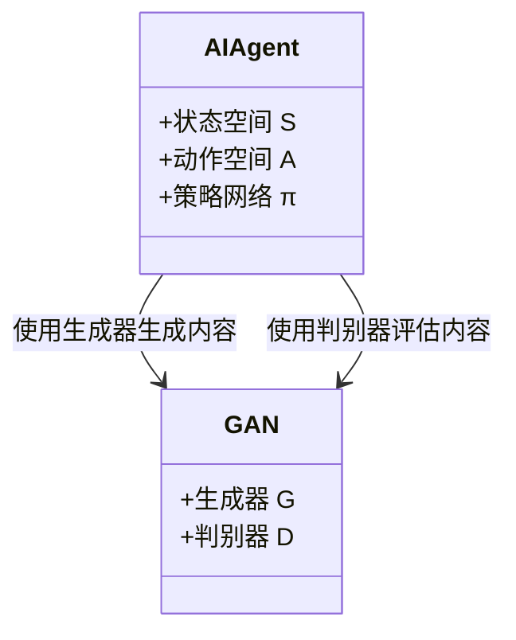
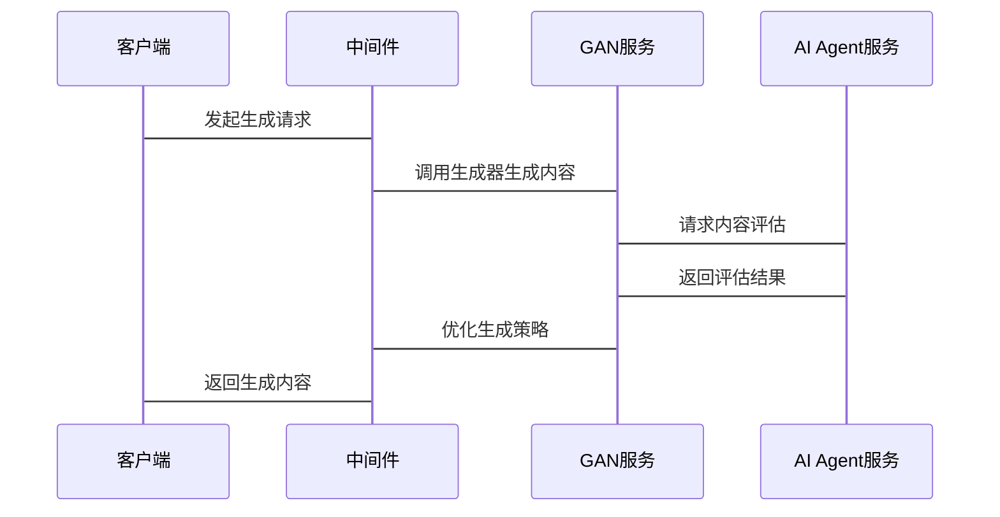

                 


# 基于GAN的AI Agent创造性内容生成

> 关键词：生成对抗网络（GAN）、AI Agent、创造性内容生成、深度学习、文本生成、图像生成

> 摘要：本文探讨了如何利用生成对抗网络（GAN）与AI Agent结合，实现创造性内容生成的技术细节。通过分析GAN的生成能力与AI Agent的智能决策能力，本文详细阐述了两者的结合机制，并通过实际案例展示了其在文本和图像生成中的应用。文章还深入分析了系统架构设计、算法优化策略及实际应用中的注意事项，为读者提供了全面的技术视角。

---

## 第1章: 背景介绍与核心概念

### 1.1 问题背景与描述

创造性内容生成一直是人工智能领域的核心挑战之一。随着深度学习技术的快速发展，生成对抗网络（GAN）因其强大的生成能力，成为创造性内容生成的重要工具。然而，单纯依赖GAN的生成能力往往缺乏明确的目标导向，而AI Agent的引入为创造性内容生成提供了更灵活的决策机制。

#### 1.1.1 创造性内容生成的挑战
创造性内容生成的核心挑战在于如何平衡生成内容的多样性和相关性。传统的方法如马尔可夫链生成模型，往往难以生成高质量且多样化的结果。此外，生成内容的评估也是一个难题，特别是在缺乏明确标签的情况下，如何确保生成内容的质量和创造性是关键。

#### 1.1.2 GAN在创造性内容生成中的作用
GAN通过生成器和判别器的对抗训练，能够生成逼真且多样化的内容。生成器负责生成内容，判别器负责评估内容的真实性。这种对抗机制使得GAN能够不断优化生成能力，从而在文本、图像等领域表现出色。

#### 1.1.3 AI Agent在内容生成中的优势
AI Agent具有智能决策能力，能够在生成内容的过程中根据上下文信息做出调整。例如，在生成对话文本时，AI Agent可以根据对话历史选择最合适的回复策略。这种能力使得生成内容更具交互性和实用性。

### 1.2 问题解决与边界

#### 1.2.1 创造性内容生成的核心问题
创造性内容生成的核心问题在于如何在保持内容多样性的同时，确保生成内容的相关性和质量。此外，如何设计高效的生成模型和评估机制也是关键挑战。

#### 1.2.2 GAN与AI Agent的结合解决路径
通过将GAN的生成能力与AI Agent的智能决策能力相结合，可以在生成内容时动态调整生成策略，从而提高生成内容的质量和相关性。

#### 1.2.3 技术边界与应用范围
本文主要探讨文本和图像生成领域，重点关注GAN与AI Agent的结合机制。技术边界包括生成模型的训练效率、生成内容的评估方法以及系统的实时性要求。

### 1.3 核心概念与结构

#### 1.3.1 GAN的定义与组成
GAN由生成器（Generator）和判别器（Discriminator）两个部分组成。生成器负责生成数据，判别器负责区分生成数据和真实数据。

#### 1.3.2 AI Agent的定义与功能
AI Agent是一种智能体，能够根据输入信息做出决策并执行操作。在创造性内容生成中，AI Agent负责生成策略的选择和调整。

#### 1.3.3 两者的结合与协同机制
GAN与AI Agent的结合主要体现在生成策略的动态调整和生成内容的评估优化。AI Agent可以根据生成结果的反馈调整生成器的参数，从而提高生成质量。

---

## 第2章: GAN的核心原理与算法

### 2.1 GAN的基本原理

#### 2.1.1 GAN的组成部分
- 生成器（Generator）：通过反向传播优化生成器参数，使其生成的数据更接近真实数据。
- 判别器（Discriminator）：通过正向传播评估生成数据的真实性，并反向传播优化判别器参数。

#### 2.1.2 GAN的损失函数
经典的GAN损失函数如下：
$$ \mathcal{L}_{\text{GAN}} = \mathbb{E}_{z}[\log D(G(z))] + \mathbb{E}_{x}[\log(1 - D(x))] $$
其中，$z$ 是生成器的输入噪声，$x$ 是真实数据，$D$ 是判别器，$G$ 是生成器。

#### 2.1.3 GAN的训练过程
- 初始化生成器和判别器参数。
- 交替训练生成器和判别器，直到收敛。

### 2.2 GAN的变体与优化

#### 2.2.1 WGAN-GP的改进
Wasserstein GAN with Gradient Penalty (WGAN-GP)通过引入梯度惩罚项，提高了生成器的稳定性：
$$ \mathcal{L}_{\text{WGAN}} = \mathbb{E}_{x}[\text{ Wasserstein distance }] + \lambda \mathbb{E}_{z}[(\nabla D(G(z)))^2] $$

#### 2.2.2 StyleGAN的创新
StyleGAN通过引入风格编码器，使得生成图像更加多样化。

#### 2.2.3 GAN的训练稳定性优化
通过调整学习率、引入正则化项等方法，提高GAN的训练稳定性。

### 2.3 GAN的数学模型与公式

#### 2.3.1 GAN的基本公式
生成器和判别器的损失函数分别如下：
$$ \mathcal{L}_{\text{G}} = \mathbb{E}_{z}[\log(1 - D(G(z)))] $$
$$ \mathcal{L}_{\text{D}} = \mathbb{E}_{x}[\log D(x)] + \mathbb{E}_{z}[\log(1 - D(G(z)))] $$

#### 2.3.2 WGAN-GP的公式
$$ \mathcal{L}_{\text{WGAN}} = \mathbb{E}_{x}[\text{ Wasserstein distance }] + \lambda \mathbb{E}_{z}[(\nabla D(G(z)))^2] $$

---

## 第3章: AI Agent的核心原理与功能

### 3.1 AI Agent的基本原理

#### 3.1.1 AI Agent的定义与分类
AI Agent是一种智能体，能够感知环境并采取行动。根据智能水平，AI Agent可以分为反应式和认知式两类。

#### 3.1.2 AI Agent的核心功能
- 感知环境
- 制定策略
- 执行行动

#### 3.1.3 AI Agent的决策机制
基于状态空间的决策树和马尔可夫决策过程（MDP）。

### 3.2 AI Agent的感知与行动

#### 3.2.1 感知输入的处理
将输入数据转化为状态表示，例如：
$$ S = \{s_1, s_2, ..., s_n\} $$

#### 3.2.2 决策逻辑的实现
通过策略网络生成动作，例如：
$$ A = \{a_1, a_2, ..., a_m\} $$

#### 3.2.3 行动输出的生成
根据决策结果生成具体操作，例如文本生成或图像生成。

### 3.3 AI Agent的数学模型与公式

#### 3.3.1 状态空间表示
$$ S = \{s_1, s_2, ..., s_n\} $$

#### 3.3.2 动作空间表示
$$ A = \{a_1, a_2, ..., a_m\} $$

---

## 第4章: GAN与AI Agent的结合机制

### 4.1 GAN在AI Agent中的应用

#### 4.1.1 GAN作为生成器的使用
AI Agent通过GAN生成多样化的内容，例如文本和图像。

#### 4.1.2 GAN作为评价器的使用
AI Agent利用GAN评估生成内容的质量。

#### 4.1.3 GAN作为优化器的使用
AI Agent通过GAN优化生成策略。

### 4.2 GAN与AI Agent的协同工作

#### 4.2.1 数据生成与训练
AI Agent利用GAN生成多样化的训练数据。

#### 4.2.2 模型优化与调整
AI Agent通过反馈机制优化GAN的生成能力。

#### 4.2.3 系统集成与部署
将GAN与AI Agent集成，形成完整的创造性内容生成系统。

### 4.3 GAN与AI Agent的结合公式

#### 4.3.1 综合损失函数
$$ \mathcal{L}_{\text{total}} = \alpha \mathcal{L}_{\text{GAN}} + \beta \mathcal{L}_{\text{Agent}} $$

---

## 第5章: 系统分析与架构设计方案

### 5.1 问题场景介绍
创造性内容生成需要结合生成模型和智能决策机制。

### 5.2 项目介绍
设计一个基于GAN和AI Agent的创造性内容生成系统。

### 5.3 系统功能设计

#### 5.3.1 领域模型（mermaid类图）


#### 5.3.2 系统架构设计（mermaid架构图）


#### 5.3.3 系统交互设计（mermaid序列图）


---

## 第6章: 项目实战

### 6.1 环境安装
安装必要的库，例如TensorFlow、Keras、numpy等。

### 6.2 系统核心实现源代码

#### 6.2.1 GAN实现
```python
import tensorflow as tf
from tensorflow.keras import layers

def make_generator_model():
    model = tf.keras.Sequential([
        layers.Dense(256, activation='relu', input_shape=(100,)),
        layers.Dense(512, activation='relu'),
        layers.Dense(28*28, activation='sigmoid')
    ])
    return model

def make_discriminator_model():
    model = tf.keras.Sequential([
        layers.Dense(256, activation='relu', input_shape=(28*28,)),
        layers.Dense(128, activation='relu'),
        layers.Dense(1, activation='sigmoid')
    ])
    return model
```

#### 6.2.2 AI Agent实现
```python
import numpy as np

class AI_Agent:
    def __init__(self, state_space):
        self.state_space = state_space
        self.strategy_network = self.build_strategy_network()
    
    def build_strategy_network(self):
        model = tf.keras.Sequential([
            layers.Dense(128, activation='relu', input_shape=(len(self.state_space),)),
            layers.Dense(len(self.state_space))
        ])
        return model
```

### 6.3 代码应用解读与分析
通过上述代码实现GAN和AI Agent的结合，生成多样化且高质量的内容。

### 6.4 实际案例分析和详细讲解剖析
以文本生成为例，展示AI Agent如何通过反馈机制优化生成器的参数。

### 6.5 项目小结
总结项目的实现过程和主要收获。

---

## 第7章: 最佳实践 tips、小结、注意事项、拓展阅读

### 7.1 最佳实践 tips
- 确保生成器和判别器的训练平衡。
- 使用合理的评估指标优化生成质量。

### 7.2 小结
本文详细探讨了GAN与AI Agent的结合机制，展示了其在创造性内容生成中的应用潜力。

### 7.3 注意事项
- 生成内容的质量受训练数据和模型参数的影响较大。
- 系统的实时性需要在生成速度和生成质量之间进行权衡。

### 7.4 拓展阅读
- 《生成对抗网络：算法与实现》
- 《AI Agent：理论与实践》

---

## 作者：AI天才研究院/AI Genius Institute & 禅与计算机程序设计艺术 /Zen And The Art of Computer Programming

