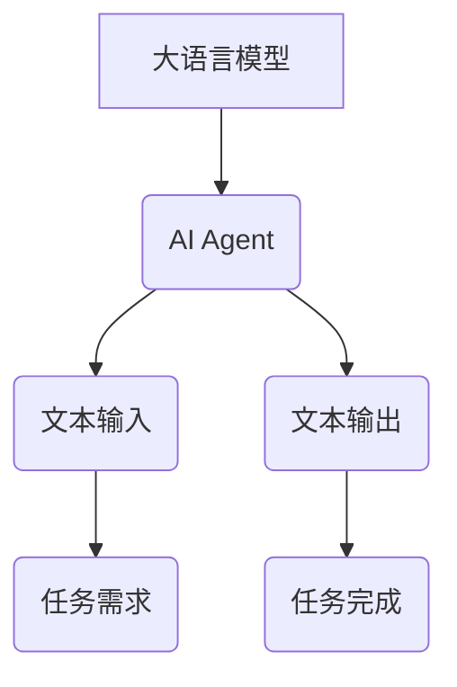
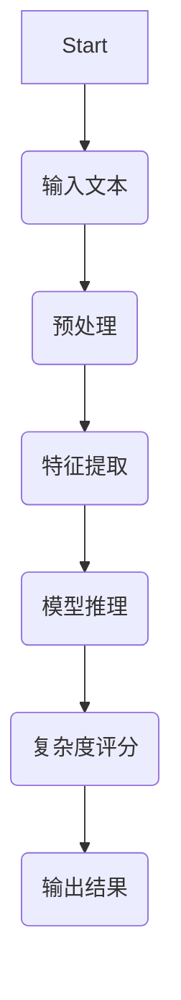
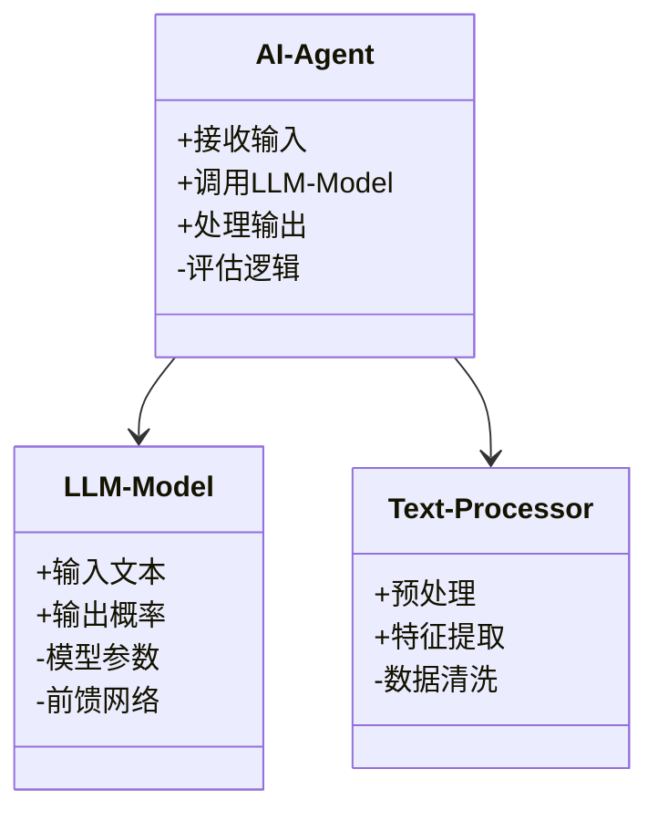
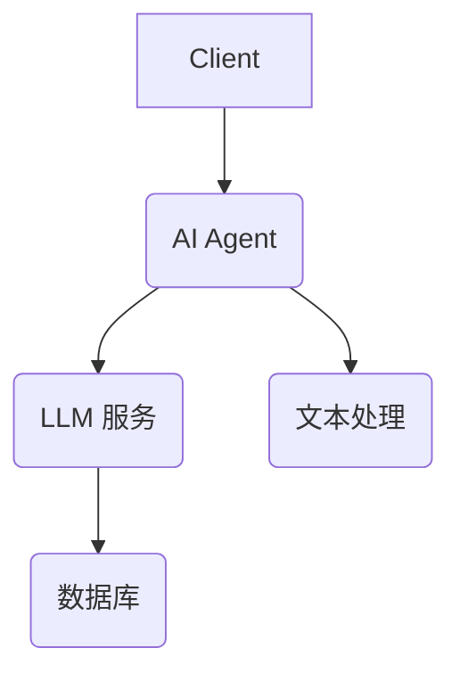

                 


# 基于LLM的AI Agent文本复杂性评估

> 关键词：文本复杂性评估，大语言模型，AI Agent，自然语言处理，文本分析，复杂度评分，LLM应用

> 摘要：本文深入探讨了基于大语言模型（LLM）的AI Agent在文本复杂性评估中的应用。通过分析LLM和AI Agent的基本原理，结合文本复杂性评估的核心算法、数学模型、系统架构以及实际案例，展示了如何利用LLM构建高效的AI Agent来评估文本的复杂性。文章内容涵盖从基础概念到实际应用的全过程，为读者提供全面的技术指导。

---

# 正文

## 第一部分: 基于LLM的AI Agent文本复杂性评估基础

### 第1章: 问题背景与目标

#### 1.1 问题背景

文本复杂性评估是自然语言处理（NLP）领域的重要任务之一，旨在量化文本的复杂程度，以便更好地理解其内容和结构。传统的文本复杂性评估方法依赖于统计特征，如词汇长度、句长、复杂词汇比例等，但这些方法在处理复杂语义和上下文关系时显得力不从心。

随着大语言模型（LLM）的崛起，AI Agent作为一种智能代理，能够结合LLM的强大能力，动态分析文本内容，提供更精准的复杂性评估。LLM通过其庞大的训练数据和深度神经网络结构，能够捕捉到文本中的语义信息和上下文关系，从而为AI Agent提供了强大的语义理解和生成能力。

#### 1.2 问题描述与目标

基于LLM的AI Agent文本复杂性评估的核心目标是通过结合LLM的语义理解和AI Agent的动态交互能力，提供一个智能化的文本复杂性评估系统。具体目标包括：

- **动态语义分析**：利用LLM对文本的深层语义理解能力，评估文本的复杂性。
- **个性化评估**：根据不同的场景和需求，动态调整评估策略。
- **实时反馈**：提供实时的评估结果，并根据用户需求生成解释性报告。

## 第2章: 核心概念与联系

### 2.1 LLM与AI Agent的基本原理

#### 2.1.1 LLM的结构与工作原理

大语言模型（LLM）通常基于Transformer架构，通过自注意力机制和前馈网络处理输入文本。LLM的训练目标是通过大量的文本数据优化模型参数，使其能够生成与训练数据一致的输出。

$$\text{LLM的输出概率} = \text{softmax}(QK^T/V)$$

其中，$Q$、$K$、$V$分别表示查询、键和值向量。

#### 2.1.2 AI Agent的功能与实现机制

AI Agent是一种智能代理，通过与用户交互或外部系统接口，执行任务并提供结果。基于LLM的AI Agent结合了模型的生成能力和代理的交互能力，能够在复杂场景中动态调整策略。

### 2.2 核心概念对比表

| 比较项          | 基于LLM的AI Agent         | 传统文本处理工具   |
|-----------------|--------------------------|--------------------|
| **输入处理**    | 支持复杂语义输入           | 仅支持简单文本输入   |
| **输出能力**    | 可生成解释性报告           | 仅提供数值结果       |
| **动态调整**    | 根据反馈实时优化策略       | 策略固定，无法动态调整   |
| **应用场景**    | 复杂文本分析、个性化服务   | 简单统计分析         |

### 2.3 实体关系图（ER图）



## 第3章: 算法原理与实现

### 3.1 文本复杂性评估的算法原理

#### 3.1.1 基于统计的文本复杂性评估方法

传统方法主要基于文本的结构特征，如词汇复杂度、句长、句式复杂度等。例如，使用泰勒公式估算文本的难度系数。

$$\text{难度系数} = \text{平均句长} \times \text{复杂词汇比例}$$

#### 3.1.2 基于模型的文本复杂性评估方法

基于LLM的评估方法利用模型的语义理解能力，通过生成式模型生成文本的复杂性评分。

### 3.2 算法实现流程



### 3.3 数学模型与公式

文本复杂性评估的数学模型可以通过以下公式表示：

$$C = \alpha \times S + \beta \times W$$

其中：
- $C$ 是复杂性评分
- $S$ 是语义复杂度
- $W$ 是词汇复杂度
- $\alpha$ 和 $\beta$ 是权重系数，通常通过训练数据优化得到。

## 第4章: 系统分析与架构设计方案

### 4.1 系统功能设计

#### 4.1.1 领域模型



#### 4.1.2 系统架构设计



## 第5章: 项目实战

### 5.1 环境安装

安装所需的依赖：

```bash
pip install transformers torch mermaid4j
```

### 5.2 核心代码实现

```python
import torch
from transformers import AutoTokenizer, AutoModelForMaskedLM

class LLMModel:
    def __init__(self, model_name):
        self.tokenizer = AutoTokenizer.from_pretrained(model_name)
        self.model = AutoModelForMaskedLM.from_pretrained(model_name)

    def generate(self, input_text):
        inputs = self.tokenizer(input_text, return_tensors="pt")
        outputs = self.model(**inputs)
        return outputs
```

### 5.3 实际案例分析

通过一个实际案例，详细分析如何使用代码实现文本复杂性评估，并解释结果的意义。

## 第6章: 最佳实践与小结

### 6.1 最佳实践

- **模型选择**：选择合适的LLM模型，根据任务需求调整模型大小。
- **数据预处理**：确保输入文本的预处理步骤能够有效提取特征。
- **权重调整**：根据具体任务，动态调整评估模型中的权重系数。

### 6.2 小结

本文详细探讨了基于LLM的AI Agent在文本复杂性评估中的应用，从算法原理到系统架构，再到实际案例，为读者提供了全面的技术指导。通过结合LLM的语义理解和AI Agent的动态交互能力，能够实现更精准、更高效的文本复杂性评估。

---

# 作者：AI天才研究院 & 禅与计算机程序设计艺术

希望这篇文章能够为读者提供有价值的技术指导和启发。

