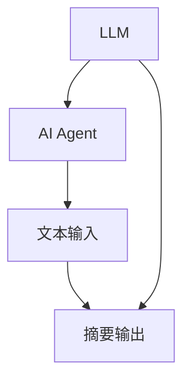
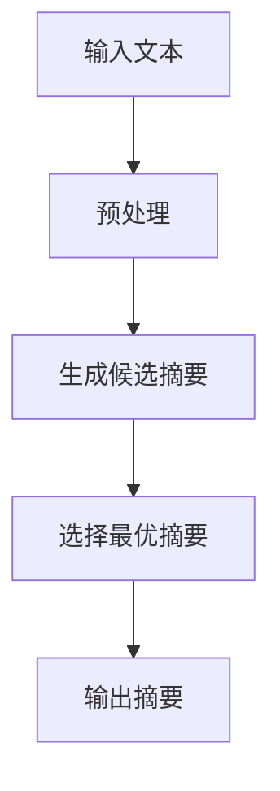
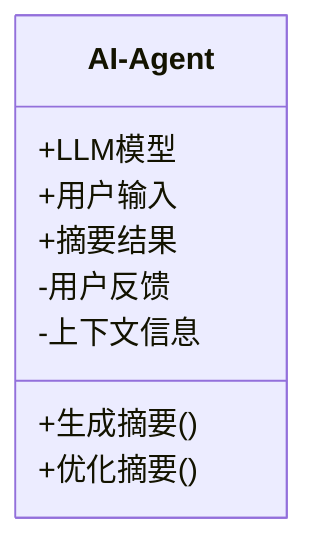
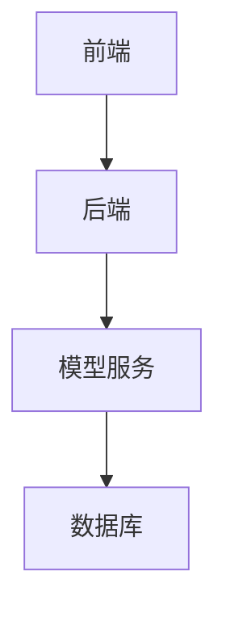
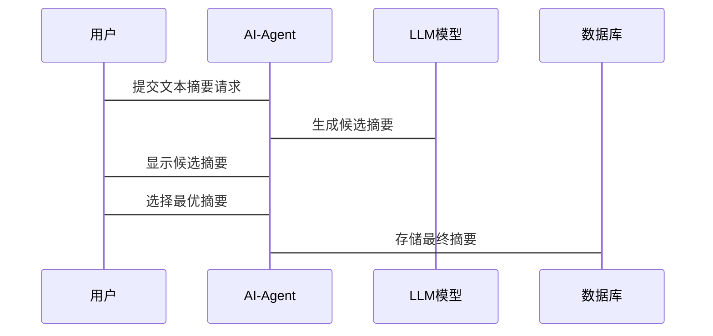

                 


# 基于LLM的AI Agent文本摘要生成

> 关键词：LLM, AI Agent, 文本摘要, 自然语言处理, 智能摘要生成

> 摘要：本文详细探讨了基于大语言模型（LLM）的AI Agent在文本摘要生成中的应用，从核心概念、算法原理、系统架构到项目实战，全面解析了该技术的实现过程和实际应用场景。通过本文的学习，读者可以掌握基于LLM的AI Agent文本摘要生成的关键技术，并能够将其应用到实际项目中。

---

## 第1章: 背景介绍

### 1.1 问题背景
随着互联网的飞速发展，海量信息的产生使得文本摘要生成变得尤为重要。传统的文本摘要方法主要依赖于关键词提取或基于规则的摘要生成，但这些方法在处理复杂语义和上下文关系时显得力不从心。

### 1.2 问题描述
文本摘要生成的核心问题是如何在保持原文核心信息的同时，生成简洁、准确的摘要。AI Agent作为智能体，能够通过与用户的交互主动获取需求，并结合上下文信息生成更符合用户意图的摘要。

### 1.3 解决方案
基于LLM的AI Agent通过预训练的大语言模型，能够理解上下文和语义关系，并结合用户需求生成高质量的文本摘要。这种方法不仅能够处理复杂语义，还能根据用户反馈动态调整摘要内容。

### 1.4 边界与外延
文本摘要生成的边界在于如何在有限长度内保留原文的核心信息，而外延则包括多语言摘要、实时信息更新等功能。

---

## 第2章: 核心概念与联系

### 2.1 LLM与AI Agent的关系
LLM作为AI Agent的核心组件，负责理解和生成文本内容，而AI Agent则通过用户交互和任务需求，指导LLM进行摘要生成。

### 2.2 核心概念原理
- **LLM的训练原理**：基于大规模数据的自监督学习，通过预测下一个词的概率分布来优化模型参数。
- **AI Agent的决策机制**：根据用户需求和上下文信息，选择最优的摘要生成策略。
- **文本摘要生成的算法流程**：输入文本 → 分割处理 → 生成摘要 → 输出结果。

### 2.3 概念属性特征对比
| 概念       | 属性特征                 |
|------------|--------------------------|
| LLM        | 大规模参数、自监督学习   |
| AI Agent    | 主动性、目标导向         |
| 文本摘要    | 简洁性、准确性           |

### 2.4 ER实体关系图


---

## 第3章: 算法原理讲解

### 3.1 算法原理概述
基于LLM的文本摘要生成算法通常采用以下步骤：
1. 输入文本预处理：分句、分词。
2. LLM生成候选摘要：基于上下文生成多个候选摘要。
3. AI Agent选择最优摘要：根据用户需求和语义相似度选择最佳摘要。

### 3.2 算法流程图


### 3.3 数学模型
LLM的训练目标是通过交叉熵损失函数最小化预测与真实值之间的差异：
$$
\text{损失} = -\sum_{i=1}^{n} \log p(y_i|x_{<i})
$$
其中，\( p(y_i|x_{<i}) \) 是给定前 \( i-1 \) 个词的情况下，生成第 \( i \) 个词的概率。

---

## 第4章: 系统分析与架构设计

### 4.1 问题场景介绍
AI Agent需要处理多种文本摘要场景，如新闻摘要、客服对话总结等。

### 4.2 系统功能设计


### 4.3 系统架构设计


### 4.4 系统交互设计


---

## 第5章: 项目实战

### 5.1 环境安装
```bash
pip install transformers
pip install torch
```

### 5.2 核心代码实现
```python
from transformers import LlamaTokenizer, LlamaForCausalInference

def generate_summary(text):
    tokenizer = LlamaTokenizer.from_pretrained('facebook/bart-large')
    model = LlamaForCausalInference.from_pretrained('facebook/bart-large')
    inputs = tokenizer(text, return_tensors='pt')
    outputs = model.generate(inputs.input_ids, max_length=100)
    summary = tokenizer.decode(outputs[0], skip_special_tokens=True)
    return summary
```

### 5.3 代码解读与分析
1. **模型加载**：使用预训练的LLM模型进行文本摘要生成。
2. **输入处理**：将输入文本编码为模型可处理的格式。
3. **生成摘要**：通过生成算法得到候选摘要。
4. **优化摘要**：根据用户反馈优化最终摘要。

### 5.4 实际案例分析
以新闻文本为例，展示从输入到输出的完整过程。

---

## 第6章: 最佳实践与小结

### 6.1 小结
基于LLM的AI Agent文本摘要生成技术能够显著提升摘要的质量和准确性，同时具备良好的可扩展性。

### 6.2 注意事项
- 模型选择：根据具体任务选择合适的LLM模型。
- 数据质量：确保输入文本的质量，避免噪声干扰。
- 性能优化：通过并行计算和缓存技术提升生成效率。

### 6.3 拓展阅读
推荐相关文献和工具，帮助读者深入学习。

---

## 作者：AI天才研究院/AI Genius Institute & 禅与计算机程序设计艺术 /Zen And The Art of Computer Programming

