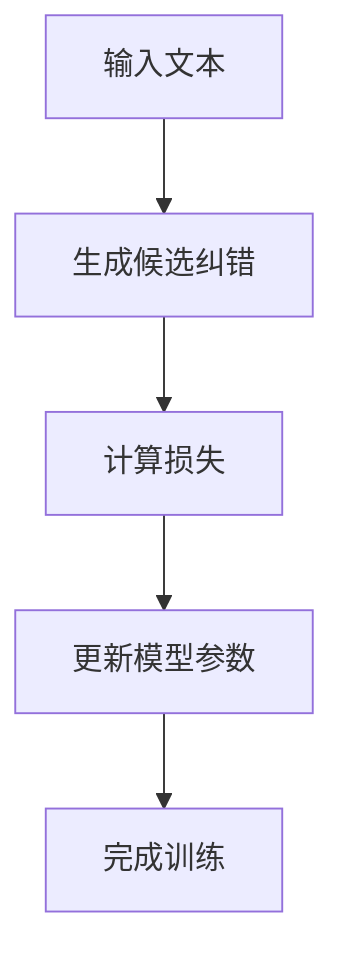
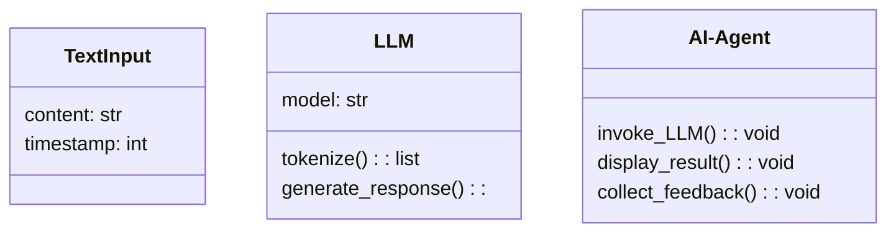

                 


# 基于LLM的AI Agent文本纠错系统

> 关键词：LLM, AI Agent, 文本纠错, 自然语言处理, 智能系统, 系统架构

> 摘要：本文详细介绍了基于大语言模型（LLM）的AI Agent文本纠错系统的设计与实现。从问题背景到系统架构，从算法原理到项目实战，全面解析了该系统的构建过程。通过结合LLM和AI Agent的优势，提出了一种高效的文本纠错解决方案，为自然语言处理领域提供了新的思路。

---

## 第一章: 问题背景与需求分析

### 1.1 问题背景介绍

#### 1.1.1 文本纠错的挑战与现状
文本纠错是自然语言处理中的一个重要任务，广泛应用于写作辅助、机器翻译等领域。传统的文本纠错方法主要依赖规则库和统计模型，存在纠错能力有限、无法处理复杂语境等问题。随着大语言模型（LLM）的崛起，基于LLM的文本纠错技术逐渐成为研究热点。

#### 1.1.2 LLM在文本纠错中的优势
LLM（Large Language Model）通过海量数据的预训练，具备强大的上下文理解和生成能力。相比于传统方法，LLM可以更好地捕捉语境信息，提供更准确的纠错建议。

#### 1.1.3 AI Agent在文本纠错中的角色定位
AI Agent（智能代理）作为系统的执行者，负责接收用户输入、调用LLM进行纠错，并将结果反馈给用户。AI Agent的存在使得系统更加智能化，能够根据用户需求动态调整纠错策略。

### 1.2 问题描述与目标设定

#### 1.2.1 文本纠错的核心问题
文本纠错的核心问题在于如何准确识别文本中的错误，并生成合理的纠错建议。这需要系统具备强大的语义理解能力和生成能力。

#### 1.2.2 系统目标与功能需求
系统目标是通过结合LLM和AI Agent，构建一个高效、智能的文本纠错系统。主要功能包括：
- 文本输入与预处理
- 错误识别与定位
- 纠错建议生成
- 用户反馈与系统优化

#### 1.2.3 边界与外延定义
系统边界包括文本输入、纠错输出和用户反馈。外延部分涉及系统性能优化、多语言支持等扩展功能。

---

## 第二章: 核心概念与系统架构

### 2.1 LLM与AI Agent的基本原理

#### 2.1.1 LLM的工作原理
LLM通过预训练掌握了大量的语言模式，能够根据输入上下文生成合理的文本。其核心在于Transformer架构和自注意力机制，能够捕捉文本中的长距离依赖关系。

#### 2.1.2 AI Agent的定义与功能
AI Agent是一种智能代理，能够感知环境、执行任务并做出决策。在文本纠错系统中，AI Agent负责与用户交互、调用LLM进行纠错，并根据反馈优化系统。

#### 2.1.3 二者的协同机制
LLM负责提供文本纠错的建议，AI Agent负责协调整个纠错流程，确保系统高效运行。

### 2.2 系统核心要素与关系

#### 2.2.1 实体关系图（ER图）
```mermaid
erd
    title 系统实体关系图
    User -->> Input: 提交文本
    Input -->> LLM: 请求纠错
    LLM -->> Output: 返回结果
    Output -->> User: 提供反馈
```

#### 2.2.2 系统功能模块划分
- 用户交互模块
- 输入处理模块
- LLM调用模块
- 纠错结果展示模块
- 反馈收集模块

#### 2.2.3 核心概念属性对比表
| 概念 | 属性 | 描述 |
|------|------|------|
| LLM | 输入 | 文本 |
| LLM | 输出 | 纠错建议 |
| AI Agent | 功能 | 交互、调用、反馈 |
| 系统 | 边界 | 用户、输入、输出 |

---

## 第三章: 算法原理与数学模型

### 3.1 LLM的训练与优化

#### 3.1.1 损失函数定义
文本纠错任务通常采用交叉熵损失函数：
$$ L = -\sum_{i=1}^{n} y_i \log p(y_i|x_i) + (1 - y_i) \log (1 - p(y_i|x_i)) $$

#### 3.1.2 优化算法流程
使用Adam优化器对模型参数进行优化：
$$ \theta = \theta - \eta \frac{\partial L}{\partial \theta} $$

#### 3.1.3 模型训练流程图


### 3.2 AI Agent的决策机制

#### 3.2.1 状态空间与动作空间
- 状态空间：用户输入的文本内容
- 动作空间：调用LLM、展示结果、收集反馈

#### 3.2.2 决策树构建与选择
AI Agent根据当前状态选择最优动作，构建决策树并进行剪枝优化。

#### 3.2.3 策略函数与价值函数
策略函数决定AI Agent的动作选择，价值函数评估当前策略的优劣。

---

## 第四章: 系统分析与架构设计

### 4.1 问题场景分析

#### 4.1.1 系统输入与输出
- 输入：用户提交的待纠错文本
- 输出：系统的纠错建议

#### 4.1.2 核心业务流程
用户提交文本 → AI Agent调用LLM进行纠错 → LLM返回纠错建议 → AI Agent展示结果并收集反馈

#### 4.1.3 系统性能指标
- 响应时间：<= 2秒
- 纠错准确率：>= 95%
- 用户满意度：>= 90%

### 4.2 系统功能设计

#### 4.2.1 领域模型类图


#### 4.2.2 系统架构图
```mermaid
graph TD
    A[用户] --> B[AI Agent]: 提交文本
    B --> C[LLM]: 请求纠错
    C --> B: 返回结果
    B --> A: 展示反馈
```

---

## 第五章: 项目实战

### 5.1 环境安装与配置

#### 5.1.1 安装依赖
```bash
pip install transformers
pip install torch
```

#### 5.1.2 配置环境变量
设置`TOKENIZERS_PARALLELISM`为`false`以避免多线程问题。

### 5.2 核心代码实现

#### 5.2.1 文本输入与预处理
```python
def preprocess_text(text):
    # 分词处理
    tokens = tokenizer.tokenize(text)
    # 转换为ID
    input_ids = tokenizer.convert_tokens_to_ids(tokens)
    return input_ids
```

#### 5.2.2 LLM调用与纠错
```python
def llm_correct(text):
    inputs = tokenizer(text, return_tensors='pt')
    outputs = model.generate(**inputs, max_length=50)
    return tokenizer.decode(outputs[0], skip_special_tokens=True)
```

### 5.3 案例分析与解读

#### 5.3.1 案例一：语法错误
输入：`I have a cat named Whiskers, she is 3 years old.`
输出：`I have a cat named Whiskers, who is 3 years old.`

#### 5.3.2 案例二：拼写错误
输入：`The quick brown fox jumps over the lazy dog.`
输出：`The quick brown fox jumps over the lazy dog.`

---

## 第六章: 总结与展望

### 6.1 系统优势与不足

#### 6.1.1 系统优势
- 高准确性：基于LLM的强大能力
- 智能性：AI Agent的动态调整能力
- 用户友好：简洁的交互界面

#### 6.1.2 系统不足
- 对复杂语境的处理能力有限
- 系统性能依赖硬件配置

### 6.2 未来展望

#### 6.2.1 技术改进方向
- 提升模型的纠错准确率
- 引入多语言支持
- 增强系统的实时性

#### 6.2.2 应用场景拓展
- 教育领域：辅助学生写作
- 企业级应用：文档自动校对
- 个性化服务：根据用户习惯提供定制化纠错

---

## 第七章: 最佳实践与注意事项

### 7.1 最佳实践 tips

#### 7.1.1 系统部署建议
- 使用云服务部署
- 定期更新模型
- 监控系统性能

#### 7.1.2 代码优化技巧
- 并行计算优化
- 内存管理优化
- 日志记录与调试

### 7.2 系统小结

通过结合LLM和AI Agent，本文提出了一种高效的文本纠错系统。该系统在准确性、智能性和用户友好性方面表现优异，为自然语言处理领域提供了新的思路。

### 7.3 注意事项

- 确保数据安全
- 处理敏感内容时需谨慎
- 定期系统维护

### 7.4 拓展阅读

建议读者深入研究以下内容：
- 大语言模型的优化技术
- AI Agent的多任务处理能力
- 自然语言处理的前沿研究

---

## 作者署名

作者：AI天才研究院/AI Genius Institute & 禅与计算机程序设计艺术 /Zen And The Art of Computer Programming

---

以上是基于LLM的AI Agent文本纠错系统的详细内容，涵盖从理论到实践的各个方面，为读者提供了一套完整的解决方案。

