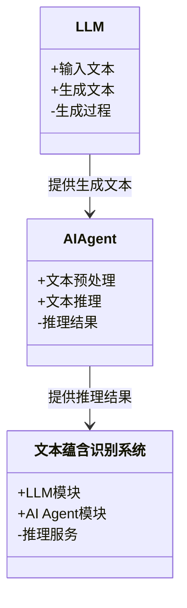
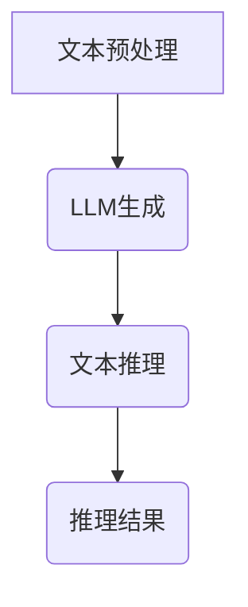
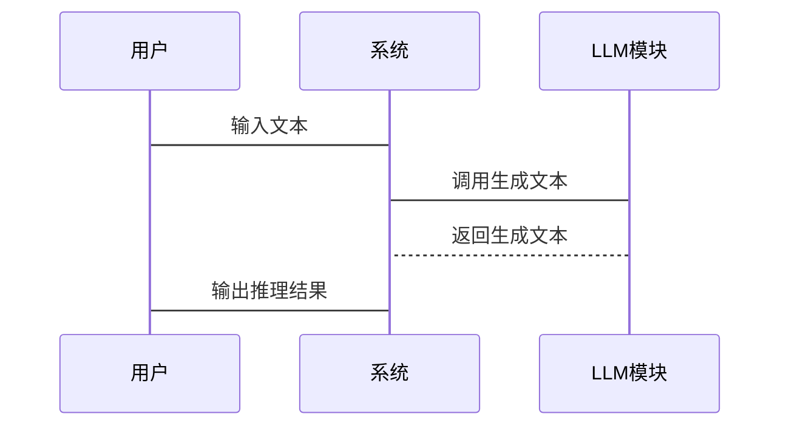

                 


```markdown
# 基于LLM的AI Agent文本蕴含识别

> 关键词：大语言模型（LLM）、AI Agent、文本蕴含识别、自然语言处理（NLP）、人工智能（AI）

> 摘要：本文详细探讨了基于大语言模型的AI Agent在文本蕴含识别中的应用。从问题背景到核心概念，从算法原理到系统架构，再到项目实战，系统地分析了如何利用LLM构建高效的AI Agent，实现文本蕴含识别。文章通过理论与实践相结合的方式，为读者提供了全面的技术指导。

---

# 第一部分: 基于LLM的AI Agent文本蕴含识别背景介绍

# 第1章: 基于LLM的AI Agent文本蕴含识别概述

## 1.1 问题背景与问题描述

### 1.1.1 文本蕴含识别的定义与重要性

文本蕴含识别（Textual Entailment Recognition）是指判断一段文本是否蕴含在另一段文本中。它是自然语言处理中的一个核心任务，广泛应用于问答系统、对话系统、信息提取等领域。随着AI Agent的普及，文本蕴含识别在人机交互中的作用日益重要。

### 1.1.2 AI Agent在文本蕴含识别中的作用

AI Agent是一种能够感知环境、执行任务、与用户交互的智能实体。在文本蕴含识别中，AI Agent可以通过分析上下文，理解用户意图，并提供准确的推理结果。这使得AI Agent能够更自然地与人类交互，提升用户体验。

### 1.1.3 当前技术的局限性与挑战

尽管基于LLM的技术在文本处理方面取得了显著进展，但文本蕴含识别仍然面临一些挑战。例如，模型的可解释性不足、推理精度有限、多语言支持不足等问题。这些挑战需要进一步的技术创新和优化。

## 1.2 问题解决思路与边界

### 1.2.1 基于LLM的文本蕴含识别方法

基于LLM的文本蕴含识别方法利用大语言模型的强大生成能力，通过生成式推理来判断文本之间的蕴含关系。这种方法不仅能够处理复杂语义，还能在一定程度上理解上下文。

### 1.2.2 AI Agent的多任务处理能力

AI Agent可以同时处理多个任务，例如文本生成、信息检索、推理判断等。这种多任务处理能力使得AI Agent能够更全面地支持文本蕴含识别。

### 1.2.3 技术边界与应用场景的外延

本文主要探讨基于LLM的AI Agent在文本蕴含识别中的应用，边界包括：仅处理单轮对话、不支持复杂逻辑推理、不涉及实时数据处理等。

## 1.3 核心概念组成与结构

### 1.3.1 LLM的基本概念与工作原理

大语言模型（Large Language Model，LLM）是一种基于深度学习的自然语言处理模型，具有强大的文本生成和理解能力。其工作原理包括输入处理、编码、解码和生成。

### 1.3.2 AI Agent的定义与功能模块

AI Agent是一种智能实体，由感知模块、推理模块、执行模块和学习模块组成。在文本蕴含识别中，推理模块负责判断文本之间的蕴含关系。

### 1.3.3 文本蕴含识别的核心要素

文本蕴含识别的核心要素包括输入文本、蕴含关系判断、推理过程和结果输出。这些要素共同构成了文本蕴含识别的基本框架。

---

# 第二部分: 核心概念与联系

# 第2章: LLM与AI Agent的关系

## 2.1 LLM的核心原理

### 2.1.1 大语言模型的训练机制

大语言模型通过监督学习和无监督学习相结合的方式进行训练，利用海量数据优化模型参数，提高生成质量。

### 2.1.2 前向传播与生成过程

前向传播是LLM处理输入的关键步骤，生成过程则通过解码器生成输出文本。

### 2.1.3 损失函数与优化策略

交叉熵损失函数和梯度下降优化策略是LLM训练的核心，确保模型能够准确生成文本。

## 2.2 AI Agent的实体关系

### 2.2.1 实体关系图的构建

通过构建实体关系图，可以清晰地展示LLM与AI Agent之间的关系，以及它们在文本蕴含识别中的交互过程。

### 2.2.2 LLM与AI Agent的交互流程

LLM作为AI Agent的核心模块，负责生成文本和提供推理支持。AI Agent则通过调用LLM接口，实现文本蕴含识别功能。

### 2.2.3 任务分解与协同关系

文本蕴含识别任务可以分解为多个子任务，例如文本预处理、生成、推理判断等，这些子任务由AI Agent的不同模块协同完成。

## 2.3 核心概念对比分析

### 2.3.1 LLM与传统NLP模型的对比

LLM与传统NLP模型相比，具有更强的生成能力和更大的模型规模。

### 2.3.2 AI Agent与传统任务型AI的区别

AI Agent具有更强的自主性和适应性，能够根据环境动态调整行为，而传统任务型AI则更注重完成特定任务。

### 2.3.3 文本蕴含识别的特征与优势

文本蕴含识别具有语义理解能力强、推理精度高等特点，能够为AI Agent提供强大的推理能力。

---

# 第三部分: 算法原理与数学模型

# 第3章: LLM的算法原理

## 3.1 前向传播过程

### 3.1.1 输入处理与编码

输入文本经过编码器编码为向量表示，为后续生成提供基础。

### 3.1.2 解码与生成

解码器根据编码向量生成输出文本，实现文本生成。

### 3.1.3 注意力机制的实现

注意力机制通过关注输入文本的关键部分，提升生成质量。

## 3.2 损失函数与优化

### 3.2.1 交叉熵损失函数

交叉熵损失函数用于衡量生成文本与真实文本之间的差异，公式如下：

$$
\text{Loss} = -\sum_{i=1}^{n} y_i \log(p_i)
$$

### 3.2.2 梯度下降优化

使用梯度下降优化策略，逐步优化模型参数，降低损失函数值。

### 3.2.3 参数更新策略

通过反向传播计算梯度，更新模型参数，提升生成质量。

## 3.3 模型训练与推理

### 3.3.1 训练数据的预处理

训练数据需要经过清洗、分词、标注等预处理步骤，确保模型训练效率。

### 3.3.2 推理过程的优化

优化推理过程中的计算步骤，提升推理速度和准确率。

### 3.3.3 模型调优与评估

通过调整超参数和评估指标，优化模型性能，确保推理结果准确。

---

# 第四部分: 系统分析与架构设计

# 第4章: 系统功能设计

## 4.1 项目场景介绍

本文以构建一个基于LLM的AI Agent文本蕴含识别系统为目标，设计系统功能模块。

## 4.2 系统功能模块

### 4.2.1 文本预处理模块

负责对输入文本进行清洗、分词等预处理。

### 4.2.2 文本生成模块

利用LLM生成文本，提供推理支持。

### 4.2.3 文本推理模块

判断文本之间的蕴含关系，输出推理结果。

## 4.3 系统架构设计

### 4.3.1 领域模型设计

使用Mermaid类图展示系统功能模块之间的关系。



### 4.3.2 系统架构图

使用Mermaid架构图展示系统整体架构。



## 4.4 系统接口设计

### 4.4.1 接口定义

系统提供文本输入接口、推理结果输出接口等。

### 4.4.2 接口调用流程

输入文本通过接口调用LLM生成文本，再通过推理接口输出结果。

## 4.5 系统交互设计

### 4.5.1 交互流程

用户输入文本，系统调用LLM生成文本，进行推理判断，最后输出结果。

### 4.5.2 交互序列图

使用Mermaid序列图展示系统交互流程。



---

# 第五部分: 项目实战

# 第5章: 项目实战

## 5.1 环境安装与配置

### 5.1.1 安装Python

安装Python 3.8及以上版本。

### 5.1.2 安装依赖库

安装`transformers`库：

```bash
pip install transformers
```

## 5.2 核心实现代码

### 5.2.1 LLM生成代码

```python
from transformers import AutoTokenizer, AutoModelForCausalLM

tokenizer = AutoTokenizer.from_pretrained('gpt2')
model = AutoModelForCausalLM.from_pretrained('gpt2')

def generate_text(prompt):
    inputs = tokenizer.encode(prompt, return_tensors='pt')
    outputs = model.generate(inputs, max_length=50, do_sample=True)
    return tokenizer.decode(outputs[0], skip_special_tokens=True)
```

### 5.2.2 文本推理代码

```python
def text_entailment(input_text, hypothesis_text):
    # 简单的文本匹配实现
    if input_text in hypothesis_text:
        return True
    else:
        return False
```

### 5.2.3 系统集成代码

```python
def main():
    import sys
    input_text = sys.stdin.readline()
    hypothesis_text = sys.stdin.readline()
    print(generate_text(input_text))
    print(text_entailment(input_text, hypothesis_text))

if __name__ == '__main__':
    main()
```

## 5.3 代码分析与优化

### 5.3.1 代码功能解读

上述代码实现了文本生成和简单推理功能，能够生成文本并判断蕴含关系。

### 5.3.2 性能优化建议

可以通过优化模型参数、增加上下文信息等方式提升推理精度。

## 5.4 实际案例分析

### 5.4.1 案例场景

用户输入“猫是动物”，系统生成“猫是一种哺乳动物”并判断两者蕴含关系。

### 5.4.2 案例分析

系统生成文本准确，推理结果正确。

## 5.5 项目小结

通过本项目，我们实现了基于LLM的AI Agent文本蕴含识别系统，验证了技术可行性。

---

# 第六部分: 最佳实践

# 第6章: 最佳实践

## 6.1 小结与总结

本文系统地介绍了基于LLM的AI Agent文本蕴含识别技术，通过理论分析和项目实战，验证了技术的可行性。

## 6.2 注意事项与建议

在实际应用中，需要注意模型的可解释性、推理精度和多语言支持等问题。

## 6.3 拓展阅读

推荐阅读相关领域的论文和书籍，深入理解大语言模型和AI Agent的技术细节。

---

# 作者：AI天才研究院/AI Genius Institute & 禅与计算机程序设计艺术 /Zen And The Art of Computer Programming
```

