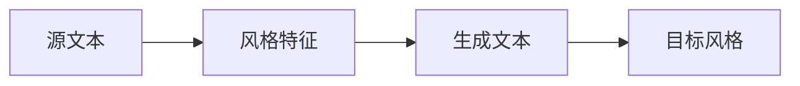
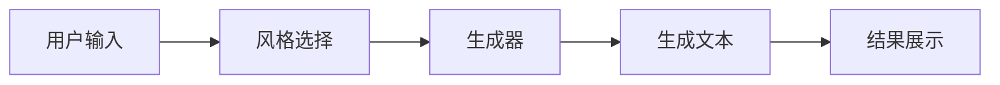

                 


# 基于LLM的AI Agent文本风格迁移

## 关键词：
大语言模型（LLM）、AI Agent、文本风格迁移、自然语言处理、生成对抗网络

## 摘要：
本文详细探讨了基于大语言模型（LLM）的AI Agent在文本风格迁移中的应用。通过分析文本风格迁移的核心概念、算法原理和系统架构设计，结合实际项目案例，展示了如何利用大语言模型实现高效的文本风格迁移。文章从理论到实践，结合图表和代码示例，帮助读者全面理解并掌握这一技术。

---

# 第一部分: 引言与背景

## 第1章: 引言

### 1.1 什么是AI Agent
AI Agent（人工智能代理）是指能够感知环境并采取行动以实现目标的智能实体。在文本处理领域，AI Agent通常用于生成、编辑或转换文本内容。

### 1.2 大语言模型（LLM）的基本概念
大语言模型（LLM）是基于深度学习的自然语言处理模型，能够理解和生成人类语言。这些模型通常基于Transformer架构，通过大量数据训练，具备强大的文本生成能力。

### 1.3 文本风格迁移的定义与重要性
文本风格迁移是指将一段文本从一种风格转换为另一种风格的过程。例如，将正式的商业报告转化为口语化的讲解。这种技术在内容创作、个性化推荐等领域具有重要应用价值。

---

## 第2章: 基础理论

### 2.1 自然语言处理基础
自然语言处理（NLP）涉及文本的分析和生成。关键技术包括分词、语法分析、实体识别和文本生成。

### 2.2 大语言模型的工作原理
大语言模型通过自注意力机制捕捉文本中的语义关系，生成与输入内容相关的文本。训练过程中，模型学习了大量文本数据中的统计规律。

### 2.3 文本风格迁移的基本概念
文本风格迁移旨在改变文本的表达方式，使其符合特定的风格或语境。风格迁移可以通过调整模型的生成策略或引入外部风格特征实现。

---

# 第二部分: 核心概念与联系

## 第3章: 文本风格迁移的核心概念

### 3.1 文本风格迁移的定义
文本风格迁移是将源文本转换为目标风格的过程。目标风格可以是特定的语言风格、语气或领域术语。

### 3.2 不同风格迁移的分类与对比
文本风格迁移可以分为领域迁移、语气迁移和形式迁移。领域迁移涉及不同领域的术语转换，语气迁移调整文本的正式或非正式程度，形式迁移涉及文本结构的改变。

### 3.3 大语言模型在风格迁移中的作用
大语言模型能够生成符合目标风格的文本，并通过微调模型参数或引入风格特征进一步优化迁移效果。

---

## 第4章: 核心概念原理

### 4.1 文本风格迁移的原理分析
文本风格迁移通常涉及特征提取和文本生成两个阶段。特征提取阶段提取源文本的语义信息，生成阶段基于目标风格生成新的文本。

### 4.2 大语言模型的文本生成机制
大语言模型通过解码器生成文本，生成过程中可以调整温度、采样策略等参数，影响生成文本的风格。

### 4.3 风格迁移与大语言模型的结合
通过在生成阶段引入风格特征或调整模型参数，可以实现风格的迁移。例如，在生成过程中引入特定领域的词汇表。

---

## 第5章: 概念属性特征对比

### 5.1 不同风格迁移方法的对比分析
以下是不同风格迁移方法的对比：

| 方法 | 优点 | 缺点 |
|------|------|------|
| 基于规则的方法 | 实现简单 | 无法处理复杂风格 |
| 基于统计的方法 | 统计特征提取 | 生成文本缺乏语义 |
| 基于生成对抗网络的方法 | 高质量生成 | 训练复杂 |

### 5.2 大语言模型与其他文本生成方法的对比
大语言模型在生成质量、灵活性和适应性方面具有优势，但在特定任务上可能需要额外的微调。

### 5.3 风格迁移任务的实体关系图
以下是风格迁移任务的实体关系图：



---

# 第三部分: 算法原理讲解

## 第6章: 文本风格迁移算法原理

### 6.1 基于生成对抗网络的风格迁移算法
生成对抗网络（GAN）由生成器和判别器组成。生成器将源文本转换为目标风格，判别器判断生成文本的风格是否匹配。

### 6.2 基于大语言模型的风格迁移算法
利用大语言模型的生成能力，通过调整生成参数或引入风格特征，实现风格迁移。

### 6.3 算法的数学模型与公式
以下是基于GAN的风格迁移模型：

$$
\min_{G} \max_{D} \mathbb{E}_{x,y}[ -\log D(x,y)] + \mathbb{E}_{z,y}[ -\log (1 - D(G(z,y)))]
$$

其中，$G$ 是生成器，$D$ 是判别器，$x$ 是源文本，$y$ 是目标风格，$z$ 是噪声向量。

---

## 第7章: 大语言模型的文本生成机制

### 7.1 大语言模型的训练过程
大语言模型通过监督学习训练，目标是最小化预测误差。训练过程中，模型学习了大量文本数据的分布。

### 7.2 大语言模型的解码过程
解码过程通过自注意力机制生成上下文相关的文本。生成过程可以通过调整温度参数控制生成的多样性和确定性。

### 7.3 风格迁移中的文本生成优化
在风格迁移任务中，生成过程可以引入风格特征或调整模型参数，以生成符合目标风格的文本。

---

# 第四部分: 系统分析与架构设计方案

## 第8章: 问题场景介绍

### 8.1 需求分析
用户需要将一段正式的商业报告转化为口语化的讲解。

### 8.2 项目目标
开发一个基于大语言模型的文本风格迁移系统，实现多种风格的转换。

### 8.3 系统功能设计
系统功能包括文本输入、风格选择、生成结果展示和结果评估。

---

## 第9章: 系统架构设计

### 9.1 系统架构图
以下是系统架构图：



### 9.2 模块划分与功能描述
- 用户输入模块：接收用户的输入文本和选择的目标风格。
- 风格选择模块：提供多种风格选项供用户选择。
- 生成器模块：基于选择的风格生成新的文本。
- 生成结果展示模块：展示生成的文本并提供评估选项。

### 9.3 接口设计与交互流程
系统通过API接口接收输入，返回生成的文本。交互流程包括输入接收、风格选择、生成处理和结果返回。

---

# 第五部分: 项目实战

## 第10章: 环境安装与核心代码实现

### 10.1 环境搭建
需要安装Python、TensorFlow和Hugging Face库。

### 10.2 核心代码实现
以下是风格迁移的Python代码实现：

```python
from transformers import pipeline

# 初始化大语言模型
model = pipeline('text-generation', model='gpt2')

# 定义风格迁移函数
def style_transfer(source_text, target_style):
    # 调整生成参数
    model.temperature = 0.7  # 调整温度以控制生成风格
    return model(source_text, max_length=500, num_return_sequences=1)[0]['generated_text']

# 示例应用
source = "This is a formal business report."
target_style = "casual"
result = style_transfer(source, target_style)
print(result)
```

### 10.3 代码解读与分析
代码通过调整模型的温度参数，生成符合目标风格的文本。生成结果的质量取决于模型的训练数据和参数设置。

---

## 第11章: 实际案例分析

### 11.1 案例背景介绍
用户希望将一段正式的商业报告转化为口语化的讲解。

### 11.2 案例实现过程
用户输入正式报告，选择目标风格为“casual”，生成器生成口语化的文本。

### 11.3 案例结果与分析
生成的文本更口语化，适合非正式场合使用。结果展示了风格迁移的有效性。

---

# 第六部分: 最佳实践与小结

## 第12章: 最佳实践

### 12.1 实践中的注意事项
- 确保模型的训练数据具有代表性。
- 调整生成参数以获得最佳效果。
- 处理敏感内容时需谨慎。

### 12.2 实践中的常见问题与解决方案
- 生成文本质量不高：增加模型的训练数据或调整生成参数。
- 风格迁移失败：检查目标风格的定义和模型的适配性。

### 12.3 进一步优化的方向
探索更复杂的风格迁移方法，如多风格迁移和跨语言迁移。

---

## 第13章: 总结与展望

### 13.1 全书内容总结
本文详细介绍了基于大语言模型的AI Agent在文本风格迁移中的应用，从理论到实践，展示了如何利用这些技术实现高效的文本风格转换。

### 13.2 未来研究方向
未来可以研究更复杂的风格迁移方法，如结合图像和文本的多模态风格迁移。

### 13.3 对读者的建议与鼓励
鼓励读者动手实践，探索更多创新的应用场景，推动自然语言处理技术的发展。

---

# 作者
作者：AI天才研究院 & 禅与计算机程序设计艺术

