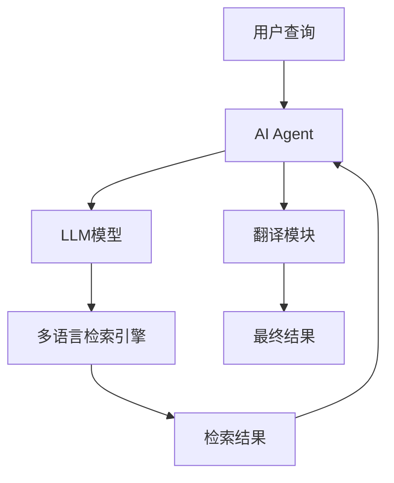
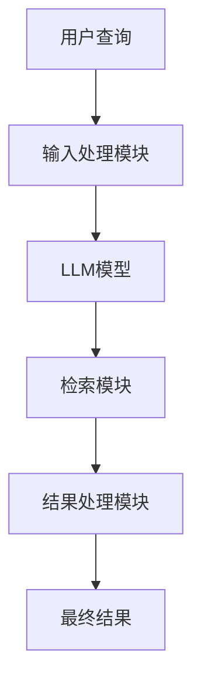

                 


# 基于LLM的AI Agent跨语言信息检索

## 关键词：
- 跨语言信息检索
- LLM
- AI Agent
- 大语言模型
- 信息检索
- 自然语言处理

## 摘要：
本文深入探讨了基于大语言模型（LLM）的AI Agent在跨语言信息检索中的应用。通过分析跨语言信息检索的核心概念、算法原理、系统架构设计以及实际项目实现，本文为读者提供了全面的视角，从理论到实践，详细阐述了如何利用LLM构建高效的AI Agent，实现跨语言信息检索。文章还结合具体案例，展示了如何在实际场景中应用这些技术，并提出了优化建议和未来发展方向。

---

# 第一部分：跨语言信息检索的背景与挑战

## 第1章：跨语言信息检索的背景与挑战

### 1.1 跨语言信息检索的定义与问题背景

#### 1.1.1 什么是跨语言信息检索
跨语言信息检索（Cross-Language Information Retrieval, CLIR）是指在多种语言的文档中进行信息检索，旨在克服语言障碍，为用户提供跨语言的信息访问能力。例如，用户可以通过中文查询英文文档，系统能够返回相关的英文结果并将其翻译成中文。

#### 1.1.2 跨语言信息检索的核心问题
- **语言障碍**：不同语言之间的语义差异和语法结构差异使得直接跨语言检索变得复杂。
- **资源不均衡**：某些语言的资源（如训练数据）可能远少于其他语言，导致检索效果受限。
- **计算复杂度**：跨语言检索需要处理多语言模型和复杂算法，对计算资源要求较高。

#### 1.1.3 跨语言信息检索的实际应用场景
- **多语言搜索引擎**：支持用户使用任意语言查询全球多语言网页。
- **跨语言客服系统**：用户可以用母语与AI客服交流，客服能够理解并处理多语言请求。
- **学术研究**：研究人员可以通过跨语言检索获取多语言学术论文和文献。

---

### 1.2 大语言模型（LLM）的崛起

#### 1.2.1 大语言模型的定义与特点
大语言模型（Large Language Model, LLM）是指基于Transformer架构训练的大型神经网络模型，具有以下特点：
- **大规模数据训练**：通常使用海量多语言文本数据进行预训练。
- **上下文理解能力**：能够处理长上下文，并理解复杂的语义关系。
- **多任务能力**：通过微调可以完成多种NLP任务，如翻译、问答、文本生成等。

#### 1.2.2 LLM在自然语言处理中的优势
- **通用性**：LLM可以处理多种语言和任务，减少了定制化开发的需求。
- **高效性**：通过预训练，LLM能够快速适应新的任务和领域。
- **可扩展性**：LLM可以轻松扩展到新的语言和领域。

#### 1.2.3 LLM与AI Agent的结合
AI Agent（人工智能代理）是一种能够感知环境、执行任务并提供服务的智能系统。LLM为AI Agent提供了强大的自然语言处理能力，使其能够理解用户需求、执行跨语言检索，并以自然语言形式返回结果。

---

### 1.3 AI Agent的基本概念与功能

#### 1.3.1 AI Agent的定义与分类
- **定义**：AI Agent是一种智能系统，能够通过感知环境、执行任务并与其他实体（用户、系统或其他AI Agent）交互来实现目标。
- **分类**：根据智能水平，AI Agent可以分为基于规则的Agent和基于模型的Agent。基于模型的Agent通常结合LLM进行复杂任务处理。

#### 1.3.2 AI Agent的核心功能与能力
- **感知能力**：通过自然语言处理技术理解用户需求。
- **决策能力**：根据任务目标选择最优的执行策略。
- **执行能力**：调用外部服务（如跨语言检索引擎）完成任务。
- **反馈能力**：根据用户反馈不断优化自身行为。

#### 1.3.3 AI Agent在跨语言信息检索中的作用
- **用户接口**：通过自然语言理解用户需求并生成查询。
- **跨语言检索**：调用多语言搜索引擎或模型进行信息检索。
- **结果处理**：对检索结果进行排序、翻译和呈现。

---

## 第2章：跨语言信息检索的核心概念与联系

### 2.1 跨语言信息检索的核心概念

#### 2.1.1 多语言模型与跨语言模型的区别
- **多语言模型**：在多种语言上进行联合训练，模型参数共享，适用于多种语言任务。
- **跨语言模型**：专注于特定语言之间的翻译或检索，通常针对两种或多种语言进行优化。

#### 2.1.2 跨语言检索的关键技术点
- **跨语言表示**：将不同语言的文本映射到相同的语义空间。
- **语言适配**：根据目标语言生成检索结果。
- **多语言索引**：构建支持多语言的索引结构以提高检索效率。

#### 2.1.3 跨语言检索的评价指标与挑战
- **评价指标**：Precision、Recall、F1值，以及翻译准确率等。
- **主要挑战**：语言资源不均衡、语义理解困难、计算效率低下。

---

### 2.2 大语言模型与AI Agent的联系

#### 2.2.1 LLM作为AI Agent的核心驱动力
- **自然语言理解**：LLM使AI Agent能够理解用户的复杂需求。
- **多语言支持**：LLM支持多种语言，使得AI Agent能够处理跨语言任务。
- **动态适应**：LLM可以通过微调快速适应新的任务和领域。

#### 2.2.2 跨语言能力对AI Agent价值的提升
- **扩展应用场景**：AI Agent能够服务于更多语言的用户。
- **提升用户体验**：通过跨语言检索，用户可以访问更多语言的信息资源。
- **增强智能水平**：跨语言能力使AI Agent更加智能和全能。

#### 2.2.3 LLM与AI Agent的协同工作模式
- **协同检索**：AI Agent调用LLM进行跨语言检索和结果处理。
- **动态优化**：根据用户反馈，AI Agent与LLM协同优化检索策略。

---

### 2.3 跨语言信息检索的系统架构

#### 2.3.1 跨语言检索系统的整体架构


#### 2.3.2 各模块之间的关系与协作
- **用户查询**：用户以母语提出检索需求。
- **AI Agent**：解析查询并调用LLM生成跨语言查询。
- **多语言检索引擎**：执行跨语言检索并返回结果。
- **翻译模块**：将检索结果翻译成用户指定语言并呈现。

#### 2.3.3 系统的输入输出流程
- **输入流程**：用户输入查询请求，AI Agent解析后生成检索指令。
- **输出流程**：检索引擎返回结果，翻译模块处理后输出给用户。

---

## 第3章：跨语言信息检索的算法原理

### 3.1 大语言模型的基本原理

#### 3.1.1 Transformer模型的结构与特点
- **编码器**：将输入文本转换为固定长度的向量表示。
- **解码器**：根据编码器的输出生成目标语言文本。
- **自注意力机制**：捕捉文本中的长距离依赖关系。

#### 3.1.2 注意力机制的数学公式与实现
```latex
\text{Attention}(Q, K, V) = \text{softmax}\left(\frac{QK^T}{\sqrt{d_k}}\right)V
```

#### 3.1.3 多语言模型的训练策略
- **多任务学习**：同时训练多种语言任务，共享模型参数。
- **语言嵌入共享**：通过共享语言嵌入层，减少语言间模型差异。

---

### 3.2 AI Agent的算法实现

#### 3.2.1 AI Agent的核心算法
- **意图识别**：基于LLM的文本分类算法，识别用户的查询意图。
- **跨语言检索**：基于多语言模型的检索算法，返回多语言结果。
- **结果处理**：包括翻译、排序和呈现算法。

#### 3.2.2 跨语言检索算法的实现步骤
1. **用户查询解析**：识别用户需求并生成多语言查询。
2. **多语言检索**：调用多语言搜索引擎或LLM进行检索。
3. **结果处理**：对检索结果进行翻译、排序和呈现。

---

### 3.3 跨语言信息检索的优化策略

#### 3.3.1 检索结果的排序算法
- **BM25算法**：基于关键词匹配的检索结果排序。
- **深度学习排序模型**：基于神经网络的检索结果排序。

#### 3.3.2 多语言模型的微调策略
- **领域微调**：针对特定领域进行微调，提高检索效果。
- **数据增强**：通过数据增强技术增加训练数据多样性。

---

## 第4章：基于LLM的AI Agent系统架构设计

### 4.1 系统模块划分与功能设计

#### 4.1.1 系统模块划分
- **输入处理模块**：解析用户查询并生成多语言查询请求。
- **检索模块**：调用多语言搜索引擎或LLM进行信息检索。
- **结果处理模块**：对检索结果进行翻译、排序和呈现。

#### 4.1.2 功能设计
- **多语言支持**：支持多种语言的查询和结果呈现。
- **智能检索**：基于LLM的语义理解进行检索优化。
- **动态适配**：根据用户反馈优化检索策略。

---

### 4.2 系统架构设计

#### 4.2.1 系统架构图


#### 4.2.2 模块之间的交互流程
- **输入处理模块**：接收用户查询，解析意图并生成多语言查询请求。
- **检索模块**：调用多语言搜索引擎或LLM进行信息检索，返回检索结果。
- **结果处理模块**：对检索结果进行翻译、排序和格式化处理，生成最终结果。

---

### 4.3 系统接口设计

#### 4.3.1 输入接口设计
- **输入格式**：支持多种语言的文本输入。
- **接口协议**：使用RESTful API进行接口交互。

#### 4.3.2 输出接口设计
- **输出格式**：支持结构化数据输出，便于前端展示。
- **接口协议**：支持JSON格式输出。

---

## 第5章：项目实战——基于LLM的AI Agent实现

### 5.1 环境安装与配置

#### 5.1.1 安装依赖
```bash
pip install transformers torch sentencepiece
```

#### 5.1.2 环境配置
- **Python版本**：3.8以上
- **GPU支持**：推荐使用NVIDIA GPU加速

---

### 5.2 系统核心实现

#### 5.2.1 数据预处理
```python
def preprocess(text):
    return text.lower().replace('.', '')
```

#### 5.2.2 模型训练与微调
```python
from transformers import AutoTokenizer, AutoModelForMaskedLM

tokenizer = AutoTokenizer.from_pretrained('bert-base-multilingual')
model = AutoModelForMaskedLM.from_pretrained('bert-base-multilingual')
```

#### 5.2.3 检索模块实现
```python
def cross_language_retrieve(query, model):
    # 将查询翻译为多种语言
    translations = translate(query, ['en', 'es', 'fr'])
    # 调用多语言检索引擎
    results = model.search(translations)
    return results
```

---

## 第6章：最佳实践与总结

### 6.1 最佳实践

#### 6.1.1 模型选择与优化
- **选择合适的多语言模型**：根据任务需求选择预训练好的多语言模型。
- **数据增强**：通过数据增强技术提高模型的泛化能力。

#### 6.1.2 系统优化
- **缓存机制**：减少重复检索，提高系统效率。
- **负载均衡**：通过分布式架构优化系统性能。

---

### 6.2 总结与展望

#### 6.2.1 总结
本文详细探讨了基于LLM的AI Agent在跨语言信息检索中的应用，从理论到实践，系统地介绍了跨语言信息检索的核心概念、算法原理和系统架构设计。通过具体案例分析，展示了如何利用LLM构建高效的AI Agent，实现跨语言信息检索。

#### 6.2.2 展望
未来，随着大语言模型的不断发展，跨语言信息检索将更加智能化和高效化。结合AI Agent的动态适配能力，跨语言信息检索将为用户提供更加丰富的信息资源和更优质的服务体验。

---

## 作者：AI天才研究院/AI Genius Institute & 禅与计算机程序设计艺术 /Zen And The Art of Computer Programming

