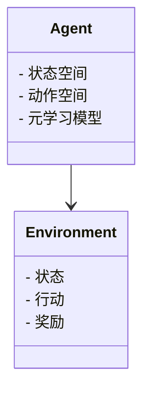
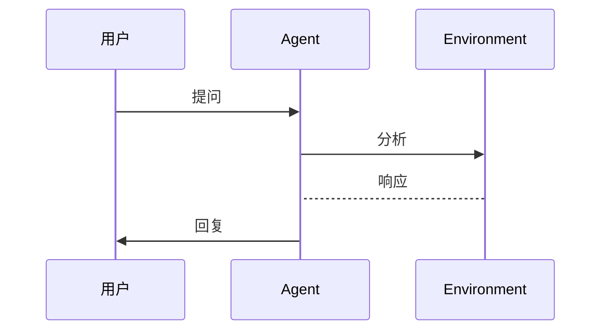

                 


# 基于元学习的快速适应型AI Agent

> 关键词：元学习（Meta-Learning）、快速适应型AI Agent、MAML算法、Meta-LSTM算法、AI系统架构设计

> 摘要：本文系统地探讨了基于元学习的快速适应型AI Agent的设计与实现。文章从元学习的基本概念出发，逐步深入分析其在AI Agent中的应用，结合典型算法MAML和Meta-LSTM的原理，详细阐述了系统架构设计与项目实战，并总结了最佳实践与未来展望。

---

## 第1章：背景介绍

### 1.1 元学习的基本概念

#### 1.1.1 元学习的定义
元学习（Meta-Learning）是一种机器学习方法，旨在通过学习“如何学习”来快速适应新任务。与传统机器学习不同，元学习关注的是模型的元知识，即模型如何调整自身以适应不同任务。

#### 1.1.2 元学习的核心目标
元学习的目标是通过少量数据快速掌握新任务，减少对大量标注数据的依赖，同时提高模型的泛化能力。

#### 1.1.3 元学习与传统机器学习的区别
| 特性 | 传统机器学习 | 元学习 |
|------|--------------|--------|
| 数据需求 | 高 | 低 |
| 适应性 | 低 | 高 |
| 学习目标 | 单任务 | 多任务 |

### 1.2 快速适应型AI Agent的背景

#### 1.2.1 快速适应的需求背景
在动态变化的环境中，AI Agent需要快速调整策略以应对新任务，例如智能客服、自动驾驶等场景。

#### 1.2.2 AI Agent的定义与特点
AI Agent是一种智能体，能够感知环境并采取行动以实现目标。快速适应型AI Agent的核心在于快速调整策略。

#### 1.2.3 元学习在AI Agent中的应用前景
元学习能够帮助AI Agent快速掌握新任务，降低对大量数据的依赖。

### 1.3 元学习在AI Agent中的作用

#### 1.3.1 元学习如何提升AI Agent的适应能力
通过元学习，AI Agent可以在新任务中快速调整参数，实现快速适应。

#### 1.3.2 元学习在不同场景中的应用
- 对话系统：快速适应不同领域的问题。
- 视觉任务：快速调整图像分类模型。

#### 1.3.3 元学习的优势与挑战
优势：
- 快速适应新任务。
- 减少数据需求。

挑战：
- 算法复杂性高。
- 对某些任务的效果有限。

---

## 第2章：核心概念与联系

### 2.1 元学习的核心原理

#### 2.1.1 元学习的参数化方法
参数化方法通过共享参数来实现元学习，例如MAML算法。

#### 2.1.2 元学习的非参数化方法
非参数化方法通过学习元模型来实现元学习，例如Meta-LSTM。

### 2.2 元学习与AI Agent的结合

#### 2.2.1 元学习在AI Agent中的应用
通过元学习，AI Agent可以在新任务中快速调整策略。

#### 2.2.2 元学习如何提升AI Agent的快速适应能力
元学习通过共享参数或元模型，帮助AI Agent快速适应新任务。

---

## 第3章：典型元学习算法

### 3.1 Meta-LSTM算法

#### 3.1.1 Meta-LSTM的基本原理
Meta-LSTM通过元循环神经网络实现元学习。

#### 3.1.2 Meta-LSTM的算法流程


#### 3.1.3 Meta-LSTM的优缺点
优点：
- 适用于序列任务。
缺点：
- 对某些任务的效果有限。

### 3.2 MAML算法

#### 3.2.1 MAML的基本原理
MAML通过梯度下降实现元学习。

#### 3.2.2 MAML的数学模型
$$
\theta' = \theta - \eta \nabla_{\theta} \mathcal{L}_i
$$

#### 3.2.3 MAML的代码实现
```python
def meta_learn():
    for task in tasks:
        for inner_update_step in range(inner_steps):
            loss = compute_loss(task, theta)
            theta = theta - eta * gradient(theta, loss)
    meta_loss = compute_meta_loss(tasks, theta)
    return theta
```

---

## 第4章：系统分析与架构设计

### 4.1 项目介绍

#### 4.1.1 项目背景
本项目旨在设计一个基于元学习的多领域对话系统。

#### 4.1.2 系统功能设计


#### 4.1.3 系统架构设计


#### 4.1.4 接口设计
- 输入接口：用户输入。
- 输出接口：系统输出。

#### 4.1.5 交互流程


---

## 第5章：项目实战

### 5.1 环境安装

#### 5.1.1 安装Python
```bash
python --version
```

#### 5.1.2 安装依赖
```bash
pip install numpy tensorflow
```

### 5.2 核心代码实现

#### 5.2.1 元学习模型实现
```python
def meta_learn():
    theta = initial_parameters()
    for task in tasks:
        for inner_update_step in range(inner_steps):
            loss = compute_loss(task, theta)
            theta = theta - eta * gradient(theta, loss)
    meta_loss = compute_meta_loss(tasks, theta)
    return theta
```

#### 5.2.2 系统交互实现
```python
def interact():
    while True:
        user_input = input("请输入问题：")
        response = agent.predict(user_input)
        print("系统回答：", response)
```

### 5.3 案例分析

#### 5.3.1 实际案例
设计一个多领域对话系统，支持快速切换领域。

#### 5.3.2 代码解读
- 元学习模型实现：实现快速适应新领域。
- 系统交互实现：用户与系统实时交互。

### 5.4 项目总结

#### 5.4.1 成果总结
实现了一个基于元学习的多领域对话系统。

#### 5.4.2 经验总结
- 元学习能够显著减少数据需求。
- 系统设计需要考虑交互流程。

---

## 第6章：最佳实践

### 6.1 小结

#### 6.1.1 核心观点总结
元学习能够显著提升AI Agent的快速适应能力。

### 6.2 注意事项

#### 6.2.1 算法选择
根据任务选择合适的元学习算法。

#### 6.2.2 系统设计
确保系统架构合理，便于扩展。

### 6.3 未来展望

#### 6.3.1 元学习的发展趋势
- 更多应用场景的探索。
- 更高效的算法设计。

#### 6.3.2 AI Agent的未来方向
- 更强的适应能力。
- 更广泛的应用领域。

### 6.4 拓展阅读

#### 6.4.1 推荐书籍
- 《Deep Learning》
- 《Meta-Learning: A survey》

#### 6.4.2 推荐论文
- Meta-LSTM: Learning to learn with long short-term memory networks.

---

## 作者：AI天才研究院/AI Genius Institute & 禅与计算机程序设计艺术 /Zen And The Art of Computer Programming

