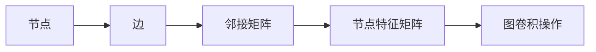
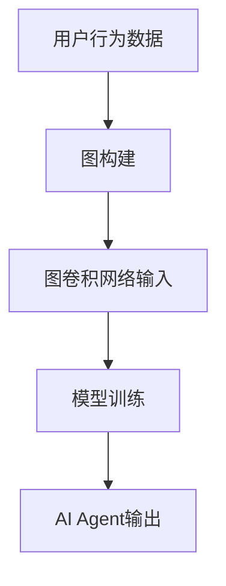

                 


# 基于图卷积网络的AI Agent社交网络分析

> 关键词：图卷积网络，AI Agent，社交网络分析，影响力传播，用户行为预测

> 摘要：本文详细探讨了基于图卷积网络（GCN）的AI Agent在社交网络分析中的应用，从核心概念、算法原理、系统设计到实际项目实现，全面解析了GCN在社交网络中的潜力与实践。

---

## 第一部分: 基于图卷积网络的AI Agent社交网络分析背景介绍

### 第1章: 图卷积网络与AI Agent概述

#### 1.1 图卷积网络的基本概念
- **图的基本概念与表示**  
  图是一种数据结构，由节点（顶点）和边组成。节点表示实体，边表示实体之间的关系。例如，在社交网络中，节点可以是用户，边可以是用户之间的关系（如朋友、关注）。

- **图卷积网络的定义与特点**  
  图卷积网络（GCN）是一种专门处理图结构数据的深度学习模型。它通过聚合节点及其邻居的信息来学习节点的表示，具有全局依赖和局部依赖的捕捉能力。

- **AI Agent的基本概念与功能**  
  AI Agent是一种智能体，能够感知环境并执行任务。在社交网络分析中，AI Agent可以用于用户行为预测、影响力传播分析等。

#### 1.2 社交网络分析的背景与挑战
- **社交网络的基本结构**  
  社交网络通常是一个无向图，节点代表用户，边代表用户之间的关系。常见的社交网络包括Facebook、Twitter和LinkedIn。

- **社交网络分析的典型问题**  
  包括用户行为预测（如用户是否会点击广告）、影响力传播分析（如谁是意见领袖）、社群检测与分析（如发现社交圈）。

- **图卷积网络在社交网络分析中的优势**  
  GCN能够有效地捕捉图结构中的局部和全局依赖关系，适合处理社交网络中的复杂关系。

---

### 第2章: 图卷积网络的核心概念与原理

#### 2.1 图卷积网络的数学模型
- **邻接矩阵与节点特征矩阵**  
  邻接矩阵$A$是一个$n \times n$的矩阵，表示节点之间的连接关系。节点特征矩阵$X$是一个$n \times d$的矩阵，表示每个节点的特征。

- **图卷积操作的数学表达**  
  GCN的卷积操作可以表示为：
  $$H^{(l+1)} = \sigma(A H^{(l)} W^{(l)}$$
  其中，$H^{(l)}$是第$l$层的节点表示，$W^{(l)}$是权重矩阵，$\sigma$是非线性激活函数。

- **池化操作与图卷积网络的结构**  
  池化操作用于降低图的规模，同时保持重要的特征信息。常见的池化方法包括基于度的池化和基于注意力的池化。

#### 2.2 图卷积网络的核心算法
- **GCN（Graph Convolutional Network）算法**  
  GCN通过聚合节点及其邻居的信息来更新节点的表示，适用于处理图结构数据。

- **GAT（Graph Attention Network）算法**  
  GAT引入了自注意力机制，能够更好地捕捉长距离依赖关系。

- **图卷积网络的变体与优化**  
  包括GraphSAGE、Gin等，这些变体在不同的场景下表现各异。

#### 2.3 图卷积网络的实体关系图


---

### 第3章: 基于图卷积网络的AI Agent设计与实现

#### 3.1 AI Agent在社交网络分析中的应用
- **用户行为预测**  
  通过GCN学习用户的行为模式，预测用户的下一步操作。

- **社交网络影响力传播**  
  分析信息在社交网络中的传播路径，识别关键节点。

- **社群检测与分析**  
  通过GCN聚类算法，发现社交网络中的社群结构。

#### 3.2 图卷积网络在AI Agent中的具体实现
- **数据预处理与图构建**  
  将社交网络数据转换为图结构，构建邻接矩阵和节点特征矩阵。

- **模型训练与优化**  
  使用GCN训练模型，优化超参数以提高性能。

- **模型部署与应用**  
  将训练好的模型部署到AI Agent中，实时分析社交网络数据。

#### 3.3 图卷积网络与AI Agent的结合流程


---

## 第二部分: 图卷积网络的数学模型与公式

### 第4章: 图卷积网络的数学模型与公式

#### 4.1 邻接矩阵与节点特征矩阵
- **邻接矩阵表示**  
  $$A_{ij} = 1 \text{ 如果节点i和节点j相连，否则} 0$$
- **节点特征矩阵表示**  
  $$X_{n \times d}$$

#### 4.2 图卷积操作的数学表达
- **GCN的前向传播公式**  
  $$H^{(l+1)} = \sigma(A H^{(l)} W^{(l)}$$
- **池化操作的数学表达**  
  $$H_{pool} = \text{aggregate}(H, A)$$

#### 4.3 图卷积网络的损失函数与优化
- **损失函数**  
  $$L = \frac{1}{N}\sum_{i=1}^{N} \text{loss}(y_i, \hat{y_i})$$
- **优化算法**  
  使用梯度下降等方法优化模型参数。

---

## 第三部分: 项目实战与总结

### 第5章: 项目实战

#### 5.1 环境安装
- **安装Python、TensorFlow、Keras等库**

#### 5.2 核心代码实现
```python
import tensorflow as tf
from tensorflow.keras import layers

class GCN(tf.keras.Model):
    def __init__(self, input_dim, hidden_dim, output_dim):
        super(GCN, self).__init__()
        self.gcn_layer = layers.Dense(hidden_dim, activation='relu')
        self.global_pooling = layers.GlobalAveragePooling1D()

    def call(self, inputs):
        A, X = inputs
        # 图卷积操作
        H = tf.matmul(A, X)
        H = self.gcn_layer(H)
        # 全局池化
        H = self.global_pooling(H)
        return H
```

#### 5.3 实际案例分析
- **影响力传播模拟**  
  通过GCN预测用户在社交网络中的影响力，识别关键节点。

---

## 第四部分: 总结与展望

### 第6章: 总结与展望

#### 6.1 总结
图卷积网络在社交网络分析中的应用潜力巨大，能够有效捕捉复杂的关系结构，为AI Agent提供了强大的分析能力。

#### 6.2 未来研究方向
- 更高效的GCN变体
- 图卷积网络与强化学习的结合
- 多模态数据的图分析方法

#### 6.3 最佳实践
- 数据预处理是关键
- 选择合适的模型和优化方法
- 定期更新模型以适应数据变化

---

作者：AI天才研究院/AI Genius Institute  
禅与计算机程序设计艺术/Zen And The Art of Computer Programming

