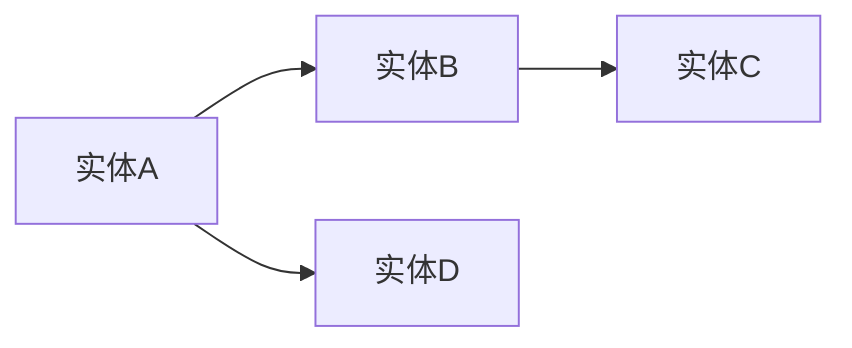
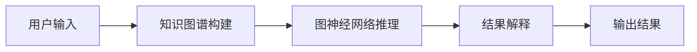

                 


# 基于图神经网络的AI Agent关系推理

---

## 关键词  
图神经网络, AI Agent, 关系推理, 知识图谱, 聚合函数, 注意力机制, 图结构数据

---

## 摘要  
本文详细探讨了基于图神经网络的AI Agent关系推理技术，从背景、核心概念到算法原理、系统架构，再到项目实战和最佳实践，全面解析了如何利用图神经网络提升AI Agent的关系推理能力。文章通过具体案例和代码示例，展示了如何在实际场景中应用这些技术，并提出了优化建议和未来研究方向。

---

# 第一部分: 基于图神经网络的AI Agent关系推理背景介绍

# 第1章: 问题背景与描述

## 1.1 问题背景  
AI Agent（智能代理）在现代人工智能系统中扮演着关键角色，它们需要通过关系推理来理解和处理复杂场景中的实体间关系。然而，传统的基于规则或浅层学习的关系推理方法在处理复杂、动态的实体关系时显得力不从心。  

图神经网络（Graph Neural Networks, GNNs）作为一种新兴的深度学习技术，能够有效地处理图结构数据，天然适合用于关系推理任务。通过将实体及其关系建模为图结构，GNNs能够捕捉到数据中的复杂关系和上下文信息，为AI Agent提供了强大的推理能力。

## 1.2 问题描述  
AI Agent在实际应用中需要处理的任务包括：  
1. **实体识别**：识别场景中的关键实体。  
2. **关系建模**：构建实体之间的关系图谱。  
3. **关系推理**：基于图谱进行推理，推断隐含的关系。  

传统方法在以下方面存在局限性：  
- 难以处理复杂、动态的关系结构。  
- 缺乏对上下文信息的有效建模。  
- 无法实时更新和推理。  

## 1.3 问题解决与边界  
通过引入图神经网络，我们可以：  
1. **动态建模**：实时更新图结构数据，捕捉关系变化。  
2. **深度推理**：利用图神经网络的深度学习能力，推断隐含关系。  
3. **端到端优化**：通过端到端训练，提升模型的泛化能力。  

**边界与适用场景**：  
- 适用于实体关系复杂且动态变化的场景。  
- 适用于需要实时推理的应用，如推荐系统、社交网络分析等。  

## 1.4 概念结构与核心要素  
关系推理的核心要素包括：  
1. **实体（Entity）**：场景中的关键对象。  
2. **关系（Relation）**：实体之间的联系。  
3. **图结构（Graph Structure）**：由实体和关系构成的图谱。  
4. **推理（Reasoning）**：基于图结构推断隐含关系。  

---

# 第二部分: 核心概念与联系

# 第2章: 图神经网络与关系推理的核心原理

## 2.1 图神经网络的基本原理  
图神经网络通过聚合（aggregation）和传播（propagation）操作，将图结构数据中的信息传递到每个节点，从而学习节点的表示。  

### 2.1.1 图结构数据的表示方法  
图结构数据由节点（Nodes）和边（Edges）组成，常用邻接矩阵或边列表示。  

### 2.1.2 图神经网络的基本操作  
1. **聚合（Aggregation）**：将相邻节点的特征聚合到当前节点。  
2. **传播（Propagation）**：将聚合后的特征传播到其他节点。  

### 2.1.3 图神经网络的训练与优化  
图神经网络通过反向传播算法进行训练，优化目标函数以最小化预测误差。

---

## 2.2 关系推理的核心概念  
### 2.2.1 关系推理的定义与分类  
关系推理是通过分析实体之间的关系，推断出新的关系或属性。常见类型包括：  
- **显式推理**：基于已知关系推断隐含关系。  
- **隐式推理**：通过上下文信息推断关系。  

### 2.2.2 基于图结构的关系推理模型  
基于图神经网络的关系推理模型通常包括以下步骤：  
1. 构建图谱：将实体及其关系建模为图结构。  
2. 表示学习：利用图神经网络学习节点的表示。  
3. 关系推理：基于节点表示推断关系。  

### 2.2.3 关系推理的评价指标与方法  
常用的评价指标包括准确率（Accuracy）、精确率（Precision）、召回率（Recall）和F1值。  

---

## 2.3 AI Agent与关系推理的联系  
### 2.3.1 AI Agent中的知识表示与推理  
AI Agent需要通过知识图谱表示知识，并通过推理能力进行决策和行动。  

### 2.3.2 图神经网络在AI Agent中的应用  
图神经网络可以用于知识图谱的构建、更新和推理，为AI Agent提供强大的关系推理能力。  

### 2.3.3 关系推理对AI Agent决策能力的提升  
通过关系推理，AI Agent能够更好地理解复杂场景，做出更智能的决策。  

---

## 2.4 核心概念对比与ER实体关系  

**核心概念对比表**：  

| **概念**       | **定义**                                                                 |  
|-----------------|--------------------------------------------------------------------------|  
| 实体（Entity）   | 场景中的关键对象，如人、物、事件等。                                    |  
| 关系（Relation） | 实体之间的联系，如“属于”、“位于”、“关联”等。                          |  
| 图结构（Graph）  | 由节点和边组成的结构，用于表示实体及其关系。                            |  
| 推理（Reasoning）| 基于已知信息推断未知关系的能力。                                        |  

**ER实体关系图**：  



---

# 第三部分: 算法原理讲解

# 第3章: 图神经网络的算法原理

## 3.1 图神经网络的聚合函数  
聚合函数用于将相邻节点的特征聚合到当前节点。常用的聚合函数包括：  
1. **平均聚合**：取相邻节点特征的平均值。  
2. **最大值聚合**：取相邻节点特征的最大值。  
3. **加权聚合**：根据边权重进行加权求和。  

### 聚合函数的数学表达  
假设节点v的特征为h_v，其邻居节点为u，边权重为w_{uv}，聚合函数可以表示为：  
$$ h_v^{(new)} = \sum_{u \in N(v)} w_{uv} h_u $$  

## 3.2 图神经网络的注意力机制  
注意力机制通过自适应地分配注意力权重，提升模型对重要节点的聚焦能力。  

### 注意力机制的数学表达  
注意力权重α_{uv}可以表示为：  
$$ \alpha_{uv} = \frac{\exp(s_u^T s_v)}{\sum_{u' \in N(v)} \exp(s_{u'}^T s_v)} $$  
其中，s_u和s_v是节点u和v的特征向量。  

## 3.3 图神经网络的传播过程  
传播过程将聚合后的特征传播到整个图中，最终得到每个节点的表示。  

### 传播过程的数学表达  
节点v的最终表示为：  
$$ h_v = \sum_{u \in N(v)} \alpha_{uv} h_u $$  

---

# 第四部分: 系统分析与架构设计

# 第4章: 系统分析与架构设计

## 4.1 问题场景介绍  
AI Agent需要在动态变化的场景中进行关系推理，例如社交网络分析、推荐系统等。  

## 4.2 系统功能设计  
1. **知识图谱构建**：将实体及其关系建模为图结构。  
2. **关系推理**：基于图神经网络进行推理。  
3. **结果解释**：将推理结果解释为可理解的形式。  

## 4.3 系统架构设计  


---

# 第五部分: 项目实战

# 第5章: 项目实战

## 5.1 环境安装与配置  
安装必要的依赖库，例如PyTorch、NetworkX等。  

## 5.2 核心代码实现  
以下是一个简单的图神经网络实现示例：  

```python
import torch
from torch import nn

class GNNLayer(nn.Module):
    def __init__(self, in_dim, out_dim):
        super(GNNLayer, self).__init__()
        self.W = nn.Parameter(torch.randn(in_dim, out_dim))
    
    def forward(self, h, adj):
        h_new = torch.matmul(h, self.W)
        h_new = torch.bmm(adj, h_new.unsqueeze(2)).squeeze(2)
        return h_new

# 示例数据
nodes = 4
features = 2
edges = [[0,1], [1,2], [2,3], [3,0]]

# 初始化图结构
adj = torch.zeros(nodes, nodes)
for u, v in edges:
    adj[u][v] = 1

# 初始化特征矩阵
h = torch.randn(nodes, features)

# 前向传播
gnn_layer = GNNLayer(features, 2)
output = gnn_layer(h, adj)
print(output)
```

---

## 5.3 实际案例分析  
以社交网络分析为例，展示如何利用图神经网络进行关系推理。  

---

# 第六部分: 总结与展望

# 第6章: 总结与展望

## 6.1 项目小结  
本文详细探讨了基于图神经网络的AI Agent关系推理技术，从理论到实践，全面解析了其核心原理和应用方法。  

## 6.2 注意事项  
- 数据预处理和特征提取是关系推理的关键步骤。  
- 注意力机制可以显著提升模型的性能。  
- 模型的可解释性需要进一步优化。  

## 6.3 拓展阅读  
建议读者进一步学习以下内容：  
1. 图神经网络的最新研究。  
2. 基于图神经网络的知识图谱构建技术。  
3. 关系推理在不同领域的应用。  

---

# 作者信息  

**作者：AI天才研究院/AI Genius Institute & 禅与计算机程序设计艺术 /Zen And The Art of Computer Programming**

---

**文章总结**  
通过本文的系统讲解，读者可以全面理解基于图神经网络的AI Agent关系推理技术，并能够在实际项目中应用这些方法。未来的研究方向包括优化模型的可解释性、提升推理效率以及探索新的应用场景。

