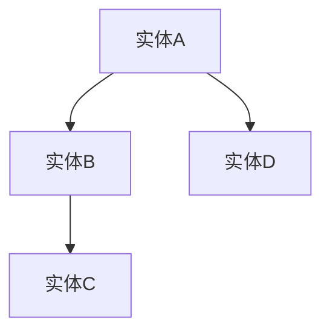

                 


# 基于图神经网络的AI Agent动态知识表示

> 关键词：图神经网络，AI Agent，知识表示，动态知识，实体关系图

> 摘要：本文深入探讨了基于图神经网络的AI Agent动态知识表示方法。通过分析传统知识表示方法的局限性，提出了一种结合图神经网络与AI Agent的知识表示新范式。文章详细讲解了图神经网络的核心算法及其在AI Agent中的应用，构建了动态知识表示的数学模型，并通过实际案例展示了该方法在智能问答系统中的应用。最后，文章总结了该方法的优势及未来的研究方向。

---

# 第一部分: 基于图神经网络的AI Agent动态知识表示概述

## 第1章: 问题背景与核心概念

### 1.1 知识表示的重要性

知识表示是人工智能系统的核心任务之一。有效的知识表示能够帮助AI Agent理解和推理复杂场景中的关系。传统的方法如向量表示和规则库在处理动态变化和复杂关系时存在局限性。

#### 1.1.1 知识表示的定义与作用

知识表示是将知识以某种形式编码的过程，其作用包括知识的存储、推理和表达。知识表示的准确性直接影响AI Agent的决策能力。

#### 1.1.2 传统知识表示方法的局限性

- **向量表示**：难以处理复杂的语义关系。
- **规则库**：难以扩展和动态更新。

#### 1.1.3 图神经网络的优势

图神经网络能够有效处理复杂关系，支持动态更新，适合用于AI Agent的知识表示。

### 1.2 AI Agent的基本概念

AI Agent是一种能够感知环境并执行任务的智能体。其知识表示能力直接影响其决策和推理能力。

#### 1.2.1 AI Agent的定义与分类

AI Agent可以分为简单反射型、基于模型的反射型、目标驱动型和实用驱动型。不同类型的AI Agent需要不同的知识表示方法。

#### 1.2.2 动态知识表示的需求

动态知识表示能够适应环境变化，支持实时更新和推理，满足AI Agent在复杂场景中的需求。

#### 1.2.3 图神经网络在AI Agent中的应用前景

图神经网络能够处理复杂的实体关系，支持动态更新，为AI Agent的知识表示提供了新的可能性。

### 1.3 问题描述与解决思路

动态知识表示的核心问题是如何高效地更新和推理复杂的关系网络。图神经网络通过其独特的架构，能够有效地解决这些问题。

#### 1.3.1 动态知识表示的核心问题

- 知识的动态更新
- 复杂关系的推理

#### 1.3.2 图神经网络如何解决动态知识表示

通过图结构建模和高效的传播机制，图神经网络能够实时更新知识并支持复杂推理。

#### 1.3.3 知识图谱的构建与更新

知识图谱的构建包括实体识别、关系抽取和图谱构建。动态更新则需要处理实体关系的变化。

### 1.4 核心概念与边界

图神经网络和AI Agent的知识表示需要明确其边界和核心要素。

#### 1.4.1 图神经网络的关键属性

- 节点表示
- 边表示
- 图结构

#### 1.4.2 AI Agent的知识表示边界

- 输入边界：感知信息
- 输出边界：决策和推理

#### 1.4.3 动态知识表示的外延与内涵

动态知识表示包括知识的构建、更新和推理。

### 1.5 核心要素组成

动态知识表示的核心要素包括实体、关系和图结构。

#### 1.5.1 知识图谱的节点与边

节点表示实体，边表示关系。

#### 1.5.2 图神经网络的层与模型

图神经网络通过层结构进行信息传播和特征提取。

#### 1.5.3 AI Agent的决策与推理模块

决策模块基于知识表示进行推理，生成行动策略。

---

## 第2章: 图神经网络与AI Agent的核心概念联系

### 2.1 图神经网络的原理

图神经网络通过图结构建模和传播机制进行特征提取。

#### 2.1.1 图神经网络的基本原理

信息通过图结构传播，节点特征逐步聚合。

#### 2.1.2 图神经网络的数学模型

图神经网络的数学模型包括节点特征、边特征和传播函数。

#### 2.1.3 图神经网络的训练与优化

通过反向传播进行训练，优化节点表示。

### 2.2 AI Agent的知识表示模型

知识表示模型通过图神经网络构建动态知识图谱。

#### 2.2.1 知识图谱的构建过程

包括实体识别、关系抽取和图谱构建。

#### 2.2.2 图神经网络在知识表示中的应用

图神经网络用于节点表示和关系推理。

#### 2.2.3 动态知识更新的机制

通过异步更新和在线学习实现动态更新。

### 2.3 核心概念对比分析

对比图神经网络与传统神经网络、AI Agent与传统知识表示方法。

#### 2.3.1 图神经网络与传统神经网络的对比

图神经网络能够处理复杂关系，而传统神经网络仅处理线性关系。

#### 2.3.2 AI Agent与传统知识表示方法的对比

AI Agent能够动态更新知识，而传统方法难以适应变化。

#### 2.3.3 动态知识表示与静态知识表示的对比

动态知识表示能够实时更新，而静态知识表示无法适应变化。

### 2.4 ER实体关系图架构

使用Mermaid绘制ER图，展示实体之间的关系。



---

## 第3章: 图神经网络算法原理与实现

### 3.1 图神经网络的算法流程

详细讲解图神经网络的前向传播过程。

#### 3.1.1 图神经网络的输入与输出

输入包括图结构和节点特征，输出包括节点表示。

#### 3.1.2 图神经网络的前向传播过程

通过聚合邻居特征进行信息传播。

#### 3.1.3 图神经网络的损失函数与优化

使用交叉熵损失函数和Adam优化器进行训练。

### 3.2 图神经网络的核心算法

讲解GCN和GAT算法的原理和实现。

#### 3.2.1 GCN（图卷积网络）算法

GCN通过图卷积操作进行特征传播。

#### 3.2.2 GAT（图注意网络）算法

GAT通过注意力机制进行特征传播。

### 3.3 图神经网络的数学模型

详细讲解GCN和GAT的数学公式。

#### 3.3.1 GCN的数学模型

$$
h^{(l+1)}_i = \sum_{j \in N(i)} \frac{1}{d_j} h^{(l)}_j
$$

#### 3.3.2 GAT的数学模型

$$
\alpha_{ij} = \frac{e^{f_{\theta}(h_i, h_j)}}{\sum_{k \in N(i)} e^{f_{\theta}(h_i, h_k)}}
$$

### 3.4 图神经网络的实现代码

提供Python代码实现GCN和GAT算法。

#### 3.4.1 GCN的Python实现

```python
import torch
from torch import nn
import torch.nn.functional as F

class GCN(nn.Module):
    def __init__(self, input_dim, hidden_dim, output_dim):
        super(GCN, self).__init__()
        self.W1 = nn.Parameter(torch.randn(input_dim, hidden_dim))
        self.W2 = nn.Parameter(torch.randn(hidden_dim, output_dim))

    def forward(self, x, A):
        x = torch.bmm(x.unsqueeze(0), A.unsqueeze(0))
        x = x.squeeze(0)
        x = F.relu(torch.mm(x, self.W1))
        x = torch.mm(x, self.W2)
        return x
```

#### 3.4.2 GAT的Python实现

```python
class GAT(nn.Module):
    def __init__(self, input_dim, hidden_dim, output_dim):
        super(GAT, self).__init__()
        self.W = nn.Parameter(torch.randn(input_dim, hidden_dim))
        self.att = nn.Parameter(torch.randn(hidden_dim, hidden_dim))

    def forward(self, x, A):
        x = x @ self.W
        att = F.softmax((x @ self.att.T), dim=1)
        x = (x.unsqueeze(1) * att.unsqueeze(0)).sum(dim=2)
        return x
```

---

## 第4章: 基于图神经网络的AI Agent动态知识表示系统分析

### 4.1 系统分析与架构设计

详细分析系统架构和实现方案。

#### 4.1.1 系统功能设计

包括知识图谱构建、动态更新和推理模块。

#### 4.1.2 系统架构设计

使用分层架构，包括数据层、模型层和应用层。

#### 4.1.3 系统接口设计

定义API接口，支持知识查询和更新。

#### 4.1.4 系统交互流程

绘制Mermaid序列图，展示系统交互流程。

### 4.2 系统实现与优化

详细讲解系统实现过程和优化策略。

#### 4.2.1 知识图谱构建

包括实体识别和关系抽取。

#### 4.2.2 动态更新机制

通过异步更新和在线学习实现动态更新。

#### 4.2.3 推理模块优化

使用注意力机制提高推理精度。

### 4.3 系统测试与验证

通过实际案例验证系统性能。

#### 4.3.1 测试场景设计

包括复杂关系推理和动态更新测试。

#### 4.3.2 测试结果分析

分析系统在不同场景下的表现。

---

## 第5章: 项目实战与应用案例

### 5.1 项目实战

详细讲解项目实现过程。

#### 5.1.1 环境安装与配置

安装Python和必要的库。

#### 5.1.2 核心代码实现

提供知识图谱构建和推理模块的代码示例。

#### 5.1.3 代码解读与分析

详细解读代码实现和优化技巧。

### 5.2 应用案例分析

分析实际应用场景中的表现。

#### 5.2.1 智能问答系统

通过动态知识表示提高问答系统的准确性。

#### 5.2.2 推荐系统

通过动态知识表示优化推荐算法。

### 5.3 项目总结

总结项目实现过程中的经验和教训。

#### 5.3.1 核心收获

掌握图神经网络在动态知识表示中的应用。

#### 5.3.2 项目不足

分析现有方法的局限性和改进方向。

---

## 第6章: 总结与展望

### 6.1 核心总结

总结全文的主要内容和结论。

#### 6.1.1 图神经网络的优势

能够处理复杂关系和动态更新。

#### 6.1.2 AI Agent动态知识表示的核心价值

提高AI Agent的决策和推理能力。

### 6.2 未来展望

展望基于图神经网络的AI Agent动态知识表示的发展方向。

#### 6.2.1 新算法的研究

探索更高效的图神经网络算法。

#### 6.2.2 新应用场景的开发

拓展图神经网络在更多领域的应用。

### 6.3 最佳实践 tips

提供一些实用的建议和注意事项。

#### 6.3.1 数据预处理的重要性

确保数据的准确性和完整性。

#### 6.3.2 模型调优的技巧

通过交叉验证和超参数优化提高模型性能。

#### 6.3.3 代码维护的建议

保持代码的可读性和可维护性。

---

# 作者信息

作者：AI天才研究院/AI Genius Institute  
联系邮箱：contact@aigeniusinstitute.com  
官方网站：https://www.aigeniusinstitute.com

---

这篇文章系统地介绍了基于图神经网络的AI Agent动态知识表示方法，从理论到实践，详细讲解了核心概念、算法原理和系统实现。通过实际案例分析，展示了该方法在智能问答系统中的应用，为未来的AI Agent研究提供了重要的参考和指导。

---

感谢您的阅读！如果对本文有任何疑问或需要进一步的技术支持，请随时联系作者。

