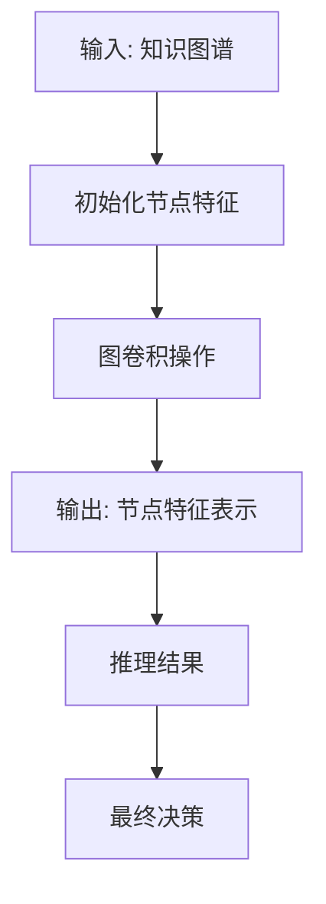

                 


# 基于图神经网络的AI Agent知识推理

> 关键词：图神经网络, AI Agent, 知识推理, 知识图谱, 图卷积操作, 实体关系图, 算法实现

> 摘要：本文详细探讨了基于图神经网络的AI Agent知识推理技术，从背景介绍、核心概念、算法原理、系统架构设计到项目实战，系统性地分析了该领域的关键技术和应用实践。通过理论与实践相结合的方式，深入讲解了图神经网络在知识图谱构建与推理中的应用，以及如何将这些技术应用于实际的AI Agent系统中。本文还提供了详细的代码实现和案例分析，帮助读者更好地理解和掌握相关技术。

---

## 第一部分: 背景介绍

### 第1章: 基于图神经网络的AI Agent知识推理概述

#### 1.1 问题背景
- **知识推理的定义与重要性**：知识推理是指通过已有知识和逻辑规则推导出新的知识的过程，是实现智能系统的核心能力。在AI Agent中，知识推理是实现自主决策的关键技术。
- **图神经网络在知识推理中的优势**：传统的知识推理方法依赖于规则和逻辑推理，但其效率和 scalability 有限。图神经网络通过图结构数据的建模和学习，能够高效处理复杂的知识关联关系。
- **AI Agent的知识推理需求**：AI Agent需要在动态环境中进行实时推理，要求推理方法具备高效的计算能力和强的环境适应能力。

#### 1.2 问题描述
- **知识推理的基本问题**：如何从大规模的知识图谱中高效地进行推理。
- **图神经网络在知识图谱中的应用**：通过图结构数据的建模，图神经网络可以更好地捕捉知识之间的关联关系。
- **AI Agent的知识推理挑战**：如何将图神经网络与AI Agent的其他模块（如感知、决策）结合，实现端到端的知识推理。

#### 1.3 问题解决
- **图神经网络的核心思想**：通过图卷积操作，将节点的特征和其邻居节点的特征进行聚合，从而得到节点的高层次特征表示。
- **AI Agent的知识推理框架**：构建知识图谱 -> 图神经网络推理 -> 推理结果 -> Agent决策。
- **知识图谱构建与推理的结合**：通过知识图谱构建获取结构化知识，利用图神经网络进行推理，实现AI Agent的智能决策。

#### 1.4 边界与外延
- **知识推理的边界条件**：仅限于知识图谱中的结构化知识，无法处理非结构化数据。
- **图神经网络的适用范围**：适用于图结构数据，对大规模图数据的处理能力较强。
- **AI Agent知识推理的外延**：未来可能结合其他技术（如强化学习、自然语言处理）进一步提升推理能力。

#### 1.5 核心概念结构与组成
- **知识图谱的组成要素**：节点（实体）、边（关系）、属性（节点的附加信息）。
- **图神经网络的核心要素**：图卷积层、节点特征、边特征。
- **AI Agent的知识推理结构**：知识图谱输入 -> 图神经网络推理 -> 推理结果输出 -> Agent决策。

---

## 第二部分: 核心概念与联系

### 第2章: 图神经网络原理

#### 2.1 图神经网络的核心原理
- **图的表示与节点关系**：图通过节点和边表示实体及其关系，节点之间的关系可以通过边的权重或类型进行描述。
- **图卷积操作的数学模型**：图卷积操作可以表示为：
  $$ f^{(l+1)}(v) = \sigma\left(\sum_{u \in N(v)} w_{vu} \cdot f^{(l)}(u) + w_{vv} \cdot f^{(l)}(v)\right) $$
  其中，$f^{(l)}(v)$ 是节点 $v$ 在第 $l$ 层的特征表示，$N(v)$ 是节点 $v$ 的邻居节点集合，$\sigma$ 是激活函数。
- **图神经网络的训练与推理**：图神经网络的训练采用端到端的反向传播算法，推理阶段利用训练好的模型进行节点或边的特征预测。

#### 2.2 AI Agent的知识推理
- **知识图谱的构建与表示**：知识图谱通过实体和关系构建结构化的知识库，可以表示为一个图结构。
- **知识推理的基本流程**：输入知识图谱和查询，输出推理结果。例如，从“人-工作”关系中推理出“人-公司”关系。
- **AI Agent的推理机制**：AI Agent通过知识图谱和图神经网络进行推理，结合环境信息做出决策。

#### 2.3 图神经网络与AI Agent的结合
- **图神经网络在知识图谱中的应用**：通过图卷积操作，图神经网络可以学习节点的高层次特征表示，捕捉知识之间的关联关系。
- **AI Agent的知识推理框架**：知识图谱输入 -> 图神经网络推理 -> 推理结果输出 -> Agent决策。
- **图神经网络与AI Agent的协同工作**：图神经网络负责知识推理，AI Agent负责根据推理结果进行决策和行动。

### 第3章: 核心概念对比与ER实体关系图

#### 3.1 核心概念原理对比
- **图神经网络与传统神经网络的对比**：
  - 输入：图结构数据 vs. 结构化数据。
  - 输出：节点或边的特征表示 vs. 普通的向量表示。
  - 优势：能够捕捉图结构中的局部和全局信息。
- **知识推理与传统推理的对比**：
  - 输入：知识图谱 vs. 简单的逻辑规则。
  - 输出：推理结果 vs. 逻辑推导结果。
  - 优势：能够处理大规模、复杂的知识关联关系。
- **AI Agent与传统知识推理系统的对比**：
  - 输入：环境信息 + 知识图谱 vs. 知识图谱。
  - 输出：决策和行动 vs. 推理结果。
  - 优势：能够结合环境信息进行自主决策。

#### 3.2 核心概念属性特征对比表
| 概念 | 属性 | 特征 |
|------|------|------|
| 图神经网络 | 输入 | 图结构数据 |
|        | 输出 | 节点或边的特征表示 |
| 知识推理 | 输入 | 知识图谱 |
|        | 输出 | 推理结果 |
| AI Agent | 输入 | 知识图谱和环境信息 |
|        | 输出 | 行动决策 |

#### 3.3 ER实体关系图
```mermaid
er
actor(Agent, 实体, 关系)
```

---

## 第三部分: 算法原理讲解

### 第4章: 图神经网络算法实现

#### 4.1 图神经网络算法原理
- **图卷积操作的实现**：通过聚合节点及其邻居节点的特征，生成新的节点特征。
- **数学模型**：
  $$ f^{(l+1)}(v) = \sigma\left(\sum_{u \in N(v) \cup \{v\}} w_{vu} \cdot f^{(l)}(u)\right) $$
- **算法步骤**：
  1. 初始化节点特征。
  2. 迭代进行图卷积操作。
  3. 输出节点的高层次特征表示。

#### 4.2 图神经网络的Python实现
```python
import torch
from torch.nn import Conv1d, ReLU, MaxPool1d

class GraphConvolution(torch.nn.Module):
    def __init__(self, in_features, out_features):
        super(GraphConvolution, self).__init__()
        self.conv = Conv1d(in_features, out_features, kernel_size=1, stride=1)
        self.relu = ReLU()

    def forward(self, input, adj):
        # input: [batch_size, in_features, num_nodes]
        # adj: [num_nodes, num_nodes]
        batch_size, _, num_nodes = input.size()
        input = input.permute(0, 2, 1)  # [batch_size, num_nodes, in_features]
        support = torch.bmm(input, adj)  # [batch_size, num_nodes, out_features]
        support = support.permute(0, 2, 1)  # [batch_size, out_features, num_nodes]
        output = self.conv(support)
        output = self.relu(output)
        return output
```

#### 4.3 算法实现的mermaid流程图


---

## 第四部分: 系统分析与架构设计

### 第5章: 系统架构设计

#### 5.1 问题场景介绍
- 知识推理系统需要支持大规模知识图谱的构建与推理，AI Agent需要实时处理环境信息并做出决策。

#### 5.2 项目介绍
- 项目目标：构建一个基于图神经网络的AI Agent知识推理系统。
- 项目特点：
  - 支持大规模知识图谱的构建。
  - 实现高效的图神经网络推理。
  - 结合环境信息进行自主决策。

#### 5.3 系统功能设计
- **领域模型设计**：
  ```mermaid
  classDiagram
      class Agent {
          知识图谱
          推理引擎
          决策模块
      }
      class 知识图谱 {
          实体节点
          关系边
          属性
      }
      class 推理引擎 {
          图卷积操作
          节点特征
          推理结果
      }
      class 决策模块 {
          环境信息
          行动决策
      }
      Agent --> 知识图谱
      Agent --> 推理引擎
      Agent --> 决策模块
  ```

#### 5.4 系统架构设计
- **系统架构图**：
  ```mermaid
  architecture
      Client
      Server
      Database
      推理引擎
      决策模块
  ```

---

## 第五部分: 项目实战

### 第6章: 项目实战与代码实现

#### 6.1 环境配置
- Python 3.7+
- PyTorch 1.9+
- Node.js 16+

#### 6.2 系统核心实现
- **知识图谱的构建**：
  ```python
  import networkx as nx
  G = nx.Graph()
  G.add_nodes_from(["A", "B", "C"])
  G.add_edges_from([("A", "B"), ("B", "C")])
  ```

- **推理引擎的实现**：
  ```python
  import torch
  from torch import nn

  class GNN(nn.Module):
      def __init__(self, input_dim, hidden_dim):
          super(GNN, self).__init__()
          self.conv1 = GraphConvolution(input_dim, hidden_dim)
          self.relu = nn.ReLU()

      def forward(self, input, adj):
          output = self.conv1(input, adj)
          output = self.relu(output)
          return output
  ```

#### 6.3 代码应用解读与分析
- **知识图谱的构建**：使用 networkx 库构建知识图谱，定义实体节点和关系边。
- **推理引擎的实现**：定义一个图神经网络模型，包括图卷积操作和激活函数。

#### 6.4 实际案例分析
- **案例1**：从知识图谱中推理出节点之间的关系。
- **案例2**：结合环境信息，进行推理并做出决策。

#### 6.5 项目小结
- 项目实现了基于图神经网络的AI Agent知识推理系统。
- 系统能够构建知识图谱，进行高效的推理，并结合环境信息做出决策。

---

## 第六部分: 最佳实践与总结

### 第7章: 最佳实践 tips

#### 7.1 小结
- 本文详细探讨了基于图神经网络的AI Agent知识推理技术。
- 从背景介绍、核心概念、算法原理到系统架构设计和项目实战，全面分析了该领域的关键技术。

#### 7.2 注意事项
- 知识图谱的构建需要考虑数据的完整性和准确性。
- 图神经网络的训练需要大量的标注数据，训练时间较长。
- 系统的实时性和可扩展性需要进行优化。

#### 7.3 拓展阅读
- 《Graph Neural Networks: A Review of Methods, Applications, and Open Challenges》
- 《Deep Learning on Graph-Structured Data》
- 《Knowledge Graphs and Reasoning》

---

## 作者

**作者：AI天才研究院/AI Genius Institute & 禅与计算机程序设计艺术 /Zen And The Art of Computer Programming**

---

通过以上内容，您可以获得关于基于图神经网络的AI Agent知识推理技术的全面了解，从理论到实践，逐步深入，帮助您掌握这一领域的核心技术和应用实践。

