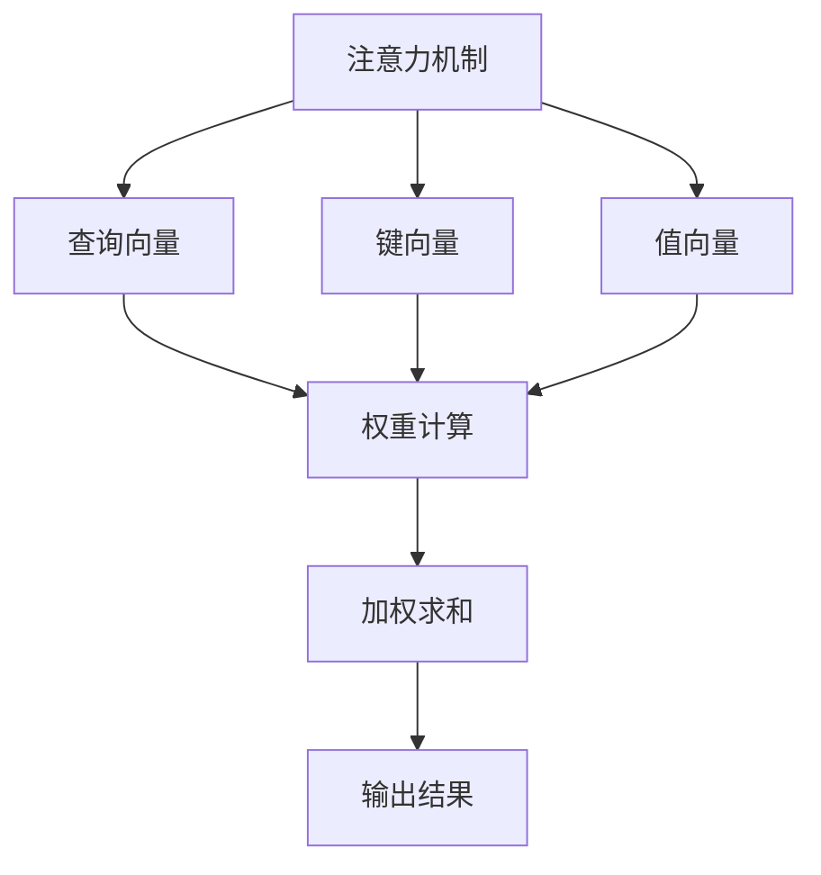
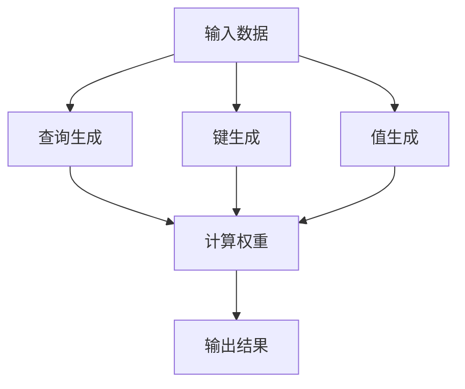
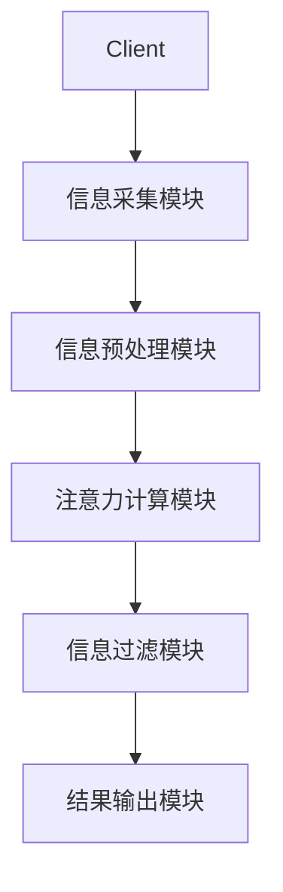
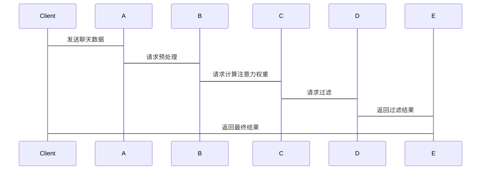

                 


# 基于注意力机制的AI Agent信息过滤

---

## 关键词  
AI Agent, 注意力机制, 信息过滤, 深度学习, 自然语言处理, 系统架构设计

---

## 摘要  
本文深入探讨了基于注意力机制的AI Agent信息过滤技术，从理论到实践，系统性地分析了其核心原理、算法实现、系统架构及应用场景。文章首先介绍了注意力机制的基本概念及其在信息过滤中的作用，随后详细讲解了自注意力机制和位置注意力机制的数学模型，并通过实际案例展示了如何将这些技术应用于AI Agent的信息过滤系统中。文章还提供了完整的系统架构设计和项目实现代码，帮助读者从理论到实践全面掌握相关技术。最后，本文总结了基于注意力机制的AI Agent信息过滤的优势与挑战，并展望了未来的研究方向。

---

## 第一部分：背景介绍

### 第1章：问题背景与概念结构

#### 1.1 问题背景
随着AI Agent在智能助手、推荐系统、聊天机器人等领域的广泛应用，信息过滤成为提升系统性能的关键技术。然而，传统的信息过滤方法难以处理高维、非结构化的数据，且缺乏对上下文语境的理解能力。注意力机制作为一种基于权重分配的模型，能够有效捕捉数据中的关键信息，为AI Agent的信息过滤提供了新的解决方案。

#### 1.2 问题描述
AI Agent需要实时处理大量多模态数据，包括文本、图像、语音等。信息过滤的目标是从这些数据中提取关键信息，排除噪声和无关内容。传统的基于规则的过滤方法难以应对动态变化的场景，而基于深度学习的注意力机制能够动态分配权重，精准识别重要信息。

#### 1.3 问题解决
注意力机制通过计算输入数据中各部分的重要性，帮助AI Agent聚焦于关键信息，从而提升信息过滤的准确性和效率。本文将重点探讨如何将注意力机制应用于AI Agent的信息过滤任务，并通过系统设计和实践案例展示其优势。

#### 1.4 边界与外延
本文的研究范围主要集中在基于注意力机制的文本信息过滤，同时兼顾多模态数据的处理。边界包括：输入数据类型、过滤目标、应用场景。外延则涉及更广泛的信息处理任务，如知识图谱构建、实时监控等。

#### 1.5 概念结构与核心要素
- **AI Agent**：具备自主决策和交互能力的智能系统。
- **注意力机制**：通过权重分配捕捉输入数据中的关键信息。
- **信息过滤**：从多源异构数据中提取有用信息的过程。
- **系统架构**：AI Agent的信息过滤系统的整体设计。

---

## 第二部分：核心概念与联系

### 第2章：注意力机制的原理与应用

#### 2.1 注意力机制的核心原理
注意力机制通过计算输入数据中每个部分的重要性，生成一个权重分布，从而决定哪些信息需要重点关注。其数学模型如下：

$$
\text{Attention}(Q, K, V) = \text{softmax}\left(\frac{QK^T}{\sqrt{d_k}}\right)V
$$

其中，$Q$、$K$、$V$分别为查询、键、值向量，$d_k$为键的维度。

#### 2.2 自注意力机制与位置注意力机制
- **自注意力机制**：适用于序列数据，计算序列中各位置之间的相互关系。
- **位置注意力机制**：引入位置编码，增强模型对位置信息的敏感性。

#### 2.3 核心概念的属性特征对比

| 特性            | 自注意力机制          | 位置注意力机制        |
|-----------------|----------------------|----------------------|
| 应用场景          | 任意序列数据          | 具有明确位置信息的序列 |
| 权重计算          | 基于全局关系          | 基于局部位置关系        |
| 优点            | 捕捉长距离依赖          | 更强的位置感知能力        |
| 缺点            | �易受噪声干扰          | 计算复杂度较高          |

#### 2.4 ER实体关系图架构



---

## 第三部分：算法原理讲解

### 第3章：注意力机制的数学模型与实现

#### 3.1 注意力机制的数学模型
注意力机制的计算分为三步：
1. **查询生成**：$Q = W_q X$
2. **键生成**：$K = W_k X$
3. **注意力权重计算**：$\text{softmax}\left(\frac{QK^T}{\sqrt{d_k}}\right)$
4. **加权求和**：$\text{Attention}(Q, K, V) = \text{softmax}(QK^T)V$

其中，$X$为输入数据，$W_q$、$W_k$、$W_v$为参数矩阵。

#### 3.2 自注意力机制的实现流程



#### 3.3 位置注意力机制的实现流程

```mermaid
graph TD
    X[输入数据] --> PositionEncoding[位置编码]
    PositionEncoding --> Q[查询生成]
    PositionEncoding --> K[键生成]
    Q --> softmax[计算权重]
    K --> softmax
    PositionEncoding --> V[值生成]
    V --> softmax
    Output[输出结果] <-- softmax
```

#### 3.4 Python实现示例
```python
import torch

def attention(query, key, value):
    scores = torch.matmul(query, key.transpose(-2, -1)) / torch.sqrt(torch.tensor(512))
    scores = torch.softmax(scores, dim=-1)
    output = torch.matmul(scores, value)
    return output

# 示例数据
X = torch.randn(1, 10, 512)
Q = X
K = X
V = X

output = attention(Q, K, V)
print(output.shape)  # 输出形状：(1, 10, 512)
```

---

## 第四部分：系统分析与架构设计

### 第4章：系统架构设计

#### 4.1 项目介绍
本项目旨在开发一个基于注意力机制的AI Agent信息过滤系统，应用于实时聊天监控场景。

#### 4.2 系统功能设计
- **信息采集**：实时采集聊天数据。
- **信息预处理**：清洗、分词、去停用词。
- **注意力计算**：基于自注意力机制计算关键词权重。
- **信息过滤**：根据权重阈值过滤低价值信息。
- **结果输出**：输出过滤结果及权重分布。

#### 4.3 系统架构设计



#### 4.4 系统交互设计



---

## 第五部分：项目实战

### 第5章：项目实现与案例分析

#### 5.1 环境安装
```bash
pip install torch
pip install transformers
```

#### 5.2 核心代码实现
```python
import torch

class AttentionModel(torch.nn.Module):
    def __init__(self, embed_dim):
        super(AttentionModel, self).__init__()
        self.embed_dim = embed_dim
        self.query = torch.nn.Linear(embed_dim, embed_dim)
        self.key = torch.nn.Linear(embed_dim, embed_dim)
        self.value = torch.nn.Linear(embed_dim, embed_dim)

    def forward(self, inputs):
        Q = self.query(inputs)
        K = self.key(inputs)
        V = self.value(inputs)
        scores = (Q @ K.transpose(-2, -1)) / torch.sqrt(torch.tensor(self.embed_dim))
        scores = torch.softmax(scores, dim=-1)
        output = scores @ V
        return output

# 初始化模型
model = AttentionModel(512)
```

#### 5.3 案例分析
假设输入一段中文文本，模型计算出每个词的注意力权重，并根据权重阈值过滤掉低权重词汇。

---

## 第六部分：最佳实践与总结

### 第6章：小结与优化建议

#### 6.1 小结
本文系统性地探讨了基于注意力机制的AI Agent信息过滤技术，从理论到实践全面分析了其核心原理、算法实现和系统架构。

#### 6.2 注意事项
- 参数调优：注意力机制的性能高度依赖参数设置。
- 计算效率：大规模数据处理需要优化计算效率。
- 可解释性：提升模型的可解释性有助于实际应用。

#### 6.3 拓展阅读
- "Attention Is All You Need"（Transformer论文）
- "Positional Attention Networks for Visual Recognition"（位置注意力机制论文）

---

## 附录

### 附录A：参考资料
1. "Attention Is All You Need"（维基百科）
2. "Transformers: A Tutorial"（Hugging Face教程）

### 附录B：工具推荐
1. PyTorch：深度学习框架
2. Transformers：自然语言处理库

### 附录C：常见问题解答
1. Q: 什么是注意力机制？  
   A: 注意力机制是一种基于权重分配的模型，用于捕捉输入数据中的关键信息。

---

## 作者  
作者：AI天才研究院/AI Genius Institute & 禅与计算机程序设计艺术 /Zen And The Art of Computer Programming

