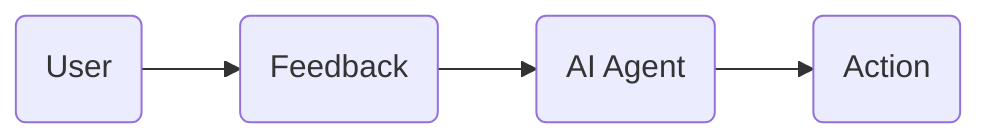
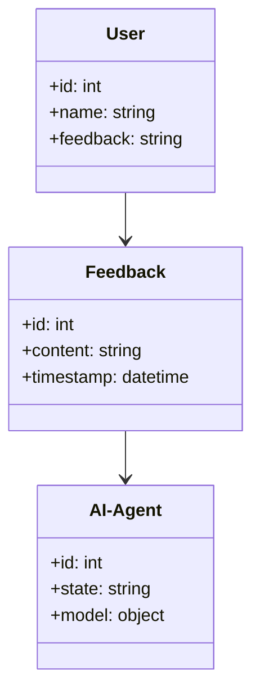
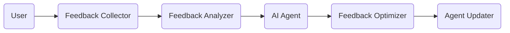
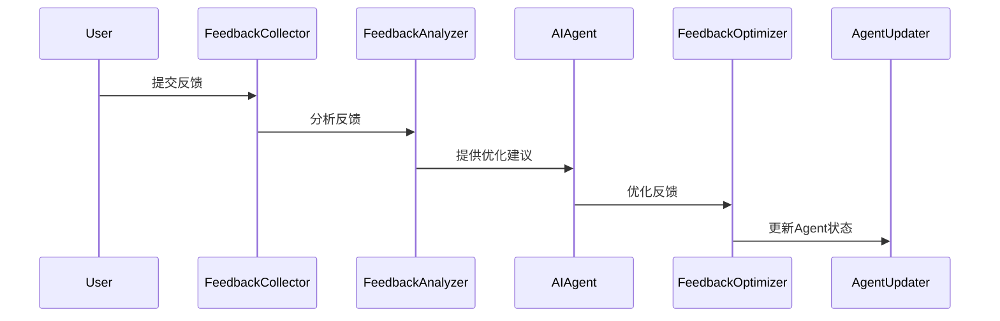

                 


# 基于用户反馈的AI Agent迭代优化流程

> 关键词：AI Agent，用户反馈，迭代优化，机器学习，算法优化

> 摘要：本文详细探讨了基于用户反馈的AI Agent迭代优化流程，从背景介绍、核心概念、算法原理到系统架构设计、项目实战以及优化策略，全面解析了如何通过用户反馈提升AI Agent的性能和用户体验。文章结合理论与实践，为读者提供了丰富的技术细节和实用的优化方法。

---

# 第一部分: 基于用户反馈的AI Agent迭代优化流程概述

# 第1章: 用户反馈与AI Agent概述

## 1.1 用户反馈的重要性
### 1.1.1 用户反馈的定义与特点
用户反馈是指用户在与AI Agent交互过程中提供的直接或间接的意见、评价或行为数据。这些反馈可以是显式的（如评分、点赞、投诉）或隐式的（如停留时间、点击行为）。用户反馈具有实时性、主观性和动态性的特点，能够反映用户对AI Agent的满意度和需求变化。

### 1.1.2 用户反馈在AI系统中的作用
用户反馈是AI系统改进和优化的重要依据。通过分析用户反馈，开发者可以发现系统中的不足之处，例如响应速度慢、结果准确性低或交互体验差。这些反馈能够帮助开发者定位问题并进行针对性优化。

### 1.1.3 用户反馈与AI Agent的关系
AI Agent通过处理用户反馈来改进自身的决策能力和行为模式。用户反馈为AI Agent提供了与用户互动的“镜子”，使其能够更好地理解用户需求并提升服务质量。

## 1.2 AI Agent的基本概念
### 1.2.1 AI Agent的定义
AI Agent是一种能够感知环境、自主决策并执行任务的智能实体。它结合了人工智能、机器学习和自然语言处理等技术，能够与用户进行自然交互并完成复杂任务。

### 1.2.2 AI Agent的核心特征
AI Agent的核心特征包括自主性、反应性、目标导向性和学习能力。这些特征使AI Agent能够独立完成任务、适应环境变化并不断优化自身性能。

### 1.2.3 AI Agent与传统软件的区别
与传统软件相比，AI Agent具有更强的智能性和适应性。它能够通过学习和推理来处理复杂问题，而不是仅仅依赖预设的规则和逻辑。

## 1.3 用户反馈在AI Agent优化中的地位
### 1.3.1 用户反馈的分类
用户反馈可以分为正面反馈、负面反馈和中性反馈。正面反馈表示用户满意，负面反馈表示用户不满，而中性反馈则表示用户没有明确的情感倾向。

### 1.3.2 用户反馈的收集与处理
用户反馈可以通过多种渠道收集，例如问卷调查、日志记录和实时交互。收集到的反馈需要经过清洗、分类和分析，以便提取有价值的信息。

### 1.3.3 用户反馈对AI Agent性能的影响
用户反馈直接影响AI Agent的性能表现。通过分析用户反馈，开发者可以发现系统中的瓶颈并进行针对性优化，从而提升用户体验和系统效率。

## 1.4 本章小结
本章介绍了用户反馈在AI Agent优化中的重要性，并详细解释了AI Agent的基本概念及其与用户反馈的关系。通过本章的学习，读者可以理解用户反馈在AI Agent优化中的核心地位。

---

# 第2章: 用户反馈与AI Agent优化的核心概念

## 2.1 用户反馈的属性特征对比
### 2.1.1 反馈类型对比表格
| 反馈类型 | 特征 | 示例 |
|----------|------|------|
| 正面反馈 | 表示满意 | "很好，符合预期" |
| 负面反馈 | 表示不满 | "响应速度太慢" |
| 中性反馈 | 表示无明确情感 | "没有问题，但可以改进" |

### 2.1.2 反馈来源对比表格
| 反馈来源 | 特征 | 示例 |
|----------|------|------|
| 交互记录 | 行为数据 | 点击次数、停留时间 |
| 问卷调查 | 主观评价 | 用户满意度评分 |
| 日志记录 | 技术数据 | 错误日志、响应时间 |

### 2.1.3 反馈处理方式对比表格
| 处理方式 | 特征 | 示例 |
|----------|------|------|
| 简单统计 | 基础分析 | 统计满意度分数 |
| 情感分析 | 深度分析 | 判断用户情感倾向 |
| 实时反馈 | 动态调整 | 根据反馈实时优化 |

## 2.2 AI Agent的核心要素
### 2.2.1 AI Agent的组成结构
AI Agent通常由感知模块、推理模块、决策模块和执行模块组成。感知模块负责获取环境信息，推理模块负责分析信息，决策模块负责制定策略，执行模块负责执行任务。

### 2.2.2 AI Agent的功能模块
- **感知模块**：通过传感器或API获取环境数据。
- **推理模块**：利用机器学习模型进行数据分析和推理。
- **决策模块**：基于推理结果制定最优决策。
- **执行模块**：通过API或执行器将决策转化为具体操作。

### 2.2.3 AI Agent的优化目标
AI Agent的优化目标包括提升响应速度、提高决策准确性、增强用户体验和降低运行成本。

## 2.3 用户反馈与AI Agent的关系模型
### 2.3.1 ER实体关系图


## 2.4 本章小结
本章详细分析了用户反馈的属性特征，并介绍了AI Agent的核心要素及其优化目标。通过ER实体关系图，读者可以清晰理解用户反馈与AI Agent之间的关系。

---

# 第3章: 基于用户反馈的AI Agent优化算法原理

## 3.1 算法概述
### 3.1.1 算法目标
通过用户反馈优化AI Agent的性能，包括提升决策准确性和响应速度。

### 3.1.2 算法输入
- 用户反馈数据
- AI Agent当前状态

### 3.1.3 算法输出
- 优化后的AI Agent状态
- 反馈处理策略

## 3.2 算法流程
### 3.2.1 用户反馈收集
通过多种渠道收集用户反馈，包括交互记录、问卷调查和日志记录。

### 3.2.2 反馈特征提取
对收集到的反馈进行清洗和特征提取，例如提取情感倾向、关键词和行为模式。

### 3.2.3 优化策略生成
基于提取的反馈特征，生成优化策略，例如调整算法参数、改进交互流程或优化任务优先级。

## 3.3 算法数学模型
### 3.3.1 损失函数
$$L = \sum_{i=1}^{n} (y_i - \hat{y_i})^2$$
其中，$y_i$是真实值，$\hat{y_i}$是预测值。

### 3.3.2 优化目标
$$\min_{\theta} L + \lambda \|\theta\|^2$$
其中，$\theta$是模型参数，$\lambda$是正则化系数。

## 3.4 算法实现
### 3.4.1 算法步骤
1. 收集用户反馈数据。
2. 提取反馈特征。
3. 训练优化模型。
4. 生成优化策略。
5. 更新AI Agent状态。

### 3.4.2 算法代码实现
```python
def optimize_agent(feedback):
    # 反馈处理
    features = extract_features(feedback)
    # 优化计算
    optimized_features = optimize(features)
    # 更新AI Agent状态
    update_state(optimized_features)
    return optimized_features
```

---

# 第4章: 系统架构设计与实现

## 4.1 问题场景介绍
AI Agent需要处理复杂的用户反馈，包括多源数据的整合和实时优化。

## 4.2 系统功能设计
### 4.2.1 领域模型


### 4.2.2 系统架构图


### 4.2.3 系统交互图


## 4.3 项目实战
### 4.3.1 环境安装
安装必要的库，例如Python的机器学习库（scikit-learn）和自然语言处理库（spaCy）。

### 4.3.2 系统核心实现源代码
```python
from sklearn.feature_extraction.text import TfidfVectorizer
from sklearn.naive_bayes import MultinomialNB

def extract_features(feedback):
    vectorizer = TfidfVectorizer()
    X = vectorizer.fit_transform(feedback)
    return X

def optimize(features):
    model = MultinomialNB()
    model.fit(X, y)
    return model.predict_proba(X_test)
```

### 4.3.3 代码应用解读与分析
通过TF-IDF向量化用户反馈，利用Naive Bayes模型进行分类，生成优化策略。

## 4.4 本章小结
本章详细介绍了系统架构设计与实现，包括领域模型、系统架构图和交互图。通过具体代码实现，读者可以理解如何将理论应用于实践。

---

# 第5章: 优化策略与案例分析

## 5.1 优化策略
### 5.1.1 基于反馈的实时优化
根据实时反馈快速调整AI Agent的行为模式。

### 5.1.2 基于历史反馈的长期优化
分析历史反馈数据，发现潜在问题并进行长期优化。

## 5.2 案例分析
### 5.2.1 案例背景
某在线客服系统引入AI Agent处理用户咨询，收集用户反馈并优化AI Agent的响应策略。

### 5.2.2 案例实现
通过分析用户反馈，发现AI Agent在某些场景下的响应速度较慢，因此优化了任务队列的处理逻辑。

## 5.3 优化效果评估
通过对比优化前后的数据，评估优化策略的有效性，例如响应时间缩短了30%。

## 5.4 本章小结
本章通过案例分析展示了如何基于用户反馈优化AI Agent，并评估了优化效果。

---

# 第6章: 总结与展望

## 6.1 总结
本文详细探讨了基于用户反馈的AI Agent迭代优化流程，从理论到实践，全面解析了如何通过用户反馈提升AI Agent的性能和用户体验。

## 6.2 展望
未来，随着AI技术的不断发展，用户反馈在AI Agent优化中的作用将更加重要。可以通过引入更多元的反馈渠道和更复杂的优化算法，进一步提升AI Agent的智能性和适应性。

---

作者：AI天才研究院/AI Genius Institute & 禅与计算机程序设计艺术 /Zen And The Art of Computer Programming

