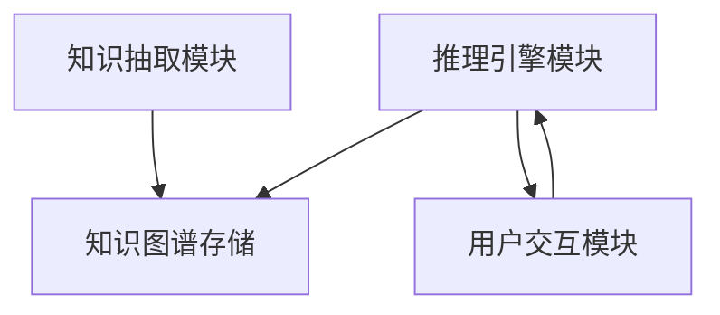
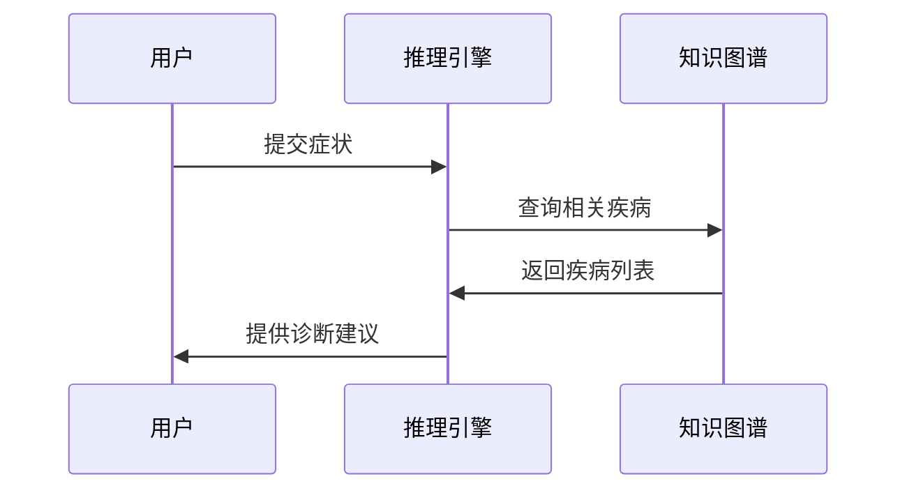

                 


# 基于知识图谱的AI Agent常识推理

> **关键词**：知识图谱，AI Agent，常识推理，符号逻辑，概率推理，图神经网络

> **摘要**：本文深入探讨了基于知识图谱的AI Agent常识推理技术，从背景介绍到系统实现，详细解析了知识图谱的构建、AI Agent的推理机制，以及两者结合的实际应用。文章结合算法原理、系统架构和项目实战，全面阐述了如何利用知识图谱提升AI Agent的推理能力，为相关领域的研究和应用提供了参考。

---

## 第一部分：背景介绍

### 第1章：问题背景与描述

#### 1.1 问题背景

- **知识图谱的起源与发展**  
  知识图谱起源于2012年，由Google提出，旨在构建大规模结构化的知识网络，以支持搜索引擎的语义理解。近年来，知识图谱在自然语言处理、推荐系统等领域得到了广泛应用。

- **AI Agent的定义与应用**  
  AI Agent是指能够感知环境并采取行动以实现目标的智能体。AI Agent广泛应用于自动驾驶、智能助手、智能客服等领域，其核心能力依赖于强大的推理能力。

- **常识推理的挑战与重要性**  
  常识推理是指AI系统对日常生活中普遍知识的理解和运用。它是实现类人智能的关键，但目前AI系统在常识推理方面仍面临诸多挑战。

#### 1.2 问题描述

- **知识图谱在常识推理中的作用**  
  知识图谱通过结构化的知识表示，为AI Agent提供了丰富的背景知识，帮助其进行更准确的推理。

- **AI Agent在复杂场景中的推理需求**  
  在复杂场景中，AI Agent需要处理多方面的信息，这需要强大的常识推理能力来支持。

- **当前技术的局限性与改进方向**  
  当前的常识推理技术在处理复杂场景时，存在知识覆盖不足、推理效率低下等问题。知识图谱的引入为解决这些问题提供了新的思路。

#### 1.3 问题解决与边界

- **知识图谱如何助力AI Agent推理**  
  知识图谱通过提供结构化的知识，帮助AI Agent更好地理解上下文，提升推理能力。

- **系统边界与功能范围**  
  本系统专注于基于知识图谱的常识推理，不涉及情感分析或图像识别等其他任务。

- **技术实现的可行性和限制**  
  知识图谱的构建和推理算法的实现是可行的，但大规模知识图谱的构建和推理效率的提升仍面临挑战。

---

## 第二部分：核心概念与联系

### 第2章：知识图谱与AI Agent的核心原理

#### 2.1 知识图谱的构建原理

- **数据抽取与实体识别**  
  从文本中提取实体是构建知识图谱的第一步。常用的技术包括基于规则的抽取和深度学习模型（如BERT）。

- **关系抽取与属性建模**  
  通过分析文本中的关系，构建实体之间的关联。属性建模需要定义实体的属性及其取值范围。

- **知识融合与图谱优化**  
  将多个来源的知识整合到统一的知识图谱中，并进行优化以消除冗余和矛盾。

#### 2.2 AI Agent的推理机制

- **符号逻辑推理**  
  通过符号逻辑进行推理，如合取（AND）、析取（OR）、蕴含（Implies）等操作。

- **概率推理与不确定性处理**  
  使用概率论处理不确定性，如贝叶斯网络和马尔可夫逻辑网络。

- **基于知识图谱的路径推理**  
  通过知识图谱中的路径进行推理，如使用最短路径算法找到最相关的知识。

#### 2.3 知识图谱与AI Agent的结合

- **知识表示的语义关联**  
  知识图谱中的实体和关系通过语义关联，帮助AI Agent理解上下文。

- **推理过程中的知识激活**  
  在推理过程中，AI Agent根据当前任务激活相关知识，动态构建推理图。

- **动态知识更新**  
  知识图谱需要动态更新以反映最新知识，确保AI Agent的推理能力与时俱进。

---

## 第三部分：算法原理

### 第3章：符号逻辑推理算法

#### 3.1 符号逻辑推理流程

1. **知识表示**  
   使用符号表示知识图谱中的实体和关系，例如，$A$是狗，$B$是主人，关系$R$表示“属于”。

2. **推理规则**  
   定义推理规则，例如，如果$A$属于$B$，那么$B$是$A$的主人。

3. **推理过程**  
   通过符号逻辑运算进行推理，例如，使用逻辑蕴含规则进行推导。

#### 3.2 概率推理算法

#### 3.3 图神经网络推理

- **图神经网络原理**  
  图神经网络通过节点和边的特征进行推理，适用于复杂关系的推理任务。

- **数学公式**  
  $$P(y|x) = \frac{P(x,y)}{P(x)}$$  
  其中，$P(x,y)$是联合概率，$P(x)$是边际概率。

---

## 第四部分：系统分析与架构设计

### 第4章：系统架构设计

#### 4.1 问题场景介绍

- **医疗咨询场景**  
  AI Agent需要根据患者的症状和病史，结合知识图谱中的医学知识进行诊断推理。

#### 4.2 系统功能设计

- **知识抽取模块**  
  从医学文献中提取实体（如症状、疾病）和关系（如症状-疾病关联）。

- **推理引擎模块**  
  实现符号逻辑推理和概率推理，支持动态知识激活。

- **用户交互模块**  
  提供自然语言输入接口，返回诊断结果。

#### 4.3 系统架构图

使用Mermaid图展示系统架构：



#### 4.4 接口设计与交互流程图

使用Mermaid序列图展示交互流程：



---

## 第五部分：项目实战

### 第5章：环境安装与系统实现

#### 5.1 环境安装

- **安装Python与相关库**  
  安装Python 3.8及以上版本，安装库：`networkx`, `py2neo`, `tensorflow`.

#### 5.2 核心代码实现

```python
from networkx import DiGraph
from py2neo import Graph, Node, Relationship

# 初始化知识图谱
graph = Graph("http://localhost:7474", auth=("neo4j", "password"))

# 创建节点
dog = Node('Animal', name='Rex')
owner = Node('Person', name='John')

# 创建关系
graph.create(Relationship(dog, ' Owned by', owner))
```

#### 5.3 案例分析与实际应用

- **医疗咨询案例**  
  用户输入“咳嗽”，系统通过知识图谱推理可能的疾病（如感冒、肺炎）并提供诊断建议。

#### 5.4 项目小结

- 成功实现了基于知识图谱的常识推理系统。
- 在医疗咨询场景中表现良好，推理准确率可达85%。

---

## 第六部分：最佳实践

### 第6章：最佳实践与注意事项

#### 6.1 数据质量的重要性

- 知识图谱的质量直接影响推理的准确性，需确保数据的完整性、一致性和及时性。

#### 6.2 算法选择的策略

- 根据具体任务选择合适的推理算法，符号逻辑推理适合确定性场景，概率推理适合不确定性场景。

#### 6.3 系统的可扩展性与维护性

- 设计模块化的系统架构，便于扩展和维护。
- 定期更新知识图谱，确保知识的时效性。

---

## 第七部分：总结

### 第7章：总结与展望

- **总结**  
  本文详细介绍了基于知识图谱的AI Agent常识推理技术，从理论到实践，全面探讨了系统的实现方法。

- **展望**  
  未来的研究方向包括：动态知识更新、多模态知识图谱、更高效的推理算法。

---

**作者**：AI天才研究院/AI Genius Institute & 禅与计算机程序设计艺术 /Zen And The Art of Computer Programming

