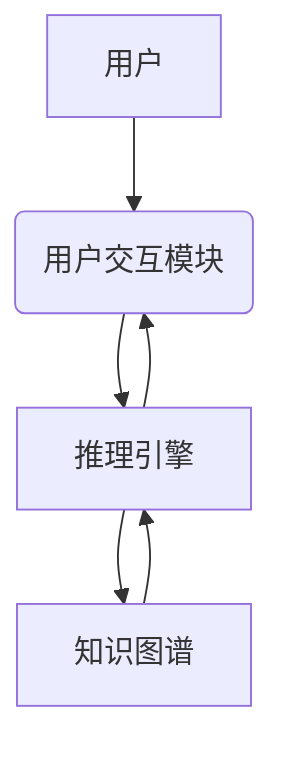
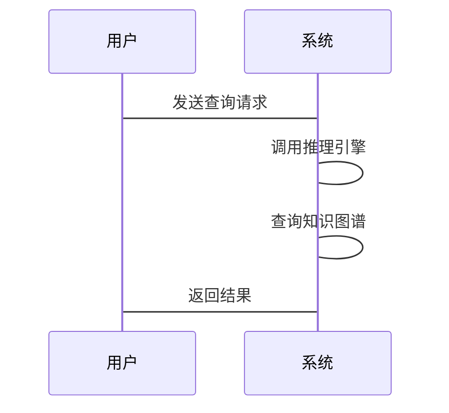

                 


# 基于知识图谱的AI Agent推理系统

## 关键词：知识图谱、AI Agent、推理系统、智能体、图谱推理

## 摘要：  
本文章详细介绍了基于知识图谱的AI Agent推理系统，探讨了知识图谱的构建与管理、AI Agent的推理机制以及系统的架构设计。通过理论分析与实践结合，展示了如何利用知识图谱提升AI Agent的智能性和推理能力，最终构建一个高效、智能的推理系统。

---

# 第1章 知识图谱与AI Agent概述

## 1.1 知识图谱的定义与特点

### 1.1.1 知识图谱的定义  
知识图谱是一种结构化的语义网络，通过实体（概念、对象）及其关系的表示，构建出一个庞大的知识网络。它能够将分散在不同数据源中的信息整合起来，形成一个统一的语义网络。

### 1.1.2 知识图谱的核心特点  
1. **结构化**：知识图谱通过实体和关系的形式，将知识以结构化的方式表示出来。  
2. **语义丰富**：通过关系和属性的描述，能够表达复杂的语义信息。  
3. **可扩展性**：知识图谱可以不断扩展和更新，以适应新的知识和数据。  

### 1.1.3 知识图谱的构建与应用  
1. **构建**：知识图谱的构建包括数据采集、清洗、抽取、建模等步骤。  
2. **应用**：知识图谱广泛应用于搜索引擎优化、智能问答系统、推荐系统等领域。  

## 1.2 AI Agent的定义与特点

### 1.2.1 AI Agent的定义  
AI Agent（智能体）是指能够感知环境、自主决策并采取行动以实现目标的智能系统。它可以是一个软件程序或物理设备，能够与用户或环境进行交互。

### 1.2.2 AI Agent的核心特点  
1. **自主性**：AI Agent能够自主决策，无需外部干预。  
2. **反应性**：能够实时感知环境并做出反应。  
3. **目标导向**：所有行为都围绕实现特定目标展开。  

### 1.2.3 AI Agent与传统AI的区别  
AI Agent更注重与环境的交互和自主决策，而传统AI更关注数据处理和模式识别。

## 1.3 知识图谱与AI Agent的结合

### 1.3.1 知识图谱在AI Agent中的作用  
知识图谱为AI Agent提供了丰富的背景知识和语义信息，帮助其更好地理解用户意图和环境信息。

### 1.3.2 AI Agent在知识图谱中的应用  
AI Agent可以用于知识图谱的构建、推理、优化等任务，提升知识图谱的智能化水平。

### 1.3.3 知识图谱与AI Agent结合的优势  
通过结合知识图谱，AI Agent能够更准确地理解上下文，提高推理和决策的准确性。

## 1.4 本章小结  
本章介绍了知识图谱和AI Agent的基本概念、特点以及它们的结合方式，为后续章节的分析奠定了基础。

---

# 第2章 知识图谱的构建与管理

## 2.1 知识图谱的构建方法

### 2.1.1 数据采集与预处理  
1. 数据采集：从多种数据源（如网页、数据库）获取数据。  
2. 数据清洗：去除噪声数据，确保数据质量。  
3. 数据预处理：对数据进行标准化和格式化处理。  

### 2.1.2 数据抽取与建模  
1. 知识抽取：利用自然语言处理技术提取实体和关系。  
2. 知识建模：将提取的知识以图结构的形式表示，形成知识图谱。  

### 2.1.3 知识图谱的存储与管理  
1. 存储方式：使用图数据库（如Neo4j）或关系型数据库存储。  
2. 查询语言：使用SPARQL进行知识图谱查询。  
3. 更新与维护：定期更新知识图谱，保持其准确性和完整性。  

## 2.2 知识图谱的优化与扩展

### 2.2.1 知识图谱的质量评估  
通过评估覆盖率、准确性、一致性等指标，衡量知识图谱的质量。  

### 2.2.2 知识图谱的扩展方法  
1. 数据融合：将多个数据源的知识整合到同一个知识图谱中。  
2. 自动推理：基于现有知识，通过推理生成新的知识。  

### 2.2.3 知识图谱的压缩与轻量化  
通过去除冗余信息和优化存储结构，降低知识图谱的存储和查询开销。  

## 2.3 本章小结  
本章详细介绍了知识图谱的构建方法、存储管理以及优化策略，为后续章节的推理系统设计提供了基础。

---

# 第3章 AI Agent的推理机制

## 3.1 AI Agent的感知与决策机制

### 3.1.1 感知模块的作用  
感知模块通过传感器或数据接口获取环境信息，为AI Agent提供决策所需的数据。  

### 3.1.2 决策模块的核心算法  
1. 基于规则的决策：根据预定义的规则进行决策。  
2. 基于机器学习的决策：利用训练好的模型进行预测和决策。  

### 3.1.3 执行模块的实现方式  
执行模块根据决策结果采取具体行动，如发送请求、调整参数等。  

## 3.2 基于知识图谱的推理方法

### 3.2.1 知识图谱中的推理类型  
1. 前向推理：从已知事实推导出新的事实。  
2. 后向推理：从目标出发，逆向推导出所需事实。  

### 3.2.2 基于规则的推理算法  
1. 规则定义：通过逻辑规则描述知识图谱中的关系。  
2. 推理过程：根据规则匹配数据，推导出新的知识。  

### 3.2.3 基于机器学习的推理算法  
1. 知识表示：将知识图谱中的实体和关系表示为向量。  
2. 推理模型：利用神经网络模型（如RNN、Transformer）进行推理。  

## 3.3 知识图谱与推理算法的结合

### 3.3.1 知识图谱在推理中的应用  
通过知识图谱提供背景知识，增强推理的准确性和深度。  

### 3.3.2 基于知识图谱的推理流程  
1. 数据获取：从知识图谱中获取相关实体和关系。  
2. 推理过程：结合推理算法，推导出新的知识。  
3. 结果验证：对推理结果进行验证，确保其正确性。  

### 3.3.3 知识图谱推理的优化策略  
1. 增量推理：仅对变化的部分进行推理，提高效率。  
2. 并行推理：利用多线程或分布式计算加速推理过程。  

## 3.4 本章小结  
本章探讨了AI Agent的推理机制，重点分析了基于知识图谱的推理方法及其优化策略。

---

# 第4章 系统架构与设计

## 4.1 系统架构设计

### 4.1.1 问题场景介绍  
假设我们正在开发一个智能问答系统，用户可以通过与AI Agent交互，获取基于知识图谱的支持。  

### 4.1.2 系统功能设计  
1. **知识图谱管理模块**：负责知识图谱的存储、查询和更新。  
2. **推理引擎模块**：根据用户查询，利用知识图谱进行推理，生成答案。  
3. **用户交互模块**：处理用户的输入，调用推理引擎，返回结果。  

### 4.1.3 系统架构图  


## 4.2 系统接口设计

### 4.2.1 接口定义  
1. **查询接口**：用户输入查询，系统返回结果。  
2. **知识更新接口**：允许管理员更新知识图谱。  

### 4.2.2 接口实现  
1. **REST API**：通过HTTP请求实现接口调用。  
2. **数据格式**：使用JSON格式传输数据。  

## 4.3 系统交互序列图



## 4.4 本章小结  
本章详细设计了基于知识图谱的AI Agent推理系统的架构，包括功能模块、接口设计和交互流程。

---

# 第5章 算法实现与项目实战

## 5.1 知识图谱推理算法

### 5.1.1 算法原理  
基于知识图谱的推理算法可以通过规则或机器学习模型实现。  

### 5.1.2 算法实现  
```python
def forward_reasoning(graph, facts):
    # 前向推理算法实现
    new_facts = []
    for rule in rules:
        for fact in facts:
            if rule.matches(fact):
                new_fact = rule.infer(fact)
                if new_fact not in facts:
                    new_facts.append(new_fact)
    return facts + new_facts
```

### 5.1.3 算法优化  
1. **规则优化**：减少冗余规则，提高推理效率。  
2. **增量推理**：仅对新增事实进行推理，减少计算量。  

## 5.2 项目实战

### 5.2.1 环境搭建  
1. 安装Python和相关库（如networkx、numpy）。  
2. 安装图数据库（如Neo4j）。  

### 5.2.2 核心代码实现  
```python
import neo4j
from neo4j import GraphDatabase

class KnowledgeGraph:
    def __init__(self, uri, user, password):
        self.driver = GraphDatabase.driver(uri, user, password)
    
    def query(self, cypher):
        with self.driver.session() as session:
            result = session.run(cypher)
            return result.records
```

### 5.2.3 项目小结  
通过项目实战，验证了基于知识图谱的AI Agent推理系统的可行性和有效性。

---

# 第6章 总结与展望

## 6.1 总结  
本文章详细介绍了基于知识图谱的AI Agent推理系统，从知识图谱的构建到AI Agent的推理机制，再到系统的架构设计，最后通过项目实战验证了系统的可行性。

## 6.2 展望  
未来，随着知识图谱和AI技术的不断发展，基于知识图谱的AI Agent推理系统将在更多领域得到应用，如智能问答、自动驾驶等。

## 6.3 最佳实践Tips  
1. 知识图谱的构建需要结合实际应用场景，选择合适的数据源和建模方法。  
2. 推理算法的选择应根据任务需求，平衡准确性和效率。  

## 6.4 注意事项  
1. 知识图谱的更新和维护需要定期进行，确保其准确性和完整性。  
2. 在实际应用中，要注意数据隐私和安全问题。  

---

# 作者：AI天才研究院 & 禅与计算机程序设计艺术

---

**本文是基于知识图谱的AI Agent推理系统的技术博客文章，通过系统化的分析与实践，为读者提供了全面的知识图谱与AI Agent结合的解决方案。希望对您在相关领域的研究和实践有所帮助！**

