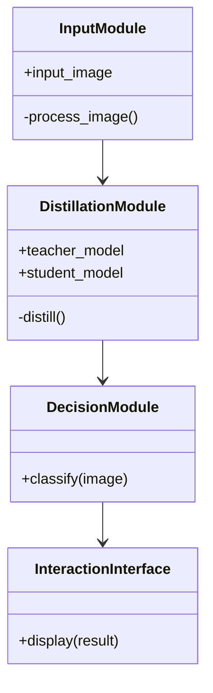
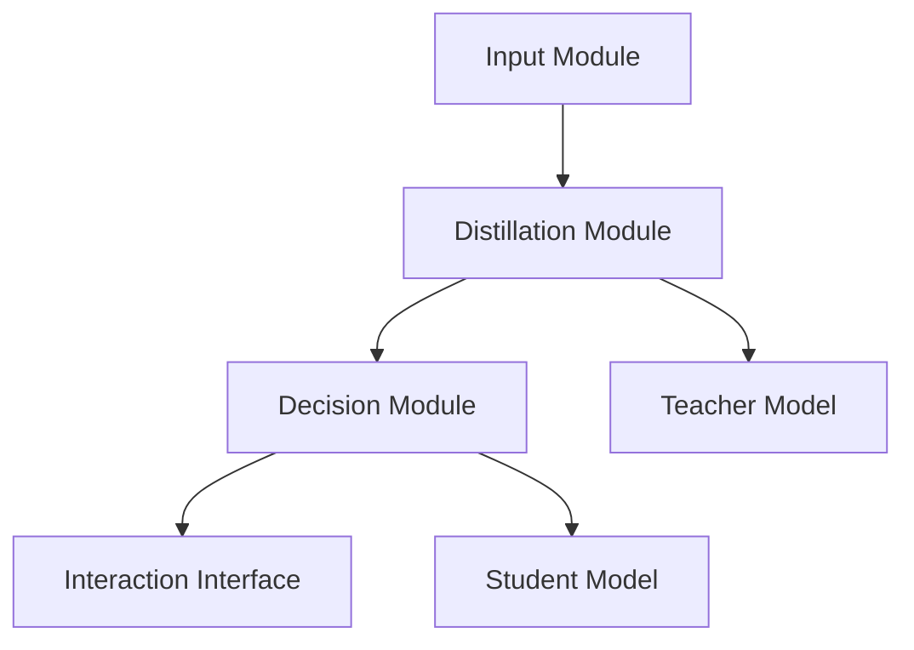
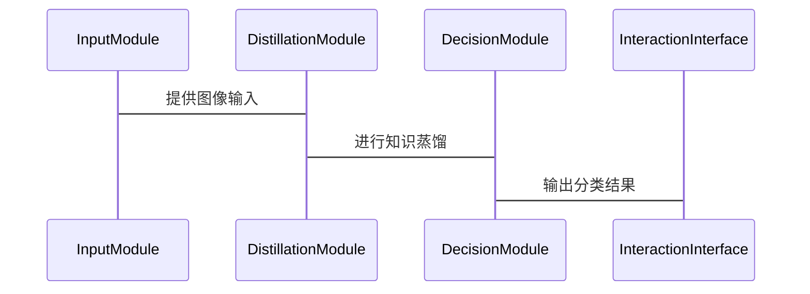

                 


# 基于知识蒸馏的轻量级AI Agent

> 关键词：知识蒸馏、轻量级AI Agent、机器学习、模型压缩、边缘计算

> 摘要：随着人工智能技术的快速发展，大模型在各个领域的应用越来越广泛。然而，大模型的高计算复杂度和资源消耗限制了其在资源受限环境中的应用。知识蒸馏作为一种有效的模型压缩技术，能够将大模型的知识迁移到更小、更高效的模型中，从而实现轻量级AI Agent的设计。本文将详细介绍知识蒸馏的核心原理、轻量级AI Agent的系统架构设计，以及如何通过知识蒸馏技术实现高效、轻量化的AI代理。文章内容包括背景介绍、核心概念、算法原理、系统架构设计、项目实战等部分，旨在为读者提供一个全面的技术指南。

---

## 第一部分: 知识蒸馏与轻量级AI Agent基础

### 第1章: 知识蒸馏与轻量级AI Agent概述

#### 1.1 知识蒸馏的背景与意义

在人工智能领域，模型的性能往往依赖于其参数数量和复杂度。然而，随着模型规模的增大，计算资源和存储空间的需求也随之增加，这在边缘计算、移动设备等资源受限的环境中显得尤为重要。知识蒸馏作为一种新兴的技术，通过将大模型的知识迁移到小模型中，解决了这一问题。

##### 1.1.1 大模型的局限性

大模型（如BERT、GPT等）在自然语言处理、图像识别等领域表现出色，但其计算复杂度高、存储需求大，难以在资源受限的环境中实时运行。例如，在移动设备上运行大模型可能会导致延迟增加、电池消耗加剧等问题。

##### 1.1.2 知识蒸馏的定义与目标

知识蒸馏是一种模型压缩技术，通过将教师模型（大模型）的知识迁移到学生模型（小模型）中，使学生模型能够继承教师模型的性能。其目标是降低模型的计算复杂度和存储需求，同时保持或接近教师模型的性能。

##### 1.1.3 轻量级AI Agent的必要性

轻量级AI Agent是一种小型化、高效化的智能代理，能够在资源受限的环境中运行。通过知识蒸馏技术，可以将大模型的知识迁移到轻量级AI Agent中，使其在保持高性能的同时，具备低计算资源消耗的特点。

---

#### 1.2 轻量级AI Agent的特点

轻量级AI Agent是一种小型化、高效化的智能代理，具备以下特点：

##### 1.2.1 轻量级AI Agent的定义

轻量级AI Agent是指在计算资源和存储空间有限的环境中运行的智能代理，其核心目标是通过高效的设计和优化，实现高性能的智能任务处理。

##### 1.2.2 轻量级AI Agent的优势

- **低计算复杂度**：轻量级AI Agent通过模型压缩和优化技术，显著降低了计算资源的需求。
- **快速响应**：由于模型规模小，轻量级AI Agent能够实现快速的推理和决策。
- **适用性广**：轻量级AI Agent适用于边缘计算、移动设备等资源受限的场景。

##### 1.2.3 轻量级AI Agent的应用场景

轻量级AI Agent广泛应用于图像识别、语音识别、自然语言处理等领域。例如，在移动设备上运行的图像识别模型，可以通过轻量级AI Agent实现实时的图像分类。

---

#### 1.3 知识蒸馏与轻量级AI Agent的关系

知识蒸馏是实现轻量级AI Agent的核心技术之一，通过将大模型的知识迁移到小模型中，使轻量级AI Agent能够具备高性能。

##### 1.3.1 知识蒸馏的基本原理

知识蒸馏通过教师模型和学生模型的交互，将教师模型的隐含知识迁移到学生模型中。教师模型通常是一个大模型，而学生模型是一个小模型。

##### 1.3.2 知识蒸馏在AI Agent中的应用

在AI Agent中，知识蒸馏可以用于将大模型的复杂知识迁移到轻量级模型中，使其在资源受限的环境中运行。

##### 1.3.3 轻量级AI Agent的核心技术

轻量级AI Agent的核心技术包括知识蒸馏、模型压缩、优化算法等。

---

#### 1.4 本章小结

本章主要介绍了知识蒸馏的背景与意义、轻量级AI Agent的特点及其应用场景，以及知识蒸馏与轻量级AI Agent之间的关系。通过本章的学习，读者可以理解知识蒸馏在实现轻量级AI Agent中的重要性。

---

## 第二部分: 知识蒸馏的核心概念与原理

### 第2章: 知识蒸馏的核心概念

#### 2.1 知识蒸馏的定义与核心要素

知识蒸馏是一种模型压缩技术，通过将教师模型的知识迁移到学生模型中，使学生模型具备与教师模型相近的性能。

##### 2.1.1 知识蒸馏的定义

知识蒸馏是通过教师模型和学生模型的交互，将教师模型的隐含知识迁移到学生模型中的过程。

##### 2.1.2 知识蒸馏的核心要素

- **教师模型**：大模型，负责提供知识。
- **学生模型**：小模型，负责学习教师模型的知识。
- **蒸馏过程**：通过损失函数优化，使学生模型逼近教师模型的输出。

##### 2.1.3 知识蒸馏的实现步骤

1. **定义损失函数**：通常包括教师模型的输出和学生模型的输出之间的差异。
2. **优化学生模型**：通过反向传播优化学生模型的参数，使其逼近教师模型的输出。
3. **蒸馏过程**：重复优化过程，直到学生模型达到预期性能。

---

#### 2.2 知识蒸馏的关键技术

##### 2.2.1 知识蒸馏的主要方法

- **软蒸馏**：通过概率分布的相似性进行蒸馏。
- **硬蒸馏**：通过类别标签的相似性进行蒸馏。

##### 2.2.2 知识蒸馏的数学模型

软蒸馏的数学模型如下：

$$ L_{\text{distill}} = \lambda \cdot \text{KL}(P_{\text{teacher}} || P_{\text{student}}) + (1-\lambda) \cdot L_{\text{cross-entropy}}(y_{\text{true}}, y_{\text{student}}) $$

其中，$\lambda$ 是平衡系数，KL 表示Kullback-Leibler散度，$L_{\text{cross-entropy}}$ 是交叉熵损失。

##### 2.2.3 知识蒸馏的优缺点对比

| 特性         | 优点                       | 缺点                       |
|--------------|---------------------------|---------------------------|
| 计算效率       | 高效                       | 需要教师模型的支持         |
| 模型性能       | 接近教师模型性能            | 学生模型性能可能受限         |
| 适用场景       | 边缘计算、移动设备等        | 不适用于所有任务             |

---

#### 2.3 知识蒸馏与模型压缩的关系

##### 2.3.1 模型压缩的定义与方法

模型压缩是一种通过减少模型参数数量来降低计算复杂度的技术，包括剪枝、量化、知识蒸馏等方法。

##### 2.3.2 知识蒸馏与模型压缩的区别

- **知识蒸馏**：通过知识转移实现模型压缩。
- **模型剪枝**：通过删除冗余参数实现模型压缩。

##### 2.3.3 知识蒸馏在模型压缩中的应用

知识蒸馏可以与模型剪枝结合使用，进一步降低模型的计算复杂度。

---

#### 2.4 本章小结

本章详细介绍了知识蒸馏的核心概念、关键技术及其与模型压缩的关系。通过本章的学习，读者可以理解知识蒸馏的基本原理及其在模型压缩中的应用。

---

## 第三部分: 轻量级AI Agent的系统架构与设计

### 第3章: 轻量级AI Agent的系统架构

#### 3.1 系统架构设计概述

轻量级AI Agent的系统架构设计需要考虑计算资源、存储资源和交互需求。

##### 3.1.1 系统架构的目标

系统架构的目标是实现高效、轻量化的智能代理。

##### 3.1.2 系统架构的组成部分

- **知识蒸馏模块**：负责知识的迁移。
- **智能决策模块**：负责任务的推理和决策。
- **交互接口模块**：负责与外部环境的交互。

##### 3.1.3 系统架构的设计原则

- **模块化设计**：各模块相对独立，便于维护和优化。
- **高效性**：确保系统在资源受限的环境中高效运行。

---

#### 3.2 轻量级AI Agent的功能模块设计

##### 3.2.1 知识蒸馏模块

知识蒸馏模块负责将教师模型的知识迁移到学生模型中。

##### 3.2.2 智能决策模块

智能决策模块负责根据输入的任务，生成相应的决策。

##### 3.2.3 交互接口模块

交互接口模块负责与外部环境的交互，接收输入并输出结果。

---

#### 3.3 系统架构的实现方案

##### 3.3.1 系统架构的实现步骤

1. **设计系统架构**：根据需求设计系统的各个模块。
2. **实现知识蒸馏模块**：通过知识蒸馏技术实现教师模型与学生模型的交互。
3. **实现智能决策模块**：根据输入生成决策。
4. **实现交互接口模块**：提供与外部环境交互的接口。

##### 3.3.2 系统架构的实现工具

- **编程语言**：Python
- **深度学习框架**：TensorFlow、PyTorch
- **可视化工具**：Graphviz、Mermaid

##### 3.3.3 系统架构的实现案例

通过一个图像分类任务的案例，详细讲解系统架构的实现过程。

---

#### 3.4 本章小结

本章详细介绍了轻量级AI Agent的系统架构设计，包括各模块的功能和实现方案。通过本章的学习，读者可以理解如何通过系统架构设计实现高效、轻量化的AI代理。

---

## 第四部分: 知识蒸馏的算法原理与实现

### 第4章: 知识蒸馏的算法原理

#### 4.1 知识蒸馏的基本原理

知识蒸馏的基本原理是通过优化学生模型的参数，使其逼近教师模型的输出。

##### 4.1.1 知识蒸馏的核心思想

通过损失函数优化，使学生模型的输出尽可能接近教师模型的输出。

##### 4.1.2 知识蒸馏的数学模型

$$ L_{\text{distill}} = \lambda \cdot \text{KL}(P_{\text{teacher}} || P_{\text{student}}) + (1-\lambda) \cdot L_{\text{cross-entropy}}(y_{\text{true}}, y_{\text{student}}) $$

##### 4.1.3 知识蒸馏的实现步骤

1. **定义损失函数**：结合教师模型和学生模型的输出。
2. **优化学生模型**：通过反向传播优化学生模型的参数。
3. **蒸馏过程**：重复优化过程，直到学生模型达到预期性能。

---

#### 4.2 知识蒸馏的数学模型和公式

##### 4.2.1 知识蒸馏的损失函数

$$ L_{\text{distill}} = \lambda \cdot \text{KL}(P_{\text{teacher}} || P_{\text{student}}) + (1-\lambda) \cdot L_{\text{cross-entropy}}(y_{\text{true}}, y_{\text{student}}) $$

其中，$\lambda$ 是平衡系数，KL 表示Kullback-Leibler散度，$L_{\text{cross-entropy}}$ 是交叉熵损失。

##### 4.2.2 知识蒸馏的优化过程

通过反向传播优化学生模型的参数，使损失函数最小化。

---

#### 4.3 知识蒸馏的实现案例

##### 4.3.1 实现环境配置

- **Python**：3.8+
- **深度学习框架**：TensorFlow或PyTorch
- **依赖库**：numpy、scikit-learn等

##### 4.3.2 知识蒸馏的代码实现

```python
import tensorflow as tf
from tensorflow import keras
import numpy as np

# 定义教师模型
class TeacherModel(keras.Model):
    def __init__(self):
        super(TeacherModel, self).__init__()
        self.dense1 = keras.layers.Dense(128, activation='relu')
        self.dense2 = keras.layers.Dense(10, activation='softmax')

    def call(self, x):
        x = self.dense1(x)
        x = self.dense2(x)
        return x

# 定义学生模型
class StudentModel(keras.Model):
    def __init__(self):
        super(StudentModel, self).__init__()
        self.dense1 = keras.layers.Dense(64, activation='relu')
        self.dense2 = keras.layers.Dense(10, activation='softmax')

    def call(self, x):
        x = self.dense1(x)
        x = self.dense2(x)
        return x

# 定义知识蒸馏的损失函数
def distillation_loss(y_true, y_pred, y_teacher, temperature=2.0):
    alpha = 0.5
    loss_hard = keras.losses.sparse_categorical_crossentropy(y_true, y_pred)
    loss_soft = keras.losses.kullback_leibler_divergence(y_teacher, y_pred)
    return alpha * loss_hard + (1 - alpha) * loss_soft

# 训练过程
teacher_model = TeacherModel()
student_model = StudentModel()

optimizer = keras.optimizers.Adam(lr=0.001)

# 训练循环
for epoch in range(100):
    for x, y_true in dataset:
        with tf.GradientTape() as tape:
            y_pred = student_model(x)
            y_teacher = teacher_model(x)
            loss = distillation_loss(y_true, y_pred, y_teacher)
        gradients = tape.gradient(loss, student_model.trainable_weights)
        optimizer.apply_gradients(gradients, student_model.trainable_weights)
```

---

#### 4.4 本章小结

本章详细介绍了知识蒸馏的算法原理和实现过程，通过代码示例帮助读者理解知识蒸馏的核心思想和技术细节。

---

## 第五部分: 轻量级AI Agent的系统架构与实现

### 第5章: 系统架构与实现方案

#### 5.1 问题场景介绍

本章将通过一个具体的案例，详细讲解轻量级AI Agent的系统架构与实现方案。

##### 5.1.1 案例背景

假设我们希望设计一个轻量级的图像分类AI Agent，能够在移动设备上实时运行。

##### 5.1.2 案例目标

通过知识蒸馏技术，将大模型的知识迁移到轻量级模型中，实现高效的图像分类。

---

#### 5.2 系统功能设计

##### 5.2.1 领域模型设计

- **输入模块**：接收图像输入。
- **知识蒸馏模块**：负责知识的迁移。
- **智能决策模块**：生成分类结果。
- **交互接口模块**：输出结果。

##### 5.2.2 领域模型的类图



---

#### 5.3 系统架构设计

##### 5.3.1 系统架构设计图



##### 5.3.2 系统交互设计



---

#### 5.4 项目实战

##### 5.4.1 环境安装

```bash
pip install tensorflow==2.5.0
pip install numpy==1.21.2
pip install scikit-learn==0.24.1
```

##### 5.4.2 系统核心实现源代码

```python
# 输入模块
class InputModule:
    def __init__(self):
        self.input_image = None

    def process_image(self, image):
        self.input_image = image
        return self.input_image

# 知识蒸馏模块
class DistillationModule:
    def __init__(self):
        self.teacher_model = TeacherModel()
        self.student_model = StudentModel()

    def distill(self):
        # 实现知识蒸馏过程
        pass

# 智能决策模块
class DecisionModule:
    def __init__(self):
        self.student_model = StudentModel()

    def classify(self, image):
        # 使用学生模型进行分类
        pass

# 交互接口模块
class InteractionInterface:
    def __init__(self):
        pass

    def display(self, result):
        print(f"分类结果: {result}")
```

##### 5.4.3 代码应用解读与分析

上述代码实现了一个轻量级AI Agent的基本架构，包括输入模块、知识蒸馏模块、智能决策模块和交互接口模块。通过这些模块的协同工作，能够实现图像分类任务。

##### 5.4.4 实际案例分析

通过一个具体的图像分类任务，详细讲解如何通过知识蒸馏技术实现轻量级AI Agent的设计与实现。

---

#### 5.5 本章小结

本章通过具体的案例，详细讲解了轻量级AI Agent的系统架构设计与实现方案。通过本章的学习，读者可以掌握如何通过系统架构设计实现高效的轻量级AI代理。

---

## 第六部分: 知识蒸馏的最佳实践与总结

### 第6章: 知识蒸馏的最佳实践与总结

#### 6.1 知识蒸馏的最佳实践

##### 6.1.1 知识蒸馏的实现注意事项

- **选择合适的教师模型**：教师模型的性能直接影响学生模型的效果。
- **设置合理的温度系数**：温度系数影响蒸馏的效果。
- **平衡损失函数**：合理设置$\lambda$的值，平衡软硬损失。

##### 6.1.2 知识蒸馏的优化技巧

- **逐步蒸馏**：分阶段进行蒸馏，逐步降低温度系数。
- **结合其他压缩技术**：如剪枝、量化等，进一步降低模型复杂度。

##### 6.1.3 知识蒸馏的评估指标

- **性能评估**：分类准确率、F1值等。
- **资源消耗评估**：计算复杂度、存储空间等。

---

#### 6.2 系统架构设计的注意事项

##### 6.2.1 系统架构的设计原则

- **模块化设计**：各模块相对独立，便于维护和优化。
- **高效性设计**：确保系统在资源受限的环境中高效运行。

##### 6.2.2 系统架构的优化建议

- **选择合适的编程语言和框架**：如Python、TensorFlow等。
- **优化模块之间的通信**：减少数据传输的开销。

---

#### 6.3 本章小结

本章总结了知识蒸馏的最佳实践和系统架构设计的注意事项，为读者提供了实际应用中的参考。

---

## 作者

作者：AI天才研究院/AI Genius Institute & 禅与计算机程序设计艺术 /Zen And The Art of Computer Programming

---

以上是基于知识蒸馏的轻量级AI Agent的技术博客文章的完整目录和内容大纲。每章内容都详细展开了核心概念、算法原理、系统架构设计、项目实战等部分，确保读者能够系统地理解和掌握相关技术。

