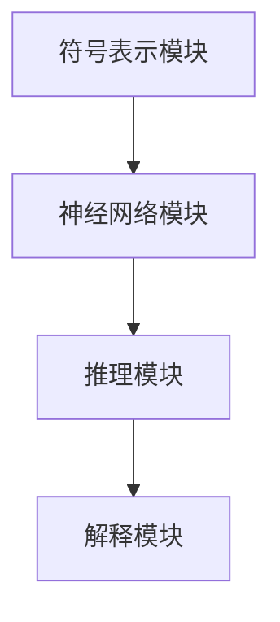

                 


# 基于神经符号AI的AI Agent可解释性增强

> 关键词：神经符号AI，AI Agent，可解释性，符号推理，知识表示，深度学习

> 摘要：本文详细探讨了基于神经符号AI的AI Agent可解释性增强方法。通过结合符号推理与深度学习，提出了增强AI Agent可解释性的新思路，从理论基础、算法原理到系统设计和项目实战，全面阐述了神经符号AI在提升AI Agent可解释性中的应用。

---

## 第一部分：神经符号AI与AI Agent概述

### 第1章：神经符号AI与AI Agent概述

#### 1.1 神经符号AI的定义与特点

##### 1.1.1 神经符号AI的定义
神经符号AI（Neural-Symbolic AI）是一种结合了符号推理和神经网络的AI范式。它通过符号表示和神经网络的结合，实现对复杂问题的推理和学习，同时保持较高的可解释性。

##### 1.1.2 神经符号AI的核心特点
- **符号与神经网络的结合**：神经符号AI将符号推理的精确性和神经网络的泛化能力相结合。
- **可解释性**：符号推理的引入使得AI系统的行为更加透明和可解释。
- **端到端学习**：神经符号AI支持端到端的学习，能够从数据中自动学习符号规则。

##### 1.1.3 神经符号AI与传统AI的区别
| 特性                | 传统AI                | 神经符号AI            |
|---------------------|----------------------|----------------------|
| 表示方式            | 符号或数值            | 符号与神经网络结合    |
| 可解释性            | 较低                 | 较高                 |
| 学习能力            | 弱                   | 强                   |

#### 1.2 AI Agent的基本概念

##### 1.2.1 AI Agent的定义
AI Agent（人工智能代理）是一种能够感知环境并采取行动以实现目标的智能实体。它可以是一个软件程序或物理设备，通过与环境交互完成任务。

##### 1.2.2 AI Agent的分类与特点
- **简单反射型Agent**：基于简单的条件反射行动。
- **基于模型的反射型Agent**：具有环境模型，能够进行推理和规划。
- **目标驱动型Agent**：根据目标进行复杂决策。
- **效用驱动型Agent**：通过最大化效用函数来优化行动。

##### 1.2.3 AI Agent的应用场景
- **自动驾驶**：实时感知环境并做出驾驶决策。
- **智能助手**：如Siri、Alexa，通过语音交互帮助用户完成任务。
- **机器人控制**：用于工业机器人或服务机器人。

#### 1.3 可解释性AI的重要性

##### 1.3.1 可解释性在AI系统中的作用
- **信任建立**：可解释性帮助用户信任AI系统。
- **问题排查**：可解释性有助于诊断和修复系统错误。
- **合规性**：在金融、医疗等领域，可解释性是合规的必要条件。

##### 1.3.2 当前AI系统可解释性的挑战
- **黑箱问题**：深度学习模型通常被视为“黑箱”，难以解释。
- **复杂性**：复杂的模型使得解释变得困难。
- **动态环境**：动态环境中的决策难以追溯和解释。

##### 1.3.3 神经符号AI在增强可解释性中的优势
- **符号透明性**：神经符号AI通过符号表示，使得决策过程更透明。
- **推理可追溯**：符号推理的过程可以被记录和追溯。
- **规则可解释**：符号规则可以直接被人类理解和解释。

---

## 第二部分：神经符号AI的核心概念与理论基础

### 第2章：神经符号AI的核心概念与理论基础

#### 2.1 符号推理与知识表示

##### 2.1.1 符号推理的基本概念
符号推理是一种基于符号逻辑的推理方法，通过规则和逻辑运算进行推理。例如，命题逻辑和谓词逻辑是常见的符号推理形式。

##### 2.1.2 知识表示的常用方法
- **谓词逻辑**：通过谓词和个体来表示知识。
- **规则表示法**：通过if-then规则表示知识。
- **语义网络**：通过节点和边表示概念及其关系。

##### 2.1.3 符号推理在AI Agent中的应用
符号推理可以用于AI Agent的知识表示、逻辑推理和决策制定。例如，在自动驾驶中，符号推理可以用于路径规划和障碍物检测。

#### 2.2 神经网络与深度学习基础

##### 2.2.1 神经网络的基本结构
神经网络由输入层、隐藏层和输出层组成，通过权重和激活函数进行非线性变换。

##### 2.2.2 深度学习的核心算法
- **卷积神经网络（CNN）**：适用于图像识别。
- **循环神经网络（RNN）**：适用于序列数据处理。
- **注意力机制**：用于重点关注输入中的关键部分。

##### 2.2.3 神经网络在AI Agent中的应用
神经网络可以用于AI Agent的感知、决策和行动控制。例如，在自然语言处理中，神经网络用于语义理解。

#### 2.3 神经符号AI的结合与优势

##### 2.3.1 神经符号AI的结合方式
- **符号增强神经网络**：在神经网络中引入符号规则。
- **神经网络增强符号推理**：通过神经网络优化符号推理过程。

##### 2.3.2 神经符号AI的优势与挑战
- **优势**：结合了符号推理的可解释性和神经网络的泛化能力。
- **挑战**：如何有效地结合符号和神经网络，避免信息损失。

##### 2.3.3 神经符号AI在可解释性增强中的作用
通过符号表示和神经网络的结合，神经符号AI能够在保持高准确性的前提下，提供更透明的决策过程。

---

## 第三部分：神经符号AI的算法原理与数学模型

### 第3章：神经符号AI的符号表示与推理

#### 3.1 符号表示的数学模型

##### 3.1.1 符号表示的基本形式
符号可以表示为命题逻辑公式或谓词逻辑表达式。例如，命题逻辑公式 $P \land Q$ 表示“P且Q”。

##### 3.1.2 符号推理的数学模型
符号推理可以通过逻辑演绎规则进行，例如Modus Ponens和Contraposition。

##### 3.1.3 符号表示与神经网络的结合
通过将符号表示嵌入到神经网络中，可以实现符号与神经网络的结合。

#### 3.2 神经符号AI的推理机制

##### 3.2.1 神经符号AI的推理过程
神经符号AI通过符号规则和神经网络进行推理，例如通过符号规则生成推理步骤，再通过神经网络进行验证。

##### 3.2.2 神经符号AI的推理算法
- **符号驱动的推理**：基于符号规则进行推理。
- **神经网络驱动的推理**：通过神经网络进行概率推理。

##### 3.2.3 推理过程的可解释性
符号推理的过程可以通过符号规则进行解释，而神经网络的推理可以通过注意力机制进行解释。

#### 3.3 神经符号AI的可解释性增强算法

##### 3.3.1 神经符号AI的可解释性增强方法
- **符号规则提取**：从神经网络中提取符号规则。
- **符号增强**：在神经网络中引入符号规则。

##### 3.3.2 神经符号AI的可解释性增强流程
1. **符号表示**：将问题表示为符号形式。
2. **神经网络学习**：通过神经网络学习符号规则。
3. **符号推理**：基于符号规则进行推理。
4. **结果解释**：通过符号规则解释推理结果。

---

## 第四部分：神经符号AI的系统架构设计

### 第4章：神经符号AI的系统架构设计

#### 4.1 系统功能设计

##### 4.1.1 领域模型设计
领域模型是系统的核心，通过符号表示和神经网络结合实现功能。

##### 4.1.2 系统功能模块
- **符号表示模块**：负责符号表示。
- **神经网络模块**：负责神经网络计算。
- **推理模块**：负责符号推理。
- **解释模块**：负责结果解释。

##### 4.1.3 功能模块的交互流程
符号表示模块将问题表示为符号形式，神经网络模块进行特征提取，推理模块基于符号规则进行推理，解释模块对推理结果进行解释。

#### 4.2 系统架构设计

##### 4.2.1 系统架构图


##### 4.2.2 系统架构的实现细节
符号表示模块通过符号规则将输入数据转换为符号形式，神经网络模块通过训练得到神经网络参数，推理模块基于符号规则进行推理，解释模块通过符号规则解释推理结果。

#### 4.3 系统接口设计

##### 4.3.1 系统接口描述
- **输入接口**：接收符号表示和神经网络输入。
- **输出接口**：输出推理结果和解释信息。

##### 4.3.2 接口交互流程
输入接口接收输入数据，符号表示模块将其转换为符号形式，神经网络模块进行特征提取，推理模块基于符号规则进行推理，解释模块对推理结果进行解释，输出接口输出最终结果。

---

## 第五部分：项目实战与案例分析

### 第5章：项目实战与案例分析

#### 5.1 环境安装与配置

##### 5.1.1 环境要求
- **Python**：3.6+
- **深度学习框架**：TensorFlow或PyTorch
- **符号逻辑库**：SymPy

##### 5.1.2 安装依赖
```bash
pip install tensorflow sympy
```

#### 5.2 核心代码实现

##### 5.2.1 符号表示代码
```python
from sympy import symbols, And, Or, Not

# 定义符号
a, b = symbols('a b')

# 符号规则
rule = Or(a, b)
```

##### 5.2.2 神经网络代码
```python
import tensorflow as tf

# 定义神经网络
model = tf.keras.Sequential([
    tf.keras.layers.Dense(8, activation='relu'),
    tf.keras.layers.Dense(1, activation='sigmoid')
])
```

##### 5.2.3 推理与解释代码
```python
# 推理
model.predict(X)

# 解释
attention_weights = model.layers[-1].get_weights()[0]
```

#### 5.3 实际案例分析

##### 5.3.1 案例背景
假设我们有一个分类任务，需要对输入数据进行分类，同时需要解释分类结果。

##### 5.3.2 案例分析
1. **符号表示**：将输入数据表示为符号形式。
2. **神经网络学习**：训练神经网络进行分类。
3. **符号推理**：基于符号规则进行推理。
4. **结果解释**：通过符号规则解释分类结果。

##### 5.3.3 案例总结
通过符号表示和神经网络结合，我们实现了分类任务，并通过符号规则解释了分类结果。

---

## 第六部分：总结与展望

### 第6章：总结与展望

#### 6.1 小结
神经符号AI通过符号表示和神经网络结合，实现了高准确性和可解释性的结合。本文详细探讨了神经符号AI的理论基础、算法原理和系统设计，并通过实际案例展示了其应用。

#### 6.2 注意事项
- **符号表示的选择**：符号表示的选择会影响系统的性能和可解释性。
- **神经网络的设计**：神经网络的设计需要结合符号规则，避免信息损失。
- **推理过程的优化**：推理过程需要优化，以提高效率和准确性。

#### 6.3 拓展阅读
- **神经符号AI的研究现状**：了解神经符号AI的最新研究进展。
- **符号推理的优化方法**：学习符号推理的优化方法。
- **可解释性AI的未来方向**：探索可解释性AI的未来发展方向。

---

## 作者信息

作者：AI天才研究院/AI Genius Institute & 禅与计算机程序设计艺术 /Zen And The Art of Computer Programming

---

以上是《基于神经符号AI的AI Agent可解释性增强》的技术博客文章目录和部分内容示例。完整文章将包含每个章节的详细内容，确保逻辑清晰、结构紧凑，同时涵盖从理论到实践的各个方面。

