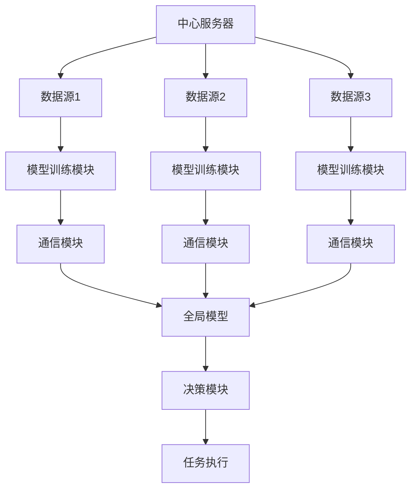

                 


# 基于联邦学习的隐私保护AI Agent

> 关键词：联邦学习，隐私保护，AI Agent，分布式机器学习，差分隐私

> 摘要：本文深入探讨了如何利用联邦学习技术在AI Agent中实现数据隐私保护。通过分析联邦学习的基本原理、算法实现、系统架构以及实际项目案例，详细阐述了在保护用户隐私的前提下，如何构建高效、安全的AI Agent系统。文章还讨论了联邦学习在AI Agent中的应用前景和挑战。

---

# 第1章 背景介绍：联邦学习与隐私保护的重要性

## 1.1 联邦学习的定义与背景

### 1.1.1 数据隐私保护的现状与挑战

随着人工智能技术的快速发展，数据成为驱动AI模型的核心资源。然而，数据的集中存储和共享也带来了严重的隐私泄露风险。传统数据共享方式需要将数据集中在云端或集中式服务器中进行处理，这使得数据在传输和存储过程中容易受到攻击，导致用户隐私被窃取。

为了应对这一挑战，联邦学习（Federated Learning）作为一种新兴的分布式机器学习技术应运而生。联邦学习的核心思想是“数据不动，模型动”，即在不交换原始数据的前提下，通过模型参数的更新和同步，实现多个分布式数据源的联合训练。

### 1.1.2 联邦学习的提出与目标

联邦学习的目标是在保护数据隐私的前提下，实现多个数据拥有者之间的模型协作训练。具体来说，联邦学习允许各个数据源（如用户设备、医疗机构等）在本地进行模型训练，并仅共享模型更新的梯度信息，而不交换原始数据。这种方式能够有效减少数据泄露的风险，同时仍然能够利用大规模分布式数据进行模型优化。

### 1.1.3 联邦学习与传统数据共享的区别

传统的数据共享方式需要将数据集中到一个中心服务器中进行处理，这种方式虽然能够方便地进行模型训练，但数据在传输和存储过程中容易受到攻击，且数据拥有者对数据的控制力较弱。而联邦学习通过将模型的训练过程分散到数据源端，避免了原始数据的共享，从而在保护隐私的同时实现了模型的联合训练。

---

## 1.2 AI Agent的基本概念

### 1.2.1 AI Agent的定义与特点

AI Agent（人工智能代理）是一种能够感知环境、自主决策并执行任务的智能实体。AI Agent可以是软件程序，也可以是物理设备，其核心特点包括：

1. **自主性**：AI Agent能够在没有外部干预的情况下自主决策。
2. **反应性**：AI Agent能够根据环境的变化实时调整其行为。
3. **目标导向**：AI Agent的行为通常是为了实现特定的目标。
4. **学习能力**：AI Agent能够通过与环境的交互和经验积累来改进自身的性能。

### 1.2.2 AI Agent在隐私保护中的作用

随着AI技术的普及，AI Agent的应用场景越来越广泛，例如智能家居、自动驾驶、医疗健康等。在这些场景中，AI Agent需要处理大量的敏感数据，例如用户的地理位置、健康状况等。如何在这些场景中保护用户隐私，成为了设计AI Agent时必须考虑的重要问题。

联邦学习作为一种分布式机器学习技术，为AI Agent的隐私保护提供了新的解决方案。通过联邦学习，AI Agent可以在本地进行模型训练，仅共享模型参数的更新信息，而不泄露原始数据，从而有效保护用户的隐私。

### 1.2.3 联邦学习与AI Agent的结合

联邦学习与AI Agent的结合，使得AI Agent能够在不共享原始数据的前提下，与其他AI Agent或中心服务器协作训练模型。这种结合不仅能够提高模型的泛化能力，还能够保护各个数据源的隐私。

---

# 第2章 联邦学习的核心概念与技术

## 2.1 联邦学习的基本原理

### 2.1.1 联邦学习的通信机制

在联邦学习中，各个数据源（如AI Agent）需要通过通信机制将模型的更新信息传递给中心服务器或其他数据源。常见的通信机制包括：

1. **同步模式**：所有数据源同时进行模型更新，并将更新后的模型参数同步到中心服务器。
2. **异步模式**：数据源可以异步地进行模型更新，并将更新后的模型参数发送到中心服务器。

### 2.1.2 联邦学习的同步与异步模式

- **同步模式**：所有数据源同时进行模型更新，并将更新后的模型参数同步到中心服务器。这种方式的好处是模型更新能够快速同步到所有数据源，但可能会导致通信开销较大。
- **异步模式**：数据源可以异步地进行模型更新，并将更新后的模型参数发送到中心服务器。这种方式的好处是通信开销较小，但模型更新可能需要更多时间才能同步到所有数据源。

### 2.1.3 联邦学习的安全性与隐私保护

在联邦学习中，数据源仅需要共享模型参数的更新信息，而不需要共享原始数据。因此，联邦学习在一定程度上能够保护数据源的隐私。然而，为了进一步增强隐私保护，联邦学习通常结合其他技术，如加密计算和差分隐私。

---

## 2.2 联邦学习的关键技术

### 2.2.1 加密计算技术

加密计算技术是一种在加密数据上直接进行计算的方法，能够有效保护数据的隐私。常见的加密计算技术包括：

1. **同态加密**：允许在加密数据上进行加法和乘法运算，而不需要解密。
2. **秘密共享**：将数据分割成多个密钥片段，只有在多个密钥片段组合时才能恢复原始数据。

### 2.2.2 差分隐私技术

差分隐私是一种通过在数据中添加噪声来保护数据隐私的技术。通过在模型更新过程中添加适当的噪声，可以有效防止通过对模型参数的分析来推断出原始数据。

### 2.2.3 模型联邦化技术

模型联邦化技术是指将模型参数分散到多个数据源中进行训练，每个数据源仅负责一部分模型参数的更新。这种方法能够进一步降低数据泄露的风险，并提高模型的训练效率。

---

## 2.3 联邦学习的实现框架

### 2.3.1 联邦学习的分层架构

联邦学习的分层架构通常包括以下几个层次：

1. **数据层**：负责存储和管理原始数据。
2. **模型层**：负责定义模型的结构和参数。
3. **算法层**：负责实现联邦学习的具体算法，如横向联邦和纵向联邦。
4. **通信层**：负责模型参数的更新和同步。
5. **应用层**：负责与外部系统的接口和用户交互。

### 2.3.2 联邦学习的通信协议

联邦学习的通信协议需要确保模型参数的更新信息能够安全地传输到目标节点。常见的通信协议包括：

1. **HTTP/HTTPS**：通过标准的Web协议进行通信。
2. **gRPC**：一种高效的RPC通信协议，适合处理大规模数据传输。
3. **WebSocket**：适合实时通信场景。

### 2.3.3 联邦学习的节点角色划分

在联邦学习中，通常将节点划分为以下几种角色：

1. **中心服务器**：负责协调各个数据源的模型更新和同步。
2. **数据源节点**：负责在本地进行模型训练，并将模型参数的更新信息发送到中心服务器。
3. **边缘服务器**：用于处理靠近数据源的计算任务，减少数据传输的延迟。

---

# 第3章 联邦学习的算法原理与数学模型

## 3.1 联邦学习的横向联邦

### 3.1.1 横向联邦的基本原理

横向联邦是指在水平方向上进行数据分割，每个数据源拥有完整的样本特征，但只有一部分样本。横向联邦通常用于分类任务，通过在特征空间上进行模型参数的更新。

### 3.1.2 横向联邦的同步与异步算法

- **同步算法**：所有数据源同时进行模型更新，并将更新后的模型参数同步到中心服务器。
- **异步算法**：数据源可以异步地进行模型更新，并将更新后的模型参数发送到中心服务器。

### 3.1.3 横向联邦的收敛性分析

横向联邦的收敛性分析通常涉及到模型参数的更新步长和数据源的数量。通过选择合适的更新步长和优化算法，可以确保模型能够收敛到全局最优解。

---

## 3.2 联邦学习的纵向联邦

### 3.2.1 纵向联邦的基本原理

纵向联邦是指在垂直方向上进行数据分割，每个数据源拥有不同的特征维度。纵向联邦通常用于回归任务，通过在特征维度上进行模型参数的更新。

### 3.2.2 纵向联邦的加密计算方法

纵向联邦可以通过加密计算技术来保护数据隐私，例如通过同态加密或秘密共享技术来实现模型参数的更新和同步。

### 3.2.3 纵向联邦的隐私保护策略

纵向联邦的隐私保护策略通常包括差分隐私和模型联邦化技术，通过在模型更新过程中添加噪声或分散模型参数，进一步增强隐私保护。

---

## 3.3 联邦学习的混合联邦

### 3.3.1 混合联邦的基本原理

混合联邦是指结合横向联邦和纵向联邦的特点，通过在特征空间和样本空间上同时进行数据分割，实现更灵活的模型训练。

### 3.3.2 混合联邦的通信优化技术

混合联邦可以通过优化通信协议和数据传输方式，进一步降低数据传输的延迟和带宽消耗。

### 3.3.3 混合联邦的隐私保护策略

混合联邦的隐私保护策略通常结合了横向联邦和纵向联邦的优点，通过差分隐私和模型联邦化技术来实现更强大的隐私保护。

---

## 3.4 联邦学习的数学模型与公式

### 3.4.1 联邦学习的优化目标

联邦学习的优化目标通常是最小化全局损失函数，具体公式为：

$$ \min_{\theta} \sum_{i=1}^{N} \mathcal{L}(x_i, y_i; \theta) $$

其中，$N$ 是数据源的数量，$\mathcal{L}$ 是损失函数，$\theta$ 是模型参数。

### 3.4.2 联邦学习的同步算法

联邦学习的同步算法通常包括以下步骤：

1. 初始化模型参数 $\theta$。
2. 每个数据源在本地进行模型训练，计算梯度 $\nabla \mathcal{L}_i$。
3. 将所有数据源的梯度进行平均，得到全局梯度 $\nabla \mathcal{L}_{\text{global}}$。
4. 更新模型参数 $\theta = \theta - \eta \nabla \mathcal{L}_{\text{global}}$，其中 $\eta$ 是学习率。
5. 重复步骤2-4，直到模型收敛。

---

# 第4章 系统架构设计与实现

## 4.1 系统架构设计

### 4.1.1 系统功能设计

基于联邦学习的隐私保护AI Agent系统通常包括以下几个功能模块：

1. **数据采集模块**：负责采集和预处理原始数据。
2. **模型训练模块**：负责在本地进行模型训练，并计算模型参数的梯度。
3. **通信模块**：负责将模型参数的梯度发送到中心服务器，并接收全局模型参数。
4. **决策模块**：负责根据全局模型参数进行决策和任务执行。

### 4.1.2 系统架构图

以下是一个基于联邦学习的隐私保护AI Agent的系统架构图：



### 4.1.3 系统接口设计

系统接口设计通常包括以下几种：

1. **模型训练接口**：负责在本地进行模型训练，并返回模型参数的梯度。
2. **通信接口**：负责与中心服务器进行数据传输，接收全局模型参数。
3. **决策接口**：负责根据全局模型参数进行决策，并执行相应的任务。

---

## 4.2 项目实战：基于联邦学习的隐私保护AI Agent实现

### 4.2.1 环境配置

以下是实现基于联邦学习的隐私保护AI Agent所需的环境配置：

- **操作系统**：Linux或macOS
- **编程语言**：Python 3.7+
- **深度学习框架**：TensorFlow或PyTorch
- **通信库**：gRPC或WebSocket
- **加密库**：Paillier加密库（用于同态加密）

### 4.2.2 核心代码实现

以下是一个基于TensorFlow的横向联邦学习实现示例：

```python
import tensorflow as tf
from tensorflow.keras import layers
import numpy as np

# 数据生成
class DataGenerator:
    def __init__(self, num_samples=1000):
        self.num_samples = num_samples
        self.X = np.random.rand(num_samples, 10)  # 10个特征
        self.y = np.random.randint(2, size=num_samples)  # 二分类任务

    def generate_batch(self, batch_size=32):
        indices = np.random.randint(self.num_samples, size=batch_size)
        return self.X[indices], self.y[indices]

# 客户端模型
class ClientModel:
    def __init__(self):
        self.model = tf.keras.Sequential([
            layers.Dense(64, activation='relu'),
            layers.Dense(1, activation='sigmoid')
        ])
        self.model.compile(optimizer='adam', loss='binary_crossentropy')

    def train(self, X, y, epochs=1):
        self.model.fit(X, y, epochs=epochs, verbose=0)
        return self.model.get_weights()

# 服务器模型
class ServerModel:
    def __init__(self):
        self.model = tf.keras.Sequential([
            layers.Dense(64, activation='relu'),
            layers.Dense(1, activation='sigmoid')
        ])
        self.model.compile(optimizer='adam', loss='binary_crossentropy')

    def aggregate(self, weights_list):
        # 简单的平均聚合
        avg_weights = []
        for i in range(len(weights_list[0])):
            avg_weights.append(np.mean([model_weights[i] for model_weights in weights_list], axis=0))
        return avg_weights

# 联邦学习主程序
def main():
    # 初始化数据生成器和客户端模型
    data_generator = DataGenerator()
    client_model = ClientModel()
    server_model = ServerModel()

    # 模型训练
    for epoch in range(10):
        # 数据源1进行模型训练
        X, y = data_generator.generate_batch()
        client_weights = client_model.train(X, y)

        # 数据源2进行模型训练
        X, y = data_generator.generate_batch()
        client_weights2 = client_model.train(X, y)

        # 聚合模型参数
        server_weights = server_model.aggregate([client_weights, client_weights2])

        # 更新服务器模型
        server_model.model.set_weights(server_weights)

if __name__ == "__main__":
    main()
```

### 4.2.3 代码应用解读与分析

1. **数据生成模块**：`DataGenerator`类用于生成模拟数据，包括特征和标签。
2. **客户端模型**：`ClientModel`类定义了客户端的模型结构，并实现了模型的训练方法。
3. **服务器模型**：`ServerModel`类定义了服务器的模型结构，并实现了模型参数的聚合方法。
4. **联邦学习主程序**：`main()`函数实现了联邦学习的主逻辑，包括数据生成、模型训练和参数聚合。

---

## 4.3 实际案例分析

假设我们有一个智能家居场景，AI Agent需要根据用户的地理位置和生活习惯来预测用户的用电需求。为了保护用户的隐私，我们可以利用联邦学习技术，在本地进行模型训练，并仅共享模型参数的更新信息，而不泄露用户的地理位置和生活习惯数据。

通过联邦学习，智能家居中的每个设备（如智能插座、智能灯泡等）可以在本地进行模型训练，并将模型参数的更新信息发送到中心服务器。中心服务器将所有设备的模型参数进行聚合，生成全局最优模型，从而提高用电需求预测的准确性，同时保护用户的隐私。

---

## 4.4 项目小结

通过以上实现，我们可以看到基于联邦学习的隐私保护AI Agent在实际应用中的潜力。联邦学习不仅能够有效保护数据隐私，还能够通过分布式训练提高模型的泛化能力。然而，联邦学习的实现也面临一些挑战，例如通信延迟、模型收敛性以及数据源的异质性等。

---

# 第5章 总结与展望

## 5.1 总结

本文详细探讨了基于联邦学习的隐私保护AI Agent的核心技术与实现方法。通过分析联邦学习的基本原理、算法实现和系统架构，展示了如何在保护用户隐私的前提下，构建高效、安全的AI Agent系统。同时，通过实际案例分析和项目实战，进一步验证了联邦学习在隐私保护AI Agent中的应用价值。

---

## 5.2 展望

随着人工智能技术的不断发展，联邦学习在隐私保护AI Agent中的应用前景广阔。未来的研究方向可能包括：

1. **优化通信效率**：通过优化通信协议和数据传输方式，进一步降低通信延迟和带宽消耗。
2. **增强模型鲁棒性**：通过改进模型结构和训练算法，提高模型的鲁棒性和泛化能力。
3. **结合其他隐私保护技术**：将联邦学习与其他隐私保护技术（如区块链、同态加密等）相结合，构建更加安全的隐私保护机制。

---

# 作者

作者：AI天才研究院/AI Genius Institute  
联系方式：[联系邮箱或社交媒体](#)  
文章版权归原作者所有，转载请注明出处。

---

# 结语

基于联邦学习的隐私保护AI Agent不仅能够有效保护用户的隐私，还能够通过分布式训练提高模型的性能。随着技术的不断进步，联邦学习在AI Agent中的应用将更加广泛，为人工智能技术的发展注入新的活力。

