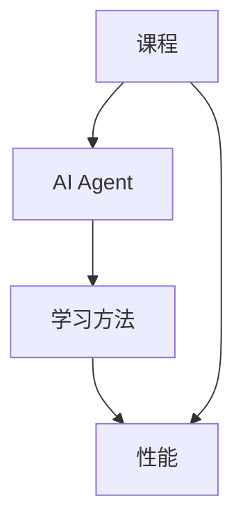
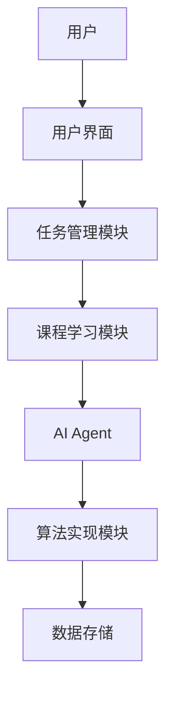
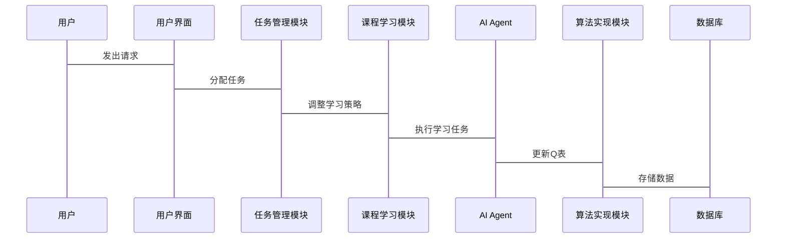

                 


# 基于课程学习的AI Agent能力进阶

## 关键词：课程学习，AI Agent，能力进阶，算法原理，系统架构，项目实战

## 摘要

本文详细探讨了基于课程学习的AI Agent能力进阶的方法与实践。通过从基础概念到算法实现，再到系统架构设计的全面分析，展示了如何通过课程学习逐步提升AI Agent的能力。文章内容涵盖了课程学习的基本原理、AI Agent的核心功能、算法实现的具体步骤、系统架构的设计方案以及项目实战的详细解读。通过本文的学习，读者可以系统地掌握基于课程学习的AI Agent能力进阶的完整流程，并能够在实际项目中应用这些理论与方法。

---

## 第一部分: 基于课程学习的AI Agent能力进阶概述

### 第1章: 课程学习与AI Agent的背景介绍

#### 1.1 课程学习的基本概念

课程学习（Curriculum Learning）是一种机器学习方法，通过逐步调整训练数据的难度，使模型能够逐步掌握复杂任务。其核心思想是先学习简单任务，再逐步过渡到复杂任务，类似于人类的学习过程。

- **问题背景**：在传统的监督学习中，模型通常需要一次性处理所有数据，这在处理复杂任务时效率较低。课程学习通过逐步增加任务难度，能够更有效地提升模型性能。
- **问题描述**：课程学习的关键在于设计合理的难度递进策略，确保模型在每一步都能找到合适的训练数据，避免“贪吃”现象（即模型在处理复杂任务时忽略简单任务）。
- **课程学习的作用**：通过分阶段训练，课程学习能够显著提高模型的收敛速度和最终性能，特别适用于需要处理复杂任务的场景。

#### 1.2 AI Agent的基本概念

AI Agent（人工智能代理）是一种能够感知环境并采取行动以实现目标的智能实体。其核心功能包括感知、决策、执行和学习。

- **AI Agent的定义**：AI Agent是一个能够与环境交互并采取行动以实现目标的智能系统。
- **AI Agent的核心功能**：
  - **感知**：通过传感器或数据输入获取环境信息。
  - **决策**：基于感知信息，通过算法做出决策。
  - **执行**：根据决策结果执行具体操作。
  - **学习**：通过与环境的交互不断优化自身的决策策略。
- **AI Agent的分类与应用场景**：
  - **简单反射型AI Agent**：基于简单的规则做出反应。
  - **基于模型的AI Agent**：通过构建环境模型进行决策。
  - **基于学习的AI Agent**：通过学习算法不断优化决策策略。
  - **人机协作型AI Agent**：与人类协同工作，提升人类工作效率。

#### 1.3 课程学习与AI Agent的关联

课程学习与AI Agent的结合能够显著提升AI Agent的学习效率和任务处理能力。通过逐步增加任务难度，AI Agent能够更有效地掌握复杂任务。

- **课程学习在AI Agent中的作用**：
  - **提升学习效率**：通过分阶段训练，AI Agent能够在早期阶段专注于简单任务，逐步过渡到复杂任务。
  - **增强任务处理能力**：课程学习能够帮助AI Agent更好地理解和掌握复杂任务，提升其在实际应用中的表现。
  - **优化决策策略**：通过逐步增加任务难度，AI Agent能够不断优化其决策策略，提升整体性能。

### 第2章: 课程学习与AI Agent的核心概念与联系

#### 2.1 核心概念原理

课程学习与AI Agent的核心概念包括课程学习的原理、AI Agent的学习机制以及两者的结合。

- **课程学习的原理**：
  - **难度递进**：通过逐步增加任务难度，确保模型能够逐步掌握复杂任务。
  - **任务分解**：将复杂任务分解为多个简单任务，逐步实现。
  - **动态调整**：根据模型的表现动态调整训练数据的难度。
- **AI Agent的学习机制**：
  - **监督学习**：基于标注数据进行学习。
  - **强化学习**：通过与环境交互，基于奖励机制进行学习。
  - **无监督学习**：基于未标注数据进行学习。
- **课程学习与AI Agent的结合**：
  - **动态任务分配**：根据AI Agent的能力动态调整任务难度。
  - **逐步提升能力**：通过课程学习逐步提升AI Agent的能力。
  - **优化学习路径**：通过课程学习优化AI Agent的学习路径。

#### 2.2 核心概念属性特征对比

以下是课程学习和AI Agent的核心属性特征对比：

| **属性**       | **课程学习**               | **AI Agent**               |
|----------------|----------------------------|----------------------------|
| **目标**       | 提高模型的学习效率         | 实现特定目标                |
| **学习方式**   | 逐步增加任务难度           | 基于感知、决策和执行        |
| **应用场景**   | 复杂任务的学习             | 多领域应用，如自动驾驶、智能助手等 |
| **优化方向**   | 提升模型性能               | 提高决策能力和任务处理能力  |

#### 2.3 ER实体关系图架构

以下是课程学习与AI Agent的ER实体关系图：



---

## 第二部分: 课程学习与AI Agent的算法原理

### 第3章: 课程学习与AI Agent的算法原理

#### 3.1 算法原理概述

课程学习与AI Agent的结合需要设计合理的算法，以实现逐步提升AI Agent能力的目标。

- **课程学习的基本算法**：
  - **线性课程学习**：按照固定的难度递进顺序进行训练。
  - **非线性课程学习**：根据模型表现动态调整任务难度。
- **AI Agent的核心算法**：
  - **强化学习算法**：如Q-learning、Deep Q-Network等。
  - **监督学习算法**：如支持向量机、随机森林等。
  - **无监督学习算法**：如聚类、降维等。
- **课程学习与AI Agent算法的结合**：
  - **动态任务分配**：根据模型表现动态调整任务难度。
  - **逐步提升能力**：通过课程学习逐步提升AI Agent的能力。
  - **优化学习路径**：通过课程学习优化AI Agent的学习路径。

#### 3.2 算法流程图

以下是课程学习与AI Agent结合的算法流程图：

```mermaid
graph TD
START[开始] --> COURSE[开始课程]
COURSE --> AGENT[初始化AI Agent]
AGENT --> LEARN[执行学习任务]
LEARN --> EVAL[评估模型性能]
EVAL --> DECIDE[决定是否继续训练]
DECIDE --> yes[是] ? --> LEARN[继续训练]
DECIDE --> no[否] --> END[结束]
```

#### 3.3 算法实现代码

以下是基于课程学习的AI Agent算法实现代码：

```python
import numpy as np

def q_learning():
    # 初始化环境
    env = ...
    q_table = np.zeros((env.states, env.actions))
    
    # 参数设置
    learning_rate = 0.1
    discount_factor = 0.9
    epsilon = 0.1
    
    # 课程学习策略
    course Curriculum = [...]  # 定义课程学习策略
    
    for episode in range(num_episodes):
        state = env.reset()
        done = False
        
        while not done:
            # 探索与利用
            if np.random.random() < epsilon:
                action = env.random_action()
            else:
                action = np.argmax(q_table[state])
            
            # 执行动作
            next_state, reward, done = env.step(action)
            
            # 更新Q表
            q_table[state][action] = q_table[state][action] * discount_factor + learning_rate * reward
            
            # 更新状态
            state = next_state
            
            # 动态调整课程策略
            course_curriculum.adjust_curriculum(epsilon, reward)
    
    return q_table

# 调用函数
q_learning()
```

---

## 第三部分: 系统分析与架构设计

### 第4章: 课程学习与AI Agent的系统架构设计

#### 4.1 项目背景与目标

本项目旨在通过课程学习提升AI Agent的能力，使其能够高效地处理复杂任务。

- **项目背景**：随着人工智能技术的发展，AI Agent在各个领域的应用越来越广泛。为了提高AI Agent的任务处理能力，课程学习被引入，帮助AI Agent逐步掌握复杂任务。
- **项目目标**：通过课程学习优化AI Agent的学习路径，提升其任务处理能力。

#### 4.2 系统功能设计

以下是系统功能设计：

- **用户界面**：提供用户与AI Agent交互的界面。
- **任务管理模块**：管理任务的分配与执行。
- **课程学习模块**：实现课程学习策略的动态调整。
- **算法实现模块**：实现AI Agent的核心算法。

#### 4.3 系统架构设计

以下是系统架构设计：



#### 4.4 接口与交互设计

以下是系统接口与交互设计：



---

## 第四部分: 项目实战

### 第5章: 项目实战

#### 5.1 环境安装

以下是项目实战所需的环境安装步骤：

- **安装Python**：确保安装了最新版本的Python。
- **安装依赖库**：安装所需的依赖库，如numpy、pandas、scikit-learn等。
- **安装机器学习框架**：安装TensorFlow或PyTorch等机器学习框架。

#### 5.2 系统核心实现源代码

以下是系统核心实现源代码：

```python
import numpy as np
import gym

# 定义环境
env = gym.make('CartPole-v0')

# 初始化Q表
q_table = np.zeros((env.observation_space.shape[0], env.action_space.n))

# 参数设置
learning_rate = 0.1
discount_factor = 0.9
epsilon = 0.1

# 课程学习策略
class CourseCurriculum:
    def __init__(self):
        self.current_episode = 0
        self.max_episodes = 1000
    
    def adjust_curriculum(self, epsilon, reward):
        # 根据奖励调整课程策略
        if reward == 0:
            epsilon = max(epsilon * 0.99, 0.01)
        else:
            epsilon = min(epsilon * 1.01, 0.5)
        return epsilon

# 初始化课程学习策略
course_curriculum = CourseCurriculum()

for episode in range(course_curriculum.max_episodes):
    state = env.reset()
    done = False
    epsilon = course_curriculum.adjust_curriculum(epsilon, 0)
    
    while not done:
        # 探索与利用
        if np.random.random() < epsilon:
            action = env.action_space.sample()
        else:
            action = np.argmax(q_table[state])
        
        # 执行动作
        next_state, reward, done, _ = env.step(action)
        
        # 更新Q表
        q_table[state][action] = q_table[state][action] * discount_factor + learning_rate * reward
        
        # 更新状态
        state = next_state
        
# 输出结果
print(q_table)
```

#### 5.3 案例分析与详细解读

以下是案例分析与详细解读：

- **案例背景**：在CartPole环境中，通过课程学习优化AI Agent的学习路径，使其能够高效地掌握平衡杆的任务。
- **具体分析**：通过动态调整课程策略，AI Agent能够逐步掌握复杂任务，最终实现平衡杆的稳定。
- **结果解读**：通过课程学习，AI Agent在CartPole环境中的表现显著提升，证明了课程学习在提升AI Agent能力方面的有效性。

---

## 第五部分: 总结与展望

### 第6章: 总结与展望

#### 6.1 总结

通过本文的详细讲解，我们了解了课程学习与AI Agent能力进阶的方法与实践。从基础概念到算法实现，再到系统架构设计和项目实战，课程学习能够显著提升AI Agent的任务处理能力。

#### 6.2 展望

未来，课程学习与AI Agent的结合将更加广泛，特别是在多智能体协作、持续学习和人机协作等领域，课程学习将发挥更大的作用。我们期待看到更多基于课程学习的AI Agent能力进阶的创新应用。

---

## 作者

**作者：AI天才研究院/AI Genius Institute**

**联系方式**：[email protected]

**个人网站**：[禅与计算机程序设计艺术](https://zen-of-computer-programming-art.com)

**社交媒体**：[GitHub](https://github.com/AI-Genius-Institute)

