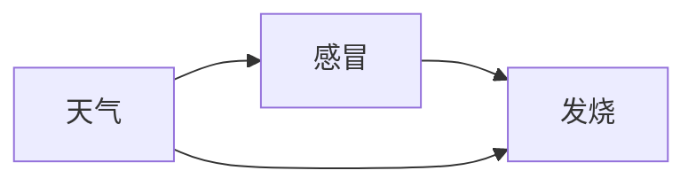
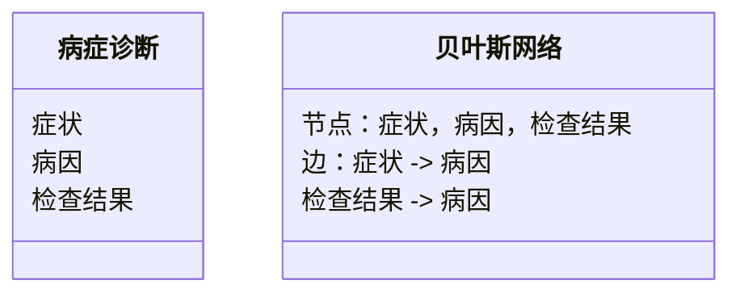
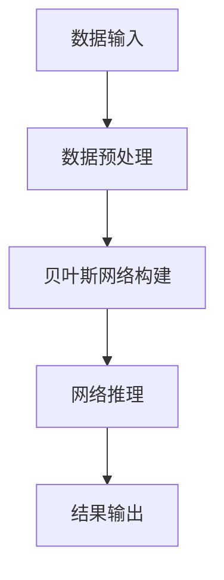

                 


# 基于贝叶斯方法的AI Agent不确定性处理

> 关键词：贝叶斯方法，AI Agent，不确定性处理，概率推理，贝叶斯网络

> 摘要：本文深入探讨了基于贝叶斯方法的AI Agent在处理不确定性方面的重要性和应用。通过详细分析贝叶斯方法的核心原理、贝叶斯网络的构建与推理、系统架构设计以及实际项目案例，本文为读者提供了从理论到实践的全面指导。通过具体实例和详细的技术分析，本文展示了如何利用贝叶斯方法有效处理AI Agent中的不确定性问题，为相关领域的研究和应用提供了有价值的参考。

---

## 第1章: 背景介绍与核心概念

### 1.1 AI Agent与不确定性处理
AI Agent（人工智能代理）是指能够感知环境、自主决策并采取行动以实现目标的智能实体。在现实世界中，AI Agent面临的环境往往是不确定的，这使得不确定性处理成为AI Agent设计中的核心问题。不确定性主要来源于环境的动态性、信息的不完整性以及决策的复杂性。

#### 1.1.1 AI Agent的定义与特点
- **定义**：AI Agent是一个能够感知环境、自主决策并采取行动以实现目标的智能实体。
- **特点**：
  - 智能性：能够理解和处理复杂信息。
  - 自主性：能够在没有外部干预的情况下自主决策。
  - 反应性：能够根据环境变化动态调整行为。
  - 目标导向：所有行为均以实现特定目标为导向。

#### 1.1.2 不确定性在AI Agent中的表现形式
- **环境不确定性**：环境的状态和行为可能无法完全预测。
- **信息不确定性**：AI Agent对环境的理解可能存在不完整或模糊性。
- **决策不确定性**：在面对多个可能选项时，AI Agent需要在有限信息下做出最优选择。

#### 1.1.3 贝叶斯方法在不确定性处理中的作用
贝叶斯方法是一种基于概率论的统计推理方法，能够有效地处理不确定性问题。其核心思想是通过不断更新概率分布来反映对世界的认知，从而在不确定的环境中做出最优决策。

---

### 1.2 贝叶斯方法的基本原理
贝叶斯方法的核心基于概率论，通过贝叶斯定理对事件的概率进行更新，从而在不确定环境中做出合理推断。

#### 1.2.1 概率论基础
概率论是贝叶斯方法的数学基础，主要用于描述随机事件的可能性。概率的基本性质如下：
- **概率的定义**：概率是某个事件发生的可能性大小，范围在0到1之间。
- **概率公理**：任何概率分布都必须满足非负性、单位性和可加性。
- **条件概率**：在给定条件下某事件发生的概率。

#### 1.2.2 贝叶斯定理与条件概率
贝叶斯定理是贝叶斯方法的核心，其公式如下：

$$
P(A|B) = \frac{P(B|A) \cdot P(A)}{P(B)}
$$

其中：
- \(P(A|B)\)：在事件B发生的条件下，事件A发生的概率。
- \(P(B|A)\)：在事件A发生的条件下，事件B发生的概率。
- \(P(A)\)：事件A的先验概率。
- \(P(B)\)：事件B的边际概率。

贝叶斯定理通过将先验概率和条件概率相结合，能够根据新的数据或证据更新概率分布，从而反映对事件认知的变化。

#### 1.2.3 贝叶斯推断的基本流程
贝叶斯推断的基本流程如下：
1. **定义假设**：明确可能的假设或模型。
2. **设定先验概率**：根据已有知识或经验，设定各假设的初始概率。
3. **获取证据**：收集与假设相关的数据或信息。
4. **计算后验概率**：利用贝叶斯定理，根据证据更新各假设的后验概率。
5. **选择最优假设**：根据后验概率选择概率最高的假设作为最优解。

---

## 第2章: 贝叶斯方法的核心概念与联系

### 2.1 贝叶斯网络的结构
贝叶斯网络（Bayesian Network）是一种有向无环图（DAG），由节点和边组成，用于表示变量之间的条件概率关系。

#### 2.1.1 贝叶斯网络的定义
贝叶斯网络是一种概率图形模型，能够通过图结构清晰地表示变量之间的依赖关系。每个节点代表一个随机变量，边代表变量之间的条件依赖关系。

#### 2.1.2 节点与边的属性特征对比表
以下是节点与边的属性特征对比：

| 特性 | 节点 | 边 |
|------|------|----|
| 描述 | 表示随机变量 | 表示变量之间的条件依赖关系 |
| 类型 | 概率分布 | 条件概率 |
| 功能 | 存储变量的先验概率 | 表示变量间的条件关系 |

#### 2.1.3 贝叶斯网络的ER实体关系图
以下是一个简单的贝叶斯网络ER实体关系图：



图中，天气影响感冒，感冒导致发烧，天气也直接导致发烧。

---

### 2.2 贝叶斯网络的构建与推理
贝叶斯网络的构建与推理是贝叶斯方法的核心内容，涉及网络的构建、参数估计和推理算法。

#### 2.2.1 贝叶斯网络的构建流程
1. **确定变量**：明确问题中涉及的所有变量。
2. **定义变量关系**：通过专家知识或数据确定变量间的依赖关系。
3. **构建网络结构**：根据变量关系绘制贝叶斯网络图。
4. **设定概率参数**：为每个节点赋予先验概率分布。

#### 2.2.2 贝叶斯网络的推理方法
贝叶斯网络的推理主要分为两种类型：
- **前向推理**：从已知变量推导未知变量。
- **后向推理**：从观测数据推导隐含变量。

#### 2.2.3 贝叶斯网络的优化策略
- **结构优化**：通过删除冗余边或合并无关节点来简化网络结构。
- **参数优化**：利用最大似然估计或贝叶斯估计优化网络参数。
- **计算优化**：采用近似算法或分层推理方法提高计算效率。

---

### 2.3 贝叶斯方法的数学模型与算法原理

#### 2.3.1 贝叶斯定理的数学表达
贝叶斯定理的数学表达式如下：

$$
P(A|B) = \frac{P(B|A) \cdot P(A)}{P(B)}
$$

其中：
- \(P(A|B)\)：后验概率，即在事件B发生的条件下，事件A发生的概率。
- \(P(B|A)\)：似然度，即在事件A发生的条件下，事件B发生的概率。
- \(P(A)\)：先验概率，即在没有考虑事件B的情况下，事件A发生的概率。
- \(P(B)\)：边际概率，即事件B发生的概率。

#### 2.3.2 贝叶斯网络的构建算法
贝叶斯网络的构建算法主要包括结构学习和参数学习两部分：
- **结构学习**：通过数据挖掘或专家知识确定变量间的依赖关系。
- **参数学习**：利用最大似然估计或贝叶斯估计确定网络参数。

#### 2.3.3 贝叶斯网络的推理算法
贝叶斯网络的推理算法主要包括变量消除法和马尔可夫链蒙特卡洛方法（MCMC）。

---

## 第3章: 贝叶斯方法的系统分析与架构设计

### 3.1 问题场景介绍
在实际应用中，AI Agent需要处理多种不确定性问题，例如医疗诊断、金融投资和自动驾驶等。

#### 3.1.1 不确定性处理的典型场景
- **医疗诊断**：根据症状和检查结果推断疾病的可能性。
- **金融投资**：根据市场数据预测股票价格走势。
- **自动驾驶**：根据传感器数据做出驾驶决策。

#### 3.1.2 贝叶斯方法的应用范围
- **医疗领域**：疾病诊断、治疗方案选择。
- **金融领域**：风险评估、投资决策。
- **工业领域**：设备故障预测、过程优化。

#### 3.1.3 系统设计的约束条件
- **计算效率**：贝叶斯网络的推理过程需要高效计算。
- **数据规模**：贝叶斯网络需要处理大规模数据。
- **模型复杂度**：贝叶斯网络的结构和参数需要合理设计。

### 3.2 系统功能设计

#### 3.2.1 领域模型的Mermaid类图
以下是一个简单的领域模型类图：



#### 3.2.2 系统架构的Mermaid架构图
以下是一个贝叶斯网络系统的架构图：



---

## 第4章: 项目实战与案例分析

### 4.1 环境搭建与工具安装
在实际项目中，我们需要选择合适的开发环境和工具。

#### 4.1.1 开发环境的选择
- **Python**：推荐使用Python语言，因其丰富的概率编程库。
- **Jupyter Notebook**：适合数据探索和可视化。
- **操作系统**：推荐使用Linux或macOS，因其兼容性较好。

#### 4.1.2 必要工具的安装与配置
- **Python库**：安装`numpy`、`pandas`、`scipy`和`networkx`。
- **贝叶斯网络工具**：安装`pgmpy`库。

#### 4.1.3 环境变量的设置与测试
- **Python路径配置**：确保Python可执行文件在环境变量中。
- **库安装验证**：通过`pip list`命令验证库是否安装成功。

---

### 4.2 核心算法实现

#### 4.2.1 贝叶斯网络的构建代码
以下是一个简单的贝叶斯网络构建代码示例：

```python
from pgmpy.models import BayesianModel
from pgmpy.distributions import Categorical
from pgmpy.parameters import Parameters

# 定义变量
nodes = ['A', 'B', 'C']

# 定义边
edges = [('A', 'B'), ('B', 'C'), ('A', 'C')]

# 构建贝叶斯网络
model = BayesianModel(edges)

# 定义参数
params = Parameters({
    'A': Categorical(['a1', 'a2'], [0.6, 0.4]),
    'B': Categorical(['b1', 'b2'], [0.7, 0.3]),
    'C': Categorical(['c1', 'c2'], [0.5, 0.5])
})

# 设置参数
model.set_parameters(params)

# 检查模型
assert model.check_model()
```

#### 4.2.2 推理算法的实现细节
以下是一个贝叶斯网络推理的代码示例：

```python
from pgmpy.inference import VariableElimination

# 初始化推理器
infer = VariableElimination(model)

# 推理后验概率
result = infer.query(variables=['B'], evidence={'A': 'a1'})

# 输出结果
print(result)
```

---

### 4.3 案例分析与结果解读

#### 4.3.1 典型案例的背景介绍
以医疗诊断为例，假设我们需要根据症状和检查结果诊断疾病。

#### 4.3.2 数据预处理与特征提取
- **数据预处理**：清洗数据，处理缺失值和异常值。
- **特征提取**：从数据中提取有用的特征，例如症状和检查结果。

#### 4.3.3 实验结果的分析与总结
通过贝叶斯网络推理，我们可以得到各疾病的后验概率，并根据概率高低进行排序，从而做出诊断决策。

---

## 第5章: 总结与展望

### 5.1 本章小结
通过本文的介绍，我们可以看到贝叶斯方法在AI Agent不确定性处理中的重要性和广泛应用。贝叶斯网络作为一种有效的概率图形模型，能够帮助AI Agent在不确定环境中做出合理的决策。

#### 5.1.1 贝叶斯方法的核心要点回顾
- 贝叶斯定理是贝叶斯方法的核心。
- 贝叶斯网络是一种有效的概率建模工具。
- 贝叶斯推理能够帮助AI Agent做出最优决策。

#### 5.1.2 AI Agent不确定性处理的关键技术总结
- 贝叶斯网络的构建与推理。
- 贝叶斯定理在实际问题中的应用。
- 贝叶斯方法与其他不确定性处理方法的结合。

#### 5.1.3 项目实战的经验与教训
- 选择合适的工具和库可以提高开发效率。
- 数据预处理和特征提取是影响结果的重要因素。
- 模型的优化和调参能够提高推理效率。

### 5.2 未来研究方向
贝叶斯方法在AI Agent中的应用前景广阔，未来的研究方向包括：
- **贝叶斯方法的优化与改进**：探索更高效的贝叶斯网络构建和推理算法。
- **新兴技术与贝叶斯方法的结合**：将贝叶斯方法与深度学习、强化学习等新兴技术结合，探索新的应用领域。
- **贝叶斯方法的扩展与推广**：将贝叶斯方法应用于更多领域，例如自然语言处理、机器人技术和智能交通系统。

---

## 作者：AI天才研究院 & 禅与计算机程序设计艺术

---

以上是《基于贝叶斯方法的AI Agent不确定性处理》的完整内容，涵盖了从理论到实践的各个方面，希望对读者有所帮助。

