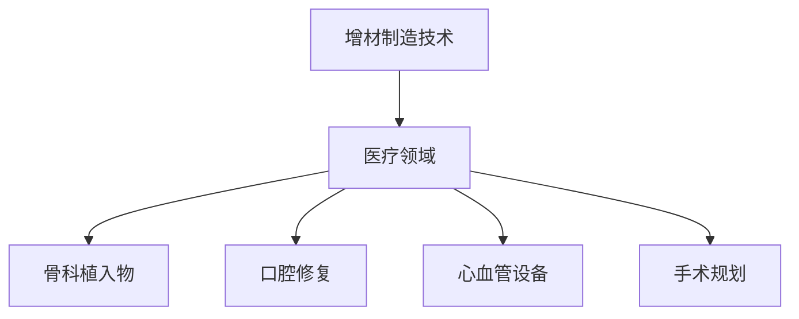
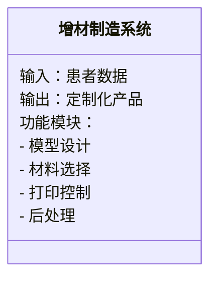
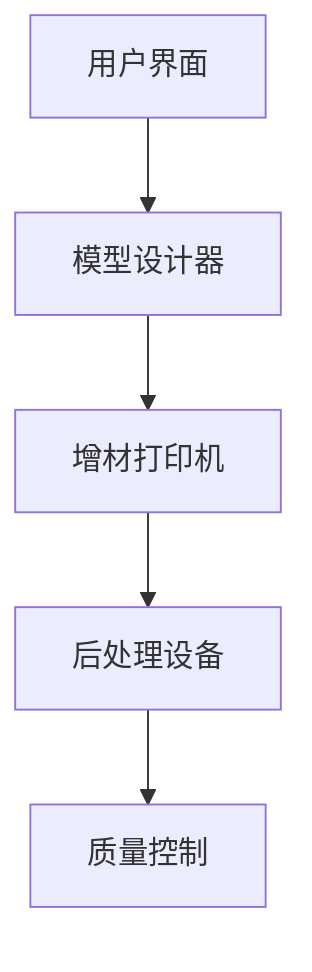

                 


# 增材制造技术在医疗领域的应用与投资机会

> **关键词**：增材制造技术、医疗领域、3D打印、医疗创新、投资机会

> **摘要**：  
增材制造技术（Additive Manufacturing，AM），即3D打印技术，近年来在医疗领域的应用取得了显著进展。本文从技术原理、应用场景、商业模式和投资机会等多个维度，系统分析增材制造技术在医疗领域的潜力与挑战。通过具体案例分析，探讨其在骨科、口腔、心血管等领域的应用前景，并结合当前市场趋势，为投资者提供有价值的参考。

---

# 第一部分：增材制造技术在医疗领域的应用概述

## 第1章：增材制造技术与医疗领域概述

### 1.1 增材制造技术的基本概念

#### 1.1.1 增材制造技术的定义  
增材制造技术（Additive Manufacturing，AM）是一种通过逐层堆叠材料来构建三维物体的技术，与传统减材制造（如铣削、锻造）不同，增材制造强调“从无到有”的构建过程。其核心在于将数字模型直接转化为实物，减少了材料浪费并提高了制造效率。

#### 1.1.2 增材制造技术的核心原理  
增材制造技术的核心原理包括：
1. **数字模型驱动**：基于CAD（计算机辅助设计）模型，将数字信息直接转化为物理对象。
2. **逐层堆叠**：通过激光、热熔挤出等方式，逐层沉积材料，形成最终的三维结构。
3. **材料多样性**：支持金属、塑料、生物材料等多种材料的使用，满足不同医疗场景的需求。

#### 1.1.3 医疗领域对增材制造技术的需求  
医疗领域对个性化、精准化的需求与增材制造技术的高度定制能力完美契合。例如，定制化的假肢、植入物、手术模型等，都需要高度精确的制造技术。

---

### 1.2 增材制造技术在医疗领域的应用现状

#### 1.2.1 全球医疗增材制造技术的发展历程  
增材制造技术在医疗领域的应用可以追溯到20世纪90年代，但真正的大规模应用始于21世纪初。近年来，随着技术的成熟和成本的降低，增材制造技术在医疗领域的应用逐渐普及。

#### 1.2.2 国内医疗增材制造技术的发展现状  
国内在增材制造技术的研发和应用方面取得了显著进展。例如，北京航空航天大学和清华大学在金属增材制造技术方面取得了突破，部分成果已应用于医疗领域。

#### 1.2.3 医疗增材制造技术的市场分析  
根据市场研究机构的数据，全球医疗增材制造市场规模已超过10亿美元，年增长率保持在20%以上。未来，随着技术的进步和成本的下降，市场将进一步扩大。

---

### 1.3 增材制造技术与传统医疗制造的对比

#### 1.3.1 传统医疗制造的局限性  
传统医疗制造依赖于大规模生产，难以满足个性化需求，且材料浪费较大，制造周期较长。

#### 1.3.2 增材制造技术的优势  
增材制造技术的优势包括：
1. **个性化定制**：能够根据患者的具体需求制造定制化产品。
2. **材料利用率高**：减少了材料浪费，降低了成本。
3. **制造周期短**：通过数字化模型快速迭代，缩短了生产周期。

#### 1.3.3 增材制造技术在医疗领域的边界与外延  
增材制造技术在医疗领域的应用范围广泛，但目前仍有一些技术瓶颈，如生物材料的性能和成本问题，以及法规认证的复杂性。

---

## 1.4 本章小结  
本章从增材制造技术的基本概念出发，分析了其在医疗领域的应用现状，并与传统医疗制造技术进行了对比，总结了增材制造技术的优势和局限性。

---

## 第2章：增材制造技术的核心概念与联系

### 2.1 增材制造技术的核心原理

#### 2.1.1 增材制造技术的材料选择  
材料是增材制造技术的核心要素之一。在医疗领域，常用的材料包括：
1. **金属材料**：如钛合金、钴铬合金，适用于骨科植入物。
2. **塑料材料**：如聚乳酸（PLA）、聚丙烯（PP），适用于假肢和手术工具。
3. **生物材料**：如羟基磷灰石（HA），适用于骨修复材料。

#### 2.1.2 增材制造技术的工艺流程  
增材制造技术的工艺流程包括：
1. **模型设计**：基于患者数据，设计三维模型。
2. **材料准备**：选择合适的材料并进行预处理。
3. **打印过程**：通过激光或挤出头逐层堆叠材料，形成三维结构。
4. **后处理**：包括清洗、打磨、热处理等，确保产品质量。

#### 2.1.3 医疗领域对增材制造技术的需求  
医疗领域对增材制造技术的需求主要集中在：
1. **个性化医疗**：如定制化假肢、植入物。
2. **复杂结构制造**：如人工心脏瓣膜、骨修复支架。
3. **快速原型制作**：用于手术规划和医疗设备开发。

---

### 2.2 增材制造技术与医疗领域的关联

#### 2.2.1 医疗领域对增材制造技术的需求分析  
医疗领域对增材制造技术的需求主要体现在以下几个方面：
1. **骨科植入物**：如髋关节置换、脊柱植入物。
2. **口腔修复**：如定制化牙冠、牙桥。
3. **心血管设备**：如人工心脏瓣膜、支架。

#### 2.2.2 增材制造技术在医疗领域的应用场景  
增材制造技术在医疗领域的应用场景包括：
1. **手术规划**：通过3D打印技术制作手术模型，辅助医生进行术前规划。
2. **医疗设备制造**：如定制化假肢、手术器械。
3. **生物组织工程**：如人工器官、皮肤修复。

#### 2.2.3 增材制造技术与医疗领域的关系图谱  
以下是增材制造技术与医疗领域关系的简要图谱：



---

### 2.3 增材制造技术的核心要素分析

#### 2.3.1 材料性能与医疗应用的关系  
材料性能是影响增材制造技术在医疗领域应用的关键因素。例如，生物相容性材料（如钛合金）适用于植入物，而可降解材料（如聚乳酸）适用于组织修复。

#### 2.3.2 工艺参数对医疗产品性能的影响  
工艺参数（如激光功率、扫描速度）直接影响产品的性能。例如，激光功率过高会导致材料烧结不均匀，影响产品的强度和韧性。

#### 2.3.3 医疗法规对增材制造技术的约束  
医疗法规对增材制造技术的约束主要体现在产品认证和质量控制方面。例如，植入物需要通过FDA或CE认证，才能进入市场。

---

## 2.4 本章小结  
本章深入分析了增材制造技术的核心原理，探讨了其在医疗领域的应用场景，并通过关系图谱展示了技术与医疗领域的关联。

---

## 第3章：增材制造技术的算法原理与数学模型

### 3.1 增材制造技术的算法概述

#### 3.1.1 增材制造技术的分层制造算法  
分层制造算法是增材制造技术的核心算法之一。其基本原理是将三维模型分解为多个二维层，并逐层进行打印。

#### 3.1.2 增材制造技术的路径规划算法  
路径规划算法用于确定打印头的运动轨迹，以优化打印效率和产品质量。例如，使用遗传算法优化打印路径，减少材料浪费。

#### 3.1.3 增材制造技术的优化算法  
优化算法用于优化打印参数（如激光功率、扫描速度）以提高产品质量。例如，使用粒子群优化算法（PSO）优化打印参数。

---

### 3.2 增材制造技术的数学模型

#### 3.2.1 增材制造技术的几何模型  
几何模型是增材制造技术的基础，通常使用三角网格（mesh）表示三维模型。例如，使用STL格式描述模型的表面。

#### 3.2.2 增材制造技术的材料性能模型  
材料性能模型用于预测材料的强度、韧性等性能。例如，使用有限元分析（FEM）模型预测金属植入物的应力分布。

#### 3.2.3 增材制造技术的工艺参数模型  
工艺参数模型用于优化打印参数。例如，使用回归模型预测打印层的厚度与激光功率的关系。

---

### 3.3 增材制造技术的算法实现

#### 3.3.1 增材制造技术的分层制造算法实现  
以下是分层制造算法的伪代码：

```python
def layer_manufacturing(model):
    for layer in model.layers:
        deposit_material(layer)
    return manufactured_part
```

#### 3.3.2 增材制造技术的路径规划算法实现  
以下是路径规划算法的伪代码：

```python
def path_planning(layers):
    optimal_path = initialize_path(layers)
    while not converged:
        evaluate_fitness(optimal_path)
        update_path(optimal_path)
    return optimal_path
```

#### 3.3.3 增材制造技术的优化算法实现  
以下是优化算法的伪代码：

```python
def parameter_optimization(parameters):
    initialize swarm(parameters)
    while not converged:
        evaluate_fitness(swarm)
        update_positions(swarm)
    return optimal_parameters
```

---

### 3.4 本章小结  
本章从算法原理和数学模型的角度，详细介绍了增材制造技术的核心算法，包括分层制造算法、路径规划算法和优化算法，并给出了相应的伪代码。

---

## 第4章：增材制造技术在医疗领域的系统分析与架构设计

### 4.1 系统分析与架构设计

#### 4.1.1 问题场景介绍  
医疗领域的增材制造系统需要解决个性化定制、快速生产、高精度等问题。例如，定制化假肢的制造需要高度精确的建模和打印技术。

#### 4.1.2 系统功能设计  
以下是增材制造系统的功能模块图：



#### 4.1.3 系统架构设计  
以下是增材制造系统的架构图：



---

### 4.2 项目实战

#### 4.2.1 环境安装  
增材制造系统的开发需要安装以下环境：
1. **软件环境**：CAD建模软件（如SolidWorks）、增材制造软件（如Netfabb）。
2. **硬件环境**：3D打印机、计算机、传感器。

#### 4.2.2 系统核心实现源代码  
以下是增材制造系统的部分源代码：

```python
class AM_System:
    def __init__(self):
        self.model = None
        self.material = None
        self.printer = None

    def design_model(self):
        # 基于患者数据设计模型
        pass

    def select_material(self):
        # 选择合适的材料
        pass

    def print_part(self):
        # 控制打印机进行打印
        pass

    def post_process(self):
        # 后处理
        pass
```

#### 4.2.3 代码应用解读与分析  
代码解读：上述代码定义了一个增材制造系统的类，包括模型设计、材料选择、打印控制和后处理四个功能模块。

---

### 4.3 本章小结  
本章通过系统分析与架构设计，详细介绍了增材制造技术在医疗领域的应用系统，并通过项目实战展示了系统的实现过程。

---

## 第5章：增材制造技术在医疗领域的投资机会

### 5.1 医疗增材制造技术的市场分析

#### 5.1.1 市场规模与增长趋势  
根据市场研究机构的数据，全球医疗增材制造市场规模预计将以年均20%以上的速度增长，未来几年将突破50亿美元。

#### 5.1.2 医疗增材制造技术的主要投资方向  
增材制造技术在医疗领域的投资方向包括：
1. **技术创新**：如新型材料、算法优化。
2. **设备研发**：如高性能3D打印机。
3. **医疗应用**：如定制化假肢、植入物。

---

### 5.2 医疗增材制造技术的投资策略

#### 5.2.1 技术驱动型投资  
技术驱动型投资关注技术创新，如新型材料和算法优化。例如，投资于生物材料研发公司将获得较高的技术溢价。

#### 5.2.2 市场需求型投资  
市场需求型投资关注医疗领域的实际需求，如骨科植入物和口腔修复。这类投资的风险较低，但回报也相对有限。

#### 5.2.3 产业链整合型投资  
产业链整合型投资关注从材料到设备、从设计到生产的全链条整合。例如，投资于增材制造技术的垂直整合企业将具备更强的竞争力。

---

## 5.3 投资机会总结  
增材制造技术在医疗领域的投资机会主要集中在技术创新、设备研发和医疗应用三个方面。投资者需要关注技术壁垒、市场需求和政策法规，以制定合理的投资策略。

---

## 第6章：增材制造技术的未来展望与挑战

### 6.1 增材制造技术的未来发展趋势

#### 6.1.1 技术创新  
未来，增材制造技术将朝着更高精度、更快速度、更低成本的方向发展。例如，下一代3D打印机将具备更高的分辨率和更快的打印速度。

#### 6.1.2 市场扩展  
随着技术的成熟和成本的降低，增材制造技术将扩展到更多医疗领域，如人工器官、基因编辑等。

---

### 6.2 增材制造技术的挑战与解决方案

#### 6.2.1 技术挑战  
增材制造技术在医疗领域的应用面临材料性能、打印精度等技术挑战。例如，生物材料的降解性能直接影响植入物的使用寿命。

#### 6.2.2 市场挑战  
市场挑战主要体现在法规认证和市场竞争方面。例如，通过FDA认证的过程复杂且耗时较长。

#### 6.2.3 经济挑战  
增材制造技术的高成本仍然是制约其大规模应用的主要障碍。例如，3D打印机和材料的成本较高，限制了其在中小型医疗机构的应用。

---

## 6.3 本章小结  
本章总结了增材制造技术的未来发展趋势，并分析了其在医疗领域应用面临的挑战，提出了相应的解决方案。

---

## 作者：AI天才研究院 & 禅与计算机程序设计艺术

---

**摘要**：  
增材制造技术（Additive Manufacturing，AM）在医疗领域的应用潜力巨大，本文从技术原理、应用场景、商业模式和投资机会等多个维度进行了系统分析，为读者提供了全面的视角和深度的见解。通过具体案例分析和数学模型的建立，本文为投资者和医疗从业者提供了有价值的参考。

---

**关键词**：增材制造技术、医疗领域、3D打印、医疗创新、投资机会

---

**声明**：本文内容基于公开信息和行业研究，不构成投资建议。投资者在进行投资决策时，应结合市场动态和专业咨询，谨慎决策。

