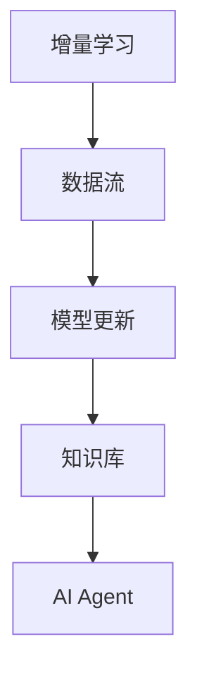
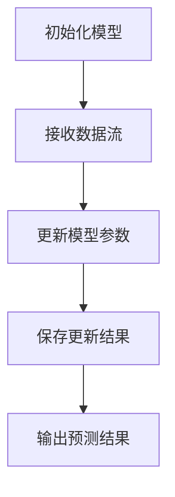
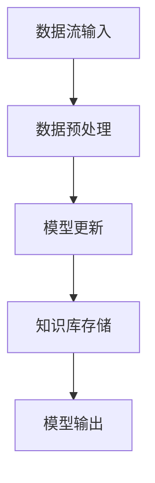

                 


# 增量学习：持续更新AI Agent的知识库

---

## 关键词：
增量学习，AI Agent，知识库更新，数据流处理，模型优化，实时推荐系统

---

## 摘要：
增量学习是一种实时更新AI Agent知识库的核心技术，它通过持续处理数据流，动态优化模型参数，实现知识库的高效更新与扩展。本文将从增量学习的背景、核心原理、算法实现、系统架构到实际应用案例进行全面解析，深入探讨其在AI Agent持续进化中的重要性与应用价值。

---

# 第一部分: 增量学习的背景与概念

## 第1章: 增量学习的背景与概念

### 1.1 增量学习的背景
在人工智能领域，AI Agent需要在动态变化的环境中实时感知、学习和适应新任务。传统的批量学习方法由于无法处理实时数据流，难以满足AI Agent持续更新知识库的需求。增量学习作为一种实时学习范式，能够动态处理数据流，持续优化模型，成为AI Agent知识库更新的核心技术。

#### 1.1.1 传统机器学习的局限性
传统机器学习方法（如支持向量机、随机森林等）通常基于批量数据进行离线训练，无法处理实时数据流，且在模型部署后难以进行更新。这种方法在动态环境中表现不佳，无法适应数据分布的变化。

#### 1.1.2 AI Agent的持续更新需求
AI Agent需要在复杂多变的环境中实时感知、学习和决策。例如，在实时推荐系统中，用户行为数据不断变化，需要模型实时更新以提供更精准的推荐。增量学习能够满足这种持续更新的需求。

#### 1.1.3 增量学习的定义与特点
增量学习是一种在线学习范式，其核心是通过处理实时数据流，逐步更新模型参数，实现知识库的动态优化。与批量学习不同，增量学习具有实时性、动态性和高效性等特点。

### 1.2 增量学习的核心概念
增量学习涉及多个核心概念，包括数据流的处理方式、模型更新策略、知识库的组织与管理等。这些概念共同构成了增量学习的理论基础。

#### 1.2.1 增量学习的定义
增量学习是指在数据流不断输入的情况下，模型逐步更新参数，以适应数据分布的变化。其核心在于模型能够实时处理数据流，并动态优化自身。

#### 1.2.2 增量学习与传统学习的对比
| 特性                | 增量学习                     | 传统批量学习                 |
|---------------------|------------------------------|------------------------------|
| 数据输入方式        | 实时数据流                   | 离线批量数据                 |
| 模型更新方式        | 在线更新                     | 离线训练                     |
| 计算效率            | 实时性强                     | 计算资源消耗较高             |
| 适应性              | 高                           | 低                           |

#### 1.2.3 增量学习的边界与外延
增量学习的边界在于实时数据流的处理和模型的在线更新。其外延包括在线学习、流学习、增量式机器学习等。

### 1.3 增量学习的场景与应用
增量学习在多个领域具有广泛的应用，例如实时推荐系统、动态数据流处理、在线广告投放等。

#### 1.3.1 AI Agent的知识库更新
AI Agent需要实时更新知识库以应对环境的变化。增量学习能够高效处理实时数据流，动态优化知识库。

#### 1.3.2 实时数据流处理
在实时数据流处理中，增量学习能够逐条处理数据，避免了批量处理的高资源消耗。

#### 1.3.3 持续优化的推荐系统
增量学习能够实时更新推荐模型，根据用户行为数据动态优化推荐结果，提升用户体验。

### 1.4 本章小结
本章介绍了增量学习的背景、定义、特点及其应用场景。通过对比增量学习与传统批量学习，明确了增量学习的核心优势。

---

## 第2章: 增量学习的核心概念与联系

### 2.1 增量学习的理论基础
增量学习的理论基础包括在线学习、流学习和增量式机器学习。

#### 2.1.1 在线学习与流学习
在线学习是指在单个样本逐个输入的情况下更新模型，而流学习是指在数据流不断输入的情况下更新模型。两者的核心在于实时性和动态性。

#### 2.1.2 增量式机器学习
增量式机器学习是一种基于增量数据更新模型的方法，其核心是高效处理实时数据流。

### 2.2 增量学习的核心要素
增量学习涉及多个核心要素，包括数据流的处理方式、模型更新策略和知识库的组织与管理。

#### 2.2.1 数据流的处理方式
数据流的处理方式包括单样本处理和小批量处理。单样本处理适用于计算资源有限的情况，而小批量处理能够提升模型更新的稳定性。

#### 2.2.2 模型更新策略
模型更新策略包括全模型更新和部分模型更新。全模型更新能够确保模型的准确性，而部分模型更新能够减少计算开销。

#### 2.2.3 知识库的组织与管理
知识库的组织与管理包括数据存储、特征提取和模型索引。高效的知识库管理能够提升增量学习的效率。

### 2.3 增量学习的ER实体关系图
以下是增量学习的ER实体关系图：


### 2.4 本章小结
本章深入探讨了增量学习的理论基础和核心要素，通过ER实体关系图展示了增量学习的系统架构。

---

## 第3章: 增量学习的算法实现

### 3.1 增量学习的算法原理
增量学习的算法原理包括在线学习算法和增量式机器学习算法。

#### 3.1.1 在线学习算法的原理
在线学习算法的核心在于逐个处理数据样本，并实时更新模型参数。其数学模型如下：
$$
w_{t+1} = w_t + \eta(y_t - y_t^{pre})x_t
$$
其中，\(w_t\) 是当前模型参数，\(\eta\) 是学习率，\(y_t\) 是真实标签，\(y_t^{pre}\) 是预测标签，\(x_t\) 是输入样本。

#### 3.1.2 增量学习的数学模型
增量学习的数学模型可以表示为：
$$
w_{t+1} = w_t + \eta(y_t - y_t^{pre})x_t
$$
其中，\(w_t\) 是当前模型参数，\(\eta\) 是学习率，\(y_t\) 是真实标签，\(y_t^{pre}\) 是预测标签，\(x_t\) 是输入样本。

#### 3.1.3 算法的收敛性分析
在线学习算法的收敛性取决于数据分布和模型复杂度。在某些条件下，增量学习算法能够收敛到全局最优。

### 3.2 增量学习的算法流程
以下是增量学习的算法流程图：


### 3.3 增量学习的Python实现
以下是一个增量学习算法的Python实现示例：
```python
import numpy as np
from sklearn.linear_model import SGDClassifier

# 初始化模型
model = SGDClassifier()

# 增量更新函数
def incremental_learn(X, y):
    model.partial_fit(X, y)
    return model

# 示例数据
X = np.array([[1, 2], [3, 4]])
y = np.array([0, 1])

# 更新模型
updated_model = incremental_learn(X, y)

# 预测
print(updated_model.predict(X))
```

### 3.4 本章小结
本章详细介绍了增量学习的算法原理和实现方法，通过数学公式和代码示例展示了增量学习的具体实现过程。

---

## 第4章: 增量学习的系统分析与架构设计

### 4.1 系统分析
增量学习系统的分析包括数据流处理、模型更新和知识库管理。

#### 4.1.1 数据流处理
数据流处理的核心是高效处理实时数据，包括数据预处理和特征提取。

#### 4.1.2 模型更新
模型更新策略包括全模型更新和部分模型更新，需要根据具体场景选择合适的策略。

#### 4.1.3 知识库管理
知识库管理包括数据存储、特征提取和模型索引，需要高效组织和管理知识库。

### 4.2 系统架构设计
以下是增量学习系统的架构图：


### 4.3 接口设计
增量学习系统的接口设计包括数据输入接口、模型更新接口和知识库查询接口。

#### 4.3.1 数据输入接口
数据输入接口负责接收实时数据流，并进行预处理。

#### 4.3.2 模型更新接口
模型更新接口负责根据预处理后的数据更新模型参数。

#### 4.3.3 知识库查询接口
知识库查询接口负责根据模型输出结果查询知识库。

### 4.4 本章小结
本章详细分析了增量学习系统的架构设计和接口设计，展示了增量学习系统的整体架构。

---

## 第5章: 增量学习的项目实战

### 5.1 项目介绍
本项目旨在实现一个基于增量学习的实时推荐系统。

#### 5.1.1 项目目标
项目的目的是通过增量学习算法实时更新推荐模型，提升推荐系统的准确性和实时性。

#### 5.1.2 项目需求
项目需求包括实时数据流处理、模型动态更新和推荐结果输出。

### 5.2 核心代码实现
以下是一个增量学习算法的Python实现示例：
```python
import numpy as np
from sklearn.linear_model import SGDClassifier

# 初始化模型
model = SGDClassifier()

# 增量更新函数
def incremental_learn(X, y):
    model.partial_fit(X, y)
    return model

# 示例数据
X = np.array([[1, 2], [3, 4]])
y = np.array([0, 1])

# 更新模型
updated_model = incremental_learn(X, y)

# 预测
print(updated_model.predict(X))
```

### 5.3 案例分析
以下是一个增量学习算法在实时推荐系统中的应用案例：
1. 数据预处理：对实时数据流进行清洗和特征提取。
2. 模型更新：根据预处理后的数据动态更新推荐模型。
3. 推荐结果输出：根据更新后的模型输出推荐结果。

### 5.4 本章小结
本章通过一个实际项目展示了增量学习算法的实现过程，通过案例分析说明了增量学习算法的应用场景。

---

## 第6章: 增量学习的应用案例

### 6.1 应用场景介绍
增量学习算法在多个领域具有广泛的应用，例如实时推荐系统、动态数据流处理和在线广告投放。

#### 6.1.1 实时推荐系统
实时推荐系统需要根据用户行为数据动态更新推荐模型，提升用户体验。

#### 6.1.2 动态数据流处理
动态数据流处理需要实时更新模型参数，适应数据分布的变化。

#### 6.1.3 在线广告投放
在线广告投放需要根据用户行为数据动态优化广告推荐策略。

### 6.2 应用案例分析
以下是增量学习算法在实时推荐系统中的应用案例：
1. 数据预处理：对实时数据流进行清洗和特征提取。
2. 模型更新：根据预处理后的数据动态更新推荐模型。
3. 推荐结果输出：根据更新后的模型输出推荐结果。

### 6.3 本章小结
本章通过多个应用案例展示了增量学习算法的实际应用场景，说明了增量学习算法的实用价值。

---

## 第7章: 总结与展望

### 7.1 总结
增量学习是一种实时更新AI Agent知识库的核心技术，其优势在于高效处理数据流和动态优化模型参数。本文从背景、理论基础、算法实现、系统架构到实际应用案例全面探讨了增量学习的核心内容。

### 7.2 展望
未来，增量学习将在更多领域得到广泛应用，例如实时决策系统、动态知识图谱构建和自适应学习系统。同时，增量学习算法的优化和创新也将推动人工智能技术的进步。

### 7.3 注意事项
在实际应用中，需要注意数据流的质量、模型更新的频率和计算资源的限制。

### 7.4 拓展阅读
推荐阅读以下书籍和论文：
1. 《机器学习实战》
2. 《增量学习：算法与应用》
3. 《在线学习算法综述》

---

## 作者：AI天才研究院/AI Genius Institute & 禅与计算机程序设计艺术 /Zen And The Art of Computer Programming

---

**本文完。**

