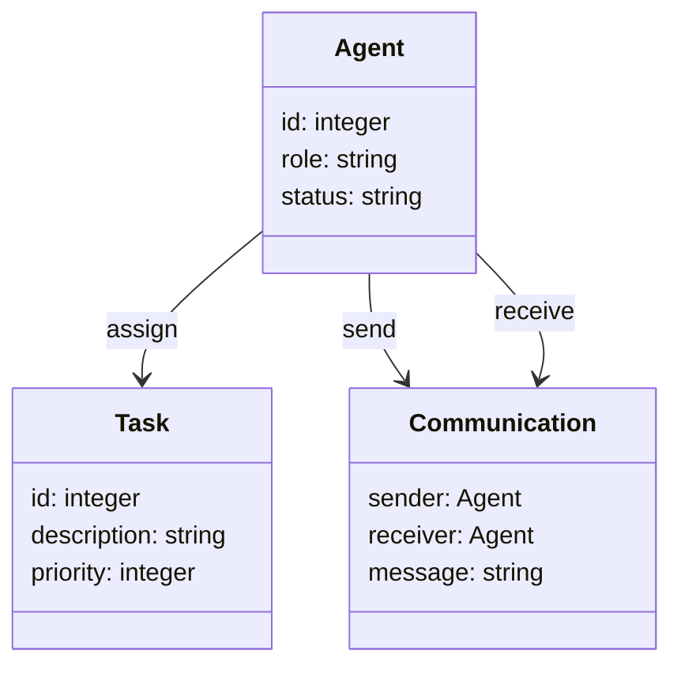
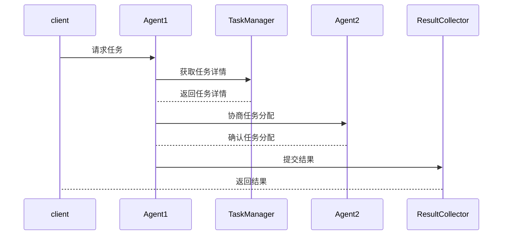

                 


# 多Agent协作系统：复杂任务的分布式解决方案

> 关键词：多Agent协作系统、分布式计算、任务分配、协作机制、系统架构、算法实现

> 摘要：多Agent协作系统是一种通过多个智能体协同工作来解决复杂任务的分布式系统。本文将从多Agent协作系统的定义、核心机制、算法实现、系统架构设计、项目实战到最佳实践等方面进行详细探讨，帮助读者全面理解多Agent协作系统的设计与实现。

---

# 第1章: 多Agent协作系统概述

## 1.1 多Agent系统的定义与特点

### 1.1.1 多Agent系统的定义
多Agent系统是由多个智能体（Agent）组成的分布式系统，这些智能体通过协作完成复杂的任务。每个Agent都是一个独立的实体，具有自主性、反应性和社会性。

### 1.1.2 多Agent系统的核心特点
- **自主性**：每个Agent能够独立决策和行动。
- **反应性**：能够感知环境并做出实时反应。
- **协作性**：多个Agent通过通信和协作完成任务。
- **分布式性**：Agent分布在不同的节点上，通过网络通信协作。

### 1.1.3 多Agent系统与分布式系统的关系
多Agent系统是一种特殊的分布式系统，但更强调智能体的协作与自主性。

## 1.2 复杂任务的分布式解决方案

### 1.2.1 问题背景与挑战
复杂任务通常涉及多个子任务，需要多个智能体协作完成。传统集中式系统在扩展性和容错性上存在不足。

### 1.2.2 分布式计算的基本概念
分布式计算将任务分解到多个计算节点上，通过协作完成整体任务。

### 1.2.3 多Agent协作的优势
- **高效性**：通过并行计算提高任务执行效率。
- **容错性**：单个Agent失效不影响整体任务完成。
- **灵活性**：能够适应动态变化的环境。

## 1.3 多Agent协作系统的应用场景

### 1.3.1 分布式任务调度
多Agent系统可以用于分布式任务调度，例如云计算中的资源分配。

### 1.3.2 分布式计算中的协作
在科学计算、大数据处理等领域，多Agent协作能够提高计算效率。

### 1.3.3 多Agent协作的实际案例
例如，自动驾驶系统中的多个Agent协作完成路径规划和决策。

## 1.4 本章小结
本章介绍了多Agent协作系统的定义、特点及其在复杂任务中的应用价值。

---

# 第2章: 多Agent协作的核心机制

## 2.1 多Agent协作的通信机制

### 2.1.1 通信协议的选择与设计
选择合适的通信协议是多Agent协作的关键。常用的通信协议包括HTTP、WebSocket等。

### 2.1.2 通信过程中的数据传输
数据传输需要考虑可靠性、实时性和安全性。

## 2.2 任务分配与协调机制

### 2.2.1 任务分配策略
任务分配策略包括轮询分配、负载均衡分配等。

### 2.2.2 协调机制的实现
通过协商算法实现任务分配和资源协调。

## 2.3 冲突检测与解决

### 2.3.1 冲突的定义与分类
冲突可以是资源竞争、任务优先级冲突等。

### 2.3.2 冲突检测算法
基于状态监测和事件触发的冲突检测算法。

### 2.3.3 冲突解决策略
优先级规则、协商解决等。

## 2.4 本章小结
本章重点讨论了多Agent协作中的通信机制、任务分配策略以及冲突解决方法。

---

# 第3章: 多Agent协作的算法与实现

## 3.1 分布式计算中的协商算法

### 3.1.1 协商算法的基本概念
协商算法用于多个Agent之间达成一致。

### 3.1.2 协商算法的分类与特点
协商算法可以分为同步协商和异步协商两类。

## 3.2 任务分配算法

### 3.2.1 基于资源分配的任务分配算法
根据资源利用率动态分配任务。

### 3.2.2 基于负载均衡的任务分配算法
确保每个Agent的负载均衡。

## 3.3 协作过程中的同步与一致性

### 3.3.1 同步机制
通过时间戳或版本号实现数据同步。

### 3.3.2 一致性算法
分布式一致性算法如Paxos、Raft等。

## 3.4 本章小结
本章详细讲解了多Agent协作中的协商算法和任务分配算法，并讨论了同步与一致性问题。

---

# 第4章: 系统架构与设计

## 4.1 问题场景介绍
复杂任务的分布式解决方案需要设计合理的系统架构。

## 4.2 系统功能设计

### 4.2.1 领域模型设计
领域模型设计包括任务分解、Agent角色定义等。

### 4.2.2 领域模型Mermaid类图


## 4.3 系统架构设计

### 4.3.1 系统架构Mermaid架构图


## 4.4 系统接口设计

### 4.4.1 系统接口设计
包括Agent注册、任务分配、通信接口等。

## 4.5 系统交互设计

### 4.5.1 系统交互Mermaid序列图


## 4.6 本章小结
本章详细讲解了多Agent协作系统的架构设计、接口设计和交互设计。

---

# 第5章: 项目实战

## 5.1 环境安装与配置

### 5.1.1 系统环境
- 操作系统：Linux/Windows
- 开发工具：Python、IDE
- 第三方库：如Flask、Celery等

## 5.2 系统核心实现

### 5.2.1 Agent类实现
```python
class Agent:
    def __init__(self, id, role):
        self.id = id
        self.role = role
        self.status = "idle"
    
    def assign_task(self, task):
        # 实现任务分配逻辑
        pass
    
    def send_message(self, receiver, message):
        # 实现通信逻辑
        pass
```

### 5.2.2 任务分配算法实现
```python
class TaskAllocator:
    def __init__(self):
        self.agents = []
    
    def allocate_task(self, task):
        # 根据负载均衡分配任务
        pass
```

### 5.2.3 通信协议实现
```python
class Communicator:
    def __init__(self):
        pass
    
    def send(self, sender, receiver, message):
        # 实现消息发送逻辑
        pass
    
    def receive(self, receiver, message):
        # 实现消息接收逻辑
        pass
```

## 5.3 代码应用解读与分析
详细分析核心代码的实现逻辑，包括任务分配、通信等部分。

## 5.4 实际案例分析
以具体案例为例，展示多Agent协作系统的实际应用。

## 5.5 本章小结
本章通过实际项目展示了多Agent协作系统的实现过程。

---

# 第6章: 最佳实践与总结

## 6.1 最佳实践 tips

### 6.1.1 系统设计建议
- 明确Agent角色与职责
- 设计高效的通信机制
- 选择合适的任务分配算法

### 6.1.2 开发注意事项
- 确保系统的可扩展性
- 处理好冲突与协调问题
- 提高系统的容错性

## 6.2 项目总结与展望

### 6.2.1 项目总结
总结项目的实现过程和取得的成果。

### 6.2.2 未来展望
讨论多Agent协作系统的发展趋势和潜在的研究方向。

## 6.3 本章小结
本章总结了多Agent协作系统的开发经验，并展望了未来的发展方向。

---

# 作者：AI天才研究院/AI Genius Institute & 禅与计算机程序设计艺术 /Zen And The Art of Computer Programming

---

通过以上目录结构，文章将从多Agent协作系统的定义、核心机制、算法实现、系统架构设计、项目实战到最佳实践进行全面探讨，帮助读者全面理解多Agent协作系统的设计与实现。

