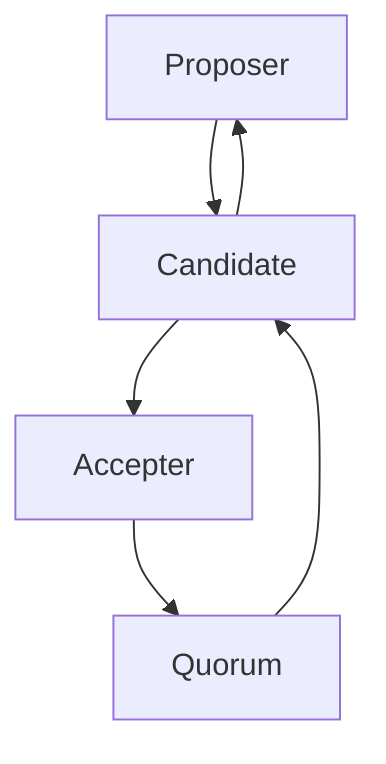
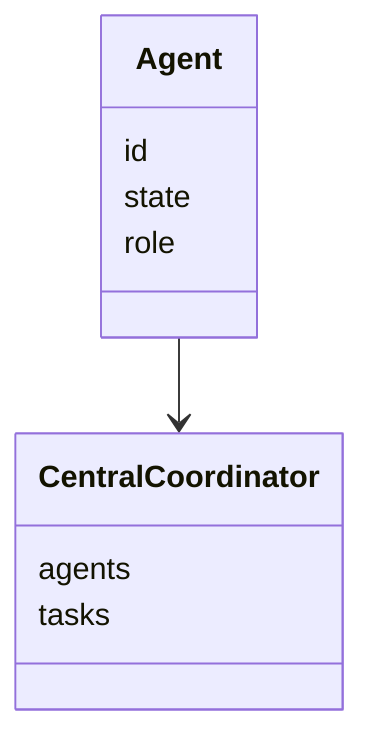
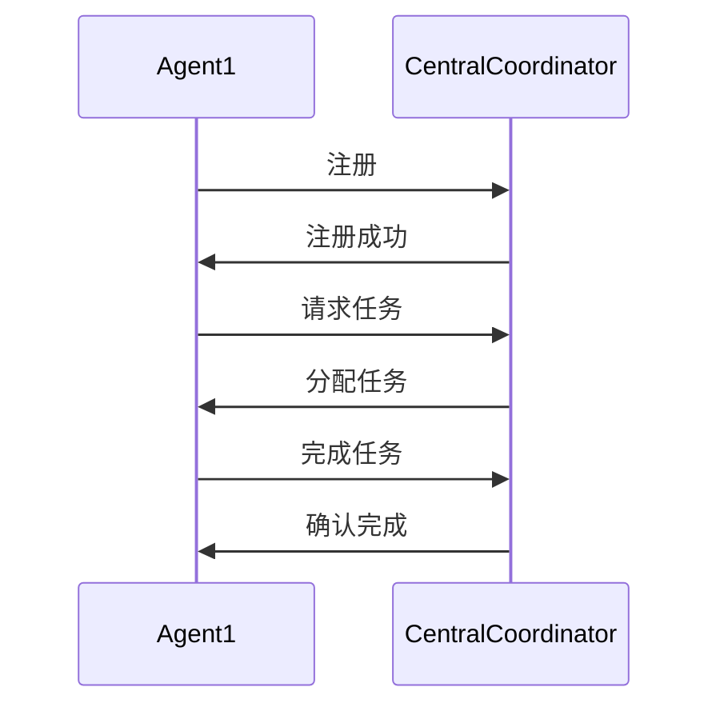

                 


# 多Agent协作：构建复杂的智能系统

> 关键词：多Agent系统，协作机制，智能系统，分布式计算，一致性算法

> 摘要：多Agent协作是指多个智能体通过协作完成复杂任务的过程，涉及分布式计算、协商算法和系统架构设计。本文从背景、核心概念、算法原理、系统架构到项目实战，全面探讨如何构建复杂的多Agent协作系统。

## 第一部分: 多Agent协作的背景与基础

## 第1章: 多Agent协作概述

### 1.1 多Agent系统的定义与特点

#### 1.1.1 多Agent系统的定义

多Agent系统由多个智能体（Agent）组成，这些智能体能够感知环境、自主决策并协作完成任务。与单Agent系统相比，多Agent系统具备更强的分布式计算和协同能力。

#### 1.1.2 多Agent系统的核心特点

- 分布式：多个Agent分布在网络中，独立运行。
- 协作性：Agent之间通过通信和协商完成任务。
- 自主性：每个Agent具备自主决策的能力。
- 可扩展性：系统可扩展以适应更大规模的任务。

#### 1.1.3 多Agent与单Agent系统的区别

| 特性 | 单Agent系统 | 多Agent系统 |
|------|-------------|-------------|
| 控制方式 | 单一控制中心 | 分布式控制 |
| 任务处理 | 单一任务处理 | 多任务协作处理 |
| 可扩展性 | 较低 | 较高 |

### 1.2 多Agent协作的背景与问题背景

#### 1.2.1 当前复杂智能系统的需求

随着智能系统规模的扩大，单个Agent难以处理复杂任务，需要多个Agent协作。

#### 1.2.2 多Agent协作的应用场景

- 分布式计算：如云计算中的任务分配。
- 智能机器人协作：如工业机器人协同完成生产任务。
- 自动驾驶：车辆之间协作避免碰撞。

#### 1.2.3 多Agent协作的核心问题

- 协作机制：如何让Agent之间有效协作。
- 通信协议：如何确保Agent之间有效通信。
- 一致性算法：如何保证系统一致性。

### 1.3 多Agent协作的目标与意义

#### 1.3.1 多Agent协作的目标

通过协作提高任务处理效率和系统整体性能。

#### 1.3.2 多Agent协作在智能系统中的意义

使系统具备更强的适应性和扩展性，能够处理更大规模的任务。

#### 1.3.3 多Agent协作的优势与挑战

优势：提高系统的容错性和可用性。

挑战：需要处理通信延迟、计算复杂性等问题。

### 1.4 多Agent协作的边界与外延

#### 1.4.1 多Agent协作的边界

确定系统中哪些部分需要协作，哪些部分独立运行。

#### 1.4.2 多Agent协作的外延

涉及分布式系统、分布式计算和分布式算法等领域。

#### 1.4.3 多Agent协作与其他技术的关系

与分布式系统密切相关，依赖于通信协议和一致性算法等技术。

---

## 第2章: 多Agent协作的核心概念与联系

### 2.1 多Agent协作的核心概念

#### 2.1.1 Agent的定义与分类

**定义**：Agent是一个能够感知环境、自主决策并采取行动的实体。

**分类**：
- 按智能水平：简单反射型、基于模型的反应型、基于效用的。
- 按行为方式：反应式、规划式、混合式。

#### 2.1.2 多Agent协作的定义与特点

多Agent协作是指多个Agent通过通信和协商，共同完成复杂任务的过程。其特点包括分布式决策、自主性和协作性。

#### 2.1.3 多Agent协作的核心要素

- 通信：Agent之间的信息交换。
- 协商：达成一致决策的过程。
- 协作：共同完成任务的行为。

### 2.2 多Agent协作的核心原理

#### 2.2.1 多Agent协作的基本原理

通过通信和协商，多个Agent协同完成任务，确保系统整体目标的实现。

#### 2.2.2 多Agent协作的关键机制

- 通信机制：定义Agent之间的信息交换方式。
- 协商机制：如何达成一致决策。
- 协作机制：如何分配任务和协调行动。

#### 2.2.3 多Agent协作的数学模型

数学模型用于描述Agent之间的协作关系，通常采用图论模型，节点代表Agent，边代表协作关系。

### 2.3 多Agent协作的核心概念对比

#### 2.3.1 Agent的类型对比

| 类型 | 特点 |
|------|------|
| 简单反射型 | 基于当前感知做出反应 |
| 基于模型的反应型 | 使用内部模型进行决策 |
| 基于效用的 | 基于效用函数优化决策 |

#### 2.3.2 协作机制的对比

| 机制 | 特点 |
|------|------|
| 分布式协商 | Agent之间自主协商 |
| 中央协调 | 由中央控制节点协调 |
| 基于规则 | 使用预定义规则进行协作 |

#### 2.3.3 多Agent协作的概念结构

```mermaid
graph TD
    A[Agent1] --> C[中央协调器]
    B[Agent2] --> C
    D[Agent3] --> C
    C --> A, B, D
```

---

## 第3章: 多Agent协作的算法原理

### 3.1 分布式计算与一致性算法

#### 3.1.1 分布式计算的基本原理

分布式计算是指在多台计算机上进行计算的过程，通过通信和协调完成任务。

#### 3.1.2 一致性算法

一致性算法用于确保分布式系统中的数据一致性，常见算法包括：

- **Paxos算法**：用于在分布式系统中达成一致的协议。
- **Raft算法**：用于选举领导节点和同步数据。

#### 3.1.3 一致性算法的实现



#### 3.1.4 一致性算法的数学模型

一致性算法确保所有节点的状态同步，数学模型如下：

$$ \text{一致性} = \forall i, j \in \text{Nodes}, \text{Node}_i.\text{state} = \text{Node}_j.\text{state} $$

### 3.2 协商算法

#### 3.2.1 协商算法的分类

- 基于价格的协商：通过价格机制达成一致。
- 基于规则的协商：基于预定义规则进行协商。

#### 3.2.2 协商算法的实现

协商过程通常包括：

1. **初始化**：设置初始状态。
2. **协商**：通过通信达成一致。
3. **决策**：基于协商结果做出决策。

#### 3.2.3 协商算法的数学模型

协商过程可以用状态转移图表示：

$$ S \rightarrow S' $$

其中，S是当前状态，S'是协商后的状态。

---

## 第4章: 多Agent协作的系统分析与架构设计

### 4.1 问题场景介绍

#### 4.1.1 问题场景描述

在一个多Agent协作的物流系统中，多个Agent负责订单处理、库存管理和配送任务。

#### 4.1.2 系统功能需求

- 订单处理：接收订单并分配给配送Agent。
- 库存管理：实时更新库存信息。
- 配送任务：完成订单配送。

### 4.2 系统功能设计

#### 4.2.1 领域模型设计



#### 4.2.2 系统架构设计

```mermaid
graph TD
    A[Agent1] --> C[CentralCoordinator]
    B[Agent2] --> C
    D[Agent3] --> C
    C --> A, B, D
```

### 4.3 系统接口设计

#### 4.3.1 系统接口描述

- `/api/register`：注册Agent。
- `/api/task`：分配任务。
- `/api/report`：汇报任务进度。

#### 4.3.2 系统接口实现

```python
class Agent:
    def __init__(self, id):
        self.id = id
        self.state = 'idle'

    def register(self):
        # 注册到中央协调器
        pass

    def receive_task(self, task):
        # 接收任务
        pass

    def report(self, status):
        # 汇报状态
        pass
```

### 4.4 系统交互设计

#### 4.4.1 交互序列图



---

## 第5章: 多Agent协作的项目实战

### 5.1 环境安装与配置

#### 5.1.1 环境需求

- Python 3.8+
- Mermaid图生成工具
- 分布式计算库（如Paxos库）

#### 5.1.2 环境配置

```bash
pip install mermaid-cli
pip install paxos
```

### 5.2 系统核心代码实现

#### 5.2.1 Agent类实现

```python
class Agent:
    def __init__(self, id, coordinator):
        self.id = id
        self.coordinator = coordinator
        self.state = 'idle'

    def register(self):
        self.coordinator.register_agent(self)

    def receive_task(self, task):
        # 处理任务
        pass

    def report_status(self, status):
        self.coordinator.update_status(self, status)
```

#### 5.2.2 中央协调器实现

```python
class CentralCoordinator:
    def __init__(self):
        self.agents = []
        self.tasks = []

    def register_agent(self, agent):
        self.agents.append(agent)

    def assign_task(self, agent, task):
        agent.receive_task(task)
```

### 5.3 代码应用解读与分析

#### 5.3.1 代码功能解读

- Agent类负责注册、接收任务和汇报状态。
- 中央协调器负责注册Agent、分配任务和更新状态。

#### 5.3.2 代码实现的关键点

- 通信机制的实现。
- 任务分配逻辑的实现。
- 状态更新的实现。

### 5.4 实际案例分析

#### 5.4.1 案例背景介绍

在一个多Agent协作的物流系统中，多个配送Agent协作完成订单配送。

#### 5.4.2 系统运行流程

1. Agent注册到中央协调器。
2. 中央协调器分配任务。
3. Agent处理任务并汇报状态。
4. 系统更新状态并分配新任务。

#### 5.4.3 系统性能分析

- 响应时间：任务分配和处理的时间。
- 系统吞吐量：单位时间内处理的任务数量。
- 系统可用性：系统在故障时的恢复能力。

### 5.5 项目小结

通过实际案例分析，展示了多Agent协作系统的设计和实现过程。重点讨论了系统的通信机制、任务分配和状态更新机制。

---

## 第6章: 多Agent协作的最佳实践与小结

### 6.1 最佳实践 tips

#### 6.1.1 通信机制的选择

选择合适的通信协议，确保Agent之间的高效通信。

#### 6.1.2 协作机制的设计

设计合理的协商算法，确保系统的一致性和高效性。

#### 6.1.3 系统架构设计

采用分层架构，确保系统的可扩展性和可维护性。

### 6.2 小结

多Agent协作系统通过多个智能体的协作，能够处理复杂任务。本文从背景、核心概念、算法、系统架构到项目实战，全面探讨了多Agent协作系统的构建过程。

### 6.3 注意事项

- 确保通信机制的可靠性和高效性。
- 设计合理的协商算法，避免系统死锁。
- 采用合适的一致性算法，确保数据一致性。

### 6.4 拓展阅读

- 分布式系统与一致性算法
- 多Agent协作的优化技术
- 多智能体系统中的自适应机制

---

## 作者

作者：AI天才研究院/AI Genius Institute & 禅与计算机程序设计艺术 /Zen And The Art of Computer Programming

---

以上是《多Agent协作：构建复杂的智能系统》的完整目录大纲及内容概要。

