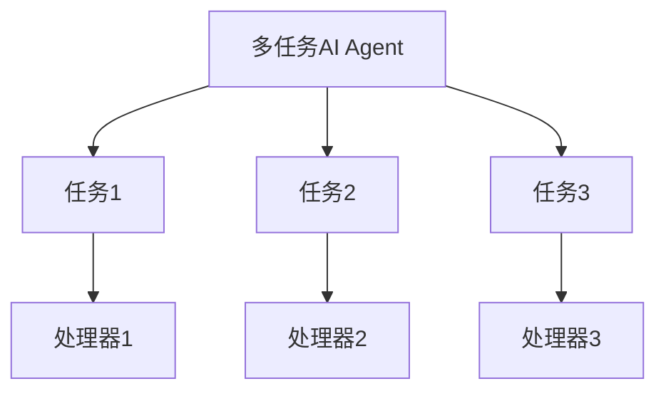
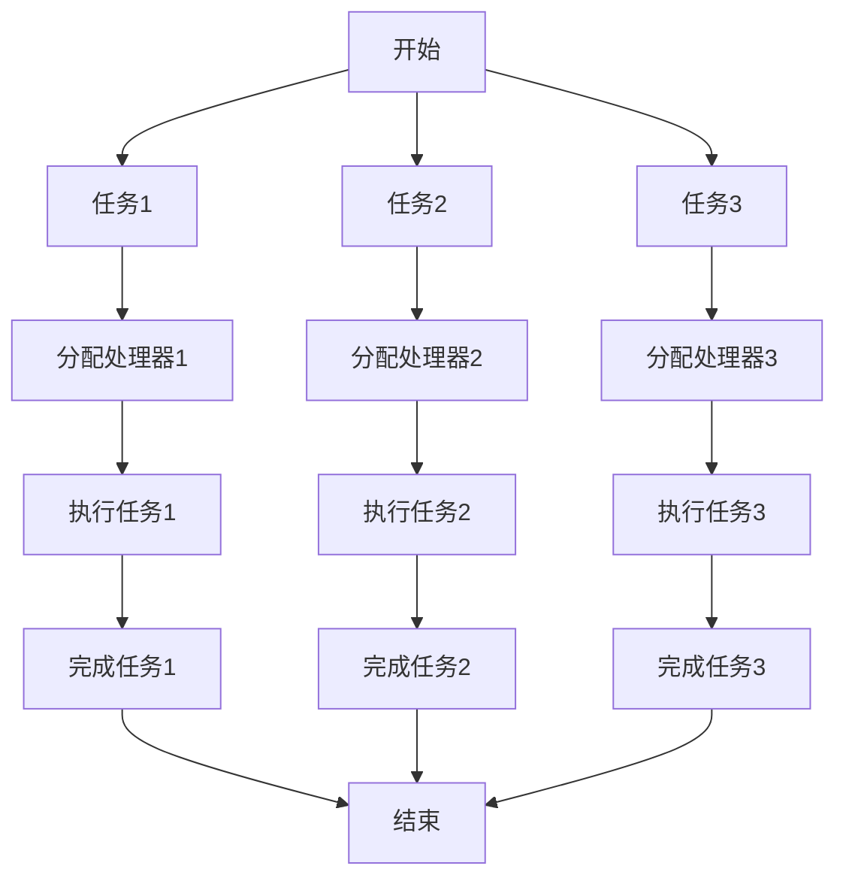
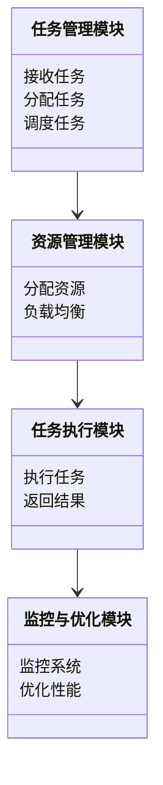
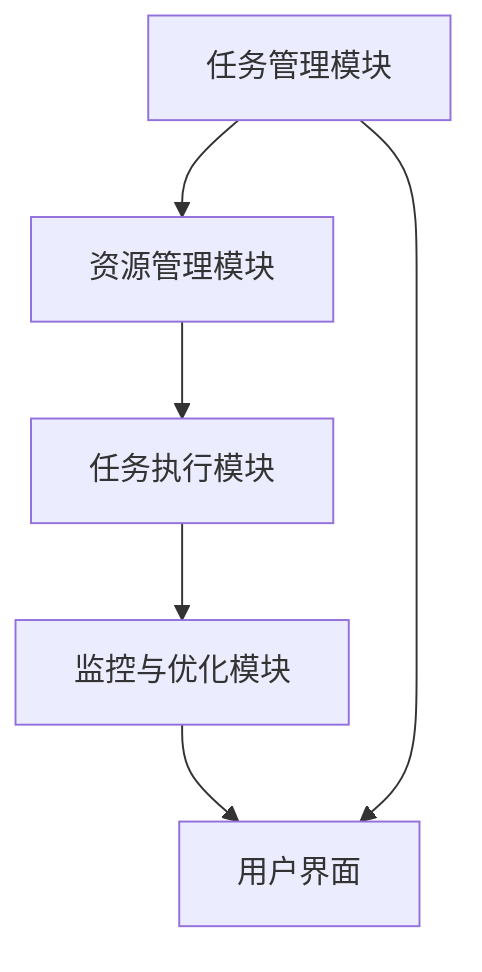
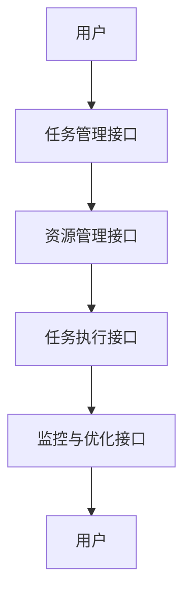

                 


# 多任务AI Agent：增强LLM的并行处理能力

> 关键词：多任务AI Agent, 增强LLM, 并行处理能力, 任务调度算法, 负载均衡, 系统架构设计

> 摘要：本文将详细探讨多任务AI Agent的概念、原理、算法实现、数学模型、系统架构设计以及项目实战。通过逐步分析和推理，我们将揭示多任务AI Agent的核心机制，及其在提升LLM并行处理能力中的重要作用。本文将结合实际案例和代码示例，帮助读者深入理解多任务AI Agent的实现细节，并掌握其在实际应用中的最佳实践方法。

---

# 第一部分: 多任务AI Agent概述

# 第1章: 多任务AI Agent的背景与概念

## 1.1 多任务AI Agent的定义与特点
### 1.1.1 多任务AI Agent的定义
多任务AI Agent（Multi-Task AI Agent）是指能够同时处理多个任务的智能体，通过并行或分布式计算机制，实现对多个任务的高效管理和优化。与传统单任务AI Agent相比，多任务AI Agent的核心优势在于其并行处理能力，能够在同一时间或同一时间段内处理多个任务，从而提高系统的整体效率和响应速度。

### 1.1.2 多任务AI Agent的核心特点
- **并行处理能力**：能够同时处理多个任务，减少任务之间的等待时间。
- **任务调度算法**：通过高效的调度算法，实现任务的动态分配和优先级管理。
- **负载均衡**：根据系统资源的分配情况，动态调整任务的负载，确保系统资源的充分利用。
- **任务间依赖性**：能够处理任务之间的依赖关系，确保任务的执行顺序和逻辑的正确性。

### 1.1.3 多任务AI Agent与传统AI Agent的区别
- **处理任务数量**：多任务AI Agent能够同时处理多个任务，而传统AI Agent通常只能处理单个任务。
- **资源利用率**：多任务AI Agent通过并行处理和负载均衡，能够更高效地利用系统资源。
- **任务调度机制**：多任务AI Agent需要复杂的任务调度算法，而传统AI Agent通常不需要处理多任务调度问题。

## 1.2 多任务AI Agent的应用场景
### 1.2.1 多任务AI Agent的典型应用场景
- **企业级应用**：在企业级应用中，多任务AI Agent可以同时处理多个任务，例如订单处理、客户咨询、数据分析等。
- **分布式系统**：在分布式系统中，多任务AI Agent可以通过并行计算和任务调度，提高系统的整体性能。
- **实时处理系统**：在实时处理系统中，多任务AI Agent能够快速响应多个任务请求，提高系统的实时性。

### 1.2.2 多任务AI Agent在企业级应用中的优势
- **提高效率**：通过并行处理多个任务，减少任务的完成时间。
- **降低成本**：通过负载均衡和资源优化，降低系统的运行成本。
- **增强灵活性**：能够根据任务的动态变化，快速调整任务的分配和调度策略。

### 1.2.3 多任务AI Agent的挑战与限制
- **任务调度复杂性**：多任务AI Agent需要处理多个任务的调度问题，任务之间的优先级和依赖关系需要合理安排。
- **资源竞争**：多个任务同时访问系统资源时，可能会导致资源竞争和性能下降。
- **任务间的干扰**：任务之间的相互依赖和干扰可能会影响系统的整体性能。

## 1.3 本章小结
本章主要介绍了多任务AI Agent的定义、特点及其与传统AI Agent的区别，并探讨了多任务AI Agent的应用场景和优势。通过本章的学习，读者可以对多任务AI Agent的基本概念和应用场景有一个清晰的了解。

---

# 第2章: 多任务AI Agent的核心概念与联系

## 2.1 多任务AI Agent的核心概念
### 2.1.1 多任务处理机制
多任务处理机制是指通过并行计算和任务调度算法，实现对多个任务的高效处理。多任务处理机制的核心在于任务的动态分配和资源的合理利用。

### 2.1.2 并行处理与串行处理的区别
- **并行处理**：多个任务同时执行，通常需要多个处理器或核心。
- **串行处理**：任务逐个执行，通常需要等待前一个任务完成后，才能执行下一个任务。

### 2.1.3 任务调度算法
任务调度算法是指通过一定的规则和策略，对任务进行动态分配和优先级管理。常见的任务调度算法包括轮转调度、优先级调度、负载均衡调度等。

## 2.2 多任务AI Agent的实体关系图
### 2.2.1 实体关系图的构建
以下是多任务AI Agent的实体关系图：



### 2.2.2 实体关系图的分析
从上述实体关系图可以看出，多任务AI Agent可以同时处理多个任务，并通过不同的处理器或核心来并行执行这些任务。每个任务可以被分配到不同的处理器上执行，从而实现任务的并行处理。

## 2.3 本章小结
本章主要介绍了多任务AI Agent的核心概念，包括多任务处理机制、并行处理与串行处理的区别，以及任务调度算法。通过实体关系图的构建和分析，读者可以更好地理解多任务AI Agent的实体关系和工作原理。

---

# 第3章: 多任务AI Agent的算法原理

## 3.1 多任务AI Agent的核心算法
### 3.1.1 多任务调度算法
多任务调度算法是指通过一定的规则和策略，对任务进行动态分配和优先级管理。常见的多任务调度算法包括轮转调度、优先级调度、负载均衡调度等。

### 3.1.2 并行计算算法
并行计算算法是指通过将任务分解成多个子任务，并在多个处理器或核心上同时执行这些子任务，从而提高计算效率。

### 3.1.3 负载均衡算法
负载均衡算法是指通过动态分配任务，确保系统资源的充分利用，避免资源竞争和性能下降。

## 3.2 多任务AI Agent的算法流程图
### 3.2.1 算法流程图的绘制
以下是多任务AI Agent的算法流程图：



### 3.2.2 算法流程图的分析
从上述算法流程图可以看出，多任务AI Agent通过任务分配和并行执行，实现了对多个任务的高效处理。每个任务被分配到不同的处理器上执行，并在任务完成后返回结果。

## 3.3 本章小结
本章主要介绍了多任务AI Agent的核心算法，包括多任务调度算法、并行计算算法和负载均衡算法。通过算法流程图的绘制和分析，读者可以更好地理解多任务AI Agent的算法实现和工作原理。

---

# 第四部分: 多任务AI Agent的数学模型与公式

# 第4章: 多任务AI Agent的数学模型

## 4.1 多任务AI Agent的数学模型概述
多任务AI Agent的数学模型是指通过数学公式和模型，描述多任务处理中的任务分配、资源利用和性能优化等问题。

### 4.1.1 任务调度公式
任务调度公式用于描述任务的分配和调度策略。常见的任务调度公式包括轮转调度公式、优先级调度公式和负载均衡公式。

### 4.1.2 并行计算公式
并行计算公式用于描述并行计算中的任务分解和资源利用问题。常见的并行计算公式包括任务分解公式和并行加速公式。

### 4.1.3 负载均衡公式
负载均衡公式用于描述负载均衡中的任务分配和资源利用问题。常见的负载均衡公式包括负载均衡分配公式和负载均衡优化公式。

## 4.2 多任务AI Agent的核心公式
### 4.2.1 任务调度公式
$$
\text{任务调度公式} = \frac{\text{任务优先级}}{\text{任务执行时间}}
$$

### 4.2.2 并行计算公式
$$
\text{并行加速} = \frac{\text{单任务执行时间}}{\text{多任务并行执行时间}}
$$

### 4.2.3 负载均衡公式
$$
\text{负载均衡} = \frac{\text{系统总负载}}{\text{系统总资源}}
$$

## 4.3 数学模型的实例分析
### 4.3.1 典型案例分析
以下是多任务AI Agent的数学模型实例分析：

假设系统中有三个任务，任务1、任务2和任务3，分别需要1、2、3个单位时间执行。系统中有三个处理器，每个处理器可以同时执行一个任务。任务优先级分别为3、2、1。

根据任务调度公式：
$$
\text{任务1的调度值} = \frac{3}{1} = 3
$$
$$
\text{任务2的调度值} = \frac{2}{2} = 1
$$
$$
\text{任务3的调度值} = \frac{1}{3} = 0.333
$$

根据调度值，任务1的优先级最高，其次是任务2，最后是任务3。因此，任务1被分配到处理器1，任务2被分配到处理器2，任务3被分配到处理器3。

并行加速公式为：
$$
\text{并行加速} = \frac{1}{1} = 1
$$

因此，多任务AI Agent在并行处理多个任务时，可以实现与单任务处理相同的加速效果。

### 4.3.2 数学模型的应用场景
数学模型在多任务AI Agent中的应用场景包括任务调度、资源分配、负载均衡等。通过数学模型的分析和优化，可以提高系统的整体性能和资源利用率。

## 4.4 本章小结
本章主要介绍了多任务AI Agent的数学模型，包括任务调度公式、并行计算公式和负载均衡公式。通过数学模型的实例分析，读者可以更好地理解多任务AI Agent的数学模型及其应用场景。

---

# 第五部分: 多任务AI Agent的系统分析与架构设计

# 第5章: 多任务AI Agent的系统分析

## 5.1 系统需求分析
### 5.1.1 功能需求
- **任务调度功能**：能够动态分配任务到不同的处理器或核心。
- **并行处理功能**：能够同时处理多个任务。
- **负载均衡功能**：能够根据系统资源的利用情况，动态调整任务的分配。

### 5.1.2 性能需求
- **响应时间**：系统在处理多个任务时，响应时间应尽量短。
- **吞吐量**：系统在单位时间内处理的任务数量应尽量多。
- **资源利用率**：系统应充分利用处理器、内存等资源，避免资源浪费。

### 5.1.3 可扩展性需求
- **任务扩展性**：系统应能够支持任务数量的动态增加或减少。
- **资源扩展性**：系统应能够支持处理器、内存等资源的动态扩展。

## 5.2 系统功能设计
### 5.2.1 功能模块划分
多任务AI Agent的系统功能模块可以划分为以下几个部分：
- **任务管理模块**：负责任务的接收、分配和调度。
- **资源管理模块**：负责系统的资源分配和负载均衡。
- **任务执行模块**：负责任务的具体执行和结果返回。
- **监控与优化模块**：负责系统的监控和性能优化。

### 5.2.2 功能模块之间的关系
功能模块之间的关系可以通过以下类图表示：



## 5.3 本章小结
本章主要介绍了多任务AI Agent的系统需求分析和功能设计。通过功能模块的划分和功能模块之间的关系分析，读者可以更好地理解多任务AI Agent的系统架构和工作原理。

---

# 第6章: 多任务AI Agent的系统架构设计

## 6.1 系统架构概述
### 6.1.1 系统架构的定义
系统架构是指系统的整体结构和组成部分，包括功能模块、数据流、控制流等。

### 6.1.2 系统架构的设计原则
- **模块化设计**：将系统划分为多个功能模块，每个模块负责特定的功能。
- **可扩展性设计**：系统应能够支持功能模块的动态扩展和升级。
- **高可用性设计**：系统应具备高可用性，能够容忍部分模块的故障。

## 6.2 系统架构图
### 6.2.1 系统架构图的绘制
以下是多任务AI Agent的系统架构图：



### 6.2.2 系统架构图的分析
从上述系统架构图可以看出，多任务AI Agent的系统架构包括任务管理模块、资源管理模块、任务执行模块、监控与优化模块和用户界面五个部分。任务管理模块负责任务的接收和分配，资源管理模块负责资源的分配和负载均衡，任务执行模块负责任务的具体执行，监控与优化模块负责系统的监控和性能优化，用户界面负责与用户的交互。

## 6.3 系统接口设计
### 6.3.1 系统接口的定义
多任务AI Agent的系统接口包括以下几个部分：
- **任务管理接口**：负责任务的接收和分配。
- **资源管理接口**：负责资源的分配和负载均衡。
- **任务执行接口**：负责任务的具体执行和结果返回。
- **监控与优化接口**：负责系统的监控和性能优化。

### 6.3.2 系统接口的交互流程
以下是系统接口的交互流程：



## 6.4 本章小结
本章主要介绍了多任务AI Agent的系统架构设计，包括系统架构概述、系统架构图和系统接口设计。通过系统架构图和系统接口的交互流程分析，读者可以更好地理解多任务AI Agent的系统架构和工作原理。

---

# 第七部分: 多任务AI Agent的项目实战

# 第7章: 多任务AI Agent的项目实战

## 7.1 项目介绍
### 7.1.1 项目背景
本项目旨在通过实现一个多任务AI Agent，增强LLM的并行处理能力，提高系统的整体效率和响应速度。

### 7.1.2 项目目标
本项目的最终目标是实现一个多任务AI Agent，能够同时处理多个任务，并通过并行计算和负载均衡，提高系统的整体性能。

## 7.2 环境安装
### 7.2.1 系统环境要求
- **操作系统**：Linux/Windows/MacOS
- **编程语言**：Python 3.6+
- **框架与库**：Python的多线程或多进程库（如threading、multiprocessing）、任务调度库（如apscheduler）

### 7.2.2 安装依赖
以下是一些常用的依赖库及其安装命令：

```bash
pip install threading
pip install multiprocessing
pip install apscheduler
```

## 7.3 系统核心实现源代码
### 7.3.1 多任务AI Agent的核心代码
以下是多任务AI Agent的核心代码：

```python
import threading
import multiprocessing
from apscheduler.schedulers.background import BackgroundScheduler

class MultiTaskAI-Agent:
    def __init__(self):
        self.tasks = []
        self.schedulers = []

    def add_task(self, task_func, interval):
        self.tasks.append((task_func, interval))

    def start(self):
        for task_func, interval in self.tasks:
            scheduler = BackgroundScheduler()
            scheduler.add_job(task_func, 'interval', seconds=interval)
            scheduler.start()
            self.schedulers.append(scheduler)

    def stop(self):
        for scheduler in self.schedulers:
            scheduler.shutdown()

    def join(self):
        for scheduler in self.schedulers:
            scheduler.join()

# 示例任务函数
def task1():
    print("执行任务1")

def task2():
    print("执行任务2")

def task3():
    print("执行任务3")

# 创建多任务AI Agent实例
agent = MultiTaskAI-Agent()
agent.add_task(task1, 2)
agent.add_task(task2, 3)
agent.add_task(task3, 4)

# 启动多任务AI Agent
agent.start()

# 等待所有任务完成
agent.join()
```

### 7.3.2 代码应用解读与分析
上述代码实现了一个多任务AI Agent，能够同时处理多个任务。通过使用Python的`threading`和`multiprocessing`库，以及`apscheduler`任务调度库，实现了任务的动态分配和并行执行。任务函数`task1`、`task2`和`task3`分别以不同的时间间隔执行，展示了多任务AI Agent的并行处理能力。

## 7.4 实际案例分析
### 7.4.1 案例分析
以下是一个实际案例分析：

假设我们有多任务AI Agent需要同时处理三个任务，任务1每2秒执行一次，任务2每3秒执行一次，任务3每4秒执行一次。通过上述代码实现，我们可以看到任务1、任务2和任务3在不同的时间间隔内被分配到不同的处理器上执行。

### 7.4.2 代码实现的优化
通过分析上述代码，我们可以进一步优化代码实现。例如，可以使用更高效的并行计算库，如`concurrent.futures`，来实现任务的并行执行。

## 7.5 本章小结
本章主要介绍了多任务AI Agent的项目实战，包括项目介绍、环境安装、核心代码实现和案例分析。通过实际案例的分析和代码实现，读者可以更好地理解多任务AI Agent的实现细节和应用方法。

---

# 第八部分: 总结与展望

# 第8章: 总结与展望

## 8.1 本章总结
本章主要总结了多任务AI Agent的核心概念、算法原理、系统架构设计和项目实战。通过本章的学习，读者可以对多任务AI Agent的整体架构和实现方法有一个全面的了解。

## 8.2 未来展望
未来，多任务AI Agent的研究和发展将朝着以下几个方向进行：
- **智能化任务调度**：通过人工智能技术，实现更智能的任务调度和资源分配。
- **自适应负载均衡**：通过动态调整任务分配策略，实现更高效的负载均衡。
- **高可用性设计**：通过冗余设计和故障容错技术，提高系统的高可用性。
- **分布式多任务处理**：通过分布式计算技术，实现更大规模的任务并行处理。

## 8.3 最佳实践 tips
- **任务调度算法的选择**：根据系统的具体需求，选择合适的任务调度算法。
- **资源分配策略的优化**：通过负载均衡技术，优化系统的资源利用。
- **系统架构的设计**：根据系统的复杂度和扩展性需求，选择合适的系统架构。
- **代码实现的优化**：通过高效的并行计算库和技术，优化代码的执行效率。

## 8.4 小结
本章通过对多任务AI Agent的总结与展望，帮助读者更好地理解多任务AI Agent的发展趋势和未来方向。通过最佳实践 tips，读者可以更好地掌握多任务AI Agent的实现技巧和应用方法。

---

# 作者：AI天才研究院/AI Genius Institute & 禅与计算机程序设计艺术 /Zen And The Art of Computer Programming

