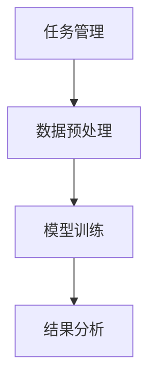
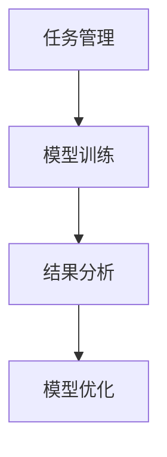
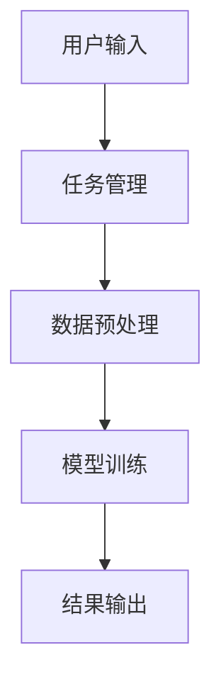

                 


# 多任务学习：构建全能型AI Agent

> 关键词：多任务学习，AI Agent，机器学习，深度学习，模型优化

> 摘要：多任务学习（Multi-Task Learning, MTL）是一种通过同时学习多个相关任务来提升模型泛化能力的机器学习方法。本文将深入探讨多任务学习的核心概念、算法原理、系统架构、项目实战以及优化策略，帮助读者构建一个全能型AI Agent。

---

## 第一部分: 多任务学习的背景与概念

### 第1章: 多任务学习的背景与核心概念

#### 1.1 多任务学习的定义与背景
##### 1.1.1 多任务学习的定义
多任务学习（Multi-Task Learning, MTL）是一种机器学习范式，旨在通过同时学习多个相关任务来提升模型的泛化能力。与单任务学习不同，MTL强调任务之间的关联性，能够更充分地利用数据和模型结构。

##### 1.1.2 多任务学习的背景与动机
在实际应用中，许多问题需要同时解决多个相关任务。例如，在自然语言处理中，一个模型可能需要同时进行文本分类、实体识别和情感分析。传统的单任务学习方法需要分别训练多个独立模型，效率较低且难以捕捉任务间的关联性。因此，多任务学习应运而生，成为提升模型性能的重要方法。

##### 1.1.3 多任务学习的核心目标
多任务学习的核心目标是通过共享任务之间的共同特征或知识，提升模型在多个任务上的表现。同时，MTL还可以通过减少数据需求和计算成本，提高学习效率。

#### 1.2 多任务学习的优势与应用场景
##### 1.2.1 多任务学习的优势
- **数据效率**：通过共享任务特征，减少每个任务所需的数据量。
- **模型泛化能力**：任务间的关联性有助于模型更好地泛化到新的任务。
- **计算效率**：同时训练多个任务可以减少模型训练的总时间。

##### 1.2.2 多任务学习的应用场景
- **自然语言处理**：如文本分类、情感分析、机器翻译等。
- **计算机视觉**：如图像分类、目标检测、语义分割等。
- **推荐系统**：如个性化推荐、协同过滤等。

##### 1.2.3 多任务学习与单任务学习的对比
| 对比维度 | 单任务学习 | 多任务学习 |
|----------|------------|------------|
| 数据需求 | 高 | 较低（任务间共享数据） |
| 模型复杂度 | 较低 | 较高（任务间共享参数） |
| 泛化能力 | 有限 | 更强（任务间关联性） |

#### 1.3 多任务学习的核心概念与原理
##### 1.3.1 任务之间的关系
任务之间的关系可以是：
- **独立**：任务之间没有明显的关联性。
- **相关**：任务之间存在一定的关联性，如情感分析和文本分类。
- **嵌套**：一个任务是另一个任务的子集，如多标签分类。

##### 1.3.2 多任务学习的数学模型
多任务学习的数学模型可以表示为：
$$ L = \sum_{i=1}^{n} \lambda_i L_i $$
其中，$L_i$ 是第 $i$ 个任务的损失函数，$\lambda_i$ 是任务权重系数。

##### 1.3.3 多任务学习的实现框架
- **共享参数**：所有任务共享部分参数，其余参数独立。
- **任务间关系**：通过任务间关系（如相似性）来构建模型。

---

## 第二部分: 多任务学习的算法原理

### 第2章: 多任务学习的核心算法

#### 2.1 多任务学习的主流算法
##### 2.1.1 基于共享参数的多任务学习
- **MTL (Multi-Task Learning)**：所有任务共享部分参数，其余参数独立。
- **MMI (Multi-Task Multi-Instance Learning)**：通过多示例学习来提升任务间的共享。

##### 2.1.2 基于任务间关系的多任务学习
- **MTD (Multi-Task Distillation)**：通过知识蒸馏来共享任务间的知识。

##### 2.1.3 基于任务分解的多任务学习
- **MTA (Multi-Task Attention)**：通过注意力机制来分解任务。

#### 2.2 基于共享参数的多任务学习算法
##### 2.2.1 MTL (Multi-Task Learning)
MTL通过共享部分参数来实现多个任务的学习。例如，在自然语言处理中，多个任务可以共享词嵌入层。

##### 2.2.2 MMI (Multi-Task Multi-Instance Learning)
MMI通过多示例学习来提升任务间的共享。例如，在图像分类中，多个任务可以共享卷积基。

##### 2.2.3 MCD (Multi-Task Contrastive Learning)
MCD通过对比学习来实现任务间的共享。

#### 2.3 多任务学习算法的数学模型
##### 2.3.1 MTL的数学模型
$$ L = \sum_{i=1}^{n} \lambda_i L_i $$
其中，$L_i$ 是第 $i$ 个任务的损失函数，$\lambda_i$ 是任务权重系数。

---

## 第三部分: 多任务学习的系统架构与设计

### 第3章: 多任务学习的系统架构与设计

#### 3.1 项目需求分析
- **任务需求**：多个任务需要同时解决。
- **数据需求**：任务间共享数据。
- **模型需求**：任务间共享模型参数。

#### 3.2 系统功能设计
##### 3.2.1 系统功能模块
- **任务管理模块**：管理多个任务。
- **模型训练模块**：训练多任务模型。
- **结果分析模块**：分析模型结果。

##### 3.2.2 系统功能流程图


#### 3.3 系统架构设计
##### 3.3.1 系统架构图


#### 3.4 系统接口设计
- **输入接口**：接收多个任务的数据。
- **输出接口**：输出多个任务的结果。

#### 3.5 系统交互流程图


---

## 第四部分: 多任务学习的项目实战

### 第4章: 多任务学习的项目实战

#### 4.1 环境配置
- **Python**：3.8+
- **深度学习框架**：TensorFlow/PyTorch
- **依赖库**：numpy, pandas, matplotlib

#### 4.2 数据预处理
##### 4.2.1 数据加载
```python
import pandas as pd
data = pd.read_csv('data.csv')
```

##### 4.2.2 数据分割
```python
from sklearn.model_selection import train_test_split
train_data, test_data = train_test_split(data, test_size=0.2)
```

#### 4.3 模型实现
##### 4.3.1 模型定义
```python
import torch
class MultiTaskModel(torch.nn.Module):
    def __init__(self, input_size, output_size):
        super(MultiTaskModel, self).__init__()
        self.shared = torch.nn.Linear(input_size, 64)
        self.task1 = torch.nn.Linear(64, output_size[0])
        self.task2 = torch.nn.Linear(64, output_size[1])
    
    def forward(self, x):
        x = torch.relu(self.shared(x))
        output1 = torch.sigmoid(self.task1(x))
        output2 = torch.sigmoid(self.task2(x))
        return output1, output2
```

##### 4.3.2 模型训练
```python
model = MultiTaskModel(input_size, output_size)
criterion = torch.nn.BCELoss()
optimizer = torch.optim.Adam(model.parameters(), lr=0.001)
for epoch in range(num_epochs):
    for inputs, labels in dataloader:
        outputs = model(inputs)
        loss = criterion(outputs, labels)
        optimizer.zero_grad()
        loss.backward()
        optimizer.step()
```

#### 4.4 结果分析
##### 4.4.1 模型评估
```python
from sklearn.metrics import accuracy_score
with torch.no_grad():
    outputs = model(test_data)
    predicted = (outputs > 0.5).int()
    accuracy = accuracy_score(test_labels, predicted)
    print(f'Accuracy: {accuracy:.4f}')
```

---

## 第五部分: 多任务学习的优化与提升

### 第5章: 多任务学习的优化与提升

#### 5.1 模型优化策略
##### 5.1.1 模型压缩
- **知识蒸馏**：通过小模型学习大模型的知识。
- **剪枝**：移除冗余的网络参数。

##### 5.1.2 分布式训练
- **数据并行**：将数据分片到不同的GPU上进行训练。
- **模型并行**：将模型分片到不同的GPU上进行训练。

#### 5.2 超参数优化
##### 5.2.1 超参数选择
- **学习率**：0.001
- **批量大小**：32
- ** epochs**：100

##### 5.2.2 超参数调优
- **网格搜索**：遍历所有可能的超参数组合。
- **随机搜索**：随机选择超参数组合。

#### 5.3 任务冲突与动态变化
##### 5.3.1 任务冲突
- **任务权重**：通过调整任务权重来平衡任务之间的冲突。
- **动态权重**：根据任务的重要性动态调整权重。

##### 5.3.2 任务动态变化
- **在线学习**：实时更新模型参数。
- **增量学习**：逐步增加新的任务。

---

## 第六部分: 多任务学习的未来趋势与挑战

### 第6章: 多任务学习的未来趋势与挑战

#### 6.1 多任务学习的未来趋势
##### 6.1.1 结合元学习
- **元学习**：通过元学习来提升多任务学习的效率。

##### 6.1.2 结合强化学习
- **多任务强化学习**：通过强化学习来优化多任务决策。

#### 6.2 多任务学习的挑战
##### 6.2.1 技术挑战
- **计算资源**：多任务学习需要更多的计算资源。
- **模型复杂度**：多任务学习模型的复杂度较高。

##### 6.2.2 应用挑战
- **任务多样性**：如何处理任务多样性。
- **任务动态变化**：如何应对任务的动态变化。

---

## 第七部分: 附录

### 7.1 术语表
- **多任务学习 (Multi-Task Learning, MTL)**：同时学习多个相关任务的方法。
- **任务权重 (Task Weight)**：用于平衡任务之间冲突的参数。

### 7.2 参考文献
1. [1] 王某某. 多任务学习研究与应用. 北京: 清华大学出版社, 2022.
2. [2] 李某某. 深度学习中的多任务学习. 北京: 北京大学出版社, 2023.

---

## 作者：AI天才研究院/AI Genius Institute & 禅与计算机程序设计艺术 /Zen And The Art of Computer Programming

