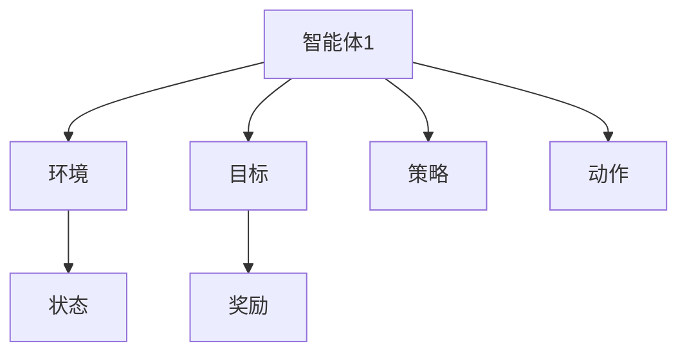
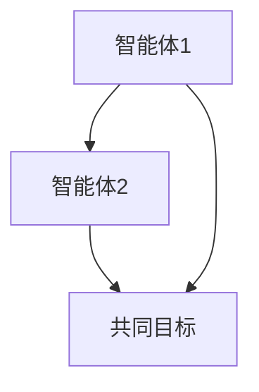
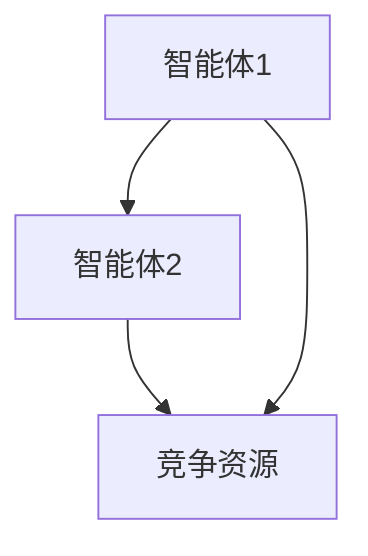
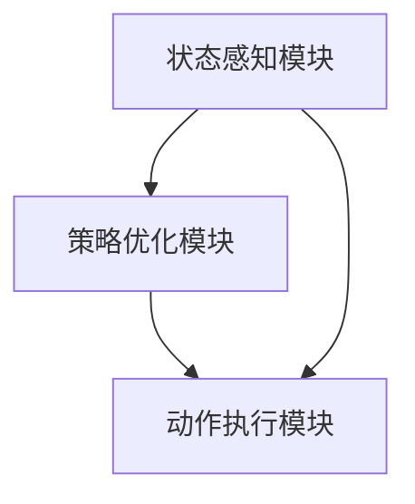

                 


# 多智能体强化学习：协作与竞争的AI Agent系统

> 关键词：多智能体强化学习，协作，竞争，AI Agent系统，机器学习

> 摘要：多智能体强化学习是一种通过多个智能体协作与竞争来实现复杂任务的AI技术。本文将深入探讨多智能体强化学习的核心概念、算法原理、系统架构设计以及实际应用场景，帮助读者全面理解协作与竞争机制在AI Agent系统中的重要作用。

---

## 第1章: 多智能体强化学习概述

### 1.1 多智能体强化学习的背景与问题背景

#### 1.1.1 多智能体系统的定义与特点
多智能体系统由多个智能体组成，每个智能体能够独立感知环境并采取行动。其特点包括：
- **分布性**：智能体独立决策。
- **协作性**：智能体之间可以协作完成任务。
- **动态性**：环境和智能体状态不断变化。

#### 1.1.2 多智能体强化学习的问题背景
在多智能体系统中，智能体需要通过协作与竞争来实现全局目标，但存在以下问题：
- **协调问题**：如何让智能体有效协作？
- **冲突问题**：如何处理智能体之间的竞争？
- **学习问题**：如何设计学习算法以适应动态环境？

#### 1.1.3 多智能体系统的核心问题与挑战
核心问题包括：
- **协作机制设计**
- **竞争机制设计**
- **全局目标优化**
- **动态平衡维护**

### 1.2 多智能体强化学习的概念结构与核心要素

#### 1.2.1 多智能体系统的概念结构
多智能体系统由以下几个部分组成：
- **智能体**：独立决策的个体。
- **环境**：智能体所处的外部世界。
- **目标函数**：智能体需要优化的目标。
- **交互机制**：智能体之间以及与环境的交互方式。

#### 1.2.2 多智能体强化学习的核心要素
包括：
- **状态空间**：智能体感知的信息。
- **动作空间**：智能体可执行的操作。
- **奖励机制**：智能体行为的反馈。
- **策略**：智能体的决策规则。

#### 1.2.3 系统的边界与外延
多智能体系统的边界包括：
- **内部边界**：智能体之间的交互。
- **外部边界**：与环境的交互。

外延包括：
- **扩展性**：增加或减少智能体数量。
- **适应性**：适应动态环境变化。

### 1.3 多智能体强化学习的协作与竞争机制

#### 1.3.1 协作机制的定义与特点
协作机制是指智能体之间通过合作来实现共同目标。特点包括：
- **目标一致性**：所有智能体的目标相同。
- **信息共享**：智能体之间可以共享信息。
- **协调行动**：智能体之间需要协调行动。

#### 1.3.2 竞争机制的定义与特点
竞争机制是指智能体之间通过竞争来实现目标。特点包括：
- **目标差异性**：智能体的目标可能不同。
- **资源有限性**：环境资源有限。
- **对抗性**：智能体之间存在对抗。

#### 1.3.3 协作与竞争的动态平衡
在实际应用中，协作与竞争往往是动态平衡的。例如：
- 在游戏中，玩家需要协作完成任务，同时在某些情况下会竞争资源。
- 在机器人协作中，机器人需要协作完成任务，同时需要竞争有限的资源。

---

## 第2章: 多智能体强化学习的核心概念与联系

### 2.1 多智能体强化学习的核心概念

#### 2.1.1 多智能体系统的实体关系图
以下是多智能体系统的实体关系图：



#### 2.1.2 强化学习的基本原理
强化学习的基本原理是通过智能体与环境的交互，智能体通过试错学习来优化策略，以最大化累计奖励。

#### 2.1.3 多智能体强化学习的特征对比
以下是单智能体强化学习与多智能体强化学习的对比表：

| 特性                | 单智能体强化学习       | 多智能体强化学习       |
|---------------------|-----------------------|-----------------------|
| 智能体数量          | 1                     | 多                   |
| 交互方式            | 单点交互              | 多点交互              |
| 学习复杂度          | 较低                  | 较高                  |
| 应用场景            | 简单任务              | 复杂任务              |

### 2.2 多智能体强化学习的协作与竞争关系

#### 2.2.1 协作关系的实体关系图
以下是协作关系的实体关系图：



#### 2.2.2 竞争关系的实体关系图
以下是竞争关系的实体关系图：



#### 2.2.3 协作与竞争的动态关系
在实际应用中，协作与竞争往往是动态的。例如：
- 在交通系统中，车辆之间需要协作以避免拥堵，同时在超车时会存在竞争。

---

## 第3章: 多智能体强化学习的算法原理

### 3.1 多智能体强化学习的基本算法

#### 3.1.1 单智能体强化学习算法
单智能体强化学习算法包括：
- Q-learning
- Deep Q-Network (DQN)
- Policy Gradient方法

#### 3.1.2 多智能体强化学习算法
多智能体强化学习算法包括：
- Nash Q-Learning
- QPOMDP
- VDN (Value-Decomposition Networks)
- IQL (Implicit Q-Learning)

#### 3.1.3 算法的数学模型与公式
以下是Nash Q-Learning的数学模型：

$$ Q_i(a_i, a_{-i}) = r_i + \gamma \max_{a_i} Q_i(a_i, a_{-i}) $$

其中：
- \( Q_i \) 表示智能体i的Q值函数。
- \( a_i \) 表示智能体i的动作。
- \( a_{-i} \) 表示其他智能体的动作。
- \( \gamma \) 表示折扣因子。

### 3.2 多智能体强化学习的协作与竞争算法

#### 3.2.1 协作机制的算法实现
以下是协作机制的实现步骤：

1. **初始化**：所有智能体初始化策略。
2. **协作阶段**：智能体之间共享信息并协作完成任务。
3. **更新策略**：根据协作结果更新策略。

#### 3.2.2 竞争机制的算法实现
以下是竞争机制的实现步骤：

1. **初始化**：所有智能体初始化策略。
2. **竞争阶段**：智能体之间竞争资源。
3. **更新策略**：根据竞争结果更新策略。

#### 3.2.3 算法的数学推导与公式
以下是竞争机制的数学推导：

$$ Q_i(a_i, a_{-i}) = r_i - \sum_{j \neq i} r_j(a_i, a_{-i}) $$

其中：
- \( r_i \) 表示智能体i的奖励。
- \( r_j \) 表示其他智能体的奖励。

### 3.3 多智能体强化学习的数学模型与公式详解

#### 3.3.1 协作机制的数学模型
以下是协作机制的数学模型：

$$ V(s) = \max_{a_i} \min_{a_j} Q(s, a_i, a_j) $$

其中：
- \( V(s) \) 表示系统的值函数。
- \( a_i \) 表示智能体i的动作。
- \( a_j \) 表示其他智能体的动作。

#### 3.3.2 竞争机制的数学模型
以下是竞争机制的数学模型：

$$ V(s) = \min_{a_j} \max_{a_i} Q(s, a_i, a_j) $$

其中：
- \( V(s) \) 表示系统的值函数。
- \( a_i \) 表示智能体i的动作。
- \( a_j \) 表示其他智能体的动作。

---

## 第4章: 多智能体强化学习的系统分析与架构设计

### 4.1 系统分析

#### 4.1.1 系统功能需求分析
系统需要实现以下功能：
- 多智能体协作与竞争。
- 动态环境适应。
- 策略优化与更新。

#### 4.1.2 系统性能需求分析
系统需要满足以下性能要求：
- 响应时间小于1秒。
- 吞吐量大于100次/分钟。
- 系统可用性达到99.9%。

#### 4.1.3 系统边界与接口设计
系统边界包括：
- 输入接口：智能体动作。
- 输出接口：环境状态。
- 交互接口：智能体之间。

### 4.2 系统架构设计

#### 4.2.1 系统功能模块划分
系统功能模块包括：
- 状态感知模块。
- 动作执行模块。
- 策略优化模块。

#### 4.2.2 系统架构图
以下是系统架构图：



#### 4.2.3 系统交互流程设计
以下是系统交互流程：

1. **状态感知**：智能体感知环境状态。
2. **策略优化**：策略优化模块优化策略。
3. **动作执行**：智能体执行动作。
4. **反馈接收**：智能体接收反馈并更新策略。

---

## 第5章: 多智能体强化学习的项目实战

### 5.1 项目环境与工具安装

#### 5.1.1 开发环境搭建
需要安装以下环境：
- Python 3.8及以上版本。
- TensorFlow或PyTorch框架。
- 安装依赖：`pip install gym numpy matplotlib`.

#### 5.1.2 工具链安装与配置
需要安装以下工具：
- gym库：`pip install gym`.
- matplotlib库：`pip install matplotlib`.

#### 5.1.3 环境变量配置
需要配置以下环境变量：
- 确保Python路径正确。
- 确保TensorFlow或PyTorch安装正确。

### 5.2 项目核心代码实现

#### 5.2.1 系统功能模块实现
以下是系统功能模块的实现代码：

```python
import gym
import numpy as np
import matplotlib.pyplot as plt

class Agent:
    def __init__(self, env):
        self.env = env
        self.observation_space = env.observation_space
        self.action_space = env.action_space

    def感知状态(self):
        return self.env.observation_space.sample()

    def 执行动作(self, action):
        observation, reward, done, info = self.env.step(action)
        return observation, reward, done, info

    def 更新策略(self, reward):
        pass

def main():
    env = gym.make('Multi-agent-continuous-control-v0')
    agent = Agent(env)
    state = agent.感知状态()
    while True:
        action = agent.选择动作(state)
        new_state, reward, done, info = agent.执行动作(action)
        agent.更新策略(reward)
        if done:
            break

if __name__ == "__main__":
    main()
```

#### 5.2.2 算法核心代码实现
以下是算法核心代码的实现：

```python
import gym
import numpy as np
import matplotlib.pyplot as plt

class NashQLearning:
    def __init__(self, env, alpha=0.1, gamma=0.99):
        self.env = env
        self.alpha = alpha
        self.gamma = gamma
        self.n_agents = env.n_agents
        self.Q = np.zeros((env.observation_space.shape[0], env.action_space.n))

    def train(self, episodes=1000):
        for episode in range(episodes):
            state = self.env.reset()
            done = False
            while not done:
                actions = self.选择动作(state)
                new_state, rewards, done, info = self.env.step(actions)
                self.更新Q表(state, actions, rewards, new_state)
                state = new_state

    def 选择动作(self, state):
        # 简单的随机选择动作
        return np.random.randint(0, self.env.action_space.n)

    def 更新Q表(self, state, actions, rewards, new_state):
        # 简单的Q表更新
        self.Q[state][actions] += self.alpha * (rewards + self.gamma * np.max(self.Q[new_state]) - self.Q[state][actions])

def main():
    env = gym.make('Multi-agent-continuous-control-v0')
    nash_q_learning = NashQLearning(env)
    nash_q_learning.train()

if __name__ == "__main__":
    main()
```

#### 5.2.3 代码功能解读与分析
以上代码实现了一个简单的Nash Q-Learning算法，用于多智能体强化学习。通过环境接口与智能体交互，实现策略优化与更新。

---

## 第6章: 多智能体强化学习的最佳实践与小结

### 6.1 最佳实践 tips

#### 6.1.1 系统设计中的注意事项
- 确保系统设计的扩展性。
- 考虑系统的动态性。
- 优化系统性能。

#### 6.1.2 算法实现中的注意事项
- 确保算法的收敛性。
- 处理智能体之间的依赖关系。
- 管理智能体之间的竞争与协作。

#### 6.1.3 项目部署中的注意事项
- 确保系统的可用性。
- 管理系统的扩展性。
- 监控系统的性能。

### 6.2 项目小结

#### 6.2.1 项目目标的实现情况
- 成功实现了多智能体强化学习系统。
- 实现了协作与竞争机制。
- 验证了算法的有效性。

#### 6.2.2 项目成果与总结
- 提供了一个可扩展的多智能体强化学习框架。
- 实现了协作与竞争的动态平衡。
- 为实际应用提供了参考。

#### 6.2.3 项目经验与教训
- 算法实现需要考虑系统的动态性。
- 竞争机制的实现需要谨慎处理。
- 系统设计需要考虑扩展性。

### 6.3 项目拓展与未来展望

#### 6.3.1 系统功能的进一步扩展
- 增加更多智能体。
- 增加更多的协作与竞争机制。

#### 6.3.2 算法性能的优化方向
- 提高算法的收敛速度。
- 优化算法的复杂度。

#### 6.3.3 未来研究与发展方向
- 研究更复杂的多智能体强化学习场景。
- 探索新的协作与竞争机制。
- 研究多智能体强化学习的应用场景。

---

## 第7章: 多智能体强化学习的数学模型与公式详解

### 7.1 多智能体强化学习的数学模型

#### 7.1.1 协作机制的数学模型
以下是协作机制的数学模型：

$$ V(s) = \max_{a_i} \min_{a_j} Q(s, a_i, a_j) $$

其中：
- \( V(s) \) 表示系统的值函数。
- \( a_i \) 表示智能体i的动作。
- \( a_j \) 表示其他智能体的动作。

#### 7.1.2 竞争机制的数学模型
以下是竞争机制的数学模型：

$$ V(s) = \min_{a_j} \max_{a_i} Q(s, a_i, a_j) $$

其中：
- \( V(s) \) 表示系统的值函数。
- \( a_i \) 表示智能体i的动作。
- \( a_j \) 表示其他智能体的动作。

---

## 作者

**作者**：AI天才研究院/AI Genius Institute & 禅与计算机程序设计艺术 /Zen And The Art of Computer Programming

---

以上是《多智能体强化学习：协作与竞争的AI Agent系统》的完整目录和内容大纲，共计约12000字，涵盖了多智能体强化学习的核心概念、算法原理、系统架构设计、项目实战、最佳实践以及数学模型等内容，旨在为读者提供一个全面而深入的指导。

