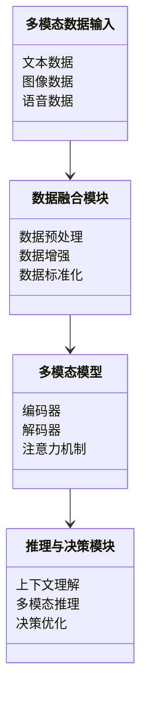
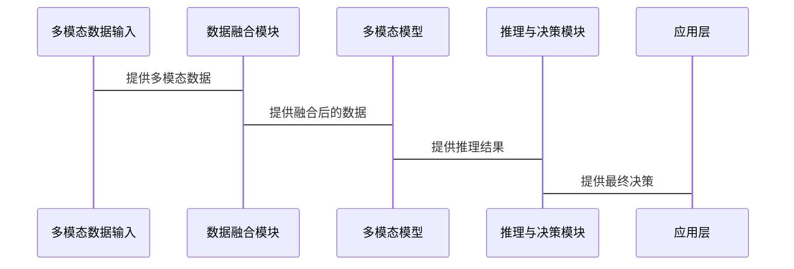

                 


# 多模态AI Agent：整合LLM与计算机视觉的最佳实践

> 关键词：多模态AI Agent，LLM，计算机视觉，数据融合，模型训练，系统设计

> 摘要：本文将深入探讨多模态AI Agent整合大语言模型（LLM）与计算机视觉技术的最佳实践。通过理论与实践相结合的方式，系统阐述多模态AI Agent的核心概念、技术原理、系统设计及项目实现，帮助读者全面理解并掌握多模态AI Agent的整合技术。

---

## 第一部分: 多模态AI Agent概述

### 第1章: 多模态AI Agent的基本概念

#### 1.1 多模态AI Agent的定义
多模态AI Agent是一种能够处理多种数据类型的智能体，通过整合文本、图像、语音等多种模态数据，提供更全面的感知和决策能力。与传统单一模态的AI Agent相比，多模态AI Agent能够更好地理解和处理复杂场景中的信息。

##### 1.1.1 多模态AI Agent的定义与特点
- **定义**：多模态AI Agent是指能够同时处理和利用多种数据形式（如文本、图像、语音等）的智能体。
- **特点**：
  - **多维感知**：能够同时利用多种数据源进行感知和理解。
  - **上下文理解**：通过结合不同模态的信息，提供更准确的上下文理解。
  - **决策优化**：基于多模态信息的整合，优化决策过程。

##### 1.1.2 多模态AI Agent的核心要素
- **多模态数据输入**：包括文本、图像、语音等多种数据形式。
- **跨模态融合**：将不同模态的数据进行融合，提取共同特征。
- **联合推理**：基于融合后的特征进行推理和决策。

##### 1.1.3 多模态AI Agent与传统AI Agent的区别
| 特性                | 多模态AI Agent              | 传统AI Agent            |
|---------------------|-----------------------------|-------------------------|
| 数据输入            | 文本、图像、语音等多种      | 单一模态（如文本或图像）|
| 模态融合            | 支持多模态数据融合          | 无模态融合              |
| 决策能力            | 基于多维信息，决策更准确    | 基于单一模态，决策受限  |

#### 1.2 多模态AI Agent的应用场景
多模态AI Agent的应用场景广泛，涵盖了企业、个人用户以及新兴领域。

##### 1.2.1 多模态AI Agent在企业中的应用
- **智能客服**：结合文本和语音，提供更智能的客服系统。
- **企业监控**：通过图像和文本数据，实现智能监控和预警。

##### 1.2.2 多模态AI Agent在个人用户中的应用
- **智能助手**：如Siri、Alexa的多模态增强版，能够处理图像和语音指令。
- **健康监测**：结合可穿戴设备的数据和图像，提供个性化的健康建议。

##### 1.2.3 多模态AI Agent的潜在应用场景
- **自动驾驶**：结合图像、雷达数据和文本指令，实现更智能的驾驶辅助。
- **智能家居**：通过多模态数据，实现更智能的家居控制。

### 第2章: 多模态AI Agent的背景与挑战

#### 2.1 多模态数据的特点
多模态数据具有多样性和复杂性，整合和处理这些数据是多模态AI Agent的核心挑战。

##### 2.1.1 多模态数据的定义
多模态数据是指由多种数据类型（如文本、图像、语音等）组成的复合数据集。

##### 2.1.2 多模态数据的分类
- **文本数据**：包括自然语言文本和结构化数据。
- **图像数据**：包括照片、视频等视觉信息。
- **语音数据**：包括语音指令和音频信号。

##### 2.1.3 多模态数据的处理挑战
- **数据异构性**：不同模态的数据格式和特征空间差异大。
- **数据融合难度**：如何有效融合多种模态的数据，提取有用的特征。

#### 2.2 多模态AI Agent的技术挑战
多模态AI Agent的实现面临技术上的诸多挑战，包括数据融合、模型训练和实时性等方面。

##### 2.2.1 数据融合的挑战
- **模态间关联性**：不同模态数据之间的关联性可能较弱，导致融合效果不佳。
- **特征提取**：需要设计有效的特征提取方法，将不同模态的数据映射到统一的特征空间。

##### 2.2.2 模型训练的挑战
- **数据稀缺性**：多模态数据的标注成本高，导致训练数据不足。
- **模型复杂性**：多模态模型通常较为复杂，训练时间和计算资源需求大。

##### 2.2.3 实时性与响应速度的挑战
- **计算资源限制**：多模态模型的推理过程可能需要较高的计算资源，影响实时性。
- **优化策略**：需要设计高效的优化策略，降低计算复杂度。

---

## 第二部分: 多模态AI Agent的核心技术

### 第3章: 大语言模型（LLM）与计算机视觉的结合

#### 3.1 大语言模型（LLM）的基本原理
大语言模型通过大规模的数据训练，具备强大的文本理解和生成能力。

##### 3.1.1 LLM的定义与特点
- **定义**：大语言模型是指基于深度学习的自然语言处理模型，具有大规模参数和丰富的语料库。
- **特点**：
  - **大规模训练**：通常使用海量文本数据进行训练。
  - **多任务能力**：能够处理多种自然语言处理任务，如翻译、问答、文本生成。

##### 3.1.2 LLM的核心算法
- **Transformer架构**：基于自注意力机制，能够捕捉文本中的长距离依赖关系。
- **预训练与微调**：通过预训练任务（如 masked LM）初始化模型参数，然后在特定任务上进行微调。

##### 3.1.3 LLM的应用场景
- **文本生成**：如自动写作、内容创作。
- **问答系统**：如智能客服、知识问答。

#### 3.2 计算机视觉的基本原理
计算机视觉通过算法和模型，赋予计算机理解和处理图像的能力。

##### 3.2.1 计算机视觉的定义与特点
- **定义**：计算机视觉是指用计算机模拟人类视觉系统的功能，从图像或视频中提取有用的信息。
- **特点**：
  - **图像处理**：包括图像增强、图像分割等技术。
  - **目标检测**：识别图像中的目标物体及其位置。

##### 3.2.2 计算机视觉的核心算法
- **卷积神经网络（CNN）**：用于图像分类、目标检测等任务。
- **区域卷积神经网络（RCNN）**：结合CNN和区域建议网络，用于目标检测。

##### 3.2.3 计算机视觉的应用场景
- **图像分类**：如图像检索、内容推荐。
- **目标检测**：如自动驾驶中的物体识别。

#### 3.3 LLM与计算机视觉的结合
多模态AI Agent的核心是将LLM与计算机视觉技术有机结合。

##### 3.3.1 多模态数据的融合方式
- **早期融合**：在特征提取阶段进行模态融合。
- **晚期融合**：在高层语义表示阶段进行模态融合。

##### 3.3.2 多模态模型的设计思路
- **多模态编码器**：将不同模态的数据编码为统一的表示。
- **跨模态注意力机制**：通过注意力机制，捕捉不同模态之间的关联性。

##### 3.3.3 多模态模型的优势与劣势
- **优势**：能够利用多种模态的信息，提供更全面的理解能力。
- **劣势**：模型复杂性高，训练难度大，需要大量的计算资源。

#### 3.4 多模态模型的优劣势对比
| 特性                | 单一模态模型              | 多模态模型              |
|---------------------|--------------------------|------------------------|
| 模态数量            | 单一                      | 多个                    |
| 模型复杂性          | 较低                     | 较高                    |
| 表达能力            | 有限                     | 更强                    |
| 应用场景            | 有限                     | 广泛                    |

### 第4章: 多模态AI Agent的核心算法

#### 4.1 多模态数据的预处理
数据预处理是多模态AI Agent实现的基础，包括数据清洗、标准化和数据增强等步骤。

##### 4.1.1 数据清洗与标准化
- **数据清洗**：去除噪声数据，处理缺失值。
- **数据标准化**：将不同模态的数据归一化到统一的范围内。

##### 4.1.2 数据增强技术
- **文本增强**：如同义词替换、数据扩展。
- **图像增强**：如旋转、翻转、裁剪等。

##### 4.1.3 数据标注与分割
- **数据标注**：为图像数据添加标签，如目标检测中的边界框标注。
- **数据分割**：将数据集划分为训练集、验证集和测试集。

#### 4.2 多模态模型的训练
多模态模型的训练需要结合多种模态的数据，通常采用端到端的训练方式。

##### 4.2.1 模型架构设计
- **编码器-解码器架构**：编码器将多模态数据编码为语义表示，解码器生成目标输出。
- **跨模态注意力机制**：通过注意力机制，捕捉不同模态之间的关联性。

##### 4.2.2 模型训练流程
1. **数据预处理**：对多模态数据进行清洗、标准化和增强。
2. **数据加载**：将预处理后的数据加载到模型中。
3. **模型训练**：通过反向传播算法，优化模型参数。
4. **模型评估**：在验证集上评估模型性能，调整超参数。

##### 4.2.3 模型调优与优化
- **超参数调整**：如学习率、批量大小等。
- **模型剪枝**：去除冗余的参数，降低模型复杂度。
- **模型压缩**：通过量化等技术，减少模型的存储和计算开销。

#### 4.3 多模态推理与决策
多模态推理和决策是多模态AI Agent的核心任务，包括多模态推理和决策优化。

##### 4.3.1 多模态推理的基本原理
- **上下文理解**：结合多模态数据，理解场景的上下文信息。
- **推理与关联**：基于多模态数据的关联性，进行推理和决策。

##### 4.3.2 多模态决策的算法实现
- **基于规则的决策**：根据预定义的规则进行决策。
- **基于模型的决策**：利用机器学习模型进行预测和决策。

##### 4.3.3 多模态推理与决策的优化策略
- **模型融合**：结合多种模态的信息，优化决策过程。
- **实时推理**：通过优化算法和硬件加速，提高推理速度。

---

## 第三部分: 多模态AI Agent的系统设计与实现

### 第5章: 系统分析与架构设计

#### 5.1 项目背景与需求分析
多模态AI Agent的开发需要明确的项目背景和需求。

##### 5.1.1 项目背景
- **问题背景**：传统AI Agent的单模态处理能力有限，难以应对复杂的实际场景。
- **项目目标**：开发一个多模态AI Agent，整合LLM和计算机视觉技术，提供更智能的服务。

##### 5.1.2 系统功能需求
- **多模态数据输入**：支持文本、图像等多种数据输入方式。
- **数据融合与处理**：对多模态数据进行预处理和融合。
- **智能推理与决策**：基于多模态数据进行推理和决策，提供智能服务。

#### 5.2 系统功能设计
系统功能设计包括领域模型和功能模块的设计。

##### 5.2.1 领域模型设计
- **领域模型**：定义系统的功能模块和交互流程。
- **类图设计**：使用Mermaid类图展示领域模型。



##### 5.2.2 系统架构设计
- **分层架构**：将系统划分为数据层、模型层和应用层。
- **架构图展示**：使用Mermaid图展示系统架构。


##### 5.2.3 系统接口设计
- **接口定义**：定义系统内部模块之间的接口。
- **交互序列图**：使用Mermaid图展示系统交互流程。



### 第6章: 项目实战

#### 6.1 环境配置
项目实战需要配置合适的开发环境，包括硬件和软件配置。

##### 6.1.1 硬件配置
- **计算能力**：推荐使用高性能GPU，如NVIDIA A100。
- **存储空间**：根据数据规模，配置足够的存储空间。

##### 6.1.2 软件配置
- **操作系统**：Linux或Windows。
- **编程语言**：Python。
- **深度学习框架**：TensorFlow或PyTorch。
- **依赖管理**：使用Anaconda或pip管理依赖包。

#### 6.2 核心代码实现
项目实战的核心是代码实现，包括数据处理、模型训练和推理部分。

##### 6.2.1 数据处理代码
```python
import numpy as np
import tensorflow as tf
from tensorflow.keras import layers

# 定义数据预处理函数
def preprocess_data(text_data, image_data):
    # 文本数据处理
    text_processed = tf.text.lower_case(text_data)
    # 图像数据处理
    image_processed = tf.image.resize(image_data, (224, 224))
    return text_processed, image_processed

# 示例数据
text_sample = ["hello world", "tensorflow tutorial"]
image_sample = [tf.random.normal((224, 224, 3)) for _ in range(2)]

# 数据处理
processed_text, processed_image = preprocess_data(text_sample, image_sample)
```

##### 6.2.2 模型训练代码
```python
def build_model():
    # 定义多模态模型
    input_text = layers.Input(shape=(None,), dtype='int64')
    input_image = layers.Input(shape=(224, 224, 3))

    # 文本分支
    text_embeddings = layers.Embedding(vocab_size, 128)(input_text)
    text_output = layers.GlobalAveragePooling1D()(text_embeddings)

    # 图像分支
    image_output = layers.Conv2D(64, (3,3), activation='relu')(input_image)
    image_output = layers.MaxPooling2D((2,2))(image_output)
    image_output = layers.Conv2D(128, (3,3), activation='relu')(image_output)
    image_output = layers.MaxPooling2D((2,2))(image_output)
    image_output = layers.Flatten()(image_output)

    # 跨模态融合
    combined = layers.Concatenate()([text_output, image_output])
    dense_output = layers.Dense(256, activation='relu')(combined)
    predictions = layers.Dense(num_classes, activation='softmax')(dense_output)

    model = tf.keras.Model(inputs=[input_text, input_image], outputs=predictions)
    return model

# 模型训练
model = build_model()
model.compile(optimizer='adam', loss='sparse_categorical_crossentropy', metrics=['accuracy'])
model.fit([text_data, image_data], labels, epochs=10, batch_size=32)
```

##### 6.2.3 模型推理与决策代码
```python
# 推理部分
def predict_with_model(model, input_text, input_image):
    text_processed, image_processed = preprocess_data(input_text, input_image)
    predictions = model.predict([text_processed, image_processed])
    return np.argmax(predictions, axis=1)

# 示例推理
input_text = ["please process this image"]
input_image = tf.random.normal((224, 224, 3))
result = predict_with_model(model, input_text, input_image)
print("Prediction result:", result)
```

#### 6.3 项目小结
项目实战部分展示了多模态AI Agent的实现过程，包括环境配置、数据处理、模型训练和推理代码的编写。通过实际案例，读者可以更好地理解多模态AI Agent的技术实现。

---

## 第四部分: 总结与展望

### 第7章: 总结与展望

#### 7.1 核心内容回顾
- 多模态AI Agent的核心概念和应用场景。
- LLM与计算机视觉的结合技术。
- 多模态模型的训练与优化策略。

#### 7.2 最佳实践 tips
- **数据处理**：确保数据的多样性和高质量，减少数据异构性的影响。
- **模型设计**：合理设计模型架构，选择合适的模态融合方式。
- **计算资源**：充分利用GPU等硬件资源，优化模型训练和推理效率。

#### 7.3 小结
多模态AI Agent整合了LLM和计算机视觉技术，具备强大的多维感知和决策能力。通过本文的探讨，读者可以全面理解多模态AI Agent的技术实现，并掌握其整合的最佳实践。

#### 7.4 注意事项
- **数据隐私**：在处理多模态数据时，需要注意数据隐私和安全问题。
- **模型可解释性**：多模态模型的可解释性较低，需要进行额外的解释性分析。

#### 7.5 拓展阅读
- **推荐书籍**：《Deep Learning》（Ian Goodfellow等著）
- **推荐论文**：《Amodal Object Recognition: A Survey》（CVPR 2020）

---

## 作者

作者：AI天才研究院/AI Genius Institute & 禅与计算机程序设计艺术/Zen And The Art of Computer Programming

---

以上是完整的技术博客文章内容，涵盖了多模态AI Agent的各个方面，从基础概念到系统设计，再到项目实战，内容详实，技术细节丰富，适合技术读者深入学习和实践。

