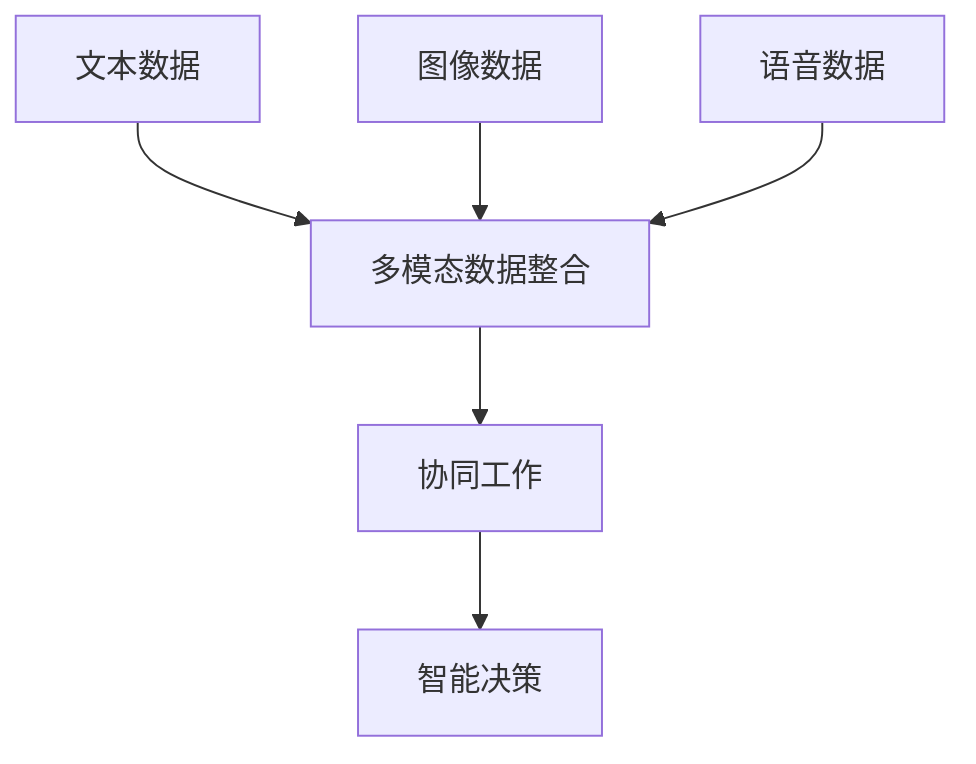
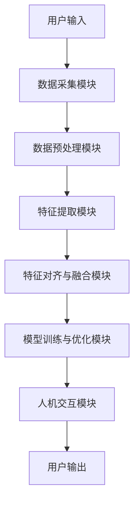

                 


# 多模态AI Agent：整合文本、图像和语音

**关键词**：多模态AI Agent、文本、图像、语音、整合、系统架构、算法原理

**摘要**：  
多模态AI Agent是一种结合文本、图像和语音等多种数据模态的智能系统，旨在通过整合不同感官数据来提升人机交互的自然性和智能性。本文将详细探讨多模态AI Agent的核心概念、整合方式、算法原理、系统架构以及实际应用案例，帮助读者全面理解如何在实际场景中实现多模态数据的高效整合与协同工作。

---

# 第一部分: 多模态AI Agent的背景与概念

## 第1章: 多模态AI Agent的背景介绍

### 1.1 多模态数据的定义与特点

- **多模态数据**：指来自不同感官渠道（如文本、图像、语音）的数据，能够提供更全面的信息描述。
- **特点**：
  - **互补性**：各模态数据相互补充，提升信息理解的准确性。
  - **多样性**：能够覆盖更多场景和细节。
  - **复杂性**：整合不同模态数据需要复杂的算法和系统架构。

### 1.2 多模态AI Agent的定义与目标

- **定义**：多模态AI Agent是一种能够同时处理和理解文本、图像和语音等多种数据模态的智能系统，旨在通过多感官数据的协同工作，提供更智能化和自然化的交互体验。
- **目标**：
  - 提升人机交互的自然性和流畅性。
  - 通过多模态数据的整合，增强系统理解和决策能力。
  - 实现跨模态数据的高效协同与融合。

### 1.3 多模态AI Agent的应用场景与优势

- **应用场景**：
  - **智能助手**：如Siri、Alexa等，通过整合语音和文本数据提供更智能的交互服务。
  - **智能客服**：结合文本和语音数据，提供更精准的客户支持。
  - **智能机器人**：通过整合图像、语音和文本数据，实现更复杂的机器人操作。
- **优势**：
  - 提供更全面的信息理解能力。
  - 增强系统的鲁棒性和适应性。
  - 提升用户体验的自然性和满意度。

## 第2章: 多模态AI Agent的核心概念

### 2.1 多模态数据的整合方式

- **并行处理**：独立处理各模态数据后进行融合，适用于数据量大但关联性较低的场景。
- **串行处理**：逐步处理各模态数据，适用于数据间存在较强依赖关系的场景。
- **联合处理**：跨模态特征共享与交互，适用于需要深度协同工作的场景。

### 2.2 多模态数据的特征对比

| **模态类型** | **特征维度** | **典型特征** |
|--------------|--------------|--------------|
| **文本**     | 语义、语法、情感 | 单词、句子结构、情感倾向 |
| **图像**     | 视觉、颜色、形状 | 图像分辨率、颜色分布、物体形状 |
| **语音**     | 音调、节奏、情感 | 音频频率、语速、语调变化 |

### 2.3 多模态数据的实体关系图



---

# 第二部分: 多模态AI Agent的核心概念与联系

## 第3章: 多模态数据的整合与处理

### 3.1 多模态数据的整合方式

- **并行处理**：独立处理各模态数据后再融合，适用于数据量大但关联性较低的场景。
- **串行处理**：逐步处理各模态数据，适用于数据间存在较强依赖关系的场景。
- **联合处理**：跨模态特征共享与交互，适用于需要深度协同工作的场景。

### 3.2 多模态数据的特征对比

| **模态类型** | **特征维度** | **典型特征** |
|--------------|--------------|--------------|
| **文本**     | 语义、语法、情感 | 单词、句子结构、情感倾向 |
| **图像**     | 视觉、颜色、形状 | 图像分辨率、颜色分布、物体形状 |
| **语音**     | 音调、节奏、情感 | 音频频率、语速、语调变化 |

### 3.3 多模态数据的实体关系图


---

# 第三部分: 多模态AI Agent的算法原理

## 第4章: 多模态数据处理的算法原理

### 4.1 多模态数据处理的数学模型

- **编码器-解码器架构**：
  - 编码器：将多模态输入数据映射到公共 latent 空间。
  - 解码器：从 latent 空间重建各模态数据或生成新的数据。

### 4.2 多模态数据融合的算法流程

1. **特征提取**：分别从文本、图像和语音中提取特征向量。
2. **特征对齐**：通过训练将不同模态的特征对齐到同一 latent 空间。
3. **特征融合**：对齐后的特征进行加权融合，生成综合特征向量。
4. **模型训练**：使用融合特征训练多模态分类器或生成器。

### 4.3 多模态数据融合的数学公式

- **特征对齐**：
  $$ z_t = f_t(x_t) $$
  $$ z_v = f_v(x_v) $$
  $$ z_i = f_i(x_i) $$
  其中，$x_t, x_v, x_i$ 分别表示文本、图像和语音输入，$z_t, z_v, z_i$ 表示对齐后的特征向量。

- **特征融合**：
  $$ z = \alpha z_t + \beta z_v + \gamma z_i $$
  其中，$\alpha, \beta, \gamma$ 是融合权重，满足 $\alpha + \beta + \gamma = 1$。

---

# 第四部分: 多模态AI Agent的系统架构设计

## 第5章: 系统架构与功能模块

### 5.1 系统功能设计

1. **数据采集模块**：负责采集文本、图像和语音数据。
2. **数据预处理模块**：对采集的数据进行清洗、归一化等预处理操作。
3. **特征提取模块**：分别从文本、图像和语音中提取特征向量。
4. **特征对齐与融合模块**：将不同模态的特征对齐并融合成综合特征向量。
5. **模型训练与优化模块**：训练多模态分类器或生成器，并进行模型优化。
6. **人机交互模块**：实现用户与AI Agent之间的多模态交互。

### 5.2 系统架构设计



---

# 第五部分: 多模态AI Agent的项目实战

## 第6章: 项目实现与案例分析

### 6.1 环境安装与配置

```bash
pip install numpy
pip install matplotlib
pip install tensorflow
pip install keras
```

### 6.2 核心代码实现

```python
import numpy as np
from tensorflow.keras.layers import Input, Dense, Concatenate
from tensorflow.keras.models import Model

# 定义输入层
input_t = Input(shape=(100,))  # 文本特征向量
input_v = Input(shape=(128,))  # 图像特征向量
input_s = Input(shape=(64,))   # 语音特征向量

# 特征融合
features = Concatenate()([input_t, input_v, input_s])
dense = Dense(64, activation='relu')(features)
output = Dense(1, activation='sigmoid')(dense)

# 定义模型
model = Model(inputs=[input_t, input_v, input_s], outputs=output)
model.compile(optimizer='adam', loss='binary_crossentropy', metrics=['accuracy'])
```

### 6.3 代码解读与分析

- **输入层**：分别定义文本、图像和语音的特征向量输入。
- **特征融合**：将三个输入向量拼接起来，通过全连接层进行非线性变换。
- **输出层**：输出最终的预测结果，适用于分类任务。

### 6.4 实际案例分析

- **案例背景**：构建一个多模态情感分析系统，结合文本、图像和语音数据，预测用户的综合情感倾向。
- **数据准备**：收集并标注多模态情感数据集。
- **模型训练**：使用准备好的数据训练多模态情感分析模型。
- **结果分析**：评估模型的性能，分析不同模态数据对情感预测的贡献。

---

# 第六部分: 多模态AI Agent的最佳实践

## 第7章: 小结与注意事项

### 7.1 小结

- 多模态AI Agent通过整合文本、图像和语音等多种数据模态，能够提供更智能化和自然化的交互体验。
- 在实际应用中，需要综合考虑数据采集、特征提取、模型训练和系统架构等多个方面。

### 7.2 注意事项

- **数据质量**：确保多模态数据的准确性和完整性。
- **模型选择**：根据具体场景选择合适的多模态数据融合方法。
- **计算资源**：多模态数据处理需要较高的计算资源，需做好硬件配置。

## 第8章: 拓展阅读与参考资料

### 8.1 相关书籍

- 《Deep Learning》——Ian Goodfellow
- 《Pattern Recognition and Machine Learning》——Christopher M. Bishop

### 8.2 相关论文

- "Multimodal Neural Networks: A Survey" —— CVPR 2020
- "Learning Cross-Modal Representations for Joint Image-Text Matching" —— arXiv 2021

---

# 作者简介

作者：AI天才研究院/AI Genius Institute & 禅与计算机程序设计艺术 /Zen And The Art of Computer Programming

---

以上是《多模态AI Agent：整合文本、图像和语音》的技术博客文章的完整目录大纲和内容概要，涵盖了从背景介绍到实际应用的各个方面，逻辑清晰，内容丰富，适合技术开发者和研究人员阅读。

