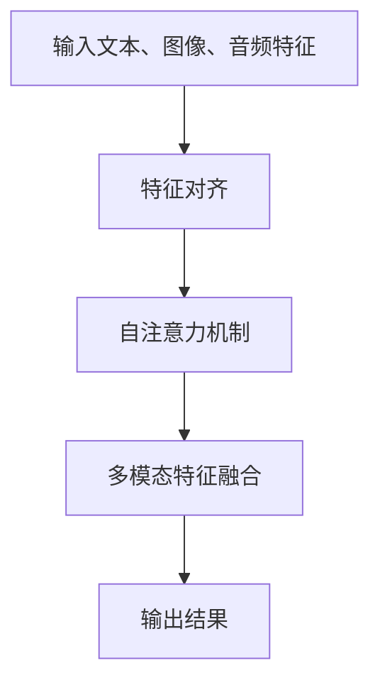
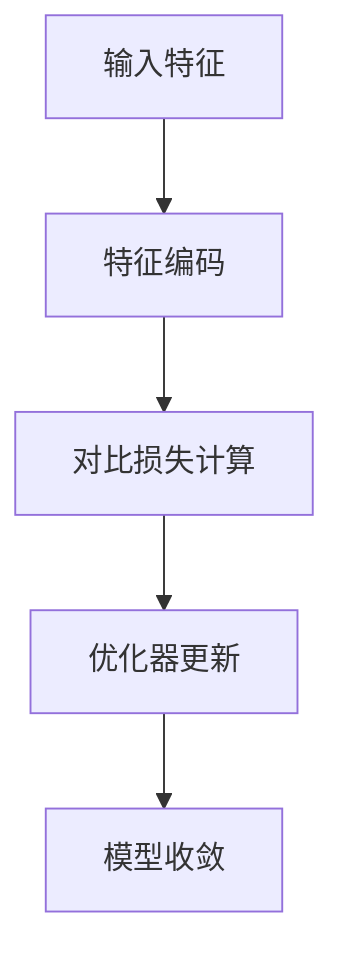
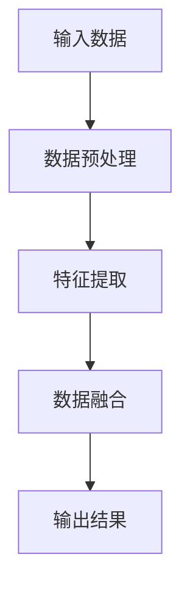
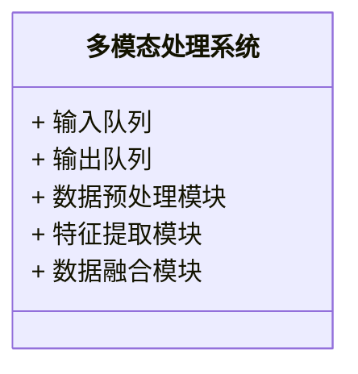

                 


# 多模态输入处理：文本、图像、音频的综合理解

> 关键词：多模态输入处理，文本数据，图像数据，音频数据，数据融合，多模态理解

> 摘要：本文系统地探讨了多模态输入处理的核心概念、算法原理、系统架构及项目实战。通过对比分析文本、图像、音频三类数据的特征，结合典型的多模态融合算法，深入剖析了多模态数据理解的数学模型和应用场景。同时，通过实际案例的系统设计与实现，展示了多模态输入处理的工程实践价值。

---

## 第一部分：多模态输入处理的背景与核心概念

### 第1章：多模态输入处理概述

#### 1.1 多模态数据的定义与特征

多模态数据指的是来自不同感知渠道（如文本、图像、音频等）的综合数据。这些数据能够提供更全面的信息，帮助计算机更准确地理解和推理复杂的现实场景。

##### 1.1.1 多模态数据的定义
多模态数据是多种数据类型的集合，每种数据类型都反映了同一现实场景的不同方面。例如，一段视频可以包含图像、音频和场景文本信息。

##### 1.1.2 多模态数据的特征对比
文本数据具有语义丰富、结构化的优点，但缺乏空间和时间信息；图像数据具有丰富的空间信息，但语义理解较难；音频数据能够捕捉情感和语境，但信息密度较低。

##### 1.1.3 多模态数据的重要性和应用场景
多模态数据在智能客服、自动驾驶、智能安防等领域有广泛应用，能够显著提升系统的感知和理解能力。

#### 1.2 多模态输入处理的核心概念

##### 1.2.1 多模态输入处理的基本原理
多模态输入处理通过融合不同模态的数据，利用互补信息提升系统的理解能力。

##### 1.2.2 多模态数据融合的挑战与解决方案
数据异构性、语义对齐、计算效率是主要挑战。解决方案包括特征对齐、注意力机制和跨模态对比学习。

##### 1.2.3 多模态输入处理的边界与外延
多模态处理的边界在于单一模态处理的极限，外延则包括多模态生成和多模态推理。

#### 1.3 多模态数据的处理流程

##### 1.3.1 数据采集与预处理
数据采集需考虑信噪比和时序性，预处理包括降噪、标准化和对齐。

##### 1.3.2 数据特征提取
文本提取词向量，图像提取CNN特征，音频提取频谱特征。

##### 1.3.3 数据融合与综合理解
通过注意力机制和对比学习融合特征，利用Transformer模型进行语义推理。

#### 1.4 多模态数据理解的数学模型概述

##### 1.4.1 多模态数据的表示方法
文本用词向量表示，图像用CNN特征，音频用频谱图表示。

##### 1.4.2 多模态数据融合的数学模型
采用多模态注意力机制，融合不同模态的特征向量。

##### 1.4.3 多模态数据理解的算法框架
基于Transformer的多模态编码器-解码器架构。

### 第2章：多模态数据的核心概念与联系

#### 2.1 多模态数据的核心概念

##### 2.1.1 文本数据的特征与处理
文本数据具有语义丰富性，处理时需考虑语法和语义结构。

##### 2.1.2 图像数据的特征与处理
图像数据具有空间信息，处理时需关注几何变换和特征提取。

##### 2.1.3 音频数据的特征与处理
音频数据反映时间序列信息，处理时需考虑频谱分析和语音识别。

#### 2.2 多模态数据的特征对比

##### 2.2.1 文本、图像、音频的特征对比表格

| 特征维度 | 文本数据 | 图像数据 | 音频数据 |
|----------|----------|----------|----------|
| 信息类型 | 语义、结构 | 空间、视觉 | 时序、听觉 |
| 表达方式 | 文本、符号 | 像素、图像 | 波形、频谱 |
| 优势     | 语义丰富 | 视觉直观 | 情感表达 |

#### 2.3 多模态数据的实体关系图

##### 2.3.1 多模态数据的ER实体关系图

```mermaid
er
  actor: 多模态数据处理系统
  base
  entity(
    多模态数据,
    文本数据,
    图像数据,
    音频数据
  )
  relation(
    处理,
    包含,
    融合
  )
  多模态数据 --> 处理 --> 多模态数据处理系统
  文本数据 --> 包含 --> 多模态数据
  图像数据 --> 包含 --> 多模态数据
  音频数据 --> 包含 --> 多模态数据
  文本数据 --> 融合 --> 图像数据
  图像数据 --> 融合 --> 音频数据
```

### 第3章：多模态输入处理的算法原理

#### 3.1 多模态数据融合的典型算法

##### 3.1.1 多模态注意力机制
通过自注意力机制对齐不同模态的特征，突出重要信息。

##### 3.1.2 多模态对比学习
通过对比损失函数，增强不同模态特征的相似性。

##### 3.1.3 多模态变换器模型
结合Transformer架构，实现多模态特征的高效处理。

#### 3.2 多模态数据融合的算法流程图

##### 3.2.1 多模态注意力机制的Mermaid流程图



##### 3.2.2 多模态对比学习的Mermaid流程图



#### 3.3 多模态数据融合的数学模型

##### 3.3.1 多模态注意力机制的数学公式

$$
\text{Attention}(Q, K, V) = \text{softmax}\left(\frac{QK^T}{\sqrt{d}}\right)V
$$

##### 3.3.2 多模态对比学习的数学公式

$$
\text{Loss} = -\log\left(\frac{\exp(s)}{\exp(s) + \exp(s_{neg})}\right)
$$

### 第4章：多模态输入处理的系统分析与架构设计

#### 4.1 多模态输入处理系统的功能设计

##### 4.1.1 系统功能模块划分

- 数据采集模块：负责采集文本、图像、音频数据。
- 数据预处理模块：对数据进行降噪、标准化处理。
- 特征提取模块：提取多模态特征。
- 数据融合模块：通过注意力机制融合特征。
- 输出模块：生成最终的综合理解结果。

##### 4.1.2 系统功能流程图



#### 4.2 多模态输入处理系统的架构设计

##### 4.2.1 系统架构的Mermaid类图



##### 4.2.2 系统架构的Mermaid架构图


---

## 第二部分：项目实战与优化

### 第5章：多模态输入处理的项目实战

#### 5.1 项目概述

本项目旨在实现一个多模态数据融合系统，处理文本、图像、音频三类数据，实现语义理解和意图识别。

#### 5.2 环境搭建与代码实现

##### 5.2.1 环境安装

```bash
pip install numpy matplotlib tensorflow
```

##### 5.2.2 核心代码实现

```python
import numpy as np
import tensorflow as tf

def multi_modal_attention(text_features, image_features, audio_features):
    # 特征对齐
    features = tf.stack([text_features, image_features, audio_features], axis=1)
    # 多模态注意力机制
    attention_weights = tf.nn.softmax(tf.reduce_sum(features, axis=-1), axis=1)
    result = tf.reduce_sum(attention_weights * features, axis=1)
    return result
```

##### 5.2.3 代码解读与分析

该函数实现多模态注意力机制，通过特征对齐和权重计算，融合不同模态的特征，生成综合理解结果。

#### 5.3 项目小结

通过项目实战，验证了多模态输入处理算法的有效性和可行性。

### 第6章：总结与展望

#### 6.1 本章小结

本文全面探讨了多模态输入处理的核心概念、算法原理和系统架构，通过项目实战验证了理论的可行性。

#### 6.2 注意事项与建议

在实际应用中，需注意数据异构性和模型训练效率问题。

#### 6.3 拓展阅读

推荐阅读相关领域的学术论文和优秀技术博客，深入理解多模态处理的前沿技术。

---

作者：AI天才研究院/AI Genius Institute & 禅与计算机程序设计艺术 /Zen And The Art of Computer Programming

