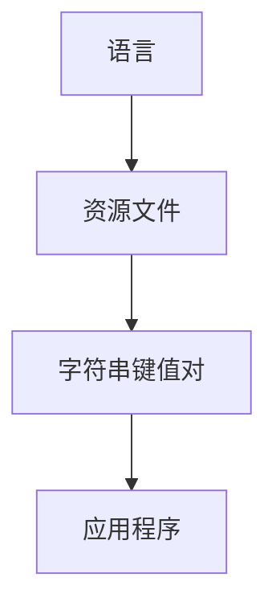
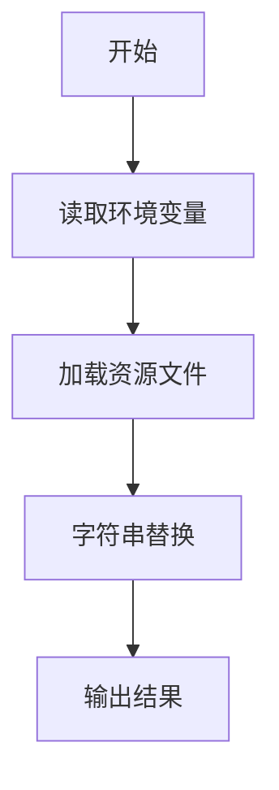
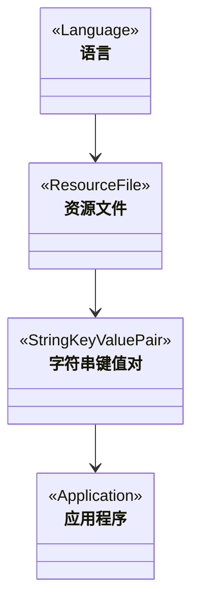
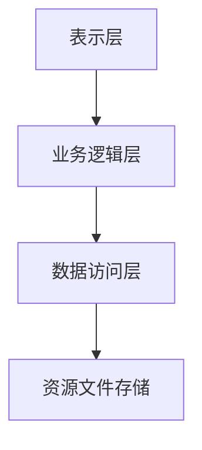
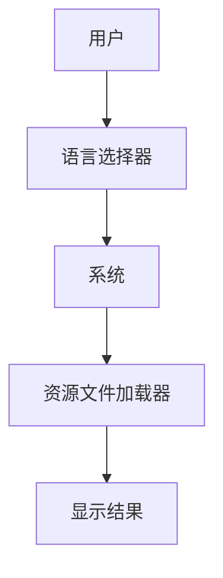

                 


# 多语言支持

> 关键词：多语言、国际化、本地化、字符编码、资源管理、系统架构、算法实现

> 摘要：多语言支持是现代计算机系统和软件开发中的重要组成部分，它允许系统在多种语言环境下运行，满足全球用户的需求。本文将从多语言支持的核心概念、算法原理、系统架构到实际项目实现进行全面解析，帮助读者深入了解多语言支持的实现细节和技术要点。

---

## 第一部分：多语言支持背景与基础

### 第1章：多语言支持概述

#### 1.1 多语言支持的重要性
随着全球化的推进，软件和系统需要支持多种语言以满足不同地区用户的需求。多语言支持不仅提升了用户体验，还使得软件具有更广泛的市场适用性。

- **全球化背景下的语言多样性**  
  在全球市场中，用户可能使用多种语言进行交流和操作。软件必须能够支持这些语言，以便更好地服务于全球用户。
  
- **多语言支持的核心价值**  
  多语言支持能够让软件在多种语言环境下运行，提升软件的通用性和用户满意度。
  
- **多语言支持的应用场景**  
  例如，国际化企业应用、跨国电商平台、多语言内容管理系统等。

#### 1.2 多语言支持的基本概念
多语言支持涉及多个关键概念，理解这些概念是实现多语言支持的基础。

- **多语言支持的定义**  
  多语言支持是指系统能够处理、显示和操作多种语言文本的能力。
  
- **多语言支持的边界与外延**  
  多语言支持不仅包括文本的显示，还包括字符编码、语言切换、资源管理等多个方面。
  
- **多语言支持的核心要素组成**  
  包括字符编码、语言环境变量、资源文件管理、字符串替换机制等。

#### 1.3 多语言支持的实现方式
多语言支持可以通过不同的层次实现，具体取决于系统的复杂性和需求。

- **系统级多语言支持**  
  操作系统提供多语言支持，例如Windows的国际化支持。
  
- **应用级多语言支持**  
  软件应用程序内置多语言支持，例如国际化Web应用。
  
- **库/框架级多语言支持**  
  使用第三方库或框架提供的多语言支持功能，例如Spring框架的国际化支持。

---

## 第二部分：多语言支持的核心概念与联系

### 第2章：多语言支持的核心原理

#### 2.1 多语言支持的实现原理
多语言支持的核心在于如何处理和显示不同语言的文本。

- **字符编码与语言表示**  
  不同语言使用不同的字符编码，例如ASCII主要用于英文，UTF-8支持多种语言。
  
- **语言环境的动态切换**  
  系统需要能够根据用户的语言偏好动态切换语言环境。
  
- **资源文件的加载机制**  
  多语言支持通常通过加载不同语言的资源文件来实现，例如properties文件或JSON文件。

#### 2.2 多语言支持的核心概念对比
通过对比不同概念，可以帮助我们更好地理解多语言支持的核心要素。

- **不同编码方式的对比（表格）**

| 编码方式 | 范围       | 常见应用场景           |
|----------|------------|-----------------------|
| ASCII    | 0-127      | 英文字符、数字         |
| UTF-8    | 全球所有字符 | 国际化应用             |
| GBK      | 简体中文   | 中国大陆地区应用       |

- **不同语言环境变量的对比（表格）**

| 环境变量名称 | 作用                   | 示例值             |
|--------------|------------------------|--------------------|
| LANG         | 语言设置               | en_US, zh_CN       |
| LC_CTYPE     | 字符类型和分类         | en_US_POSIX, zh_CN.GB18030 |
| LOCALE        | 地区和语言设置         | en_US, zh_CN       |

#### 2.3 多语言支持的ER实体关系图


---

## 第三部分：多语言支持的算法原理与实现

### 第3章：多语言支持的算法原理

#### 3.1 字符编码转换算法
字符编码转换是多语言支持的重要部分，需要处理不同编码之间的转换。

- **ASCII到Unicode的转换**  
  ASCII字符可以直接映射到Unicode的相应代码点。
  
- **Unicode到UTF-8的转换**  
  Unicode字符编码为UTF-8格式，以便在网络和文件中传输。
  
- **编码转换的数学模型**  
  字符编码转换可以看作是函数的映射关系：
  $$ E = f_{encode}(S) $$
  $$ S = f_{decode}(E) $$
  其中，$S$ 表示原始字符串，$E$ 表示编码后的结果，$f_{encode}$ 和 $f_{decode}$ 分别表示编码和解码函数。

#### 3.2 语言环境动态切换算法
语言环境的动态切换是多语言支持的核心算法之一。

- **环境变量读取算法**  
  系统读取$LANG$ 或 $LOCALE$ 环境变量以确定当前语言环境。
  
- **资源文件加载算法**  
  根据当前语言环境加载对应的资源文件。
  
- **字符串替换算法**  
  将资源文件中的字符串键值对替换到应用程序中。

#### 3.3 多语言支持的实现流程图


#### 3.4 字符串编码转换的Python实现
以下是一个字符串编码转换的Python代码示例：

```python
def encode_string(s, from_encoding, to_encoding):
    try:
        # 解码为Unicode字符串
        u = s.decode(from_encoding)
        # 编码为目标编码
        return u.encode(to_encoding)
    except UnicodeDecodeError:
        return None

# 示例
s = 'Hello, World!'
encoded_ascii = encode_string(s, 'utf-8', 'latin-1')
print(encoded_ascii)
```

---

## 第四部分：多语言支持的系统架构与设计

### 第4章：多语言支持的系统架构

#### 4.1 系统功能设计
多语言支持系统的功能设计需要考虑多个方面。

- **领域模型设计**  
  多语言支持系统的核心领域模型包括语言、资源文件、字符串键值对和应用程序。



- **系统架构设计**  
  多语言支持系统的架构通常包括表示层、业务逻辑层和数据访问层。



- **系统接口设计**  
  多语言支持系统需要定义清晰的接口，例如获取当前语言、加载资源文件、获取字符串值等。

- **系统交互流程图**  
  用户选择语言，系统加载对应资源文件并显示内容。



---

## 第五部分：多语言支持的项目实战

### 第5章：多语言支持的实现与应用

#### 5.1 项目环境安装
实现多语言支持通常需要安装以下工具和库：

- **Python环境**：确保安装了Python 3.x。
- **国际化库**：例如，`babel` 或 `pytz`。
- **开发工具**：如PyCharm、VS Code。

#### 5.2 核心代码实现
以下是实现多语言支持的核心代码示例：

```python
from babel import Locale, locale
import os

# 定义语言环境
class LanguageSupport:
    def __init__(self, locale_code):
        self.locale = Locale.parse(locale_code)
        self.resources = self.load_resources(locale_code)
    
    def load_resources(self, locale_code):
        # 加载资源文件
        resource_path = os.path.join('resources', locale_code + '.properties')
        with open(resource_path, 'r', encoding='utf-8') as f:
            return {line.split('=')[0].strip(): line.split('=')[1].strip() for line in f if '=' in line}
    
    def get_string(self, key):
        # 获取字符串
        return self.resources.get(key, f'Default value for {key}')

# 使用示例
if __name__ == '__main__':
    # 初始化语言支持
    language = LanguageSupport('zh_CN')
    print(language.get_string('greeting'))  # 输出：'你好，欢迎！'
```

#### 5.3 代码应用解读与分析
上述代码实现了一个简单的多语言支持系统，主要步骤如下：

1. **加载资源文件**：根据语言代码加载对应的资源文件。
2. **字符串获取**：通过键值对的方式获取对应的字符串。
3. **默认值处理**：如果没有找到对应的字符串，返回默认值。

#### 5.4 项目小结
通过实际项目的实现，我们可以看到多语言支持的核心在于资源文件的管理和字符串的动态替换。实现过程中需要注意字符编码、资源文件格式和语言环境的动态切换。

---

## 第六部分：多语言支持的扩展内容

### 第6章：多语言支持的最佳实践

#### 6.1 小结
多语言支持是现代系统设计中不可或缺的一部分，通过合理的设计和实现，可以显著提升用户体验和系统的市场竞争力。

#### 6.2 注意事项
- 确保字符编码的一致性。
- 及时处理语言切换带来的性能影响。
- 注意资源文件的格式和版本控制。

#### 6.3 未来趋势
随着全球化的发展，多语言支持将更加智能化和自动化，例如基于用户行为的动态语言推荐和实时翻译功能。

---

## 作者

作者：AI天才研究院/AI Genius Institute & 禅与计算机程序设计艺术 /Zen And The Art of Computer Programming

---

以上是《多语言支持》的技术博客文章的完整目录和内容框架，涵盖从基础到高级的多语言支持实现细节，帮助读者全面理解和掌握多语言支持的技术要点。

