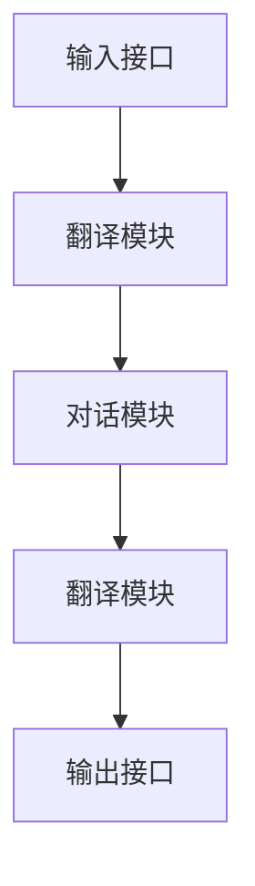
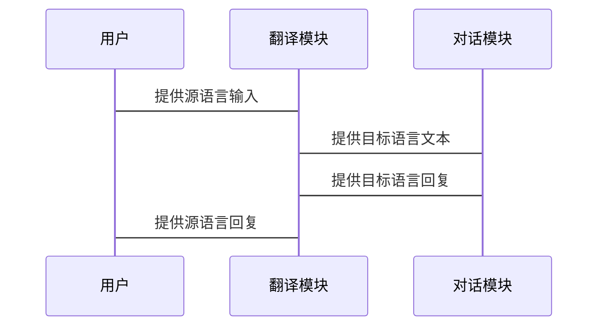

                 


# 多语言翻译：构建跨语言AI Agent

> **关键词**：多语言翻译，AI Agent，自然语言处理，机器学习，深度学习，跨语言对话  
> 
> **摘要**：  
> 本文将深入探讨如何构建一个能够处理多种语言的AI Agent，结合多语言翻译技术，介绍其核心概念、算法原理、系统架构及实际应用案例。通过逐步分析，帮助读者理解跨语言AI Agent的实现细节与应用场景。

---

## 第1章：多语言翻译的重要性

### 1.1 多语言翻译的背景与挑战

#### 1.1.1 全球化背景下的语言障碍
在如今的全球化时代，语言障碍仍然是一个普遍存在的问题。企业、组织以及个人在全球化背景下需要频繁地进行跨语言交流，尤其是在国际贸易、国际合作、多语言内容分发等领域，语言障碍可能导致沟通不畅、信息丢失甚至误解。

#### 1.1.2 多语言翻译的市场需求与应用场景
- **市场需求**：随着全球化的推进，企业对多语言翻译的需求日益增长。特别是在跨国公司、跨境电商、国际会议等领域，多语言翻译技术已经成为不可或缺的一部分。
- **应用场景**：包括实时聊天翻译、跨语言客服、多语言内容生成、跨语言数据分析等。

#### 1.1.3 当前技术的局限性与改进方向
尽管现有的机器翻译技术已经取得了显著的进步，但在处理复杂语境、多语言对话理解以及实时响应速度方面仍然存在诸多挑战。例如：
- 对复杂语境的理解不足，导致翻译结果不够准确。
- 对于小语种的支持不足，数据稀缺性问题仍然存在。
- 实时翻译的延迟问题影响用户体验。

---

### 1.2 AI Agent的基本概念

#### 1.2.1 AI Agent的定义与分类
AI Agent（人工智能代理）是指能够感知环境并采取行动以实现目标的智能实体。AI Agent可以分为以下几类：
- **简单反射型代理**：基于简单的规则做出反应。
- **基于模型的反射型代理**：基于内部模型进行推理和规划。
- **目标驱动型代理**：根据目标采取行动。
- **效用驱动型代理**：通过最大化效用来做出决策。

#### 1.2.2 AI Agent的核心功能与技术特点
- **感知能力**：能够通过传感器或接口获取环境信息。
- **推理能力**：能够对获取的信息进行分析和推理。
- **决策能力**：基于推理结果做出决策并采取行动。
- **学习能力**：能够通过经验改进性能。

#### 1.2.3 跨语言AI Agent的必要性与优势
在多语言环境中，AI Agent需要能够理解并处理多种语言的信息，从而实现跨语言的交互与协作。其优势包括：
- **提升用户体验**：能够为用户提供无缝的多语言交互体验。
- **支持全球化业务**：帮助企业在全球范围内更高效地开展业务。
- **增强智能系统的通用性**：使AI系统能够适应更多场景和语言环境。

---

### 1.3 跨语言处理的必要性

#### 1.3.1 跨语言翻译的核心问题
跨语言翻译的核心问题在于如何准确地将一种语言的信息转换为另一种语言，同时保留原有的语义和语境信息。这涉及到以下关键问题：
- **语义理解**：如何准确理解源语言的语义。
- **语境适应**：如何将源语言的语境适配到目标语言。
- **实时性要求**：如何在实时交互中实现快速准确的翻译。

#### 1.3.2 跨语言对话的挑战与解决方案
跨语言对话的挑战主要体现在以下方面：
- **语法结构差异**：不同语言的语法结构差异可能导致翻译的不准确。
- **文化差异**：某些语言中的特定表达可能在另一种语言中没有直接对应的表达。
- **上下文依赖性**：对话中的上下文信息需要被准确理解和传递。

解决方案包括：
- **基于上下文的翻译模型**：利用上下文信息提高翻译的准确性。
- **多模态输入**：结合图像、语音等多种信息源提高翻译质量。
- **基于记忆的模型**：通过记忆机制处理长距离依赖关系。

#### 1.3.3 跨语言AI Agent的实际应用场景
跨语言AI Agent的实际应用场景非常广泛，包括：
- **跨国客服支持**：为用户提供多语言的客服支持。
- **多语言内容生成**：自动生成多语言的新闻、广告等内容。
- **跨语言数据分析**：对多语言数据进行分析和处理。

---

## 第2章：AI Agent与多语言翻译的核心概念

### 2.1 AI Agent的核心原理

#### 2.1.1 AI Agent的基本工作流程
AI Agent的核心工作流程可以分为以下几个步骤：
1. **感知环境**：通过传感器或接口获取环境信息。
2. **理解信息**：对获取的信息进行解析和理解。
3. **推理与决策**：基于理解的信息进行推理并做出决策。
4. **执行行动**：根据决策结果采取相应的行动。

#### 2.1.2 跨语言翻译在AI Agent中的角色
跨语言翻译在AI Agent中的角色是实现跨语言交互的关键技术。它负责将用户输入的源语言信息转换为目标语言，或者将目标语言的信息转换回源语言，从而实现无缝的多语言交互。

#### 2.1.3 跨语言AI Agent的系统架构
跨语言AI Agent的系统架构通常包括以下几个部分：
- **输入接口**：接收用户输入的信息。
- **翻译模块**：对输入信息进行跨语言翻译。
- **推理模块**：对翻译后的信息进行分析和推理。
- **输出接口**：将推理结果输出给用户。

---

### 2.2 多语言翻译的实现原理

#### 2.2.1 多语言翻译的核心原理
多语言翻译的核心原理是基于自然语言处理技术，通过训练大规模的双语或多语语料库，构建翻译模型。常见的翻译模型包括基于统计的翻译模型和神经机器翻译模型。

#### 2.2.2 神经机器翻译的实现原理
神经机器翻译（Neural Machine Translation, NMT）是一种基于深度学习的翻译技术。其核心思想是将翻译任务视为一个序列到序列（Sequence-to-Sequence）的预测问题。典型的NMT模型包括编码器（Encoder）和解码器（Decoder）两个部分：
- **编码器**：将源语言的序列编码为一个固定长度的向量。
- **解码器**：将编码后的向量解码为目标语言的序列。

#### 2.2.3 跨语言翻译的挑战与解决方案
跨语言翻译的挑战主要体现在以下方面：
- **数据稀缺性**：对于小语种，训练数据可能非常有限。
- **语义漂移**：不同语言之间的语义可能存在漂移，导致翻译不准确。
- **实时性要求**：需要在实时交互中实现快速准确的翻译。

解决方案包括：
- **数据增强技术**：通过数据增强技术增加训练数据的多样性。
- **多任务学习**：结合其他任务（如情感分析）进行联合训练，提高模型的泛化能力。
- **模型优化技术**：通过模型压缩、知识蒸馏等技术提高模型的推理速度。

---

## 第3章：构建跨语言AI Agent的算法原理

### 3.1 神经机器翻译算法原理

#### 3.1.1 Transformer模型的原理
Transformer模型是一种基于自注意力机制的深度学习模型，广泛应用于自然语言处理领域。其核心思想是通过自注意力机制捕捉输入序列中的长距离依赖关系。

#### 3.1.2 自注意力机制的数学模型
自注意力机制的数学模型可以表示为：
$$
\text{Attention}(Q, K, V) = \text{softmax}\left(\frac{QK^T}{\sqrt{d_k}}\right)V
$$

其中：
- $Q$ 是查询向量。
- $K$ 是键向量。
- $V$ 是值向量。
- $d_k$ 是键向量的维度。

#### 3.1.3 Transformer模型的实现步骤
1. **输入处理**：将输入序列编码为嵌入向量。
2. **自注意力计算**：计算自注意力权重并加权求和。
3. **前馈网络**：通过前馈网络生成输出向量。
4. **输出处理**：将输出向量解码为目标语言的序列。

#### 3.1.4 翻译模型的训练过程
1. **数据准备**：准备双语或多语语料库。
2. **模型构建**：构建Transformer模型。
3. **损失函数定义**：定义交叉熵损失函数。
4. **模型训练**：使用反向传播算法训练模型。

---

### 3.2 跨语言对话的算法实现

#### 3.2.1 跨语言对话的核心算法
跨语言对话的核心算法是基于神经机器翻译的对话模型。其核心思想是将对话中的源语言信息翻译为目标语言，然后再将目标语言的回复翻译回源语言，从而实现跨语言对话。

#### 3.2.2 跨语言对话的实现步骤
1. **输入处理**：接收源语言的输入。
2. **翻译模型**：将源语言的输入翻译为目标语言。
3. **对话模型**：用目标语言进行对话生成。
4. **翻译回源语言**：将目标语言的对话回复翻译回源语言。
5. **输出结果**：返回源语言的对话回复。

#### 3.2.3 对话模型的训练过程
1. **数据准备**：准备多语对话数据。
2. **模型构建**：构建基于Transformer的对话模型。
3. **损失函数定义**：定义交叉熵损失函数。
4. **模型训练**：使用反向传播算法训练模型。

---

## 第4章：跨语言AI Agent的系统架构与设计

### 4.1 系统架构设计

#### 4.1.1 系统功能设计
跨语言AI Agent的系统功能设计包括以下几个方面：
- **输入接口**：接收用户输入的源语言信息。
- **翻译模块**：将源语言信息翻译为目标语言。
- **对话模块**：用目标语言进行对话生成。
- **翻译回源语言**：将目标语言的对话回复翻译回源语言。
- **输出接口**：返回源语言的对话回复。

#### 4.1.2 系统架构图


#### 4.1.3 系统交互流程图


---

### 4.2 系统接口设计

#### 4.2.1 输入接口设计
输入接口负责接收用户输入的源语言信息。常见的输入方式包括：
- **文本输入**：用户输入文本信息。
- **语音输入**：用户输入语音信息。

#### 4.2.2 输出接口设计
输出接口负责将目标语言的对话回复翻译回源语言，并返回给用户。常见的输出方式包括：
- **文本输出**：返回文本形式的回复。
- **语音输出**：返回语音形式的回复。

---

## 第5章：跨语言AI Agent的项目实战

### 5.1 项目环境安装与配置

#### 5.1.1 安装依赖库
需要安装以下依赖库：
```bash
pip install numpy
pip install tensorflow
pip install transformers
```

#### 5.1.2 配置运行环境
确保安装了Python 3.8及以上版本，并安装了NVIDIA GPU驱动和CUDA toolkit（如果需要使用GPU加速）。

---

### 5.2 系统核心实现代码

#### 5.2.1 翻译模块实现
```python
from transformers import MarianMTModel, MarianTokenizer

class Translator:
    def __init__(self, src_lang, tgt_lang):
        self.src_lang = src_lang
        self.tgt_lang = tgt_lang
        self.model_name = f"facebook/marian-{src_lang}-{tgt_lang}"
        self.tokenizer = MarianTokenizer.from_pretrained(self.model_name)
        self.model = MarianMTModel.from_pretrained(self.model_name)
    
    def translate(self, text):
        inputs = self.tokenizer(text, return_tensors="pt")
        outputs = self.model.generate(**inputs)
        return self.tokenizer.decode(outputs[0], skip_special_tokens=True)
```

#### 5.2.2 对话模块实现
```python
from transformers import AutoTokenizer, AutoModelForCausalLM

class DialogModel:
    def __init__(self, language):
        self.language = language
        self.model_name = f"gpt2-{language}"
        self.tokenizer = AutoTokenizer.from_pretrained(self.model_name)
        self.model = AutoModelForCausalLM.from_pretrained(self.model_name)
    
    def generate_response(self, text):
        inputs = self.tokenizer(text, return_tensors="pt")
        outputs = self.model.generate(inputs.input_ids, max_length=50)
        return self.tokenizer.decode(outputs[0], skip_special_tokens=True)
```

---

### 5.3 项目实现与案例分析

#### 5.3.1 实际案例分析
假设我们需要构建一个中英文双语的AI Agent，具体实现步骤如下：
1. **环境安装**：安装所需的依赖库。
2. **翻译模块实现**：实现中英文互译功能。
3. **对话模块实现**：实现英文对话生成功能。
4. **系统集成**：将翻译模块和对话模块集成到AI Agent中。

#### 5.3.2 代码实现与解读
```python
# 翻译模块实现
translator = Translator("zh", "en")
translated_text = translator.translate("你好，我是AI Agent。")
print(translated_text)  # 输出：Hello, I am AI Agent.

# 对话模块实现
dialog_model = DialogModel("en")
response = dialog_model.generate_response("What is your name?")
print(response)  # 输出：My name is AI Agent.

# 翻译回源语言
translator = Translator("en", "zh")
translated_response = translator.translate("My name is AI Agent.")
print(translated_response)  # 输出：我的名字是AI Agent。
```

---

## 第6章：总结与展望

### 6.1 小结
本文详细探讨了如何构建一个能够处理多种语言的AI Agent，并结合多语言翻译技术，介绍了其核心概念、算法原理、系统架构及实际应用案例。通过逐步分析，帮助读者理解跨语言AI Agent的实现细节与应用场景。

### 6.2 最佳实践Tips
- **数据质量**：确保训练数据的质量和多样性。
- **模型优化**：通过模型压缩和知识蒸馏等技术优化模型性能。
- **实时性优化**：通过并行计算和缓存技术优化实时响应速度。

### 6.3 未来展望
随着人工智能技术的不断发展，跨语言AI Agent的应用场景将更加广泛。未来的研究方向包括：
- **多模态跨语言理解**：结合图像、语音等多种信息源进行跨语言理解。
- **动态语言适应**：根据上下文动态调整翻译策略。
- **个性化翻译**：基于用户偏好和习惯提供个性化的翻译服务。

---

## 作者

作者：AI天才研究院（AI Genius Institute） & 禅与计算机程序设计艺术（Zen And The Art of Computer Programming）

---

感谢您的阅读！希望本文对您理解跨语言AI Agent的构建有所帮助。如果需要进一步探讨或有疑问，欢迎随时联系！

