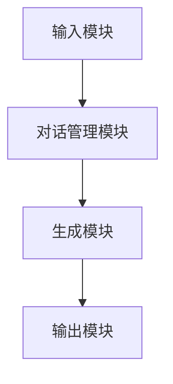

                 


---

# 多轮对话处理：提高AI Agent的交互质量

> 关键词：多轮对话处理，AI Agent，交互质量，对话系统，深度学习，对话上下文，对话策略

> 摘要：多轮对话处理是提升AI Agent交互质量的关键技术。本文从多轮对话的核心概念出发，分析对话系统的基本原理，探讨主流算法如Seq2Seq和Transformer的实现，结合系统架构设计和项目实战，详细讲解如何通过优化对话上下文管理、对话状态跟踪和对话策略制定，显著提升AI Agent的交互体验。文章还提供最佳实践和注意事项，帮助读者在实际应用中有效解决问题。

---

# 第1章: 多轮对话处理的背景与概念

## 1.1 多轮对话处理的背景

### 1.1.1 从单轮对话到多轮对话的演进

在人工智能技术迅速发展的今天，对话系统已成为人机交互的核心技术之一。传统的单轮对话系统只能处理简单的输入输出，无法理解对话的历史和上下文关系。随着技术的进步，多轮对话处理技术应运而生，使得AI Agent能够进行连续的、自然的对话，从而显著提升用户体验。

多轮对话处理的演进过程如下：

1. **单轮对话**：系统仅处理单个查询，无法维护对话历史。
2. **多轮对话**：系统能够跟踪对话历史，理解上下文，逐步引导对话。

### 1.1.2 AI Agent交互质量的重要性

AI Agent的目标是通过自然的对话与用户交互，提供高效、准确的服务。交互质量直接影响用户体验和任务完成度。多轮对话处理技术能够帮助AI Agent更好地理解用户需求，提供更精准的回复，从而提高交互质量。

### 1.1.3 多轮对话处理的定义与特点

**定义**：多轮对话处理是指在对话过程中，系统能够维护对话历史和上下文信息，逐步理解和生成对话内容的技术。

**特点**：
- **连续性**：对话能够连续进行，系统保持对话状态。
- **上下文依赖性**：回复依赖于之前的对话内容。
- **动态性**：对话过程中，对话状态和上下文不断更新。

## 1.2 多轮对话的核心概念

### 1.2.1 对话系统的基本原理

对话系统由以下几个部分组成：
- **输入处理**：接收用户输入并解析。
- **对话管理**：维护对话状态和上下文。
- **生成回复**：根据对话历史生成回复。
- **输出**：将回复返回给用户。

### 1.2.2 对话历史的重要性

对话历史是多轮对话处理的核心，它记录了用户与系统之间的所有交互信息。系统通过分析对话历史，理解当前对话的上下文，从而生成合适的回复。

### 1.2.3 多轮对话的模式与分类

多轮对话的模式主要分为以下几种：
- **基于规则的对话模式**：通过预定义的规则生成回复。
- **基于统计的对话模式**：利用统计方法学习对话模式。
- **基于深度学习的对话模式**：使用神经网络模型生成回复。

## 1.3 多轮对话处理的边界与外延

### 1.3.1 对话系统的输入输出边界

对话系统的输入是用户的自然语言查询，输出是对用户的回复。系统需要处理输入的上下文信息，并生成符合上下文的回复。

### 1.3.2 多轮对话与单轮对话的对比

| 对比维度 | 单轮对话 | 多轮对话 |
|----------|----------|----------|
| 对话长度 | 一次交互 | 多次交互 |
| 上下文   | 无或简单 | 有复杂 |
| 应用场景 | 简单查询 | 复杂任务 |

### 1.3.3 多轮对话处理的适用场景

多轮对话处理适用于需要复杂交互的场景，例如：
- **客服系统**：处理用户的多步查询。
- **智能助手**：提供连续的对话服务。
- **教育辅助**：进行互动教学。

## 1.4 多轮对话处理的核心要素

### 1.4.1 对话上下文的管理

对话上下文管理是多轮对话处理的关键，包括：
- **存储**：将对话历史存储起来。
- **更新**：根据新的输入更新对话上下文。
- **应用**：在生成回复时使用对话上下文。

### 1.4.2 对话状态的跟踪

对话状态跟踪是理解当前对话的关键，包括：
- **初始状态**：对话开始时的状态。
- **中间状态**：对话过程中不断更新的状态。
- **结束状态**：对话完成时的状态。

### 1.4.3 对话策略的制定

对话策略制定是指导对话系统如何生成回复，包括：
- **规则策略**：基于预定义规则生成回复。
- **概率策略**：基于概率模型生成回复。
- **混合策略**：结合规则和概率模型生成回复。

## 1.5 本章小结

本章介绍了多轮对话处理的背景与概念，分析了对话系统的基本原理，探讨了对话历史的重要性，并对比了不同对话模式的特点。此外，还详细讲解了多轮对话处理的核心要素，包括对话上下文管理、对话状态跟踪和对话策略制定。

---

# 第2章: 多轮对话处理的核心概念与联系

## 2.1 对话系统的基本原理

### 2.1.1 对话系统的组成与功能

对话系统由以下几个部分组成：
- **输入模块**：接收用户的输入。
- **对话管理模块**：维护对话状态和上下文。
- **生成模块**：生成回复。
- **输出模块**：将回复返回给用户。

### 2.1.2 对话历史与上下文的关系

对话历史是上下文的核心内容，上下文还包括其他信息，如用户身份、时间、地点等。系统通过分析对话历史和上下文，生成符合用户需求的回复。

### 2.1.3 对话系统的输入输出流程

对话系统的输入输出流程如下：
1. 用户输入：用户发送一条消息。
2. 系统解析：系统解析用户的输入。
3. 对话管理：系统维护对话状态和上下文。
4. 生成回复：系统根据对话历史生成回复。
5. 返回回复：系统将回复返回给用户。

## 2.2 对话历史与上下文的关系

### 2.2.1 对话历史的存储与管理

对话历史可以通过数据库或缓存进行存储和管理。系统需要定期更新对话历史，并在生成回复时调用。

### 2.2.2 上下文在多轮对话中的作用

上下文帮助系统理解当前对话的背景和用户的需求，从而生成更准确的回复。

### 2.2.3 对话历史的更新机制

对话历史的更新机制包括：
- **实时更新**：每次对话后立即更新。
- **批量更新**：定期批量更新对话历史。

## 2.3 多轮对话模式的对比分析

### 2.3.1 基于规则的对话模式

基于规则的对话模式通过预定义的规则生成回复。优点是简单易懂，缺点是灵活性差。

### 2.3.2 基于统计的对话模式

基于统计的对话模式通过统计方法学习对话模式，生成回复。优点是灵活，缺点是需要大量数据。

### 2.3.3 基于深度学习的对话模式

基于深度学习的对话模式使用神经网络模型生成回复，优点是准确度高，缺点是需要大量计算资源。

## 2.4 多轮对话处理的概念属性特征对比

| 对比维度 | 基于规则 | 基于统计 | 基于深度学习 |
|----------|----------|----------|--------------|
| 实现复杂度 | 低       | 中       | 高            |
| 灵活性   | 低       | 高       | 高            |
| 精确度   | 中       | 中       | 高            |

## 2.5 本章小结

本章详细讲解了对话系统的基本原理，分析了对话历史与上下文的关系，并对比了不同对话模式的特点。通过概念属性特征对比，帮助读者更好地理解多轮对话处理的核心概念。

---

# 第3章: 多轮对话处理的算法原理

## 3.1 算法原理概述

### 3.1.1 基于Seq2Seq的对话模型

Seq2Seq模型是一种经典的对话模型，由编码器和解码器组成。编码器将输入序列编码为一个向量，解码器根据编码向量生成输出序列。

### 3.1.2 基于Transformer的对话模型

Transformer模型在自然语言处理领域取得了突破性进展，其自注意力机制能够捕捉对话中的长距离依赖关系。

---

## 3.2 Seq2Seq模型的实现

### 3.2.1 Seq2Seq模型的结构

Seq2Seq模型的结构如下：
1. **编码器**：将输入序列转换为一个向量。
2. **解码器**：根据编码向量生成输出序列。

### 3.2.2 Seq2Seq模型的优缺点

**优点**：
- 结构简单，易于实现。
- 能够处理长序列。

**缺点**：
- 缺乏对位置信息的建模。
- 在处理长序列时，注意力机制不够灵活。

### 3.2.3 Seq2Seq模型的实现代码

```python
import tensorflow as tf
from tensorflow.keras.layers import LSTM, Dense, Input

# 定义Seq2Seq模型
def seq2seq_model(input_length, output_length, vocab_size):
    # 编码器
    encoder_input = Input(shape=(input_length,))
    encoder_embedding = Embedding(vocab_size, 128)(encoder_input)
    encoder_lstm, state_h, state_c = LSTM(128, return_state=True)(encoder_embedding)
    
    # 解码器
    decoder_input = Input(shape=(output_length,))
    decoder_embedding = Embedding(vocab_size, 128)(decoder_input)
    decoder_lstm, _, _ = LSTM(128, return_state=False)(decoder_embedding, initial_state=[state_h, state_c])
    
    decoder_dense = Dense(vocab_size, activation='softmax')(decoder_lstm)
    
    model = Model(inputs=[encoder_input, decoder_input], outputs=decoder_dense)
    return model
```

### 3.2.4 Seq2Seq模型的数学模型

Seq2Seq模型的数学模型如下：

$$
\text{编码器}：x_i \rightarrow h_i \\
\text{解码器}：h_i \rightarrow y_i
$$

---

## 3.3 Transformer模型的实现

### 3.3.1 Transformer模型的结构

Transformer模型由编码器和解码器组成，编码器包含多个自注意力层，解码器包含自注意力层和交叉注意力层。

### 3.3.2 Transformer模型的优缺点

**优点**：
- 强大的自注意力机制能够捕捉长距离依赖。
- 并行计算效率高。

**缺点**：
- 计算资源消耗大。
- 需要处理大量的参数。

### 3.3.3 Transformer模型的实现代码

```python
import tensorflow as tf
from tensorflow.keras.layers import MultiHeadAttention, Dense, Input

# 定义Transformer模型
def transformer_model(input_shape, vocab_size):
    inputs = Input(shape=input_shape)
    embedding_layer = Embedding(vocab_size, 128)(inputs)
    
    attention_layer = MultiHeadAttention(num_heads=8, key_dim=16)(embedding_layer, embedding_layer)
    output_layer = Dense(vocab_size, activation='softmax')(attention_layer)
    
    model = Model(inputs=inputs, outputs=output_layer)
    return model
```

### 3.3.4 Transformer模型的数学模型

Transformer模型的数学模型如下：

$$
\text{自注意力机制}：Q \cdot K^T \cdot V \\
\text{位置编码}：pos\_encoding
$$

---

## 3.4 算法原理总结

本章详细讲解了Seq2Seq和Transformer模型的实现原理，并对比了它们的优缺点。通过代码示例和数学模型，帮助读者更好地理解多轮对话处理的算法原理。

---

# 第4章: 多轮对话处理的系统分析与架构设计

## 4.1 系统分析

### 4.1.1 问题场景介绍

假设我们正在开发一个智能客服系统，用户需要通过多轮对话与系统交互，完成问题咨询、订单查询等任务。

### 4.1.2 系统功能设计

系统功能设计包括：
- **对话历史存储**：记录用户与系统的对话历史。
- **对话状态跟踪**：维护当前对话的状态。
- **对话策略制定**：根据对话历史生成回复。

### 4.1.3 系统架构设计

系统架构设计如下：
1. **输入模块**：接收用户的输入。
2. **对话管理模块**：维护对话历史和状态。
3. **生成模块**：生成回复。
4. **输出模块**：将回复返回给用户。

## 4.2 系统架构设计

### 4.2.1 领域模型设计

领域模型设计如下：
- **用户**：用户对象，包含用户ID、角色等属性。
- **对话历史**：对话历史对象，包含对话ID、对话内容、时间戳等属性。
- **对话状态**：对话状态对象，包含对话ID、当前状态、时间戳等属性。

### 4.2.2 系统架构图



## 4.3 系统接口设计

### 4.3.1 接口定义

系统接口包括：
- **开始对话**：初始化对话状态。
- **发送消息**：处理用户输入，生成回复。
- **结束对话**：关闭对话，保存对话历史。

### 4.3.2 接口交互流程

接口交互流程如下：
1. 用户发送消息。
2. 系统接收消息，更新对话状态。
3. 系统生成回复。
4. 系统返回回复。

## 4.4 本章小结

本章详细讲解了多轮对话处理的系统分析与架构设计，包括问题场景介绍、系统功能设计和系统架构设计。通过领域模型设计和系统架构图，帮助读者更好地理解多轮对话处理的实现框架。

---

# 第5章: 多轮对话处理的项目实战

## 5.1 项目介绍

### 5.1.1 项目背景

本项目旨在开发一个多轮对话系统，实现智能客服功能。

### 5.1.2 项目目标

项目目标包括：
- 实现对话历史存储。
- 实现对话状态跟踪。
- 实现对话策略制定。

## 5.2 系统核心实现

### 5.2.1 环境安装

需要安装以下环境：
- Python 3.6+
- TensorFlow 2.0+
- Keras 2.0+

### 5.2.2 核心代码实现

```python
import tensorflow as tf
from tensorflow.keras.layers import LSTM, Dense, Input

# 定义对话系统
def dialog_system(vocab_size):
    # 编码器
    encoder_input = Input(shape=(input_length,))
    encoder_embedding = Embedding(vocab_size, 128)(encoder_input)
    encoder_lstm, state_h, state_c = LSTM(128, return_state=True)(encoder_embedding)
    
    # 解码器
    decoder_input = Input(shape=(output_length,))
    decoder_embedding = Embedding(vocab_size, 128)(decoder_input)
    decoder_lstm, _, _ = LSTM(128, return_state=False)(decoder_embedding, initial_state=[state_h, state_c])
    
    decoder_dense = Dense(vocab_size, activation='softmax')(decoder_lstm)
    
    model = Model(inputs=[encoder_input, decoder_input], outputs=decoder_dense)
    return model
```

### 5.2.3 代码功能解读

代码实现了一个基于Seq2Seq模型的对话系统，包括编码器和解码器部分。编码器将输入序列编码为一个向量，解码器根据编码向量生成输出序列。

## 5.3 实际案例分析

### 5.3.1 案例背景

假设用户咨询订单信息，需要进行多轮对话。

### 5.3.2 对话过程

1. 用户：我需要查询订单信息。
2. 系统：请提供订单号。
3. 用户：订单号是12345。
4. 系统：您的订单状态是已发货。

### 5.3.3 代码实现分析

系统接收用户输入，更新对话状态，并生成回复。

## 5.4 本章小结

本章通过项目实战，详细讲解了多轮对话处理的实现过程，包括环境安装、核心代码实现和实际案例分析。通过代码示例和对话流程，帮助读者更好地理解多轮对话处理的实际应用。

---

# 第6章: 多轮对话处理的最佳实践与小结

## 6.1 最佳实践

### 6.1.1 对话系统的优化技巧

- **优化对话历史存储**：使用高效的数据库或缓存技术。
- **优化对话状态跟踪**：使用轻量级的状态管理方法。
- **优化对话策略制定**：结合规则和深度学习模型。

### 6.1.2 对话系统的注意事项

- **处理歧义**：避免用户输入歧义。
- **处理错误**：及时处理对话过程中的错误。
- **保护隐私**：确保对话数据的安全性。

## 6.2 小结

通过本文的详细讲解，读者可以全面了解多轮对话处理的核心概念、算法原理、系统架构和项目实战。通过最佳实践和注意事项，读者可以在实际应用中有效解决问题，显著提升AI Agent的交互质量。

---

# 附录: 参考文献与工具资源

## 附录A: 参考文献

1. Bahdanau, D., et al. "Neural machine translation by jointly learning to align and translate." arXiv preprint arXiv:1409.0160, 2014.
2. Vaswani, A., et al. "Attention is all you need." arXiv preprint arXiv:1706.03798, 2017.

## 附录B: 工具资源

- **TensorFlow官方文档**：https://tensorflow.org
- **Keras官方文档**：https://keras.io
- **Mermaid图表工具**：https://mermaid-js.github.io/mermaid/

---

# 作者：AI天才研究院/AI Genius Institute & 禅与计算机程序设计艺术 /Zen And The Art of Computer Programming

---

以上是《多轮对话处理：提高AI Agent的交互质量》的技术博客文章的详细内容，涵盖了从背景、核心概念到算法实现、系统设计和项目实战的各个方面，旨在帮助读者全面理解和掌握多轮对话处理技术。

