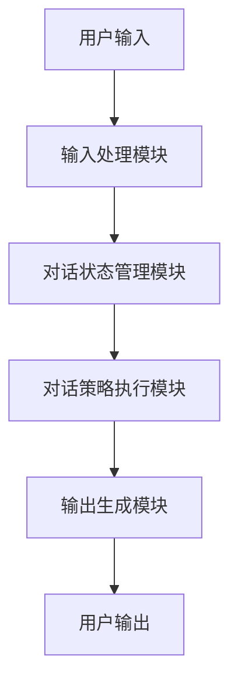

                 


# 多轮对话管理：提升AI Agent的交互体验

## 关键词：多轮对话管理、AI Agent、对话系统、自然语言处理、对话状态、上下文关联

## 摘要：  
多轮对话管理是实现高效、智能AI Agent交互体验的核心技术。本文从多轮对话管理的基本概念出发，深入探讨其在自然语言处理中的应用，分析对话状态管理、上下文关联等关键问题，结合具体算法和系统架构设计，详细讲解如何提升AI Agent的交互体验。通过实际项目案例，本文为读者提供从理论到实践的完整指导。

---

# 第1章: 多轮对话管理概述

## 1.1 多轮对话管理的基本概念  
### 1.1.1 对话管理的定义  
对话管理是指在多轮对话过程中，系统根据当前对话内容和上下文信息，生成合适的回应，引导对话朝着预期目标进行。它是自然语言处理（NLP）和人机交互领域的重要组成部分。  

### 1.1.2 多轮对话的特点  
多轮对话具有以下特点：  
1. **上下文依赖性**：对话内容与之前的交流内容密切相关。  
2. **动态性**：对话过程中，对话状态会不断更新。  
3. **目标导向性**：对话通常以完成某个任务为目标。  

### 1.1.3 多轮对话管理的核心要素  
多轮对话管理的核心要素包括：  
1. **对话状态**：记录当前对话的上下文信息。  
2. **用户意图**：识别用户的意图和需求。  
3. **对话策略**：根据对话状态和用户意图生成合适的回应。  

## 1.2 多轮对话管理的应用场景  
### 1.2.1 智能客服  
多轮对话管理广泛应用于智能客服系统，帮助用户解决复杂问题。  

### 1.2.2 智能助手  
如Siri、Alexa等智能助手，通过多轮对话为用户提供便捷服务。  

### 1.2.3 聊天机器人  
在社交平台或聊天应用中，聊天机器人通过多轮对话与用户互动。  

## 1.3 多轮对话管理的挑战  
### 1.3.1 上下文理解的复杂性  
如何准确理解用户的上下文信息是一个难点。  

### 1.3.2 对话状态的维护  
对话状态的更新需要实时跟踪对话内容，确保信息的准确性和连贯性。  

### 1.3.3 用户意图的多样性  
用户意图多样且复杂，如何准确识别是多轮对话管理的核心挑战。  

## 1.4 本章小结  
本章介绍了多轮对话管理的基本概念、应用场景和面临的挑战，为后续内容奠定了基础。

---

# 第2章: 多轮对话管理的核心概念

## 2.1 对话状态管理  
### 2.1.1 对话状态的定义  
对话状态是指当前对话中系统对用户意图和上下文信息的记录。  

### 2.1.2 对话状态的表示方法  
对话状态可以用以下方式表示：  
1. **关键词表示法**：记录对话中的关键信息。  
2. **槽位填充法**：通过填充槽位信息来表示对话状态。  
3. **向量表示法**：使用向量表示对话状态的语义信息。  

### 2.1.3 对话状态的更新机制  
对话状态的更新机制包括：  
1. **基于规则的更新**：根据预定义的规则更新对话状态。  
2. **基于模型的更新**：利用机器学习模型自动更新对话状态。  

## 2.2 上下文关联  
### 2.2.1 上下文的定义  
上下文是指当前对话中所有相关的语义信息。  

### 2.2.2 上下文的存储方式  
上下文可以通过以下方式存储：  
1. **数据库存储**：将上下文信息存储在数据库中。  
2. **内存存储**：在运行时将上下文信息存储在内存中。  

### 2.2.3 上下文的关联性分析  
通过分析上下文的关联性，可以更好地理解用户意图。  

## 2.3 对话策略  
### 2.3.1 对话策略的定义  
对话策略是指系统在对话过程中选择合适的回应策略。  

### 2.3.2 常见的对话策略类型  
1. **基于规则的策略**：根据预定义的规则选择回应。  
2. **基于模型的策略**：利用机器学习模型生成回应。  

### 2.3.3 对话策略的选择与优化  
对话策略的选择需要综合考虑对话状态、用户意图和任务目标。  

## 2.4 本章小结  
本章详细讲解了对话状态管理、上下文关联和对话策略的核心概念及其在多轮对话管理中的作用。

---

# 第3章: 多轮对话管理的算法原理

## 3.1 基于规则的对话管理  
### 3.1.1 规则的定义与设计  
基于规则的对话管理通过预定义的规则来实现对话管理。  

### 3.1.2 规则的执行流程  
1. 分析用户输入。  
2. 匹配预定义规则。  
3. 生成回应。  

### 3.1.3 规则的优缺点分析  
优点：规则简单易懂，易于实现。缺点：难以应对复杂的对话场景。  

## 3.2 基于统计的对话管理  
### 3.2.1 统计模型的基本原理  
基于统计的对话管理利用概率模型来分析对话数据。  

### 3.2.2 常见的统计模型算法  
1. 马尔可夫链模型。  
2. 隐马尔可夫模型（HMM）。  

### 3.2.3 统计模型的优缺点分析  
优点：能够处理大规模数据。缺点：需要大量的训练数据。  

## 3.3 基于深度学习的对话管理  
### 3.3.1 深度学习的基本原理  
深度学习通过多层神经网络模型学习对话的语义信息。  

### 3.3.2 常见的深度学习算法  
1. Transformer模型。  
2. LSTM模型。  

### 3.3.3 深度学习模型的优缺点分析  
优点：能够捕捉复杂的语义信息。缺点：需要大量的计算资源。  

## 3.4 对比分析  
### 3.4.1 规则、统计与深度学习的对比  
从实现复杂度、性能和适用场景三个方面进行对比。  

### 3.4.2 不同场景下的适用性分析  
根据具体需求选择合适的对话管理方法。  

## 3.5 本章小结  
本章对比分析了基于规则、统计和深度学习的对话管理算法，帮助读者理解不同方法的优缺点及其适用场景。

---

# 第4章: 多轮对话管理的系统架构设计

## 4.1 系统功能设计  
### 4.1.1 用户输入处理模块  
负责接收和解析用户的输入。  

### 4.1.2 对话状态管理模块  
记录和更新对话状态。  

### 4.1.3 对话策略执行模块  
根据对话状态生成合适的回应。  

### 4.1.4 输出生成模块  
将回应生成自然语言输出。  

## 4.2 系统架构图  


## 4.3 接口设计  
### 4.3.1 输入接口  
定义输入的格式和协议。  

### 4.3.2 输出接口  
定义输出的格式和协议。  

### 4.3.3 状态更新接口  
定义对话状态更新的接口。  

## 4.4 本章小结  
本章详细讲解了多轮对话管理系统的功能设计和架构设计，为后续的实现提供了指导。

---

# 第5章: 多轮对话管理的项目实战

## 5.1 环境安装  
### 5.1.1 开发工具安装  
安装Python、TensorFlow等开发工具。  

### 5.1.2 依赖库安装  
安装必要的Python库，如numpy、pandas等。  

## 5.2 核心代码实现  
### 5.2.1 对话状态管理模块实现  
```python
class DialogState:
    def __init__(self):
        self.state = {}

    def update(self, key, value):
        self.state[key] = value

    def get(self, key):
        return self.state.get(key, None)
```

### 5.2.2 对话策略执行模块实现  
```python
class DialogStrategy:
    def __init__(self, dialog_state):
        self.dialog_state = dialog_state

    def execute(self, user_input):
        # 根据用户输入和对话状态生成回应
        pass
```

### 5.2.3 输出生成模块实现  
```python
class OutputGenerator:
    def generate_response(self, dialog_state):
        # 根据对话状态生成回应
        pass
```

## 5.3 案例分析  
### 5.3.1 案例背景  
以医疗咨询系统为例，展示多轮对话管理的应用。  

### 5.3.2 案例实现  
详细讲解医疗咨询系统的对话流程和代码实现。  

### 5.3.3 案例总结  
总结案例实现的经验和教训。  

## 5.4 本章小结  
本章通过实际项目案例，展示了多轮对话管理的实现过程和关键点。

---

# 第6章: 总结与展望

## 6.1 最佳实践  
1. 明确对话目标。  
2. 合理设计对话流程。  
3. 选择合适的对话管理方法。  

## 6.2 本章小结  
总结本文的主要内容，强调多轮对话管理在提升AI Agent交互体验中的重要性。

## 6.3 注意事项  
1. 对话状态管理要实时更新。  
2. 对话策略要灵活调整。  
3. 对话系统的安全性要高度重视。  

## 6.4 拓展阅读  
推荐相关的技术书籍和论文，供读者深入学习。  

---

作者：AI天才研究院 & 禅与计算机程序设计艺术

